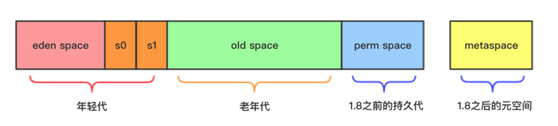
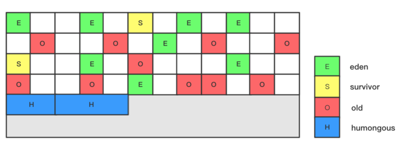

G1是java 7u4版本中引进的一款垃圾回收期， 在最新的jdk9中已经是默认垃圾回收器了。 如果你还不了解它， 那就有点out了。

在聊G1垃圾回收期之前我们先了解下垃圾回收器的目标是什么？ 垃圾回收器要完成两项工作：

1. 为新对象分配内存
2. 回收不再使用的垃圾对象

在完成上述两项工作的情况下还需要尽可能满足下面两点要求：

1. 尽可能低的回收时停顿时间
2. 尽可能大的吞吐量： 即支持更大的堆大小

注意上述两点要求是有点矛盾的， 吞吐量越大， 在回收时往往需要越长的停顿时间， 要想让停顿时间小需要堆尽可能小。

为了降低回收停顿时间引入了并发的垃圾回收机制， 所谓“并发”是指垃圾回收器工作时， 用户线程可以并发工作， 不会一直stop the world（STW）； 另外为了加大回收的效率，引入了并行回收， “并行”和“串行”对应， 是指多个线程并行执行垃圾回收工作；为了提高内存堆的使用率， 提升内存使用率，垃圾回收算法也会对堆进行整理（Compact），通过整理可以使碎片化的内存集中化。

另外在G1之前的垃圾回收算法都是要做分代回收的。 如下简图：

分为如下几个代：

 - 年轻代： eden space + survivor0 + survivor1
 - 老年代： old space 
 - 持久代： perm space 1.8之前存储class/常量池等信息
 - 元空间： metaspace 1.8后取代了持久代

分代回收也是为了降低停顿时间的， 可以在年轻代空间不够用时触发young gc， 不会回收整个堆。

以上我们对垃圾回收的工作， 要求和手段有了一个简单的了解， 下面我们来聊下G1垃圾回收器。

## G1垃圾回收器有如下优点：

1. 垃圾回收时间弹性可控
2. 避免产生内存碎片
3. 支持超大内存的低停顿时间

## G1垃圾回收器的内存模型

G1垃圾回收器的内存模型和以前的方式完全不同， 堆内存被划分为n个大小相等的内存块（Region）， 每个Region是物理上连续的一段内存。 

另外G1依然是分代的， 不过是逻辑上分代， 非物理分代， 分为：

 - 年轻代（eden+survivor） 上图中的E和S
 - 老年代 （old） 上图中的O

另外还有大对象， H块。

每个Region的大小可以通过jvm参数： -XX:G1HeapRegionSize 来设置， 这个参数的设置值必须是1M， 2M， 4M … 32M， 最小为1M， 最大为32M， 且必须是2的n次方M。 

如果不设置， jvm会根据堆的最大大小， 将内存分为2048份， 然后选择一个合适的1到32M之间的合理值。

## G1的回收模式

G1的回收模式分为三种， 分别为Young GC， Mixed GC， Full GC， 分别描述如下：

Young GC： 当new新对象， 在eden区分配不了时， 会触发young gc, 触发young gc后eden区的所有存活对象会被复制到survivor，如果survivor存不下复制对象， 对象会晋升到老年代。 回收之后， 空闲的region会被放入空闲列表里， 等待再次创建对象时使用。

Mixed GC：字面意思是混合gc， 即进行young gc加上部分region的old gc， 这里部分old gc是g1根据算法确定的， 算法会考虑历史回收时间和用户期望的回收时间， 期望的垃圾回收时间可以通过 参数： -XX:MaxGCPauseMillis 来设置， 此参数的默认值是200ms。

Full GC： G1中很少触发full gc， 更多的是mixed gc或young gc， full gc在jdk10之前的版本中会退化为单线程回收， 回收整个堆， 回收效率很低，需要的时间很长， 应用可能出现假死现象。

## 参考资料：

 - http://www.oracle.com/technetwork/tutorials/tutorials-1876574.html
 - https://github.com/cncounter/translation/blob/master/tiemao_2014/G1/G1.md
 - https://www.jianshu.com/p/aef0f4765098
 - http://www.importnew.com/27793.html
 - https://tech.meituan.com/g1.html
 - http://blog.jobbole.com/109170/
 - https://t.hao0.me/jvm/2017/01/15/jvm-g1.html
