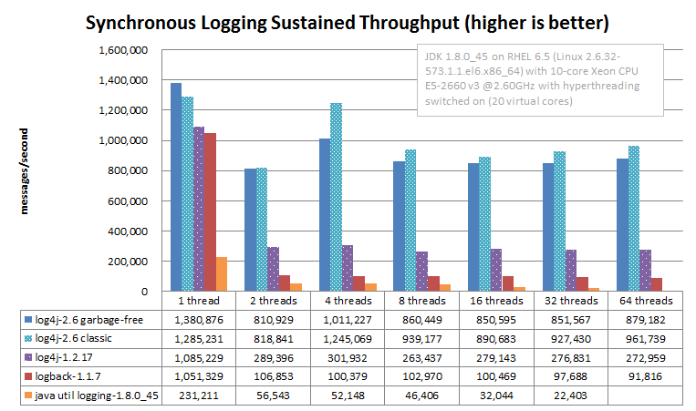
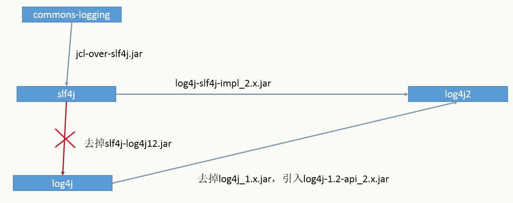

# log4j2的使用及注意事项
> log4j（log for java）是Apache下的开源项目，为java工程提供功能强大的日志记录。log4j2是log4j 1.x的升级版，改进了log4j 1.x、logback的很多问题，并在性能方面有很大提升。

## 为什么选择log4j2
对于大流量、高并发的系统来说，在选择日志框架框架时，除了功能、稳定性方面的考量，性能是首要考虑因素。对于日志操作，具有写入频繁、多线程写入的特点，如果日志框架性能达不到要求，日志操作会成为系统性能瓶颈之一。

log4j2、log4j、logback、Jul(Java Util Logging)等日志框架都有大量的应用案例，这些框架的功能、稳定性可以满足大多数应用场景。但从性能方面考虑，log4j2的性能是最高的，这里引用Apache做的[基准测试](https://logging.apache.org/log4j/2.x/performance.html#benchmarks)数据来进行说明。




从以上两图可以看出，无论采用同步还是异步的方式，log4j2的性能是最高的。当然自己也可以做一个测试，在相同软硬件环境下，测试各种日志框架的性能。

除了性能之外，log4j2还有自动加载修改过的配置文件、更简单的插件机制、更全面的过滤器机制等特性。

## log4j2的使用

### 基本使用

引入log4j2的包：
```
        <dependency>
            <groupId>org.apache.logging.log4j</groupId>
            <artifactId>log4j-api</artifactId>
            <version>2.10.0</version>
        </dependency>
        <dependency>
            <groupId>org.apache.logging.log4j</groupId>
            <artifactId>log4j-core</artifactId>
            <version>2.10.0</version>
        </dependency>
```

如果使用slf4j做接口，还需要引入：
```
        <dependency>
            <groupId>org.slf4j</groupId>
            <artifactId>slf4j-api</artifactId>
            <version>1.7.25</version>
        </dependency>
        <dependency>
            <groupId>org.apache.logging.log4j</groupId>
            <artifactId>log4j-slf4j-impl</artifactId>
            <version>2.10.0</version>
        </dependency>
```

在classpath加入log4j2.xml，内容示例：
```
<?xml version="1.0" encoding="UTF-8"?>
<Configuration>
    <Properties>
        <Property name="baseDir">d:/logs/mydemo</Property>
        <Property name="patternLayout">%d{yyyy-MM-dd HH:mm:ss.SSS} %p %c.%M(%F:%L) - %m%n</Property>
    </Properties>

    <Appenders>
        <Console name="Console" target="SYSTEM_OUT">
            <PatternLayout pattern="${patternLayout}" />
        </Console>

        <RollingRandomAccessFile name="RollingRandomAccessFile" fileName="${baseDir}/log.log"
                     filePattern="${baseDir}/log_%d{yyyy-MM-dd}_%i.log">
            <PatternLayout pattern="${patternLayout}" />
            <Policies>
                <TimeBasedTriggeringPolicy modulate="true" interval="1" />
                <SizeBasedTriggeringPolicy size="100MB" />
            </Policies>

            <DefaultRolloverStrategy max="10000" />
        </RollingRandomAccessFile>
    </Appenders>
    <Loggers>
        <Root level="INFO">
            <AppenderRef ref="Console" />
            <AppenderRef ref="RollingRandomAccessFile"/>
        </Root>
    </Loggers>
</Configuration>
```

此配置的文件的含义是对INFO及以上级别的日志输出到console和file，对文件按日期和大小（100M）切分，每日保留10000个日志文件。

比如程序中使用以下语句输出log：
```java
package com.jd.mydemo.controller;

import org.slf4j.Logger;
import org.slf4j.LoggerFactory;
import org.springframework.stereotype.Controller;
import org.springframework.web.bind.annotation.RequestMapping;
import org.springframework.web.bind.annotation.ResponseBody;

import com.jd.mydemo.common.Result;

@Controller
public class DemoController {
    private static final Logger logger = LoggerFactory.getLogger(DemoController.class);

    @RequestMapping("/demo")
    @ResponseBody
    public Result demo() {
        logger.info("call demo");
        Result result = new Result();
        result.setCode(1);
        result.setMsg("成功");
        return  result;
    }
}
```

在调用时，输出下面的日志：
```
2018-08-01 14:56:09.419 INFO org.mydemo.log4j2.webapp.controller.DemoController.demo(DemoController.java:19) - call demo
```

### 修改配置文件位置和名称

log4j2默认加载classpath下的log4j2.xml，如果需要修改配置文件的位置和名称，按以下步骤进行。

对于webapp来说，需要引入：
```
        <dependency>
            <groupId>org.apache.logging.log4j</groupId>
            <artifactId>log4j-web</artifactId>
            <version>2.10.0</version>
        </dependency>
```

在web.xml中加入：
```
  <context-param>
    <param-name>log4jConfiguration</param-name>
    <param-value>classpath:log4j2-dev.xml</param-value>
  </context-param>
  <listener>
    <listener-class>org.apache.logging.log4j.web.Log4jServletContextListener</listener-class>
  </listener>
```

对其他应用来说，需要在程序启动时进行初始化：
```
import org.apache.logging.log4j.core.config.Configurator;
...
    Configurator.initialize("Log4j2", "classpath:log4j2-dev.xml");
...
```

### 在SpringBoot中使用log4j2

以SpringBoot 1.5.10为例，默认引入了spring-boot-starter-logging，以logback作为日志框架，需要引入spring-boot-starter-log4j2：
```
        <dependency>
            <groupId>org.springframework.boot</groupId>
            <artifactId>spring-boot-starter-web</artifactId>
            <version>1.5.10.RELEASE</version>
            <exclusions>
                <exclusion>
                    <groupId>org.springframework.boot</groupId>
                    <artifactId>spring-boot-starter-logging</artifactId>
                </exclusion>
        </dependency>
        <dependency>
            <groupId>org.springframework.boot</groupId>
            <artifactId>spring-boot-starter-log4j2</artifactId>
            <version>1.5.10.RELEASE</version>
        </dependency>
```

默认使用classpath下的log4j2.xml作为配置文件，如果要修改配置文件路径和名称，在application.yml或application.properties中修改。以application.yml为例：
```
logging:
  config: classpath:log4j2-dev.xml
```
### all async、mixed sync/async和async appender

#### all async

这种方式对所有的Logger都是异步的。

需要引入disruptor包，log4j2 2.9及以上版本要求disruptor-3.3.4或更高版本，log4j2 2.9以下版本要求disruptor-3.0.0或更高版本。

例如使用log4j2 2.10，引入disruptor：

```
        <dependency>
            <groupId>com.lmax</groupId>
            <artifactId>disruptor</artifactId>
            <version>3.3.11</version>
        </dependency>
```

另外需要JVM参数`-Dlog4j2.contextSelector=org.apache.logging.log4j.core.async.AsyncLoggerContextSelector`

log4j2.xml示例：
```
<?xml version="1.0" encoding="UTF-8"?>
<Configuration>
    <Properties>
        <Property name="baseDir">d:/logs/mydemo</Property>
        <Property name="patternLayout">%d{yyyy-MM-dd HH:mm:ss.SSS} %p %c.%M(%F:%L) - %m%n</Property>
    </Properties>

    <Appenders>
        <RollingRandomAccessFile name="RollingRandomAccessFile" fileName="${baseDir}/log.log"
                     filePattern="${baseDir}/log_%d{yyyy-MM-dd}_%i.log" immediateFlush="false">
            <PatternLayout pattern="${patternLayout}" />
            <Policies>
                <TimeBasedTriggeringPolicy modulate="true" interval="1" />
                <SizeBasedTriggeringPolicy size="100MB" />
            </Policies>

            <DefaultRolloverStrategy max="10000" />
        </RollingRandomAccessFile>
    </Appenders>
    <Loggers>
        <Logger name="com.jd.mydemo" level="DEBUG" additivity="false" includeLocation="true">
            <AppenderRef ref="RollingRandomAccessFile"/>
        </Logger>
        <Root level="INFO" includeLocation="true">
            <AppenderRef ref="RollingRandomAccessFile"/>
        </Root>
    </Loggers>
</Configuration>
```

> 异步日志默认不输出位置（比如`DemoController.java:19`），需要在Logger上加`includeLocation="true"`启用输出位置。

#### mixed sync/async

这种方式可以在配置文件中指定Logger是同步还是异步的。

同样需要disruptor包，但不需要JVM参数了。

log4j2.xml示例：
```
<?xml version="1.0" encoding="UTF-8"?>
<Configuration>
    <Properties>
        <Property name="baseDir">d:/logs/mydemo</Property>
        <Property name="patternLayout">%d{yyyy-MM-dd HH:mm:ss.SSS} %p %c.%M(%F:%L) - %m%n</Property>
    </Properties>

    <Appenders>
        <RollingRandomAccessFile name="RollingRandomAccessFile" fileName="${baseDir}/log.log"
                     filePattern="${baseDir}/log_%d{yyyy-MM-dd}_%i.log" immediateFlush="false">
            <PatternLayout pattern="${patternLayout}" />
            <Policies>
                <TimeBasedTriggeringPolicy modulate="true" interval="1" />
                <SizeBasedTriggeringPolicy size="100MB" />
            </Policies>

            <DefaultRolloverStrategy max="10000" />
        </RollingRandomAccessFile>
    </Appenders>
    <Loggers>
        <AsyncLogger name="com.jd.mydemo" level="DEBUG" additivity="false" includeLocation="true">
            <AppenderRef ref="RollingRandomAccessFile"/>
        </AsyncLogger>
        <Root level="INFO" includeLocation="true">
            <AppenderRef ref="RollingRandomAccessFile"/>
        </Root>
    </Loggers>
</Configuration>
```

> 可以使用AsyncLogger、AsyncRoot来指定使用异步Logger。

> 同样需要`includeLocation="true"`启用输出位置。

#### async appender

这种方式使用`java.util.concurrent.ArrayBlockingQueue`暂存日志事件，不需要disruptor包。

log4j2示例：
```
<?xml version="1.0" encoding="UTF-8"?>
<Configuration>
    <Properties>
        <Property name="baseDir">d:/logs/mydemo</Property>
        <Property name="patternLayout">%d{yyyy-MM-dd HH:mm:ss.SSS} %p %c.%M(%F:%L) - %m%n</Property>
    </Properties>

    <Appenders>
        <RollingRandomAccessFile name="RollingRandomAccessFile" fileName="${baseDir}/log.log"
                     filePattern="${baseDir}/log_%d{yyyy-MM-dd}_%i.log">
            <PatternLayout pattern="${patternLayout}" />
            <Policies>
                <TimeBasedTriggeringPolicy modulate="true" interval="1" />
                <SizeBasedTriggeringPolicy size="100MB" />
            </Policies>

            <DefaultRolloverStrategy max="10000" />
        </RollingRandomAccessFile>
        <Async name="Async">
            <AppenderRef ref="RollingRandomAccessFile"/>
        </Async>
    </Appenders>
    <Loggers>
        <Logger name="com.jd.mydemo" level="DEBUG" additivity="false">
            <AppenderRef ref="Async"/>
        </Logger>
        <Root level="INFO">
            <AppenderRef ref="Async"/>
        </Root>
    </Loggers>
</Configuration>
```

all async、mixed sync/async和async appender对比：
> all async使用disruptor提供的无锁队列，在一个单独的线程中处理I/O操作，在3种方式中性能最高。

> mixed sync/async 虽然牺牲了一些性能，但提供了更多灵活性。

> async appender 性能不如async logger，尤其在非常多的线程并发输出日志的时候。

> async logger默认不输出位置，如果需要输出需要指定`includeLocation="true"`。

> 如果需要输出位置，long4j2需要获取堆栈快照，并从中获取位置信息。如果设置了获取位置，在sync logger下有1.3-5倍的性能损失，在async logger下有30-100倍的性能损失。

### 过滤器Filter的使用

比如把error级别的log输出到单独的文件，warn、info级别的log输出到另一个的文件：
```
<?xml version="1.0" encoding="UTF-8"?>
<Configuration>
    <Properties>
        <Property name="baseDir">d:/logs/mydemo</Property>
        <Property name="patternLayout">%d{yyyy-MM-dd HH:mm:ss.SSS} %p %c.%M(%F:%L) - %m%n</Property>
    </Properties>

    <Appenders>
        <RollingRandomAccessFile name="RollingRandomAccessFile-warn" fileName="${baseDir}/log-warn.log"
                     filePattern="${baseDir}/log-warn_%d{yyyy-MM-dd}_%i.log" immediateFlush="true">
            <Filters>
                <ThresholdFilter level="error" onMatch="DENY" onMismatch="NEUTRAL"/>
                <ThresholdFilter level="info" onMatch="ACCEPT" onMismatch="DENY"/>
            </Filters>
            <PatternLayout pattern="${patternLayout}" />
            <Policies>
                <TimeBasedTriggeringPolicy modulate="true" interval="1" />
                <SizeBasedTriggeringPolicy size="100MB" />
            </Policies>

            <DefaultRolloverStrategy max="10000" />
        </RollingRandomAccessFile>
        <RollingRandomAccessFile name="RollingRandomAccessFile-error" fileName="${baseDir}/log-error.log"
                                 filePattern="${baseDir}/log-error_%d{yyyy-MM-dd}_%i.log" immediateFlush="true">
            <Filters>
                <ThresholdFilter level="error" onMatch="ACCEPT" onMismatch="DENY"/>
            </Filters>
            <PatternLayout pattern="${patternLayout}" />
            <Policies>
                <TimeBasedTriggeringPolicy modulate="true" interval="1" />
                <SizeBasedTriggeringPolicy size="100MB" />
            </Policies>

            <DefaultRolloverStrategy max="10000" />
        </RollingRandomAccessFile>
    </Appenders>
    <Loggers>
        <Root level="info">
            <AppenderRef ref="RollingRandomAccessFile-warn"/>
            <AppenderRef ref="RollingRandomAccessFile-error"/>
        </Root>
    </Loggers>
</Configuration>
```

### 自动清理日志文件

比如自动清理超过30天、或者日志文件大小总和超过10GB：
```
<?xml version="1.0" encoding="UTF-8"?>
<Configuration>
    <Properties>
        <Property name="baseDir">d:/logs/mydemo</Property>
        <Property name="patternLayout">%d{yyyy-MM-dd HH:mm:ss.SSS} %p %c.%M(%F:%L) - %m%n</Property>
    </Properties>

    <Appenders>
        <Console name="Console" target="SYSTEM_OUT">
            <PatternLayout pattern="${patternLayout}" />
        </Console>

        <RollingRandomAccessFile name="RollingRandomAccessFile" fileName="${baseDir}/log.log"
                     filePattern="${baseDir}/log_%d{yyyy-MM-dd}_%i.log">
            <PatternLayout pattern="${patternLayout}" />
            <Policies>
                <TimeBasedTriggeringPolicy modulate="true" interval="1" />
                <SizeBasedTriggeringPolicy size="100MB" />
            </Policies>

            <DefaultRolloverStrategy max="10000">
                <Delete basePath="${baseDir}" maxDepth="1">
                    <IfFileName glob="log_*.log">
                        <IfAny>
                            <IfLastModified age="30d"/>
                            <IfAccumulatedFileSize exceeds="10GB"/>
                        </IfAny>
                    </IfFileName>
                </Delete>
            </DefaultRolloverStrategy>
        </RollingRandomAccessFile>
    </Appenders>
    <Loggers>
        <Root level="DEBUG">
            <AppenderRef ref="Console" />
            <AppenderRef ref="RollingRandomAccessFile"/>
        </Root>
    </Loggers>
</Configuration>
```

## 注意事项

### 多日志框架接口的桥接

日志接口建议使用slf4j，但引用的第三方jar可能使用了其他的日志接口，比如：

> commons-logging：`private static final org.apache.commons.logging.Log apacheLogger = org.apache.commons.logging.LogFactory.getLog(XX.class);`

> log4j：`private static final org.apache.log4j.Logger log4jLogger = org.apache.log4j.LogManager.getLogger(XX.class);`

这时就需要用桥接的方式，最终把log输出到log4j2。



排除对log4j1.x、slf4j-log4j12的引用，下面是一个案例：
```
        <dependency>
            <groupId>com.jd.pop.customs</groupId>
            <artifactId>pop-customs-old</artifactId>
            <version>1.0.0-SNAPSHOT</version>
            <exclusions>
                ...
                <exclusion>
                    <groupId>org.slf4j</groupId>
                    <artifactId>slf4j-log4j12</artifactId>
                </exclusion>
                <exclusion>
                    <artifactId>log4j</artifactId>
                    <groupId>log4j</groupId>
                </exclusion>
            </exclusions>
        </dependency>
```

引入log4j-1.2-api_2.x.jar是把原来输出到log4j的日志改为输出到log4j2，这样在不修改程序的情况下，实现了日志的升级。
有的项目虽然升级到了log4j2，但因为有jar包使用了log4j做日志接口，为了输出log4j的日志，log4j2.xml和log4j.properties并存，通过这种方式，解决了log4j1.x、log4j2日志并存的问题。

### 日志文件按大小切分

有的应用以为单量小只做了按天的日志切分，即一天一个日志文件，但遇到618、双11大促的时候，单量暴增几倍，单个日志文件可能达到几个G、几十个G，有打爆磁盘的风险。

不要冒这样的风险，在按日期切分的基础上加上按大小切分的策略，这样也麻烦不了多少。

### 日志相关的开发规范
1、以slf4j做接口，而不是以具体的日志框架做接口，这样切换具体日志实现的时候会比较方便。
```java
import org.slf4j.Logger;
import org.slf4j.LoggerFactory;

public class MyClass {
    private static final Logger logger = LoggerFactory.getLogger(MyClass.class);
}
```

2、日志输出时，采用条件判断或者占位符的方式，否则即使根据日志级别不输出日志也会占用计算资源。
```
if (logger.isInfoEnabled()) {
    logger.info("createMessage error orderId=" + orderId + ",customsOrderInfo=" + customsOrderInfo);
}
```
或者
```
logger.info("createMessage error orderId={},customsOrderInfo={}", orderId, customsOrderInfo);
```
如果输出捕获的异常信息，需要同时把异常堆栈输出，便于定位问题发生的原因：
```
try {
    ...
} catch (JAXBException e) {
    logger.error("调用接口返回报文xml结构异常 orderId={},retStr={}", orderId, retStr, e);
    ...
}
```

3、正确使用日志级别，避免输出大量的无用日志。

