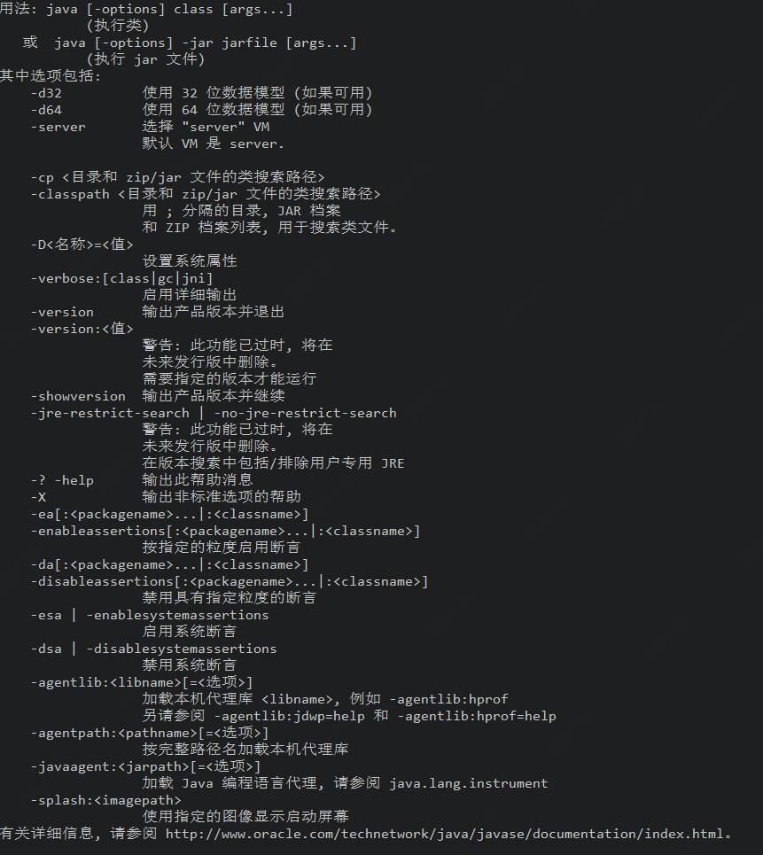
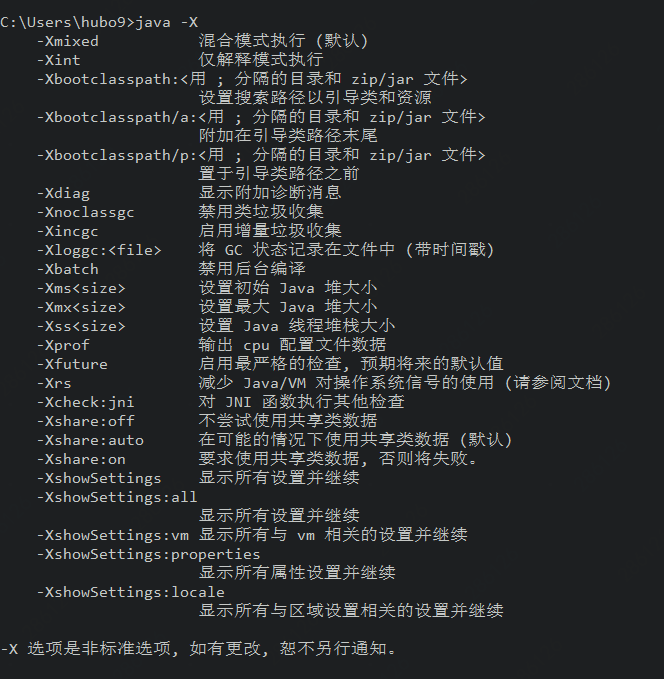
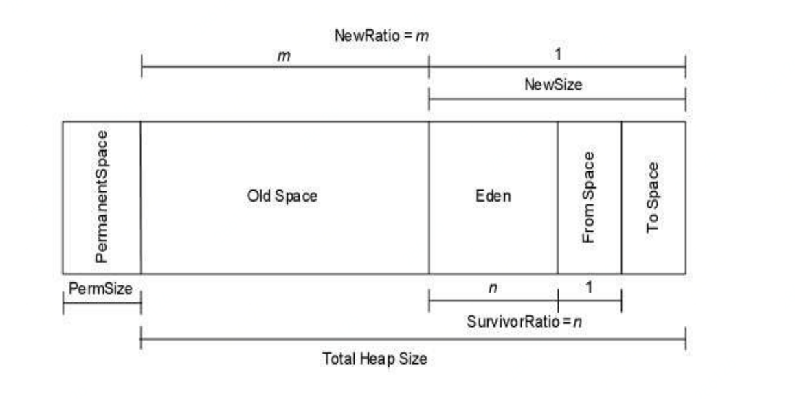
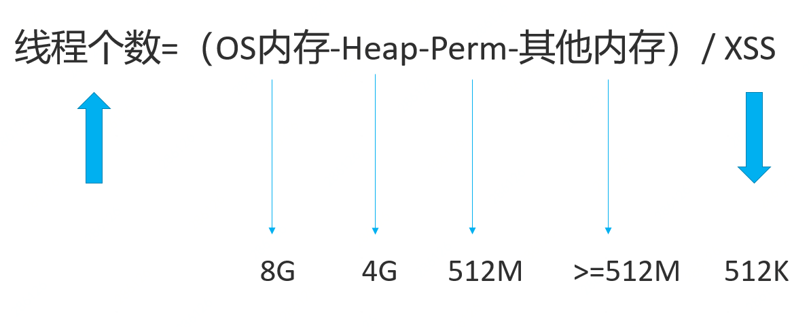
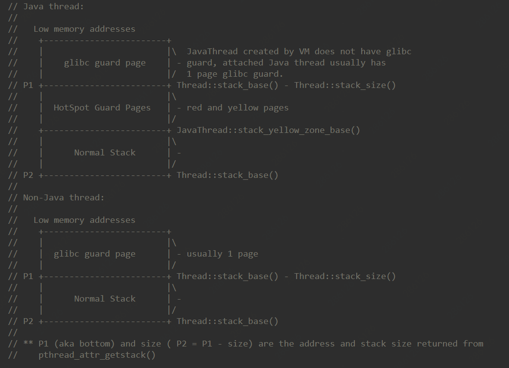

# JVM备战参数之XSS

> 前提：
>	
>	JVM：Hotspot
>
>   JDK：openjdk7
>
>   硬件：4C8G
>
>   OS: 64位 linux, 句柄数：不限制


在此之前我们先来看一个问题：设置JVM参数的时候有以`-X`开头的参数，也有以`-XX`开头的参数，这两个有什么不同吗？下面我们来一起看看。

## JVM 参数

### 标准参数

功能和输出的参数都是很稳定的 在未来的JVM版本中不会改变 可以使用java -help检索出所有的标准参数



### -X参数

非标准化参数 在未来的版本可能会改变 所有的参数都用-X开始 可以使用java -X检索



### -XX参数

非标准 很长一段时间不会列出来 用于JVM开发的debug和调优

说明XX参数的语法:

* 所有的XX参数都以”-XX:”开始，但是随后的语法不同，取决于参数的类型。
* 对于布尔类型的参数，我们有”+”或”-“，然后才设置JVM选项的实际名称。例如，-XX:+<name>用于激活<name>选项，而-XX:-<name>用于注销选项。
* 对于需要非布尔值的参数，如string或者integer，我们先写参数的名称，后面加上”=”，最后赋值。例如，-XX:<name>=<value>给<name>赋值<value>。


[JDK7参数说明](https://docs.oracle.com/javase/7/docs/technotes/tools/solaris/java.html)

---

> 言归正传

**备战参数推荐：**

`-Xss512k`或`-Xss256k`

每次备战的时候都会扫描没有配置`Xss`的应用，这个是为什么呢？首先来看一下官方对`Xss`参数解释：

-Xss : Sets the thread stack size. // 设置线程栈大小。

从官方的定义来看很简单，就是设置线程栈的大小。

2个问题：

1. 线程栈设置大小有什么影响。
2. 哪些东西会存在线程栈中。

我们先来看第一个问题：

## 线程栈设置大小有什么影响。

要说明这个问题，先来看一副图：



上图是JVM内存区域，涉及到JVM几个参数：

```
-Xms4096m 
-Xmx4096m
-XX:PermSize=512m 
-XX:MaxPermSize=512m
-XX:NewRatio=m
-XX:ServivorRatio=n
```

那问题来了？`-Xss`既然也是分配大小，那为什么上图中没有标识出来？

为了解决这问题，我们只能从JVM源码方面入手，我都知道`-Xss`都是设置线程栈的大小，所以我们出发点就是`Thread`类

```
JavaThread::JavaThread(ThreadFunction entry_point, size_t stack_sz) :
  Thread()
#ifndef SERIALGC
  , _satb_mark_queue(&_satb_mark_queue_set),
  _dirty_card_queue(&_dirty_card_queue_set)
#endif // !SERIALGC
{
  if (TraceThreadEvents) {
    tty->print_cr("creating thread %p", this);
  }
  initialize();
  _jni_attach_state = _not_attaching_via_jni;
  set_entry_point(entry_point);
  // Create the native thread itself.
  // %note runtime_23
  os::ThreadType thr_type = os::java_thread;
  thr_type = entry_point == &compiler_thread_entry ? os::compiler_thread :
                                                     os::java_thread;
  os::create_thread(this, thr_type, stack_sz);
  _safepoint_visible = false;
  // The _osthread may be NULL here because we ran out of memory (too many threads active).
  // We need to throw and OutOfMemoryError - however we cannot do this here because the caller
  // may hold a lock and all locks must be unlocked before throwing the exception (throwing
  // the exception consists of creating the exception object & initializing it, initialization
  // will leave the VM via a JavaCall and then all locks must be unlocked).
  //
  // The thread is still suspended when we reach here. Thread must be explicit started
  // by creator! Furthermore, the thread must also explicitly be added to the Threads list
  // by calling Threads:add. The reason why this is not done here, is because the thread
  // object must be fully initialized (take a look at JVM_Start)
}

```
从方法参数中我们可以看到`stack_sz`,从字面意思可以看出此字段就是线程栈大小，但实际上`stack_sz`是`0`。

我们可以看到方法其中有一行：


```
os::create_thread(this, thr_type, stack_sz);
```

可以看出`JavaThread`内部是调用os创建线程的，并且把线程栈的大小传入进去,。

进到os方法内部：

```
OSThread* osthread = new OSThread(NULL, NULL);
  if (osthread == NULL) {
    return false;
  }
```

创建了一个`OSThread`，并且重新初始化`stack_sz`，此时会用到`-Xss`


```
if (os::Linux::supports_variable_stack_size()) {
    // calculate stack size if it's not specified by caller
    if (stack_size == 0) {
      stack_size = os::Linux::default_stack_size(thr_type);

      switch (thr_type) {
      case os::java_thread:
        // Java threads use ThreadStackSize which default value can be
        // changed with the flag -Xss
        assert (JavaThread::stack_size_at_create() > 0, "this should be set");
        stack_size = JavaThread::stack_size_at_create();
        break;
      case os::compiler_thread:
        if (CompilerThreadStackSize > 0) {
          stack_size = (size_t)(CompilerThreadStackSize * K);
          break;
        } // else fall through:
          // use VMThreadStackSize if CompilerThreadStackSize is not defined
      case os::vm_thread:
      case os::pgc_thread:
      case os::cgc_thread:
      case os::watcher_thread:
        if (VMThreadStackSize > 0) stack_size = (size_t)(VMThreadStackSize * K);
        break;
      }
    }

    stack_size = MAX2(stack_size, os::Linux::min_stack_allowed);
    pthread_attr_setstacksize(&attr, stack_size);
  } else {
    // let pthread_create() pick the default value.
  }
```

可以看到，先使用的系统默认的`stack_size`，来看一下默认`stack_size`大小

```
// return default stack size for thr_type
size_t os::Linux::default_stack_size(os::ThreadType thr_type) {
  // default stack size (compiler thread needs larger stack)
#ifdef AMD64
  size_t s = (thr_type == os::compiler_thread ? 4 * M : 1 * M);
#else
  size_t s = (thr_type == os::compiler_thread ? 2 * M : 512 * K);
#endif // AMD64
  return s;
}
```

默认`stack_size`是根据操作系统类型以及线程类型来定的。


```
case os::java_thread:
        // Java threads use ThreadStackSize which default value can be
        // changed with the flag -Xss
        assert (JavaThread::stack_size_at_create() > 0, "this should be set");
        stack_size = JavaThread::stack_size_at_create();
        break;
```

如果设置了`Xss`话会覆盖默认的`stack_size`


最终创建一个pthread, pthread是glibc库中的pthread.h中定义代码。


```
int ret = pthread_create(&tid, &attr, (void* (*)(void*)) java_start, thread);
```

由此可见java创建线程是用过os来创建的，并且传入-Xss或者默认线程栈大小，所以线程栈的大小是直接os malloc分配的内存的。


由此我们可以得出以下一个公式：



上面公式只是一个大概的理论值，nginx+tomcat镜像实际应该比这个还小。

由此可见`-Xss`大小直接影响线程个数。


我们再来看二个问题：

## 哪些东西会存在线程栈中。

首先来简单介绍一下java栈

### java栈

java栈是一块线程私有的内存空间。如果说，java堆和程序数据密切相关，那么java栈就是和线程执行密切相关的。线程执行的基本行为是函数调用,每次函数调用的数据都是通过Java栈传递的。

特点：

* 线程私有
* 栈由一系列帧组成（因此Java栈也叫做帧栈）
* 帧保存一个方法的局部变量、操作数栈、常量池指针
* 每一次方法调用创建一个帧，并压栈

### java中线程栈组成：



#### 1. Normal Stack

栈帧组成：

局部变量表：
用于保存函数的参数（实参）变量和局部变量。局部变量表中的变量只在当前函数调用中有效，当函数调用结束后，随着函数栈帧的销毁，局部变量表也会随之销毁。

操作数栈：
栈帧的一部分，也是个先入先出的数据结构。用于计算过程的中间结果，同时作为计算过程中变量临时的存储空间。

帧数据区：
栈帧需要数据支持常量池解析，正常方法返回和异常处理等

#### 2. HotSpot Guard Pages(red and yellow pages)

当我们的代码访问到yellow page或者red page里的地址的时候，因为这块内存是受保护的，所以会产生SIGSEGV的信号，此时会交给JVM里的信号处理函数来处理，针对yellow page以及red page会有不同的处理策略，其中yellow page的处理是会抛出StackOverflowError的异常，进程不会挂掉，但是如果是red page，那将直接导致进程退出，不过还是会产生Crash的日志

#### 3. glibc guard page

非Stack Size，由glibc 挂载到java线程中

> 其实上面的都是科普，大家了解一下就可以了。

## 主要影响栈空间使用的因素：

1. 参数列表的参数多。
2. 递归的深度过深了。


下面通过一段代码来解析`-Xss`作用

```
public class TestStackDeep {
    private static int count=0;
    public static void f(long a,long b,long c){
        long e=1,f=2,g=3,h=4,i=5,k=6,q=7,x=8,y=9,z=10;
        count++;
        System.out.println(count);
        f(a, b, c);
    }

    public static void f(){
        count++;
        System.out.println(count);
        f();
    }

    public static void main(String[] args) {
        try {
//          f(0L,0L,0L);
            f();
        }catch (Exception e){
            System.out.println("deep "+count);
            e.fillInStackTrace();
        }
    }
}

```

结果1: 不同`-Xss`参数，相同的方法。

`-Xss256k`:
deep 568  // 递归调用了568次


`-Xss512k`:
deep 3030 // 递归调用了3030次

结果2：相同的`-Xss`参数，不同的方法。

`-Xss256k`

调用f(a, b, c);：
deep 176 // 递归调用了176次

调用f()：
deep 1963 // 递归调用了1963次


从上面结果来看，`-Xss`对于程序来说，主要影响**Java线程执行方法调用次数**。


