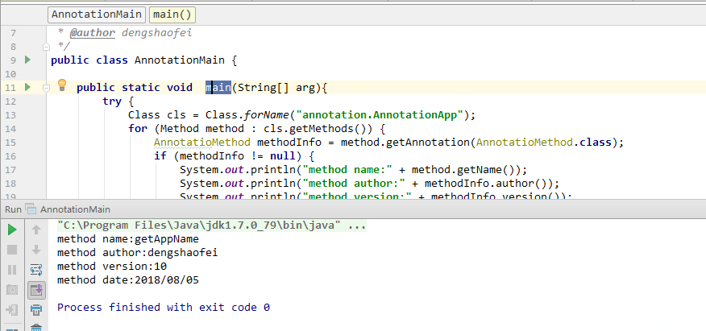
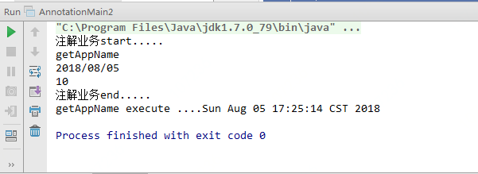

java Annotation基础
---
一、Annotation概念及作用
---
### 1、概念
Java Annotation是JDK5.0引入的一种注释机制。  
能够添加到 Java 源代码的语法元数据。类、方法、变量、参数、包都可以被注解，可用来将信息元数据与程序元素进行关联。
更直观的理解，它提供了一种安全的类似注释的机制，用来将任何的信息或元数据（metadata）与程序元素（类、方法、成员变量等）进行关联。

### 2、定义
Annotation通过如下的方式进行定义  
```
public @interface Override {

}
```  
其中的@interface是一个关键字，这个关键字声明隐含了一个信息：它是继承了java.lang.annotation.Annotation接口，并非声明了一个interface。在设计annotations的时候必须把一个类型定义为@interface，而不能用class或interface关键字。

### 3、作用
Annotation的引入是为了从Java语言层面上，为Java源代码提供元数据的支持   
(1) 标记，用于告诉编译器一些信息Marker Annotation:该Annotation没有参数输入，更多类似于标识一个东西，类似于Java语言中的java.io.Serialable之类的接口，并无需要实现的方法。  
(2) 编译时动态处理，如动态生成代码    
(3) 运行时动态处理，如得到注解信息    

---
二、Annotation分类和使用
---
### 1、元Annotation
元Annotation是指用来定义Annotation的Annotation，包括有@Retention @Target @interface @Documented  
（1）、@Retention
@Retention表示Annotation作用范围和保留时间，可选值SOURCE（源码时）/CLASS（编译时）/RUNTIME（运行时），默认值为CLASS值为SOURCE大都为Mark Annotation，这类Annotation都用来校验,比如Override, SuppressWarnings
RetentionPolicy.SOURCE是Java源文件(.java文件),javac把java源文件编译成.class文件，在编译成class时可能会把Java源程序上的一些注解给去掉，java编译器(javac)在处理java源程序时，可能会认为这个注解没有用了，于是就把这个注解去掉了，那么此时在编译好的class中就找不到注解了， 这是编译器编译java源程序时对注解进行处理的第一种可能情况. 
RetentionPolicy.CLASS是.class文件，注释在class文件中可用，但会被VM丢弃，是缺省值。  
RetentionPolicy.RUNTIME是内存中的字节码，VM将在运行时也保留注释，因此也可以通过反射机制读取注释信息。  

```
Retention注解代码：  
@Documented  
@Retention(RetentionPolicy.RUNTIME)  
@Target(ElementType.ANNOTATION_TYPE)  
public @interface Retention {  
    RetentionPolicy value();  
}  

RetentionPolicy策略枚举定义：  
public enum RetentionPolicy {  
    /**  
     * Annotations are to be discarded by the compiler.  
     */  
    SOURCE,   
    /**  
     * Annotations are to be recorded in the class file by the compiler  
     * but need not be retained by the VM at run time.  This is the default  
     * behavior.  
     */  
    CLASS,  
    /**  
     * Annotations are to be recorded in the class file by the compiler and  
     * retained by the VM at run time, so they may be read reflectively.  
     *  
     * @see java.lang.reflect.AnnotatedElement  
     */  
    RUNTIME  
}
```

（2）、 @Target
表示Annotation可以用来修饰哪些程序元素，如TYPE, METHOD, CONSTRUCTOR, FIELD, PARAMETER等，未标注则表示可修饰所有。
TYPE：类、接口(包括注解类型)或enum声明 
FIELD：类成员变量
METHOD：类方法声明
PARAMETER：参数声明
CONSTRUCTOR：构造器声明
LOCAL_VARIABLE：局部变量声明
ANNOTATION_TYPE：用于注解类型上（被@interface修饰的类型）  
PACKAGE：类的包声明

```
@Target   
@Documented  
@Retention(RetentionPolicy.RUNTIME)  
@Target(ElementType.ANNOTATION_TYPE)  
public @interface Target {  
    ElementType[] value();  
}  
public enum ElementType {  
    /** Class, interface (including annotation type), or enum declaration */  
    TYPE,  
    /** Field declaration (includes enum constants) */  
    FIELD,  
    /** Method declaration */  
    METHOD,  
    /** Parameter declaration */  
    PARAMETER,  
    /** Constructor declaration */  
    CONSTRUCTOR,  
    /** Local variable declaration */  
    LOCAL_VARIABLE,  
    /** Annotation type declaration */  
    ANNOTATION_TYPE,  
    /** Package declaration */  
    PACKAGE  
}  
```
（3）、@Inherited
```
@Inherited 表示父类Annotation可以被子类继承  
@Documented  
@Retention(RetentionPolicy.RUNTIME)  
@Target(ElementType.ANNOTATION_TYPE)  
public @interface Inherited {  
}  
```
@Inherited标识某个被标注的类型是被继承的。使用了@Inherited修饰的annotation类型被用于一个class之时，则这个annotation将被用于该class的相应子类。  
注意：  
@Inherited annotation类型是被标注过的class的子类所继承。类并不从它所实现的接口继承annotation，方法并不从它所重载的方法继承annotation。  
当@Inherited annotation类型标注的annotation的Retention是RetentionPolicy.RUNTIME，则反射API增强了这种继承性。如果我们使用java.lang.reflect去查询一个@Inherited annotation类型的annotation时，反射代码检查将展开工作：检查class和其父类，直到发现指定的annotation类型被发现，或者到达类继承结构的顶层。
就是说，查找@Inherited过的Annotation之时，需要反复的向上查找，方才可以。  
（4）、@Documented  
```
@Documented所修饰的Annotation连同自定义Annotation所修饰的元素一同保存到Javadoc文档中  
@Documented  
@Retention(RetentionPolicy.RUNTIME)  
@Target(ElementType.ANNOTATION_TYPE)  
public @interface Documented {  
}  
```

### 2、标准Annotation  
（1）、@Override  
保证编译时Override函数声明的正确性  
```
@Target(ElementType.METHOD)  
@Retention(RetentionPolicy.SOURCE)  
public @interface Override {  
}  
```
（2）、@Deprecated  
对不应该再使用的方法添加注解  
```
@Documented  
@Retention(RetentionPolicy.RUNTIME)  
public @interface Deprecated {  
}  
```
（3）、@SuppressWarnings 
```
@Target({TYPE, FIELD, METHOD, PARAMETER, CONSTRUCTOR, LOCAL_VARIABLE})  
@Retention(RetentionPolicy.SOURCE)   
public @interface SuppressWarnings {   
    String[] value();  
}
```   
标准Annotation是指Java自带的几个Annotation，上面三个分别表示重写函数，函数已经被禁止使用，忽略某项Warning 

### 3、自定义Annotation
自定义Annotation表示自己根据需要定义的Annotation，定义时需要用到上面的元Annotation。这里只是一种分类而已，也可以根据作用域分为源码时、编译时、运行时 Annotation。  
下面通过自定义Annotation MethodInfo，以实例来具体介绍自定义Annotation的使用。  
（1）自定义Annotation定义  
```
package annotation;

import java.lang.annotation.*;

/**
 * Created by dengshaofei on 2018/8/5.
 */
@Documented
@Retention(RetentionPolicy.RUNTIME)
@Target(ElementType.METHOD)
@Inherited
public @interface AnnotatioMethod {
    String author() default "dengshaofei@jd.com";
    String date();
    int version() default 1;
}


```  
MethodInfo Annotation定义部分：  
①通过@interface定义，注解名即为自定义注解名    
②注解配置参数名为注解类的方法名，且：  
　　a) 所有方法没有方法体，方法名即为属性名，没有参数没有修饰符，实际只允许 public & abstract 修饰符，默认为 public ，不允许抛异常。  
　　b) 方法返回值只能是基本类型，String, Class, annotation, enumeration 或者是他们的一维数组，返回类型即为属性类型。  
　　c) 若只有一个默认属性，可直接用 value() 函数。一个属性都没有表示该 Annotation 为 Mark Annotation。  
　　d) 可以加 default 表示默认值，null不能作为成员默认值。  
（2）自定义Annotation调用  
```
package annotation;

/**
 * Created by dengshaofei on 2018/8/5.
 */
public class AnnotationApp {

    @AnnotatioMethod( author ="dengshaofei", date="2018/08/05", version=10)
    public String getAppName() {
        return "lixiaolong";
    }

    public int getAge() {
        return 18;
    }
}
```
（3）Annotation分析
```
package annotation;

import java.lang.reflect.Method;

/**
 * Created by dengshaofei on 2018/8/5.
 * @author dengshaofei
 */
public class AnnotationMain {

    public static void  main(String[] arg){
        try {
            Class cls = Class.forName("annotation.AnnotationApp");
            for (Method method : cls.getMethods()) {
                AnnotatioMethod methodInfo = method.getAnnotation(AnnotatioMethod.class);
                if (methodInfo != null) {
                    System.out.println("method name:" + method.getName());
                    System.out.println("method author:" + methodInfo.author());
                    System.out.println("method version:" + methodInfo.version());
                    System.out.println("method date:" + methodInfo.date());
                }
            }
        } catch (ClassNotFoundException e) {
            e.printStackTrace();
        }
    }
}
```
执行结果如下：  
  
（4）Annotation反射解析器  
下面代码通过反射机制动态解析注解：
```
package annotation;

import java.lang.reflect.Method;

/**
 * Created by dengshaofei on 2018/8/5.
 * @author dengshaofei
 */
public class AnnotationMain2 {

    public static void  main(String[] arg){
        try {
            Class cls = Class.forName("annotation.AnnotationApp");
            //获取getAppName方法
            Method method = cls.getMethod("getAppName", new Class[]{});
            //如果有AnnotatioMethod注解
            if(method.isAnnotationPresent(AnnotatioMethod.class)){
                AnnotatioMethod methodInfo = method.getAnnotation(AnnotatioMethod.class);
                System.out.println( "注解业务start.....");
                System.out.println( method.getName());
                System.out.println( methodInfo.date());
                System.out.println( methodInfo.version());
                System.out.println( "注解业务end.....");
            }
            //执行方法
            AnnotationApp annotationApp = new AnnotationApp();
            method.invoke(annotationApp,new Object[]{});

        } catch (Exception e) {
            e.printStackTrace();
        }
    }
}
```
执行结果如下：  
  


---
下一节：继续阐述jdk扩展注解@Resource注解原理、spring注解原理及基于AOP编写注解  
---