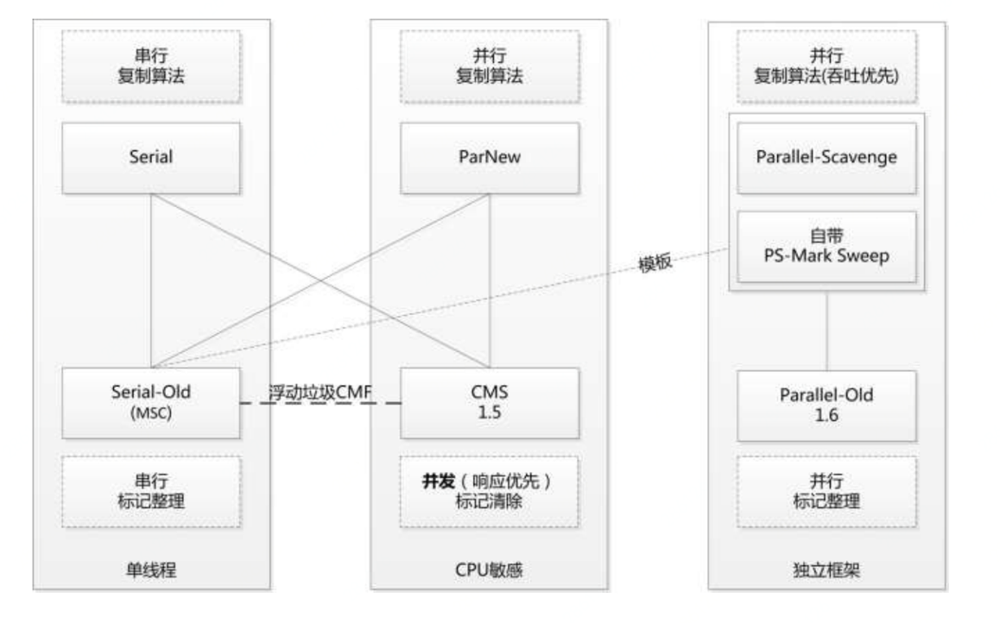

# JVM GC之CMS (上)

> 前提：
>	
>	JVM：Hotspot
>
>   JDK：openjdk7
>
>   硬件：4C8G
> 
>   本文章需要有一定JVM相关知识，在阅读本文章之前，最好请先阅读《深入理解Java虚拟机》

在说CMS GC之前我们先来说一下JAVA的应用类型，JAVA的应用类型大体上可以分为两种：

- 吞吐量优先型，例如：大数据计算、日常简单的应用

- CPU敏感型，例如：Web系统、JSF服务等

两种JAVA类型对应的GC如下图所示：



其实目前我们大部分应用或系统都属于CPU敏感型，在G1出现之前JVM提供的CPU敏感型GC只有CMS，这也是为什么我们需要设置JVM GC为CMS

JVM设置CMS GC参数如下：

`-XX:+UseConcMarkSweepGC`

从[《JVM备战参数之XSS》](http://git.jd.com/jdwl_tc/JavaCourse/blob/master/01%20Java%E5%9F%BA%E7%A1%80/09%20JVM%E5%8F%82%E6%95%B0/JVM%E5%A4%87%E6%88%98%E5%8F%82%E6%95%B0%E4%B9%8BXSS/README.md)这篇文章中我们可以看到其实是把`UseConcMarkSweepGC`这个参数设置成`true`。

我们可以通过JVM源码分析一下设置这个参数后做了什么：

```
  // Set per-collector flags
  if (UseParallelGC || UseParallelOldGC) {
    set_parallel_gc_flags();
  } else if (UseConcMarkSweepGC) { // should be done before ParNew check below
    set_cms_and_parnew_gc_flags();
  } else if (UseParNewGC) {  // skipped if CMS is set above
    set_parnew_gc_flags();
  } else if (UseG1GC) {
    set_g1_gc_flags();
  }
```

上面代码是根据不同GC类型标志设置各种GC方法，根据上面我们可以看出参数和参数之间是**互斥**的，并且有一定的**优先级**。如果同时设置了`UseParallelGC`和`UseConcMarkSweepGC`那么从代码上看`UseParallelGC`会生效。

根据上面代码我们可以看出设置CMS后还会设置`UseParNewGC`，那么我们其实有一个疑问，上面代码参数如果在启动参数中都没有显示设置，那么JVM会设置哪个GC呢？我们看一下以下代码片段：

```
jint Arguments::parse_each_vm_init_arg(const JavaVMInitArgs* args,
                                       SysClassPath* scp_p,
                                       bool* scp_assembly_required_p,
                                       FlagValueOrigin origin) {

	...

	FLAG_SET_CMDLINE(bool, UseParallelGC, true);

	...

```

默认JVM会设置为`UseParallelGC`

其实JVM还是很智能的，上面两种JAVA类型之间GC切换是取决于***最大停顿时间(`MaxGCPauseMillis`)***的

```
if (!UseSerialGC &&
        !UseConcMarkSweepGC &&
        !UseG1GC &&
        !UseParNewGC &&
        !DumpSharedSpaces &&
        FLAG_IS_DEFAULT(UseParallelGC)) {
  if (should_auto_select_low_pause_collector()) {
    FLAG_SET_ERGO(bool, UseConcMarkSweepGC, true);
  } else {
    FLAG_SET_ERGO(bool, UseParallelGC, true);
  }
  no_shared_spaces();
}

bool Arguments::should_auto_select_low_pause_collector() {
  if (UseAutoGCSelectPolicy &&
      !FLAG_IS_DEFAULT(MaxGCPauseMillis) &&
      (MaxGCPauseMillis <= AutoGCSelectPauseMillis)) {
    if (PrintGCDetails) {
      // Cannot use gclog_or_tty yet.
      tty->print_cr("Automatic selection of the low pause collector"
       " based on pause goal of %d (ms)", MaxGCPauseMillis);
    }
    return true;
  }
  return false;
}
```

我们主要看一下这句代码：`if (should_auto_select_low_pause_collector())`，通过字面意思是**自动选择低停顿的GC**

如上面代码可以看出设置了`MaxGCPauseMillis`并且`MaxGCPauseMillis > AutoGCSelectPauseMillis`，那么JVM自动会切换到CMS，其实一般情况下我们会手动设置，这样更明确，解决问题更方便一些。


OK，我们已经设置完CMS了，接下来看一下CMS内部是如何工作的把


CMS会启动一个`ConcurrentMarkSweepThread`,CMS GC回收工作会由`ConcurrentMarkSweepThread`处理。

```
if (collector_policy()->is_concurrent_mark_sweep_policy()) {
    bool success = create_cms_collector();
    if (!success) return JNI_ENOMEM;
}

bool GenCollectedHeap::create_cms_collector() {
  ...
  CMSCollector* collector = new CMSCollector(
    (ConcurrentMarkSweepGeneration*)_gens[1],
    (ConcurrentMarkSweepGeneration*)_perm_gen->as_gen(),
    _rem_set->as_CardTableRS(),
    (ConcurrentMarkSweepPolicy*) collector_policy());
  ...
}

CMSCollector::CMSCollector(ConcurrentMarkSweepGeneration* cmsGen,
                           ConcurrentMarkSweepGeneration* permGen,
                           CardTableRS*                   ct,
                           ConcurrentMarkSweepPolicy*     cp):

  ...

  _cmsThread = ConcurrentMarkSweepThread::start(this);

  ...

}

ConcurrentMarkSweepThread* ConcurrentMarkSweepThread::start(CMSCollector* collector) {
  if (!_should_terminate) {
    assert(cmst() == NULL, "start() called twice?");
    ConcurrentMarkSweepThread* th = new ConcurrentMarkSweepThread(collector);
    assert(cmst() == th, "Where did the just-created CMS thread go?");
    return th;
  }
  return NULL;
}

```

上面代码是CMS GC创建的过程以及`ConcurrentMarkSweepThread`创建的过程，下面我们看一下`ConcurrentMarkSweepThread`内部是如何运行的。

```
void ConcurrentMarkSweepThread::run() {

  ...

  while (!_should_terminate) {
    sleepBeforeNextCycle();
    if (_should_terminate) break;
    GCCause::Cause cause = _collector->_full_gc_requested ?
      _collector->_full_gc_cause : GCCause::_cms_concurrent_mark;
    _collector->collect_in_background(false, cause);
  }

  ...

}

void ConcurrentMarkSweepThread::sleepBeforeNextCycle() {
  while (!_should_terminate) {
    if (CMSIncrementalMode) {
      icms_wait();
      return;
    } else {
      // Wait until the next synchronous GC, a concurrent full gc
      // request or a timeout, whichever is earlier.
      wait_on_cms_lock(CMSWaitDuration);
    }
    // Check if we should start a CMS collection cycle
    if (_collector->shouldConcurrentCollect()) {
      return;
    }
    // .. collection criterion not yet met, let's go back
    // and wait some more
  }
}

manageable(intx, CMSWaitDuration, 2000,                                   \
          "Time in milliseconds that CMS thread waits for young GC")  

```
**以上代码是CMS触发的核心逻辑**

如上面代码可以看出，`ConcurrentMarkSweepThread`内部是两个嵌套的`while`循环，我们先来看内层的`while`循环，内层的循环中会有一个`wait_on_cms_lock(CMSWaitDuration);`，lock时长为2s，到时间后会继续往下走，相当于内层的`while`循环每隔两秒检查一次是否需要进行cms回收：`if (_collector->shouldConcurrentCollect())` 如果需要回收会跳出内部`while`循环，到外部的`while`循环，外部循环内就会进行cms回收，回收完毕后又会进入到内层的while循环去判断是否需要cms回收，循环往复直到`_should_terminate=true`为止。


下面我们来看一下CMS是否回收的触发逻辑：`_collector->shouldConcurrentCollect()`

```
bool CMSCollector::shouldConcurrentCollect(){

  ...

  if (!UseCMSInitiatingOccupancyOnly) {
    if (stats().valid()) {
      if (stats().time_until_cms_start() == 0.0) {
        return true;
      }
    } else {
      // We want to conservatively collect somewhat early in order
      // to try and "bootstrap" our CMS/promotion statistics;
      // this branch will not fire after the first successful CMS
      // collection because the stats should then be valid.
      if (_cmsGen->occupancy() >= _bootstrap_occupancy) {
        if (Verbose && PrintGCDetails) {
          gclog_or_tty->print_cr(
            " CMSCollector: collect for bootstrapping statistics:"
            " occupancy = %f, boot occupancy = %f", _cmsGen->occupancy(),
            _bootstrap_occupancy);
        }
        return true;
      }
    }
  }

  if (_cmsGen->should_concurrent_collect()) {
    if (Verbose && PrintGCDetails) {
      gclog_or_tty->print_cr("CMS old gen initiated");
    }
    return true;
  }


  GenCollectedHeap* gch = GenCollectedHeap::heap();
  assert(gch->collector_policy()->is_two_generation_policy(),
         "You may want to check the correctness of the following");
  if (gch->incremental_collection_will_fail(true /* consult_young */)) {
    if (Verbose && PrintGCDetails) {
      gclog_or_tty->print("CMSCollector: collect because incremental collection will fail ");
    }
    return true;
  }

  if (CMSClassUnloadingEnabled && _permGen->should_concurrent_collect()) {
    bool res = update_should_unload_classes();
    if (res) {
      if (Verbose && PrintGCDetails) {
        gclog_or_tty->print_cr("CMS perm gen initiated");
      }
      return true;
    }
  }

  return false;

  ...

}

```

上面代码有四段，我们下面一段一段的分析一下：

首先是第一段：

```
if (!UseCMSInitiatingOccupancyOnly) {
    if (stats().valid()) {
      if (stats().time_until_cms_start() == 0.0) {
        return true;
      }
    } else {
      // We want to conservatively collect somewhat early in order
      // to try and "bootstrap" our CMS/promotion statistics;
      // this branch will not fire after the first successful CMS
      // collection because the stats should then be valid.
      if (_cmsGen->occupancy() >= _bootstrap_occupancy) {
        if (Verbose && PrintGCDetails) {
          gclog_or_tty->print_cr(
            " CMSCollector: collect for bootstrapping statistics:"
            " occupancy = %f, boot occupancy = %f", _cmsGen->occupancy(),
            _bootstrap_occupancy);
        }
        return true;
      }
    }
  }

_bootstrap_occupancy = ((double)MIN2((uintx)100, MAX2((uintx)0, CMSBootstrapOccupancy)))
                       /(double)100;

```

这段代码需要`UseCMSInitiatingOccupancyOnly=false`才会进入，进入后会根据`(stats().time_until_cms_start() == 0.0`和`_cmsGen->occupancy() >= _bootstrap_occupancy`判断是否需要进行CMS回收。

其实我们没必要关心上面两个条件，因为一般配置CMS的时候都会配置`-XX:+UseCMSInitiatingOccupancyOnly`，这样对于我们分析CMS触发原因简单很多，因为不需要判断太多额外条件。


我们再来看第二段代码：

```
if (_cmsGen->should_concurrent_collect()) {
    if (Verbose && PrintGCDetails) {
      gclog_or_tty->print_cr("CMS old gen initiated");
    }
    return true;
}

bool ConcurrentMarkSweepGeneration::should_concurrent_collect() const {

  assert_lock_strong(freelistLock());
  if (occupancy() > initiating_occupancy()) {
    if (PrintGCDetails && Verbose) {
      gclog_or_tty->print(" %s: collect because of occupancy %f / %f  ",
        short_name(), occupancy(), initiating_occupancy());
    }
    return true;
  }
  if (UseCMSInitiatingOccupancyOnly) {
    return false;
  }
  if (expansion_cause() == CMSExpansionCause::_satisfy_allocation) {
    if (PrintGCDetails && Verbose) {
      gclog_or_tty->print(" %s: collect because expanded for allocation ",
        short_name());
    }
    return true;
  }
  if (_cmsSpace->should_concurrent_collect()) {
    if (PrintGCDetails && Verbose) {
      gclog_or_tty->print(" %s: collect because cmsSpace says so ",
        short_name());
    }
    return true;
  }
  return false;
}

```

我们可以看到，如果配置了`-XX:+UseCMSInitiatingOccupancyOnly`，只需要判定`occupancy() > initiating_occupancy()`这个条件，`initiating_occupancy`是通过配置`-XX:CMSInitiatingOccupancyFraction=80 `设定的，`occupancy`则是老年代目前的内存占比，所以触发条件就是如果当前老年代内存占比>80%则就触发CMS回收。

如果没有配置`-XX:+UseCMSInitiatingOccupancyOnly`，则还需要判断`_cmsSpace`等条件，这样不利于对我们分析CMS。


我们再来看第三段代码：

```
  GenCollectedHeap* gch = GenCollectedHeap::heap();
  assert(gch->collector_policy()->is_two_generation_policy(),
         "You may want to check the correctness of the following");
  if (gch->incremental_collection_will_fail(true /* consult_young */)) {
    if (Verbose && PrintGCDetails) {
      gclog_or_tty->print("CMSCollector: collect because incremental collection will fail ");
    }
    return true;
  }

```

这段代码就是我们所说的晋升担保失败了(`gch->incremental_collection_will_fail(true /* consult_young */)`)，也是CMS回收判断中对复杂的一个。

我们具体来来分析一下：晋升担保有两个条件，满足其一便为晋升担保失败。

```
bool incremental_collection_will_fail(bool consult_young) {
    // Assumes a 2-generation system; the first disjunct remembers if an
    // incremental collection failed, even when we thought (second disjunct)
    // that it would not.
    assert(heap()->collector_policy()->is_two_generation_policy(),
           "the following definition may not be suitable for an n(>2)-generation system");
    return incremental_collection_failed() ||
           (consult_young && !get_gen(0)->collection_attempt_is_safe());
}
```

第一个条件是`incremental_collection_failed()`，`incremental_collection_failed`实在`ParNewGeneration::handle_promotion_failed`方法中进行设置为`true`的。

> promotion_failed：是在进行Young GC时，survivor space放不下、对象只能放入老年代，而此时老年代也放不下造成的

第二个条件是`consult_young && !get_gen(0)->collection_attempt_is_safe()`，`consult_young`上面一个明确设值为true了， `get_gen(0)`则指的是年轻代的回收器，我们继续看一下`collection_attempt_is_safe()`内部实现

```

bool DefNewGeneration::collection_attempt_is_safe() {
    if (!to()->is_empty()) {
      if (Verbose && PrintGCDetails) {
        gclog_or_tty->print(" :: to is not empty :: ");
      }
      return false;
    }
    if (_next_gen == NULL) {
      GenCollectedHeap* gch = GenCollectedHeap::heap();
      _next_gen = gch->next_gen(this);
      assert(_next_gen != NULL,
             "This must be the youngest gen, and not the only gen");
    }
    return _next_gen->promotion_attempt_is_safe(used());
  }

  size_t DefNewGeneration::used() const {
    return eden()->used()
         + from()->used();      // to() is only used during scavenge
  }

```

从代码看是调用了`_next_gen->promotion_attempt_is_safe(used())`，`_next_gen`指的就是cms_gen，所以我们来一下cms的`promotion_attempt_is_safe`, 传入的是年轻代的`eden+from`内存使用值。

```
  bool ConcurrentMarkSweepGeneration::promotion_attempt_is_safe(size_t max_promotion_in_bytes) const {
    size_t available = max_available();
    size_t av_promo  = (size_t)gc_stats()->avg_promoted()->padded_average();
    bool   res = (available >= av_promo) || (available >= max_promotion_in_bytes);
    if (Verbose && PrintGCDetails) {
      gclog_or_tty->print_cr(
        "CMS: promo attempt is%s safe: available("SIZE_FORMAT") %s av_promo("SIZE_FORMAT"),"
        "max_promo("SIZE_FORMAT")",
        res? "":" not", available, res? ">=":"<",
        av_promo, max_promotion_in_bytes);
    }
    return res;
  }

  size_t ConcurrentMarkSweepGeneration::max_available() const {
    return free() + _virtual_space.uncommitted_size();
  }
```

在`promotion_attempt_is_safe`方法中`max_available`其实是剩余老年代剩余空间,`gc_stats()->avg_promoted()->padded_average()`是gc统计的一个平均晋升值，

**老年代剩余空间>晋升的平均值**或者**老年代剩余空间>eden+from内存当前占用值** 这两个条件任何一个成立时都认为是可以安全的晋升到老年代的。


我们再来看第四段代码：

```
if (CMSClassUnloadingEnabled && _permGen->should_concurrent_collect()) {
    bool res = update_should_unload_classes();
    if (res) {
      if (Verbose && PrintGCDetails) {
        gclog_or_tty->print_cr("CMS perm gen initiated");
      }
      return true;
    }
}
```

这段代码我们可以看到是通过perm区的占比来判断是否应该进行CMS回收，前提是设置了`-XX:+CMSClassUnloadingEnabled`，`_permGen->should_concurrent_collect()`内部逻辑和上面老年代判断逻辑是一样的，这里就赘述了。

综上所述：CMS判断是否应该回收主要由3个因素：

1. 当前老年代内存占比>CMS设定的回收占比
2. 老年代剩余空间>晋升的平均值
3. 老年代剩余空间>eden+from内存当前占用值


