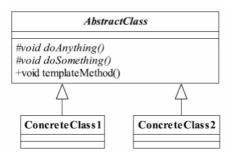

# Spring中模板模式的应用

## 模板模式的定义

定义一个操作中的算法的框架， 而将一些步骤延迟到子类中。 使得子类可以不改变一个算法的结构即可重定义该算法的某些特定步骤

模板方法模式的通用类图非常简单，仅仅使用了Java的继承机制，但它是一个非常广泛的模式。 

其类图如下:

其中AbstractClass叫做抽象模板，它的方法分为两类：

基本方法：是由子类实现的方法，并且在模板方法被调用。（一般都加上final关键字，防止被覆写）

模板方法：可以有一个或几个，一般是一个具体方法，也就是一个框架，实现对基本方法的调用，完成固定的逻辑
（抽象模板中的基本方法尽量设计为protected类型，符合迪米特法则，不需要暴露的属性或方法尽量不要设置为protected类型。实现类若非必要，尽量不要扩大父类中的访问权限）

## 模板方法优缺点

### 模板方法优点
封装不变部分，扩展可变部分。把认为不变部分的算法封装到父类中实现，而可变部分的则可以通过继承来继续扩展

提取公共部分代码，便于维护

行为由父类控制，子类实现

### 模板方法缺点
按照我们的设计习惯,抽象类负责声明最抽象、最一般的事物属性和方法,实现类完成具体的事物属性和方法。 但是模板方法模式却颠倒了,抽象类定义了部分抽象方法,由子类实现,子类执行的结果影响了父类的结果,也就是子类对父类产生了影响,这在复杂的项目中,会带来代码阅读的难度,而且也会让新手产生不适感

### 模板方法使用场景
多个子类有公有的方法，并且逻辑基本相同时。

重要、复杂的算法，可以把核心算法设计为模板方法，周边的相关细节功能则由各个子类实现。

重构时，模板方法模式是一个经常使用的模式，把相同的代码抽取到父类中，然后通过钩子函数约束其行为。

## Spring中模板方法的实现
JdbcTemplate类中把对数据库的操作jdbc代码高度封装，并且采用了模板方法的设计思想，将其抽象成回调接口和工具类调用的方法，把特定的步骤通过工具类来组装，这样可以实现固定步骤的高度可重用。

举例：执行sql的方法execute的源码

	public void execute(final String sql) throws DataAccessException {
		if (logger.isDebugEnabled()) {
			logger.debug("Executing SQL statement [" + sql + "]");
		}

		class ExecuteStatementCallback implements StatementCallback<Object>, SqlProvider {
			@Override
			@Nullable
			public Object doInStatement(Statement stmt) throws SQLException {
				stmt.execute(sql);
				return null;
			}
			@Override
			public String getSql() {
				return sql;
			}
		}
		execute(new ExecuteStatementCallback());
	}

这个类继承了StatementCallback接口和sqlProvider接口，这个接口只有一个方法，主要负责的就是Statement这个对象执行sql

	public interface StatementCallback<T> {
		T doInStatement(Statement stmt) throws SQLException, DataAccessException;
	}

最后把这个接口传入execute重载方法

	public <T> T execute(StatementCallback<T> action) throws DataAccessException {
		Assert.notNull(action, "Callback object must not be null");

		Connection con = DataSourceUtils.getConnection(obtainDataSource());
		Statement stmt = null;
		try {
			stmt = con.createStatement();
			applyStatementSettings(stmt);
			T result = action.doInStatement(stmt);
			handleWarnings(stmt);
			return result;
		}
		catch (SQLException ex) {
			// Release Connection early, to avoid potential connection pool deadlock
			// in the case when the exception translator hasn't been initialized yet.
			String sql = getSql(action);
			JdbcUtils.closeStatement(stmt);
			stmt = null;
			DataSourceUtils.releaseConnection(con, getDataSource());
			con = null;
			throw translateException("StatementCallback", sql, ex);
		}
		finally {
			JdbcUtils.closeStatement(stmt);
			DataSourceUtils.releaseConnection(con, getDataSource());
		}
	}

这段源码把固定的获取connection对象，创建Statement、调用doInstatement方法执行sql获取结果进行了封装。外部调用该方法时通过匿名内部类实现回调。

