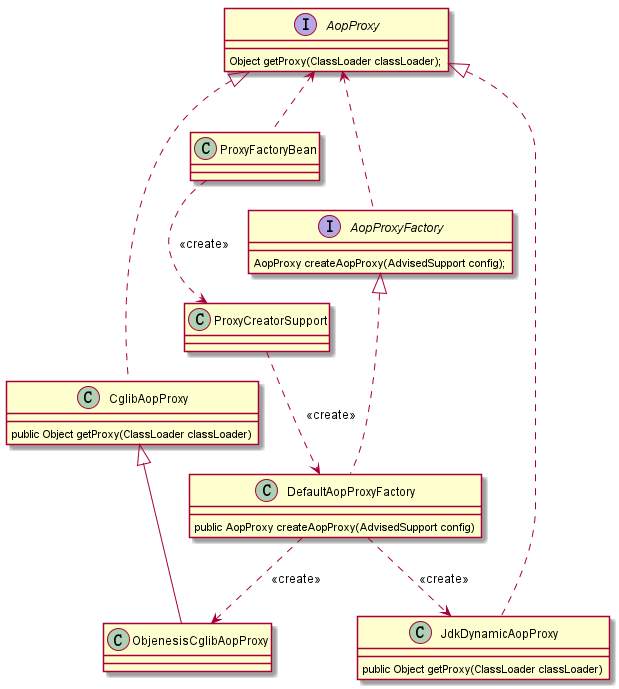

# Spring中策略模式的实现

## 策略模式的原理

策略模式，通常是指完成某个操作可能有多种方法，这些方法可能有不同的适合场合，这些操作方法都有可能被用到。把各个操作方法都当作一个实现策略，使用者可根据需要选择合适的策略。策略模式的结构如下：


Context：使用不同策略的环境，它可以根据自身的条件选择不同的策略实现类来完成所要的操作。它持有一个策略实例的引用。创建具体策略对象的方法也可以由它来完成

Strategy：抽象策略，定义每个策略都要实现的策略方法

ConcreteStrategy：具体策略实现类，实现在抽象策略中定义的策略方法

## 策略模式的优缺点
### 策略模式的优点
1. 由于策略类实现自同一个抽象接口,策略类之间可以自由切换
2. 易于扩展,增加一个新的策略,对策略模式来说非常容易,基本可以在不改变原有代码的基础上进行扩展
3. 避免使用多重条件,如果不使用策略模式,对于所有的业务逻辑,必须使用if..else条件语句进行连接,通过条件判断来决定使用哪种业务逻辑,代码是非常不容易维护的

### 策略模式的缺点
1. 维护各个策略类会带来额外的开销,策略类比较多的话,维护起来会比较头疼

## 策略模式适用场景
* 几个类的主要逻辑相同,只有部分逻辑少有区别的情况
* 有几种相似的行为,调用者需要动态地决定使用哪一种,那么可以使用策略模式,将这些行为封装起来供调用者使用

## Spring中策略模式的实现
在Spring中有多个地方使用策略模式，如Bean定义对象的创建及代理对象的创建等，这里主要看一下代理对象创建的策略模式的是实现,Spring的代理方式有JDK动态代理和CGLIB代理，对这两种代理方式使用了策略模式，结构图如下：



这里抽象策略是AopProxy接口，CglibAopProxy和JdkDynamicAopProxy分别代表两种策略的实现方式，ProxyFactoryBean代表Context角色，它根据条件选择使用JDK代理方式还是CGLIB代码方式，源码如下：

```
public class DefaultAopProxyFactory implements AopProxyFactory, Serializable {
	@Override
	public AopProxy createAopProxy(AdvisedSupport config) throws AopConfigException {
		if (config.isOptimize() || config.isProxyTargetClass() || hasNoUserSuppliedProxyInterfaces(config)) {
			Class<?> targetClass = config.getTargetClass();
			if (targetClass == null) {
				throw new AopConfigException("TargetSource cannot determine target class: " +
						"Either an interface or a target is required for proxy creation.");
			}
			if (targetClass.isInterface() || Proxy.isProxyClass(targetClass)) {
				return new JdkDynamicAopProxy(config);
			}
			return new ObjenesisCglibAopProxy(config);
		}
		else {
			return new JdkDynamicAopProxy(config);
		}
	}
}
```

> 从上面的代码可以看出JDK动态代理只能基于接口去代理，被代理的类必须要实现一个接口，而CGLIB动态代理可以基于类。

DefaultAopProxyFactory、ProxyCreatorSupport、AopProxyFactory负责创建具体的策略对象，ProxyFactoryBean是通过依赖的方法来关联具体策略对象的，它通过调用策略对象的getProxy(ClassLoader classLoader)方法来完成操作