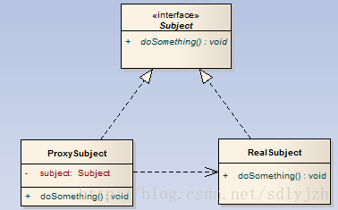
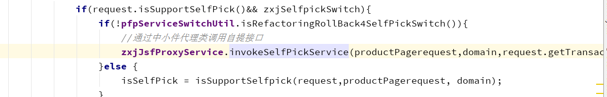
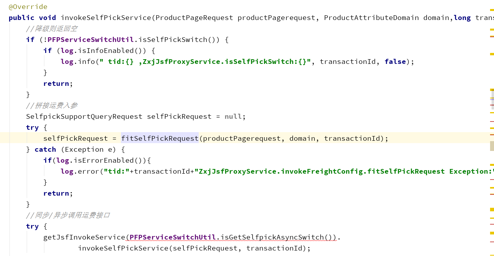
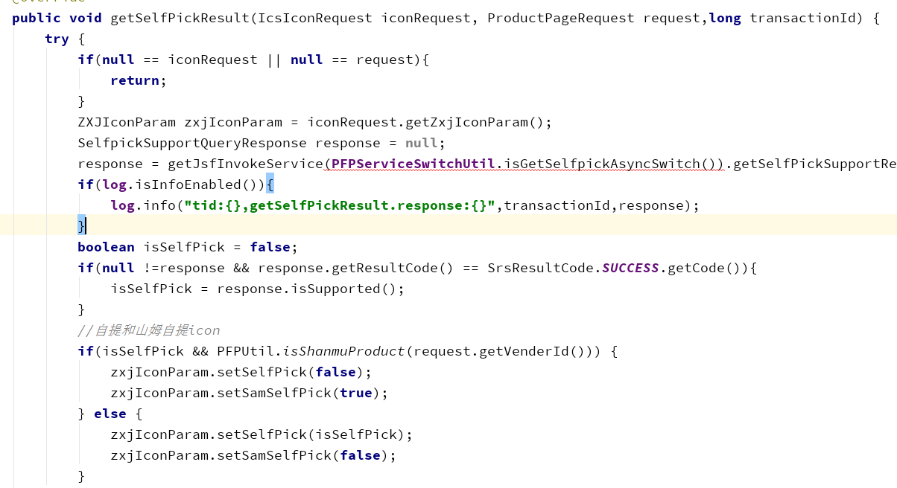

# 设计模式之代理模式 

## 代理模式定义

为其他对象提供一种代理以控制对这个对象的访问。在某些情况下，一个对象不适合或者不能直接引用另一个对象，而代理对象可以在客户端和目标对象之间起到中介的作用。

类型：结构型模式

类图：

代理模式包含如下角色：
- 抽象角色：通过接口或抽象类声明真实角色实现的业务方法。
- 代理角色：实现抽象角色，是真实角色的代理，通过真实角色的业务逻辑方法来实现抽象方法，并可以附加自己的操作。
- 真实角色：实现抽象角色，定义真实角色所要实现的业务逻辑，供代理角色调用。

## 优点
1、职责清晰，实的角色就是实现实际的业务逻辑，不用关心其他非本职责的事务，通过后期的代理完成一件完成事务，附带的结果就是编程简洁清晰。
2、对象可以在客户端和目标对象之间起到中介的作用，这样起到了中介的作用和保护了目标对象的作用。
## 缺点
代理模式虽然实现了调用者与委托类之间的解耦合，但是却增加了代理类与委托类之间的强耦合（在代理类中显式调用委托类的方法），而且增加代理类之后明显会增加处理时间，拖慢处理时间。
## 代理模式的适用场景
1、我们想要隐藏某个类时，可以为其提供代理类。
2、当一个类需要对不同的调用者提供不同的调用权限时，可以使用代理类来实现（代理类不一定只有一个，我们可以建立多个代理类来实现，也可以在一个代理类中进行权限判断来进行不同权限的功能调用）。
3、当我们要扩展某个类的某个功能时，可以使用代理模式，在代理类中进行简单扩展（只针对简单扩展，可在引用委托类的语句之前与之后进行）。

## 应用场景（pfp商详页调用外部自提jsf接口 - 开放平台研发部 高红旭）
调用jsf自提接口时，代理类负者区分同步和异步调用，并且对于调用接口需要的入参拼接和结果处理也是代理类处理。
例如：对于自提接口调用首先代理类会根据商详页入参拼接自提接口所需要的入参，并且根据我们ucc系统配置的同步异步开关进行相应的同步异步的逻辑调用。在获取接口返回值的时候，代理类会根据调用时我们选择的同步异步模式进行相应的处理，并对取得结果做相应拼接处理。
基于这种情况，调用自提jsf接口我们选择了代理模式。

### 优点：
1.调用方不必要知道我调用运费接口具体的处理逻辑（同步/异步），因此我们隐藏了我们具体的处理方式。
2.对运费接口的入参和调用后结果的处理在代理类中实现。

代码：

通过代理调用中小件自提接口：

自提接口调用前对所需入参进行拼接，并调用相应的同异步逻辑：

通过代理获取中小件自提接口返回结果：
代理类负责区分调用方式是同步还是异步并取得相应的返回结果，并根据返回结果做相应处理。

## 总结
代理模式其实就是一个中介，它具备被调用方的所有功能，并且还可以做附加处理并可以隐藏被调用方。
