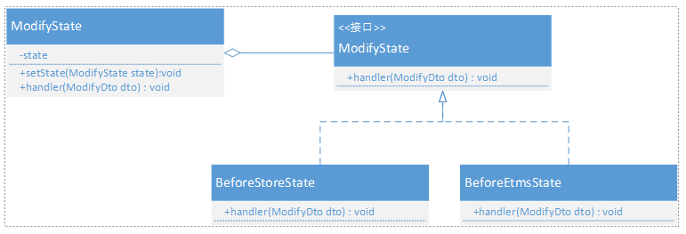

# 设计模式之状态模式

状态模式，又称状态对象模式（Pattern of Objects for States），状态模式是对象的行为模式。状态模式允许一个对象在其内部状态改变的时候改变其行为。这个对象看上去就像是改变了它的类一样。

## 状态模式的结构
状态模式把所研究的对象的行为包装在不同的状态对象里，每一个状态对象都属于一个抽象状态类的一个子类。状态模式的意图是让一个对象在其内部状态改变的时候，其行为也随之改变。

状态模式所涉及到的角色有：

### 上下文(Context)
定义客户端所感兴趣的接口，并且保留一个具体状态类的实例。这个具体状态类的实例给出此上下文对象的现有状态。

### 抽象状态(State)
定义一个接口，用以封装上下文（Context）对象的一个特定的状态所对应的行为。

### 具体状态(ConcreteState)
每一个具体状态类都实现了上下文（Context）的一个状态所对应的行为。

## 业务场景
在订单修改系统中，订单不同的状态对应的订单修改流程也不同，根据具体业务划分为下库前状态和下库后状态。使用状态模式实现，需要定义两个状态【下库前状态】和【下库后状态】，每个状态对应一个订单修改流程，然后创建一个订单状态管理对象（相当于Context），然后客户端类通过订单状态管理对象去控制状态，从而改变订单修改流程。
###	系统结构图


### 源代码
#### 抽象状态类

```java

	public interface ModifyState {
	     //订单修改
	     // @param dto 订单修改信息
	     
	    void handler(ModifyDto dto);
	}
```
#### 具体状态类——下库前状态
```java

	public class BeforeStoreState implements ModifyState {
	    /**
	     * 下库前状态对应的订单修改处理逻辑
	     * @param dto
	     */
	    public void handler(ModifyDto dto) {
	        System.out.println("下库前修改");
	        ......
	    }
	}
```
#### 具体状态类——下库后状态
```java

	public class BeforeEtmsState implements ModifyState {
	
	    /**
	     * 下库后状态对应的订单修改处理逻辑
	     * @param dto
	     */
	    public void handler(ModifyDto dto) {
	        System.out.println("下库后修改");
	        ......
	    }
	}
```
#### 上下文类
```java

    public class ModifyContext implements Serializable{

	    private static final long serialVersionUID = -4316898242295640398L;
	
	    private ModifyState state;
	
	    public ModifyContext(){
	        state = null;
	    }
	
	    public ModifyState getState() {
	        return state;
	    }
	    /**
	     * 设置状态
	     */
	    public void setState(ModifyState state) {
	        this.state = state;
	    }
	
	    /**
	     * 调用具体状态对应的行为
	     * @param modifyDto
	     */
	    public void handler(ModifyDto modifyDto){
	        state.handler(modifyDto);
	    }
	
	    @Override
	    public String toString() {
	        return ToStringBuilder.reflectionToString(this, ToStringStyle.SHORT_PREFIX_STYLE);
	    }
	}
```

#### 客户端类
```java

    public class OrderModifyHandler {

	    //下库前状态：
	    private ModifyState beforeStoreState = new BeforeStoreState();
	    //下库后状态：
	    private ModifyState beforeEtmsState = new BeforeEtmsState();
	    //订单中间件查询组件：
	    private OmbOomService ombOomService;
	    /**
	     * 订单修改处理类
	     * @param modifyDto 用户提交的订单修改信息
	     */
	    public void hander(ModifyDto modifyDto){
	        ModifyContext modifyContext = new ModifyContext();
	
	        //调用订单中间件，获取订单信息：
	        Order order = ombOomService.getOrder(modifyDto.getOrderId(), modifyDto.getRequestionId());
	
	        //下库前状态：
	        if (OrderStateUtil.isBeforeStoreProduced(order.getState(), order.getState2())) {
	            modifyContext.setState(beforeStoreState);
	        //下库后状态：
	        } else if (OrderStateUtil.isStoreProducedBeforeEtms(order.getState(),order.getState2())) {
	            modifyContext.setState(beforeEtmsState);
	        }
	        //调用具体状态对应的订单修改处理类：
	        modifyContext.handler(modifyDto);
	    }
	
	    public void setOmbOomService(OmbOomService ombOomService) {
	        this.ombOomService = ombOomService;
	    }
	}
```

从上面的示例可以看出，订单状态在运行期是动态变化的，对应的订单修改流程会根据具体订单状态的改变而改变。
