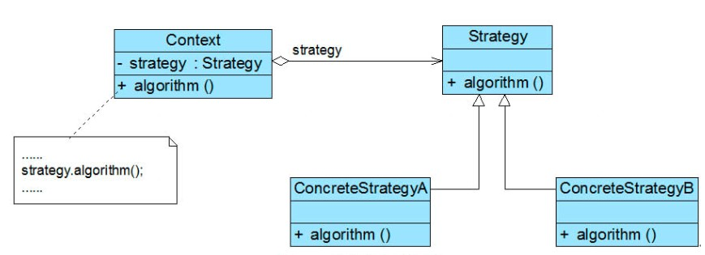

# 设计模式之策略模式

## 策略模式定义

**策略模式(Strategy Pattern)：**定义一系列算法类，将每一个算法封装起来，并让它们可以相互替换，策略模式让算法独立于使用它的客户而变化，也称为政策模式(Policy)。策略模式是一种对象行为型模式。

**类型：**对象行为型模式。

**类图：**



在策略模式结构图中包含如下几个角色：

- **Context（环境类）：**环境类是使用算法的角色，它在解决某个问题（即实现某个方法）时可以采用多种策略。在环境类中维持一个对抽象策略类的引用实例，用于定义所采用的策略。

- **Strategy（抽象策略类）：**它为所支持的算法声明了抽象方法，是所有策略类的父类，它可以是抽象类或具体类，也可以是接口。环境类通过抽象策略类中声明的方法在运行时调用具体策略类中实现的算法。

- **ConcreteStrategy（具体策略类）：**它实现了在抽象策略类中声明的算法，在运行时，具体策略类将覆盖在环境类中定义的抽象策略类对象，使用一种具体的算法实现某个业务处理。

## 策略模式的优缺点

### 主要优点

1. 策略模式提供了`开闭原则`的完美支持，用户可以在不修改原有系统的基础上选择算法或行为，也可以灵活地增加新的算法或行为。
1.  策略模式提供了管理相关的算法族的办法。策略类的等级结构定义了一个算法或行为族，恰当使用继承可以把公共的代码移到抽象策略类中，从而避免重复的代码。
1. 策略模式提供了一种可以替换继承关系的办法。如果不使用策略模式，那么使用算法的环境类就可能会有一些子类，每一个子类提供一种不同的算法。但是，这样一来算法的使用就和算法本身混在一起，不符合“单一职责原则”，决定使用哪一种算法的逻辑和该算法本身混合在一起，从而不可能再独立演化；而且使用继承无法实现算法或行为在程序运行时的动态切换。
1. 使用策略模式可以避免多重条件选择语句。多重条件选择语句不易维护，它把采取哪一种算法或行为的逻辑与算法或行为本身的实现逻辑混合在一起，将它们全部硬编码(Hard Coding)在一个庞大的多重条件选择语句中，比直接继承环境类的办法还要原始和落后。
1.  策略模式提供了一种算法的复用机制，由于将算法单独提取出来封装在策略类中，因此不同的环境类可以方便地复用这些策略类。

### 2. 主要缺点

1. 客户端必须知道所有的策略类，并自行决定使用哪一个策略类。这就意味着客户端必须理解这些算法的区别，以便适时选择恰当的算法。换言之，策略模式只适用于客户端知道所有的算法或行为的情况。
1. 策略模式将造成系统产生很多具体策略类，任何细小的变化都将导致系统要增加一个新的具体策略类。
1. 无法同时在客户端使用多个策略类，也就是说，在使用策略模式时，客户端每次只能使用一个策略类，不支持使用一个策略类完成部分功能后再使用另一个策略类来完成剩余功能的情况。

## 应用场景（自提推荐接口-开发平台研发部 魏立明）

获取站点类型及站点信息时，会安装不同的入参版本类型，做不同的初始化站点信息操作。

例：

- 入参版本为V2时，根据站点id获取站点类型及站点信息；
- 入参版本为V4时，根据Geohash获取站点类型及站点信息；
- 入参版本为非V2或V4时，根据四级地址获取站点类型及站点信息。

## 优点：

1. 获取站点类型及站点信息时，增加其他初始化流程操作时，无需更改原代码，直接编写具体策略类即可。
2. 部分初始化逻辑相同时，可放在抽象策略类中，无需增加重复代码。
3. 某一版本初始化逻辑需要变更时只需更改对应具体策略类，不会涉及整体流程变动。

代码：

- 根据入参版本从工厂类中获取对应对象：

  ```java
  AbstractSiteInit abstractSiteInit = SiteInitFactory.getSiteInitObject(tid, request);
  ```

  ```java
  public class SiteInitFactory {
      private static final int REQUEST_VERSION_SITE_ID = 2;
      private static final int REQUEST_VERSION_SITE_GEOHASH = 4;
  
      private SiteInitFactory() {
      }
  
      /**
       * 通过入参构建对象
       * - 构建siteId站点初始化对象
       * - 构建Geohash站点初始化对象
       * - 构建四级地址站点初始化对象
       *
       * @param tid
       * @param request
       * @return
       */
      public static AbstractSiteInit getSiteInitObject(long tid, BaseRequest request) {
          if (request.getVersion() == REQUEST_VERSION_SITE_ID) {
              return new SiteInitBySiteId();
          } else if (request.getVersion() == REQUEST_VERSION_SITE_GEOHASH) {
              return new SiteInitByGeoHash();
          }
          return new SiteInitByAddress();
      }
  }
  ```

- 向委托类中注入对象：

  ```java
  SiteInitContext siteInitContext = new SiteInitContext();
  siteInitContext.setAbstractSiteInit(abstractSiteInit);
  ```

  ```java
  public class SiteInitContext {
  
      private AbstractSiteInit abstractSiteInit;
       /**
       * 注入对象
       * @param abstractSiteInit
       */
      public void setAbstractSiteInit(AbstractSiteInit abstractSiteInit) {
          this.abstractSiteInit = abstractSiteInit;
      }
       /**
       * 获取区域站点类型集合Map
       * @param tid
       * @param request
       * @return
       */
      public Map<String, List<Integer>> getSiteTypeIdMap(long tid, BaseRequest request) {
          return abstractSiteInit.getSiteTypeIdMap(tid, request);
      }
  
      /**
       * 获取站点类型信息
       * @param tid
       * @param siteTypeIdList
       * @return
       */
      public List<SelfpickSiteTypeBO> getSiteTypeInfos(long tid, List<Integer> siteTypeIdList) {
          return abstractSiteInit.getSiteTypeInfo(tid, siteTypeIdList);
      }
  }
  ```

   

- 通过委托类获取具体信息：

  ```java
  /**
    * 初始化站点类型id
    * key为regionID || siteId || geoHash
    * value为区域下包含的siteTypeId
    */
  Map<String, List<Integer>> regionTypeMap = siteInitContext.getSiteTypeIdMap(tid, request);
   /**
     * 获取站点类型信息
     */
  List<SelfpickSiteTypeBO> siteTypeList = abstractSiteInit.getSiteTypeInfo(tid, Lists.newArrayList(siteTypeIdSet)); 
  ```

## 总结

策略模式用于算法的自由切换和扩展，它是应用较为广泛的设计模式之一。策略模式对应于解决某一问题的一个算法族，允许用户从该算法族中任选一个算法来解决某一问题，同时可以方便地更换算法或者增加新的算法。只要涉及到算法的封装、复用和切换都可以考虑使用策略模式。

 