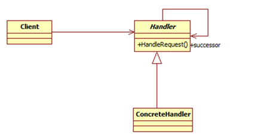
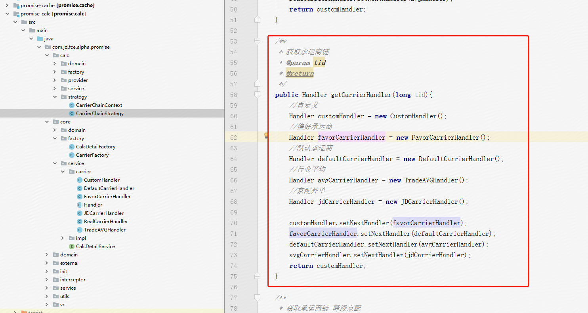
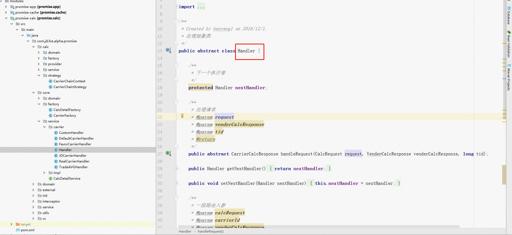
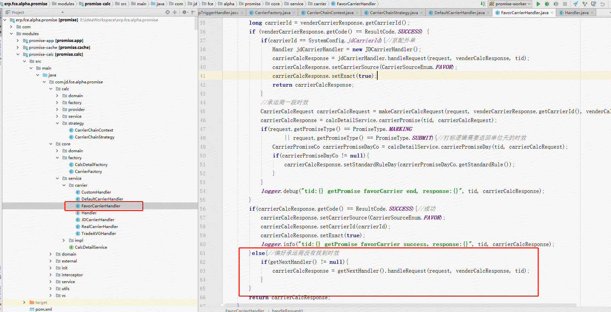

# 设计模式之责任链模式

## 责任链定义

避免请求发送者与接收者耦合在一起，让多个对象都有可能接收请求，将这些对象连接成一条链，并且沿着这条链传递请求，直到有对象处理它为止，这就是职责链模式。在职责链模式中，使得每一个对象都有可能来处理请求，从而实现了请求的发送者和接收者之间的解耦。同时职责链模式简化了对象的结构，它使得每个对象都只需要引用它的后继者即可，而不必了解整条链，这样既提高了系统的灵活性也使得增加新的请求处理类也比较方便。

**类型：**行为类模式。

**类图：**

**职责链模式包含如下角色：**

- 抽象处理类：抽象处理类中主要包含一个指向下一处理类的成员变量nextHandler和一个处理请求的方法handRequest，handRequest方法的主要主要思想是，如果满足处理的条件，则有本处理类来进行处理，否则由nextHandler来处理。
- 具体处理类：具体处理类主要是对具体的处理逻辑和处理的适用条件进行实现。

## 责任链模式的优缺点

责任链模式与if…else…相比，他的耦合性要低一些，因为它把条件判定都分散到了各个处理类中，并且这些处理类的优先处理顺序可以随意设定。责任链模式也有缺点，这与if…else…语句的缺点是一样的，那就是在找到正确的处理类之前，所有的判定条件都要被执行一遍，当责任链比较长时，性能问题比较严重。

## 责任链模式的适用场景

就像开始的例子那样，假如使用if…else…语句来组织一个责任链时感到力不从心，代码看上去很糟糕时，就可以使用责任链模式来进行重构。

## 应用场景（pop promise承运商选择-开放平台研发部 韩扬）

计算pop promise时效时，获取商家对应的承运商有多重可能，而且这些可能性存在优先级关系，并且优先级随时会调整。

例如：商家a， 根据上一个月的发货数据计算出使用频率最高的承运商为承运商1, 商家自己设置的默认承运商为承运商2， 京东快递为承运商3。

第一版做法是 ：优先默认承运商，如果没有时效则选择偏好承运商，在没有时效则选择京东快递， 即：承运商2---承运商1---京东快递。

第二版调整了优先级， 优先偏好承运商，即：承运商1-----承运商2-------京东快递。

基于这种情况，选择承运商我们使用了责任链的模式。

## 优点：

1. 商家侧代码不需要知道承运商的优先级关系，如需调整优先级，改动较小，只需修改责任链前后关系。
2. 各个承运商逻辑代码解耦，如果偏好承运商计算逻辑修正，不影响其他承运商逻辑。

代码：

- 组装承运商选择链：

- 承运商处理抽象类：

 

- 偏好承运商处理类：

 

## 总结

责任链模式其实就是一个灵活版的if…else…语句，它就是将这些判定条件的语句放到了各个处理类中，这样做的优点是比较灵活了，但同样也带来了风险，比如设置处理类前后关系时，一定要特别仔细，搞对处理类前后逻辑的条件判断关系，并且注意不要在链中出现循环引用的问题。

 