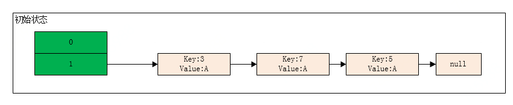
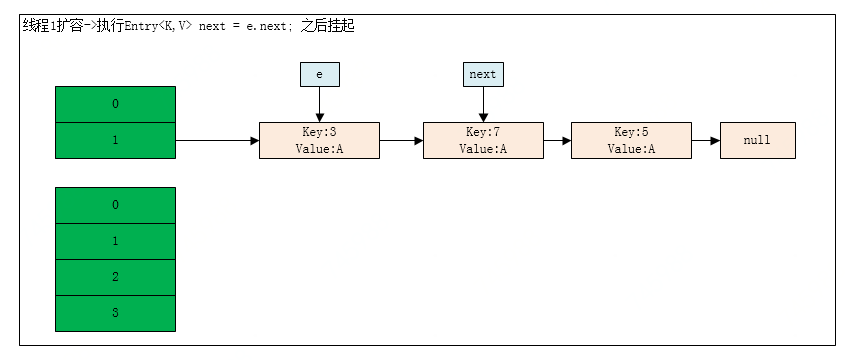
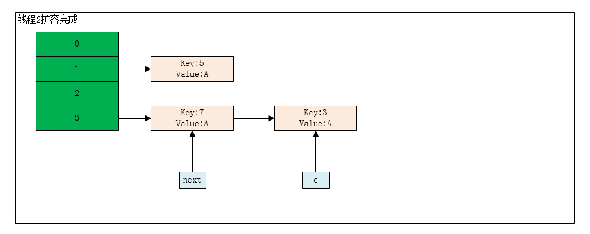
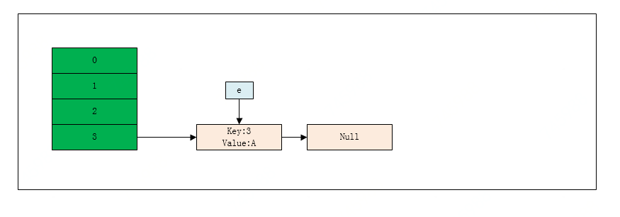
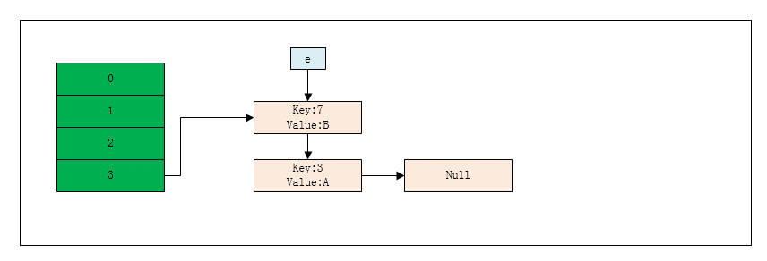
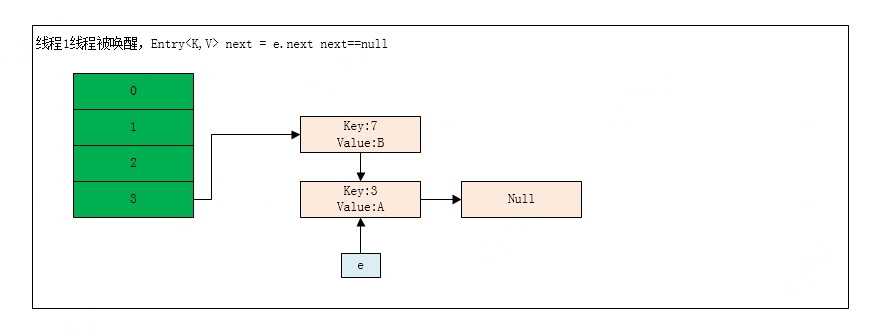
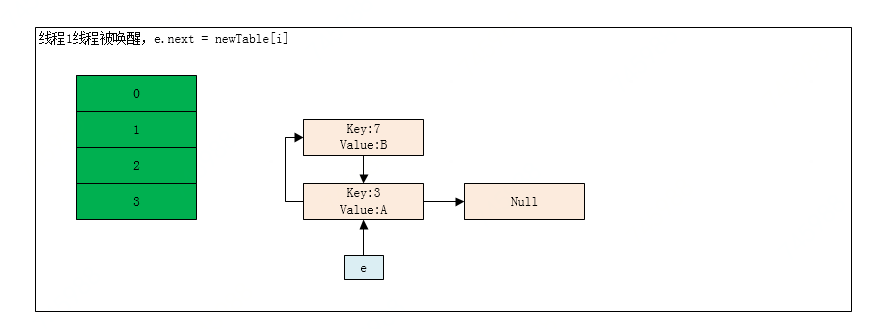
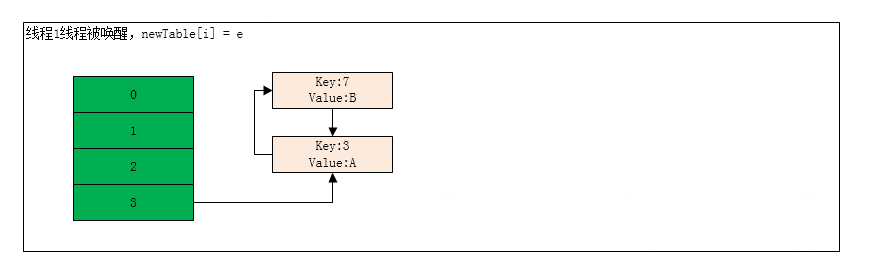

# 线程安全问题产生的原因：

1. 线程安全是多线程领域的问题，线程安全可以简单理解为一个方法或者一个实例可以在多线程环境中使用而不会出现问题。
    在同一程序中运行多个线程本身不会导致问题，问题在于多个线程访问了相同的资源。如同一内存区中的变量、数组或者对象，系统中的数据库或者文件。实际上，这些问题只有在一或多个线程
    向这些资源做了写操作时才有可能发生，只要资源没有发生变化,多个线程读取相同的资源就是安全的。
    
2. 因时间和篇幅所限，本文只是介绍几个非线程安全和线程安全的场景供大家参考，关于线程安全的其他方面还有很多，像读写锁、同步容器、同步工具、线程池等等，《Java并发编程实战》中均有
介绍。


# 非线程安全：

## 一、HashMap的死循环
    
    HashMap是开发中经常用到集合类，大家都知道它是非线程安全的，在多线程使用的情况下，会导致线程安全问题，产生死循环。
     
    JDK1.7中扩容hashMap数组：
``` java
    void transfer(Entry[] newTable, boolean rehash) {
        int newCapacity = newTable.length;
        for (Entry<K,V> e : table) {
            while(null != e) {
                //因为是单链表，如果要转移头指针，一定要保存下一个结点，不然转移后链表就丢了
                Entry<K,V> next = e.next;
                if (rehash) {
                    e.hash = null == e.key ? 0 : hash(e.key);
                }
                int i = indexFor(e.hash, newCapacity);
                //e要插入到链表的头部，所以要先用 e.next 指向新的 Hash 表第一个元素（采用头插法）
                e.next = newTable[i];
                //现在新 Hash 表的头指针仍然指向 e 没转移前的第一个元素，所以需要将新 Hash 表的头指针指向 e
                newTable[i] = e;
                //取e的下一个元素
                e = next;
            }
        }
    }
```   
    举例：
- 第一步：HashMap中数组中的初始长度为2

- 第二步：线程一对HashMap进行扩容，即调用transfer方法
            执行 Entry<K,V> next = e.next; 执行之后，元素3即是e，元素7即是next
            此时线程一挂起

- 第三步：线程二对HashMap进行扩容,执行完成之后，线程一仍然是元素3是e,元素7是next。

- 第四步：线程一唤醒之后继续进行扩容,执行e.next = newTable[i];由于是新链表，所以newTable[i]是null,执行完成之后:3->null
- 第五步：执行newTable[i] = e

- 第六步：第五步移动3完成之后，接下来要移动7,采用头插法，所以移动完成7之后，结果如下：

- 第七步：由于线程二的影响使得当前需要移动的e变成了3，所以需要继续迁移3，采用头插法。
      
   
   
    由此可以看出，多线程的扩容导致hashMap产生了死循环。

## 二、非线程安全的单例模式
     
     单例模式是我们开发中经常用到的一个模式，非线程安全的单例是一个危险的存在，会使得我们的程序在运行过程中产生多个实例，在使用过程中产生严重的代码错误。
     
``` java
     public class SingleInstance {

        	private static volatile SingleInstance singleInstance;
        
        	private SingleInstance() {
        
        	}
        
        	public static SingleInstance getInstance() {
        		if (singleInstance == null) {//此处存在线程安全问题，多个线程同时操作时，会导致实例被重复创建
        			  singleInstance = new SingleInstance();
        		}
        		return singleInstance;
        
        	}
        
        	public void toSay() {
        		System.out.println("jingdong");
        	}
        
    }
```
## 三、非线程安全的打印模式
   
   由于两个线程时间片之间的来回切换，导致method1方法和method2方法的打印会交叉。
    
``` java
  public class MyPrintExample {
	public static void main(String[] args) {

		final Printer printer = new Printer();
		// 线程1打印method1
		new Thread(new Runnable() {
			@Override
			public void run() {
				printer.method1();
			}
		}).start();
		// 线程2打印method2
		new Thread(new Runnable() {
			@Override
			public void run() {
				printer.method2();
			}
		}).start();

	}

	/**
	 * 打印类
	 * 
	 * @author wanghongyan1
	 *
	 */
	static class Printer {
		public  void method1() {
			for (int i = 0; i < 5; i++) {
				try {
					Thread.sleep(1000);
				} catch (InterruptedException e) {
					e.printStackTrace();
				}
				System.out.println(Thread.currentThread().getName() + "我是method1,i=" + i);
			}
		}

		public  void method2() {
			for (int i = 0; i < 5; i++) {
				try {
					Thread.sleep(1000);
				} catch (InterruptedException e) {
					e.printStackTrace();
				}
				System.out.println(Thread.currentThread().getName() + "我是method2,i=" + i);
			}
		}
	}

}
```
- 执行结果：
- Thread-1我是method2,i=0
- Thread-0我是method1,i=0
- Thread-1我是method2,i=1
- Thread-0我是method1,i=1
- Thread-0我是method1,i=2
- Thread-1我是method2,i=2
- Thread-1我是method2,i=3
- Thread-0我是method1,i=3
- Thread-0我是method1,i=4
- Thread-1我是method2,i=4


# 线程安全：

## 一、Lock和synchronized的选择

### synchronized:
      
     synchronized是java中的一个关键字，也就是说是Java语言内置的特性，如果一个代码块被synchronized修饰了，当一个线程获取了对应的锁，并执行该代码块时，
     其他线程便只能一直等待，等待获取锁的线程释放锁，而这里获取锁的线程释放锁只会有两种情况：
     
1. 获取锁的线程执行完了该代码块，然后线程释放对锁的占有。
　　 
2. 线程执行发生异常，此时JVM会让线程自动释放锁。

### Lock:

    Lock是一个接口，用于同步锁的实现
    
1. lock()、tryLock()、tryLock(long time, TimeUnit unit)、lockInterruptibly()是用来获取锁的。unLock()方法是用来释放锁的。

2. lock()方法是平常使用得最多的一个方法，就是用来获取锁。如果锁已被其他线程获取，则进行等待。由于在前面讲到如果采用Lock，必须主动去释放锁，并且在发生异常时，不会自动释放锁。
　 因此一般来说，使用Lock必须在try{}catch{}块中进行，并且将释放锁的操作放在finally块中进行，以保证锁一定被被释放，防止死锁的发生。

3. tryLock()方法是有返回值的，它表示用来尝试获取锁，如果获取成功，则返回true，如果获取失败（即锁已被其他线程获取），则返回false，也就说这个方法无论如何都会立即返回。
   在拿不到锁时不会一直在那等待。

4. tryLock(long time, TimeUnit unit)方法和tryLock()方法是类似的，只不过区别在于这个方法在拿不到锁时会等待一定的时间，在时间期限之内如果还拿不到锁，就返回false。
   如果一开始拿到锁或者在等待期间内拿到了锁，则返回true。

5. lockInterruptibly()方法比较特殊，当通过这个方法去获取锁时，如果线程正在等待获取锁，则这个线程能够响应中断，即中断线程的等待状态。也就使说，当两个线程同时通过
　 lock.lockInterruptibly()想获取某个锁时，假若此时线程A获取到了锁，而线程B只有在等待，那么对线程B调用threadB.interrupt()方法能够中断线程B的等待过程。
　 
   当一个线程获取了锁之后，是不会被interrupt()方法中断的。因此当通过lockInterruptibly()方法获取某个锁时，如果不能获取到，只有进行等待的情况下，是可以响应中断的。
　 而用synchronized修饰的话，当一个线程处于等待某个锁的状态，是无法被中断的，只有一直等待下去。
　     
6. ReentrantLock
   直接使用lock接口的话，需要实现很多方法，不太方便，ReentrantLock是实现了Lock接口的类，并且ReentrantLock提供了更多的方法。

### synchronized和lock的区别:

1. Lock是一个接口，而synchronized是Java中的关键字，synchronized是内置的语言实现；

2. synchronized在发生异常时，会自动释放线程占有的锁，因此不会导致死锁现象发生；而Lock在发生异常时，如果没有主动通过unLock()去释放锁，则很可能造成死锁现象，因此使用Lock时
       需要在finally块中释放锁；

3. Lock可以让等待锁的线程响应中断，而synchronized却不行，使用synchronized时，等待的线程会一直等待下去，不能够响应中断；
    
4. 通过Lock可以知道有没有成功获取锁，而synchronized却无法办到。
    
5. Lock可以提高多个线程进行读操作的效率。

## 二、线程安全的单例模式

### 双检查锁
    线程1初始化SingleInstance
	SingleInstance singleInstance;
	singleInstance = new SingleInstance();
	
	//线程2读取user
	if(singleInstance!=null){
	   singleInstance.toSay();
	}
	
    在多线程并发环境下，线程2读取到的user可能未初始化完成
	具体来看SingleInstance singleInstance = new SingleInstance的语义：
	1：分配对象的内存空间
	2：初始化堆栈
	3：设置user指向刚分配的内存地址
	步骤2和步骤3可能会被重排序，流程变为
	1->3->2
	
	因此如果将SingleInstance声明为volatile的，那么步骤2,3将不会被重排序，并且整体是一个原子操作，初始化完成之后才会被刷新到主存。


``` java

public class SingleInstance {

	private static volatile SingleInstance singleInstance;

	private SingleInstance() {

	}

	public static SingleInstance getInstance() {
		if (singleInstance == null) {
			synchronized (SingleInstance.class) {//线程同步
				if (singleInstance == null) {
					singleInstance = new SingleInstance();
				}
			}
		}
		return singleInstance;

	}

	public void toSay() {
		System.out.println("jingdong");
	}

}

```

### 枚举类

``` java
public class EnumSingleton {

    public static EnumSingleton getInstance() {
        return EnumGet.INSTANCE.getInstance();
    }

    private enum EnumGet {
        INSTANCE;
        private EnumSingleton singleton;

        EnumGet() {
            singleton = new EnumSingleton();
        }

        private EnumSingleton getInstance() {
            return singleton;
        }
    }
}
```
### 静态代码块

``` java
public class SingleInstance {
    
    private static SingleInstance instance = null;

    public SingleInstance() {
    }

    static {
        instance = new SingleInstance();
    }

    public static SingleInstance getInstance(){
        return instance;
    }
}
```
## 三、TurnsWithSynchronized 实现交替打印

``` java

  public class TurnsWithSynchronized {

	public static void main(String[] args) {
		Business business = new Business();
		Thread mainThread = new Thread(new MainThread(business));
		Thread subThread = new Thread(new SubThread(business));
		mainThread.start();
		subThread.start();
	}

	// 子线程
	static class SubThread implements Runnable {
		private Business business;

		public SubThread(Business business) {
			this.business = business;
		}

		@Override
		public void run() {
			for (int i = 0; i < 3; i++) {
				business.sub();
			}
		}

	}

	// 主线程
	static class MainThread implements Runnable {

		private Business business;

		public MainThread(Business business) {
			this.business = business;
		}

		@Override
		public void run() {
			for (int i = 0; i < 3; i++) {
				business.main();
			}
		}

	}

	// 业务类
	static class Business {

		private boolean flag = true;// 通过标识位的控制让main和sub达到依次循环执行的目的

		public synchronized void main() {
			while (!flag) {// 此处最好写成while，不要写成if，线程可能会出现不可预知的复活，此时循环检查flag的状态，更为有保障
				try {
					wait();
				} catch (InterruptedException e) {
					e.printStackTrace();
				}
			}
			for (int i = 0; i < 5; i++) {
				System.out.println(Thread.currentThread().getName() + "我是main,i=" + i);
			}

			this.flag = false;
			notify();// 通知一个线程
		}

		public synchronized void sub() {
			while (flag) {// 此处最好写成while，不要写成if，线程可能会出现不可预知的复活，此时循环检查flag的状态，更为有保障
				try {
					wait();
				} catch (InterruptedException e) {
					e.printStackTrace();
				}
			}
			for (int i = 0; i < 5; i++) {
				System.out.println(Thread.currentThread().getName() + "我是sub,i=" + i);
			}

			this.flag = true;

			notify();// 通知另外一个线程准备去获取锁，但是另外一个线程不一定能拿到锁
		}

	}

}

```

- 执行结果：
- Thread-0我是main,i=0
- Thread-0我是main,i=1
- Thread-0我是main,i=2
- Thread-0我是main,i=3
- Thread-0我是main,i=4
- Thread-1我是sub,i=0
- Thread-1我是sub,i=1
- Thread-1我是sub,i=2
- Thread-1我是sub,i=3
- Thread-1我是sub,i=4
- Thread-0我是main,i=0
- Thread-0我是main,i=1
- Thread-0我是main,i=2
- Thread-0我是main,i=3
- Thread-0我是main,i=4
- Thread-1我是sub,i=0
- Thread-1我是sub,i=1
- Thread-1我是sub,i=2
- Thread-1我是sub,i=3
- Thread-1我是sub,i=4
- Thread-0我是main,i=0
- Thread-0我是main,i=1
- Thread-0我是main,i=2
- Thread-0我是main,i=3
- Thread-0我是main,i=4
- Thread-1我是sub,i=0
- Thread-1我是sub,i=1
- Thread-1我是sub,i=2
- Thread-1我是sub,i=3
- Thread-1我是sub,i=4


## 四、TurnsWithReentrantLock 实现交替打印

``` java
    public class TurnsWithReentrantLock {

    	public static void main(String[] args) {
    		Business business = new Business();
    		Thread mainThread = new Thread(new MainThread(business));
    		Thread subThread = new Thread(new SubThread(business));
    		mainThread.start();
    		subThread.start();
    
    	}
    
    	static class SubThread implements Runnable {
    
    		private Business business;
    
    		public SubThread(Business business) {
    			this.business = business;
    		}
    
    		@Override
    		public void run() {
    			for (int i = 0; i < 3; i++) {
    				business.sub();
    			}
    		}
    
    	}
    
    	static class MainThread implements Runnable {
    
    		private Business business;
    
    		public MainThread(Business business) {
    			this.business = business;
    		}
    
    		@Override
    		public void run() {
    			for (int i = 0; i < 3; i++) {
    				business.main();
    			}
    		}
    
    	}
    
    	static class Business {
    
    		Lock lock = new ReentrantLock();
    
    		Condition condition1 = lock.newCondition();
    
    		Condition condition2 = lock.newCondition();
    
    		private boolean flag = true;// 通过标识位的控制让main和sub达到依次循环执行的目的
    
    		public void main() {
    			try {
    				lock.lock();
    				while (!flag) {// 此处最好写成while，不要写成if，线程可能会出现不可预知的复活，此时循环检查flag的状态，更为有保障
    					try {
    						condition1.await();
    					} catch (InterruptedException e) {
    						e.printStackTrace();
    					}
    				}
    				for (int i = 0; i < 5; i++) {
    					System.out.println("我是main,i=" + i);
    				}
    
    				this.flag = false;
    				condition2.signal();// 通知另外一个线程准备去获取锁，但是另外一个线程不一定能拿到锁
    			} finally {
    				lock.unlock();
    			}
    
    		}
    
    		public void sub() {
    
    			try {
    				lock.lock();
    
    				while (flag) {// 此处最好写成while，不要写成if，线程可能会出现不可预知的复活，此时循环检查flag的状态，更为有保障
    					try {
    						condition2.await();//线程挂起，同时释放锁
    					} catch (InterruptedException e) {
    						e.printStackTrace();
    					}
    				}
    				for (int i = 0; i < 5; i++) {
    					System.out.println("我是sub,i=" + i);
    				}
    
    				this.flag = true;
    
    				condition1.signal();// 通知另外一个线程准备去获取锁，但是另外一个线程不一定能拿到锁
    			} finally {
    				lock.unlock();
    			}
    
    		}
    	}

}

```
- 执行结果：
- Thread-0我是main,i=0
- Thread-0我是main,i=1
- Thread-0我是main,i=2
- Thread-0我是main,i=3
- Thread-0我是main,i=4
- Thread-1我是sub,i=0
- Thread-1我是sub,i=1
- Thread-1我是sub,i=2
- Thread-1我是sub,i=3
- Thread-1我是sub,i=4
- Thread-0我是main,i=0
- Thread-0我是main,i=1
- Thread-0我是main,i=2
- Thread-0我是main,i=3
- Thread-0我是main,i=4
- Thread-1我是sub,i=0
- Thread-1我是sub,i=1
- Thread-1我是sub,i=2
- Thread-1我是sub,i=3
- Thread-1我是sub,i=4
- Thread-0我是main,i=0
- Thread-0我是main,i=1
- Thread-0我是main,i=2
- Thread-0我是main,i=3
- Thread-0我是main,i=4
- Thread-1我是sub,i=0
- Thread-1我是sub,i=1
- Thread-1我是sub,i=2
- Thread-1我是sub,i=3
- Thread-1我是sub,i=4


## 五、Lock实现生产者消费者模式

``` java

public class ProducerConsumer {

	private static List<String> list = new ArrayList<String>();

	Lock lock = new ReentrantLock();
	Condition full = lock.newCondition();
	Condition empty = lock.newCondition();

	public static void main(String[] args) {

		ProducerConsumer producerConsumer = new ProducerConsumer();

		Thread t1 = new Thread(producerConsumer.new Producer(list, 10));
		Thread t2 = new Thread(producerConsumer.new Producer(list, 10));
		Thread t3 = new Thread(producerConsumer.new Consumer(list));

		t1.start();
		t2.start();
		t3.start();
	}

	/**
	 * 生产者
	 * 
	 * @author wanghongyan1
	 *
	 */
	class Producer implements Runnable {

		private List<String> list;

		private int maxSize;

		public Producer(List<String> list, int maxSize) {
			super();
			this.list = list;
			this.maxSize = maxSize;
		}

		@Override
		public void run() {
			while (true) {
				try {
					lock.lock();
					while (list.size() >= maxSize) {
						try {
							full.await();
						} catch (InterruptedException e) {
							e.printStackTrace();
						}
					}
					// 开始生产
					String s = UUID.randomUUID().toString();
					list.add(s);
					try {
						Thread.sleep((int) (Math.random() * 1000));
					} catch (InterruptedException e) {
						e.printStackTrace();
					}
					System.out.println(Thread.currentThread().getName() + "我是生产者，生产了" + s + ",size=" + list.size());
					// 通知消费者抢占资源
					empty.signal();
				} finally {
					lock.unlock();
				}
			}
		}

	}

	/**
	 * 消费者
	 * 
	 * @author wanghongyan1
	 *
	 */
	class Consumer implements Runnable {

		private List<String> list;

		public Consumer(List<String> list) {
			super();
			this.list = list;
		}

		@Override
		public void run() {
			while (true) {
				try {
					lock.lock();
					while (list.size() == 0) {
						try {
							empty.await();
						} catch (InterruptedException e) {
							e.printStackTrace();
						}
					}
					// 开始消费
					String s = list.remove((int) (Math.random() * list.size()));
					System.out.println(Thread.currentThread().getName() + "我是消费者，消费了" + s + ",size=" + list.size());
					try {
						Thread.sleep((int) (Math.random() * 1000));
					} catch (InterruptedException e) {
						e.printStackTrace();
					}
					// 通知生产者抢占资源
					full.signalAll();
				} finally {
					lock.unlock();
				}
			}
		}

	}
}
```
- 执行结果：
- Thread-0我是生产者，生产了d92b4fe5-001d-45e2-913b-3c5ab1de6d33,size=1
- Thread-0我是生产者，生产了94574723-a1a1-46c6-bfaf-112c25b64934,size=2
- Thread-0我是生产者，生产了8c031150-fbfd-4199-a050-97fd434baacf,size=3
- Thread-1我是生产者，生产了7bd114a6-a8da-4377-905c-5a56142f9183,size=4
- Thread-2我是消费者，消费了d92b4fe5-001d-45e2-913b-3c5ab1de6d33,size=3
- Thread-2我是消费者，消费了7bd114a6-a8da-4377-905c-5a56142f9183,size=2
- Thread-2我是消费者，消费了94574723-a1a1-46c6-bfaf-112c25b64934,size=1
- Thread-2我是消费者，消费了8c031150-fbfd-4199-a050-97fd434baacf,size=0
- Thread-0我是生产者，生产了b25e7869-68a5-4397-879d-305dac15adf0,size=1
- Thread-0我是生产者，生产了72787089-dc80-4036-ab8a-b73d91bdd743,size=2
- Thread-0我是生产者，生产了fb171d42-2a9e-4e3f-ab1d-cc5531e29819,size=3
- Thread-0我是生产者，生产了dd1faa8c-04f6-4e7a-ab0b-262e6713a7c0,size=4
- Thread-0我是生产者，生产了ff9eb690-c08e-46a3-87a9-f6c4b75fb5ce,size=5
- Thread-1我是生产者，生产了6e728d46-c6d2-4880-bc3e-09afedf0d5a6,size=6
- Thread-1我是生产者，生产了7405a798-51ff-4a7b-a60e-169ed57def48,size=7
- Thread-1我是生产者，生产了76c1270f-1444-4117-9d5a-10d25a394cf8,size=8
- Thread-2我是消费者，消费了ff9eb690-c08e-46a3-87a9-f6c4b75fb5ce,size=7
- Thread-2我是消费者，消费了dd1faa8c-04f6-4e7a-ab0b-262e6713a7c0,size=6

   
   
    

            
           
            
            
            
            
    