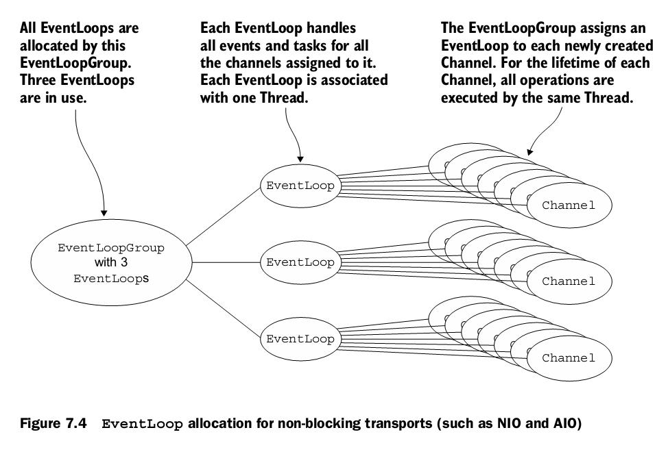
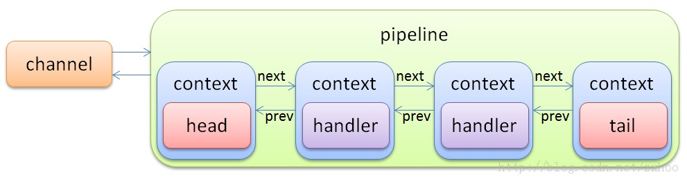

使用netty

介绍
====

Netty 是一个高性能网络通讯框架，支持开发tcp/udp 协议的通讯开发。有几个特点：

1.  抽象为事件模型，简化了通讯编程的复杂性

2.  支持 linux epoll ，达到高的吞吐量

3.  有专门的线程模型，达到高的性能

本文是基于netty 4 进行介绍。

一个简单的http 协议的server 的代码示例如下：

	EventLoopGroup workerGroup = new NioEventLoopGroup();
	ServerBootstrap b = new ServerBootstrap();
	b.group(workerGroup)
	        .channel(NioServerSocketChannel.class)      //采用Nio 
	        .childHandler(new ChannelInitializer() {
	            @Override
	            protected void initChannel(Channel channel) throws Exception {
	                ChannelPipeline p = channel.pipeline();

	                p.addLast(new HttpServerCodec());       //Http 协议处理
	                p.addLast(new HttpHelloWorldServerHandler());  //业务处理
	                
	            }
	        });

	b.bind(8080).sync();

可以看出来HttpServerCodec 是一个可以复用的http协议组件。

业务处理开发，可以专注在业务处理，代码示例如下：

	public class HttpHelloWorldServerHandler extends ChannelInboundHandlerAdapter {
	 
	     public void channelRead(ChannelHandlerContext ctx, Object msg) {
	        if (msg instanceof HttpRequest) {
	            HttpRequest req = (HttpRequest) msg;

	            FullHttpResponse response = new DefaultFullHttpResponse(…..);
	            response.headers().set(CONTENT_TYPE, "text/plain");
	            response.headers().set(CONTENT_LENGTH, response.content().readableBytes());

	            ctx.write(response);

	        }
	    }

Netty 的maven 依赖如下：

	<dependency>
	    <groupId>io.netty</groupId>
	    <artifactId>netty-all</artifactId>
	    <version>4.0.44.Final</version>
	</dependency>

Netty 架构
==========

如下图：

EventLoop 是一个while(true) 的循环，处理i/o 事件，也处理handler 。

内部代码如下：

	public final class NioEventLoop extends SingleThreadEventLoop {
	@Override
	protected void run() {
	    for (;;) {
	        boolean oldWakenUp = wakenUp.getAndSet(false);
	        try {
	            if (hasTasks()) {      //任务队列有任务
	                selectNow();   //非阻塞,不等待
	            } else {
	                select(oldWakenUp); //阻塞，等待nio 事件
	          
	        }

Channel 相当于一个连接，每个channel 绑定到一个EventLoop 上处理。

Channel 的事件来了以后，经过绑定到channel 上的pipeline 处理，如下所示。

Handler 是作为netty 使用者，需要开发的内容。

Handler 的编写
==============

一个基本的handler 包含的几个主要事件：

1.  channelActive

2.  channelInactive

3.  exceptionCaught

4.  channelRead0

代码如下示例：

	public class XXXXHandler extends SimpleChannelInboundHandler
	{
	 
	   @Override
	   public void channelActive(ChannelHandlerContext ctx){
	      //连接已经建立，可以ctx.channel() 拿到channel 对象
	      //可以做一些资源分配相关的事情
	}

	@Override
	   public void channelInactive(ChannelHandlerContext ctx) throws Exception {
	      //如果是client, 可以重连server
	      //如果是server, 可以释放本连接相关的资源，等待client 重连
	   }

	@Override
	   public void exceptionCaught(ChannelHandlerContext ctx, Throwable cause)
	   {
	     // log 一下异常信息
	      if(ctx.channel().isActive()){
	          ctx.close();    //如果是协议异常，一般就断开连接了
	        }                
	      
	}

	     @Override
	     public void channelRead0(final ChannelHandlerContext ctx, final XXRequest request) {

	  //进行业务处理

	}

Handler 分2类：inbound 和outbound
---------------------------------

Inbound 负责读进来的消息进行处理。

Outbound 负责对写出去的消息转化为字节。

使用netty 处理通讯协议
======================

设计报文格式
------------

报文一般可以分为2个部分，包头和内容。

一般来说包头都具备2个字段，报文的类型(type)和报文的长度(length)，在报文的开头几个字节。如下：

	   	   0         8        16        24        32
	    
	      | type      sequence      length         |
	      |                                        |
	      .     body
	      .                                       .
	      .                                       .

Sequence（报文的编号） 一般也是需要的，用于确认报文已经收到。一个字节只能循环使用256个，一般可以搞为4个字节。

处理包头，判断收到足够的字节
----------------------------

  也叫帧处理，就是把字节流截断为报文流。

	public  class XXXDecoder extends ByteToMessageDecoder {

	    @Override
	    protected void decode(ChannelHandlerContext ctx, ByteBuf buffer, List<Object> results)
	            throws Exception {

	        if (buffer.readableBytes() < Header.LENGTH)
	            return;      //如果收到的包不够包头的长度，就不继续处理了 ，等待netty 底层接收更多地字节，这个也叫做粘包

	        
	        int bodyLength =  //解析包头，取出长度;

	        if (buffer.readableBytes()  <  Header.LENGTH+bodyLenth)
	            return;           //内容不够，也不继续处理了
	         …….
	         …….
	         //真正开始处理
	    }
	}

使用netty 的一些最佳实践
========================

1.  不要阻塞，采用异步处理

2.  共享 EventLoopGroup

3.  添加 \@ChannelHandler.Sharable 注解

   没有状态的handler 才能加这个注解，减少java gc 压力

   譬如：

	@ChannelHandler.Sharable
	public static class ProtocolDecoder extends MessageToMessageDecoder<Frame>
	{
	    public void decode(ChannelHandlerContext ctx, Frame frame, List results)

    ByteToMessageDecoder 的子类 不能share， 因为它是有状态的

4.   调试协议，可以加上 loggingHandler,就能把二进制报文打印到log 中

	
	pipeline.addLast("debug", new LoggingHandler());

使用案例
========

仓库内，打包机与服务端使用socket 通讯
-------------------------------------

    打包机作为客户端。

### 报文格式

	报文头： (共8个字节)
	  信息类型： 1个字节 , byte
	  预留：1个字节
	  sequence: 2 个字节 , unsigned short .  (这个用途是确认收到，重发和防止重发
	  报文长度： 4个字节 , unsigned int

	    报文体：json 格式的文本 , charset: utf-8

	报文体：json 格式的文本 , charset: utf-8

### 报文举例

  **打包机心跳， heartbeat**

>   02 00 00 00 00 00 00 00

>   空的报文体。

   设备每秒发一次心跳，不需要回复，不需要使用sequence 字段。

  **收到报文回复，ack**

>   报文头:

>   30 00 xx xx ll ll ll ll

   ack 的 sequence "xx xx" 设置为收到的原始报文的 sequence

>   报文体 ：{

>   messageReply: 原始报文类型， int

>   taskId: String， (任务号)

>   }

 如果客户端超时没有收到ack, 需要重发上一条消息(sequence 一样)。

### 代码示例

	public class HengChannelInitializer extends ChannelInitializer {

	    private static final Logger logger = LoggerFactory.getLogger(HengChannelInitializer.class);
	    // Stateless handlers
	    private static final HengMessage.ProtocolDecoder messageDecoder = new HengMessage.ProtocolDecoder();
	    private static final HengMessage.ProtocolEncoder messageEncoder = new HengMessage.ProtocolEncoder();
	    private static final HengFrame.Encoder frameEncoder = new HengFrame.Encoder();

	    public HengChannelInitializer() {

	    }

	    protected void initChannel(Channel channel) throws Exception {
	        ChannelPipeline pipeline = channel.pipeline();

	        pipeline.addLast("debug", new LoggingHandler());

	        pipeline.addLast("frameDecoder", new HengFrame.Decoder(ServerConnectionFactory.getInstance()));//入站解码,将byteBuf解码成Frame
	        pipeline.addLast("frameEncoder", frameEncoder);//出站编码,将Frame转码成ByteBuf

	        pipeline.addLast("messageDecoder", messageDecoder);//入站,Frame——>Message.Request
	        pipeline.addLast("messageEncoder", messageEncoder);//出站,Message.Response——>Frame

	        pipeline.addLast("executor", new HengDispatcher());
	    }

	    @ChannelHandler.Sharable
	    public static class HengDispatcher extends SimpleChannelInboundHandler<HengMessage.Request> {

	        public HengDispatcher() {
	            super(true);
	        }

	        @Override
	        public void channelRead0(final ChannelHandlerContext ctx, final HengMessage.Request request) {

	            final ServerConnection connection;

	            assert request.connection() instanceof ServerConnection;
	            connection = (ServerConnection) request.connection();

	            HengMessage response = request.execute();

	            if (response != null) {

	                try {
	                    response.attach(connection); 
	                    ctx.channel().writeAndFlush(response);
	                } finally {

	                    request.getSourceFrame().release();                  }

	            } else {
	                logger.trace("null response for request: {}", request);
	            }

	        }

	        @Override
	        public void exceptionCaught(final ChannelHandlerContext ctx, Throwable cause)
	                throws Exception {
	            if (ctx.channel().isOpen()) {
	    
	                // On protocol exception, close the channel as soon as the message have been sent
	                if (cause instanceof ProtocolException) {

	                    logger.error("protocol error",cause);
	                    ctx.close();

	                }else {
	                  
	                    logger.error("other transport exception ",cause);
	                    ctx.close();
	                }
	            }
	        }

	        @Override
	        public void channelActive(ChannelHandlerContext ctx) throws Exception {
	            logger.debug("channel active ");

	            super.channelActive(ctx);
	        }

	        @Override
	        public void channelInactive(ChannelHandlerContext ctx) throws Exception {

	            String deviceId = ctx.channel().attr(Connection.deviceIdAttributeKey).get();

	            logger.info("channel inactive of device :{}", deviceId);

	            HengPackersAgent.getInstance().getDeviceConnectionManager().remove(deviceId);

	            //report to wcs

	            DeviceRegister dr = new DeviceRegister();
	            dr.setDeviceId(deviceId);
	            dr.unRegister();
	            ((WcsHengCallback)HengPackersAgent.getInstance().getWcsCallback()).deviceRegister(deviceId, dr);

	            super.channelInactive(ctx);
	        }
	    }

	}

