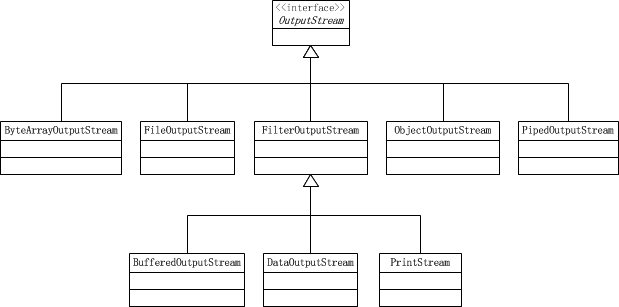

# Java I/O

**Java I/O**中最核心的概念是流（Stream），IO 编程实质为面向流的编程。一个流要么是输入流，要么是输出流，不可能同时即是输入流又是输出流。


## 概述

Java IO 设计初衷是为了提供所有类型 IO 的抽象，例如：内存、文件、网络、目录等

在 JDK 1.0 中，Java提供了以字节流（ASCII，8 bits）为基础的操作类 ：
* InputStream
* OutputStream

后在 JDK 1.1 中，Java 又引入了以字符流（Unicode，16 bits）为基础的操作类：
* Reader
* Writer

## 流（Stream）
所谓流（Stream），是指一个用于从源传输到目的地的有序的信息源。


* 按照数据流向，可将流分为 `输入流` 和 `输出流`
* 按照处理数据的单位，又可将流分为 `字节流`与 `字符流`。

> 注： Java 中，`字节` 占 1个Byte，即8位。`字符`占 2个Byte，即16位。

## IO 体系

### 字节流（Byte streams）
#### InputStream


上图为输入流的层级图，可看出：
* 字节输入流是以InputStream 抽象类为顶层的父类
* ByteArrayInputStream 是字节数组输入流，它在内存中创建一个字节数组缓冲区，从输入流读取的数据保存在该字节数组缓冲区中，主要用于从内存块中读取数据
* StringBufferInputStream 字符串输入流，用于将字符串作为字符串输入流使用，此类已废弃，不再建议使用
* FileInputStream 是文件输入流，主要用于对文件进行读取操作
* SequenceInputStream 为顺序输入流，可用于将多个输入流串联在一起，合并为一个输入流。通过此类读取数据时会依次从所有被串联的输入流中读取数据，从程序角度来讲，就像只对一个输入流进行操作一样
* ObjectInputStream 为对象输入流，用于从流中直接读取Java 对象，而不需要每次读取一个字节（此处涉及到对象序列化，在后续章节中有体现）
* PipedInputStream 管道输入流，通常与 PipedOutputStream 一起使用，能实现多线程间的管道通信
* FilterInputStream 过滤器输入流，通常过滤器流会包含一些其他输入流来充当数据源
* DataInputStream 数据输入流，继承自 FilterInputStream ，用来装饰其它输入流，它允许应用程序以与机器无关方式从底层输入流中读取基本Java 数据类型
* BufferedInputStream 缓冲输入流，继承自 FilterInputStream，用来装饰其他输入流，为他们一些基本功能方法，例如“缓冲、mark、reset等”，本质上是通过内部缓冲区实现的
* LineNumberInputStream 行号输入流，继承自 FilterInputStream，用来装饰其他输入流，提供了跟踪当前行号的附加功能。此类已经废弃，不再建议使用
* PushbackInputStream 推回输出流，推回流允许读取字节，然后再退回到流中，提供了一种“偷窥”机制，且不对输入流的内容产生影响

综上，ByteArrayInputStream、StringBufferInputStream、FileInputStream 是三种基本的介质流，它们分别从Byte 数组、StringBuffer、和本地文件中读取数据。

PipedInputStream 是从与其它线程共用的管道中读取数据。

ObjectInputStream 和所有FilterInputStream的子类都是装饰流（装饰器模式的主角）。通过构造方法可以看出，必须装饰其他输入流对象才能返回新对象。

#### OutputStream


上图为字节输出流类层级图，可以看出：
* 字节输出流是以 OutputStream 抽象类为顶层父类
* ByteArrayOutputStream 字节数组输出流
* FileOutputStream 文件输出流
* ObjectOutputStream 对象输出流
* PipedOutputStream 管道输出流
* FilterOutputStream 过滤输出流
* BufferedOutputStream 缓冲输出流
* DataOutputStream 数据输出流
* PrintStream 打印输出流

综上，ByteArrayOutputStream、FileOutputStream 是两种基本的介质流，它们分别向 Byte 数组、和本地文件中写入数据。

PipedOutputStream 是向与其它线程共用的管道中写入数据。

ObjectOutputStream 和所有 FilterOutputStream 的子类都是装饰流。

#### 示例：使用字节流
在该示例中，我们使用FileInputStream和FileOutputStream来演示如何采用字节流来进行文件的复制。

代码如下：
```java
import java.io.FileInputStream;
import java.io.FileOutputStream;
import java.io.IOException;

public class CopyBytes {
    public static void main(String[] args) throws IOException {

        FileInputStream in = null;
        FileOutputStream out = null;

        try {
            in = new FileInputStream("xanadu.txt");
            out = new FileOutputStream("outagain.txt");
            int c;

            while ((c = in.read()) != -1) {
                out.write(c);
            }
        } finally {
            if (in != null) {
                in.close();
            }
            if (out != null) {
                out.close();
            }
        }
    }
}
```

上述示例中，程序大部分时间花费在一个简单的循环中，该循环读取输入流并一次写入一个字节的输出流，如下图所示：


> 上述示例中，实际上文本文件中是字符数据，因此最好的方法是使用字符流。字节流应仅用于最原始的I/O操作。

### 字符流（Character stream）
#### Reader


#### Writer


### 字节流 VS 字符流
#### 基础 I/O 类对比
| 字节流（Binary I/O）        | 字符流（Character I/O）|
| :------------------------ | :-------------------- |
| InputStream               | Reader（通过 InputStreamReader 进行转换） |
| OutputStream              | Writer（通过 OutputStreamReader 进行转换）|
| FileInputStream           | FileReader      |
| FileOutputStream          | FileWriter      |
| StringBufferedInputStream | StringReader    |
| N/A                       | StringWriter    |
| ByteArrayInputStream      | CharArrayReader |
| ByteArrayOutputStream     | CharArrayWriter |
| PipedInputStream          | PipedReader     |
| PipedOutputStream         | PipedWriter     |


#### 装饰器 I/O 类对比
| 字节流（Binary I/O）        | 字符流（Character I/O）|
| :------------------------ | :------------------- |
| FilterInputStream         | FilterReader         |
| FilterOutputStream        | FilterWriter（抽象类） |
| BufferedInputStream       | BufferedReader       |
| BufferedOutputStream      | BufferedWriter       |
| DataInputStream           | DataInputStream 或 BufferedReader |
| PrintStream               | PrintWriter      |
| LineNumberInputStream     | LineNumberReader |
| PushbackInputStream       | PushbackReader   |

#### 示例：使用字符流

1. 示例1如下:
与字节流章节中示例基本类似，在该示例中我们采用 FileReader和FileWriter替换掉了FileInputStream和FileOutputStream。

```java
import java.io.FileReader;
import java.io.FileWriter;
import java.io.IOException;

public class CopyCharacters {
    public static void main(String[] args) throws IOException {

        FileReader inputStream = null;
        FileWriter outputStream = null;

        try {
            inputStream = new FileReader("xanadu.txt");
            outputStream = new FileWriter("characteroutput.txt");

            int c;
            while ((c = inputStream.read()) != -1) {
                outputStream.write(c);
            }
        } finally {
            if (inputStream != null) {
                inputStream.close();
            }
            if (outputStream != null) {
                outputStream.close();
            }
        }
    }
}
```

通过上述示例中，你可能注意到在上一章节的示例和本次示例中都采用了一个int类型的变量，但实际上它们是有区别的，在字符流中，int变量在其最后16位bit保存一个字符值，，而字节流保存的是一个8bit的字节值。

2. 示例2如下:
字符流除了用于单字符为单位的场景之外还经常用于以行为单位的场景。

```java
import java.io.FileReader;
import java.io.FileWriter;
import java.io.BufferedReader;
import java.io.PrintWriter;
import java.io.IOException;

public class CopyLines {
    public static void main(String[] args) throws IOException {

        BufferedReader inputStream = null;
        PrintWriter outputStream = null;

        try {
            inputStream = new BufferedReader(new FileReader("xanadu.txt"));
            outputStream = new PrintWriter(new FileWriter("characteroutput.txt"));

            String l;
            while ((l = inputStream.readLine()) != null) {
                outputStream.println(l);
            }
        } finally {
            if (inputStream != null) {
                inputStream.close();
            }
            if (outputStream != null) {
                outputStream.close();
            }
        }
    }
}
```

调用`readLine`方法返回的是一行文本，在上述示例中，我们按行读取并输出该文本。


> 通过上述示例也许你会注意到，** 在不再使用流时，关闭流是非常重要的！** 我们通常的做法是使用`finally`块来保证即使发生错误也会关闭流，这种做法有能很好的避免资源泄露。

### 文件及目录（File 类）
File类是文件和目录路径的抽象表示。可用来获取文件/目录、创建文件/目录、读写文件、复制、移动、删除文件等。

该类提供了4个构造方法，通常我们采用传入文件路径的方式来创建该对象，例如：
```
  File file = new File("/Users/foo");
```

#### 示例
该示例中，我们将对目录（包含子目录）进行遍历，并打印所有文件。

代码如下：
```java
public class FileExample {
    public static void main(String[] args) {
        List<File> files = getFiles("/Users/foo/file-example-path");

        for (File f : files) {
            System.out.println(f.getAbsolutePath());
        }

    }

    public static List<File> getFiles(String path) {
        List<File> fileList = new ArrayList<File>();
        File file = new File(path);
        if (!file.exists()) {
            return fileList;
        }

        if (file.exists()) {
            File[] files = file.listFiles();
            if (null == files || files.length == 0) {
                return fileList;
            }

            for (File f : files) {
                if (f.isDirectory()) {
                    fileList.addAll(getFiles(f.getAbsolutePath()));
                } else {
                    fileList.add(f);
                }
            }

        }

        return fileList;
    }

}
```

### 序列化（Serializable / Externalizable）
简单来讲，序列化是一种对象持久化的手段，而序列化的目的就是为了持久化对象状态，在保存状态时，会把其状态保存为一组字节，对象保存的**状态**即指的是对象的**成员变量**（不包括对方方法），所以，*对象序列化不关注类中的静态变量*。与此对应，反序列化则是为了把持久化的对象状态重新读取并恢复。

序列化主要应用在对象持久化（保存到文件、内存、数据库）、网络传输、RMI 等场景中。

#### Serializable 接口
在 Java 中，一个类只要实现了 `java.io.Serializable` 接口，那么由这个类 new 出的对象就可以被序列化。Java 中基本类型和实现了`java.io.Serializable`接口的类都支持序列化，但是以下两种情况是不能序列化的：

* 采用 `static`或 `transient` 进行修饰的变量不会被序列化
* `Thread` 或 `Socket` 类型成员变量不支持序列化（原因是这些类如果能序列化，则在反序列化时也无法进行资源的重新分配），若实现了 `Serializable` 接口的类中需要有`Thread` 或 `Socket`成员变量，需要用 `transient` 关键字进行修饰。

> 不支持序列化的原因有很多种，例如：安全问题、资源分配等原因

**需要注意的是**，如果一个类的父类实现了序列化接口，则子类自动实现序列化，不再需要现实的实现 `Serializable` 接口，但是反过来，如果一个类的父类未实现序列化接口，而子类实现了序列化接口，则在序列化时直接跳过父类中的成员变量。

另外，`transient` 关键字的作用是控制变量的序列化，在变量声明前加上该关键字，可以阻止该变量被序列化到文件中，在被反序列化后，transient 变量的值被设为初始值，如 int 型的是 0，对象型的是 null。

#### Externalizable 接口
在 Java 中，如果一个类要完全自己负责自己的序列化，则需要实现 `java.io.Externalizable` 接口。该接口有两个方法 `writeExternal(ObjectOutput out)` 和 `readExternal(ObjectInput in)` ，分别负责对象的序列化和反序列化。

> 注意，实现此接口的类必须定义无参数的构造方法。

#### 序列化 ID（serialVersionUID ）
Java 的序列化机制是在运行时通过判断类的  `serialVersionUID ` 来验证版本的一致性的。在进行反序列化时，JVM 会把传入的字节流中的  `serialVersionUID ` 与本地相应类的  `serialVersionUID ` 进行比较，如果一致则可进行反序列化，否则会抛出反序列化版本不一致的异常。

有以下两种方式提供此序列化ID：
*  一个是根据类名、接口名、成员方法及属性等来生成一个64位的哈希字段，例如：
	private static final long serialVersionUID = 3487495895819393L;
* 提供一个默认值，例如：
    private static final long serialVersionUID = 1L;

第一种情况下，是根据类的结构产生的 Hash 值，也就是说，任何改变属性、方法等都会导致 ID 产生变化。当一个实现了 `Serializable` 接口的类中，如果未显示的定义 `serialVersionUID` 时，则 Java 序列化机制会根据编译的 class 自动生成一个 `serialVersionUID ` 用于序列化版本比较，此种情况下，只有同一次编译的 class 才会生成同样的 `serialVersionUID` ，所以并不稳定。

第二种情况，对类的修改在可兼容的前提下，可保留原有版本号，如果不兼容则可以手工递增修改版本号。

值得注意的是，对于动态代理类及枚举类，`serialVersionUID`始终为 `0L` ，数据不能显示的声明 `serialVersionUID`，所以总是具有默认的计算值，但是对于数组，放弃了匹配 `serialVersionUID` 的要求。


----
参考：
1. http://www.cnblogs.com/skywang12345/archive/2013/02/24/2936044.html
2. http://www.cnblogs.com/skywang12345/p/io_01.html
3. http://blog.csdn.net/u012815721/article/details/25279613
4. https://www.ibm.com/developerworks/cn/java/j-lo-serial/
5. https://www.ibm.com/developerworks/cn/java/j-5things1/index.html
6. http://www.cnblogs.com/biGpython/archive/2012/02/12/2347929.html
7. https://docs.oracle.com/javase/8/docs/platform/serialization/spec/serialTOC.html
8. https://docs.oracle.com/javase/tutorial/essential/io/index.html
9. https://www.zhihu.com/question/39262026
