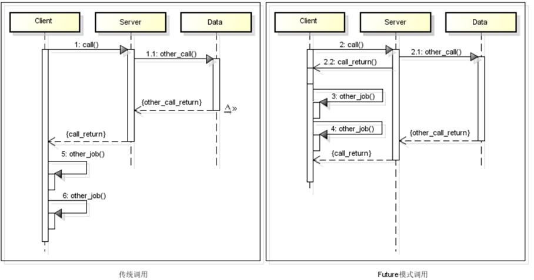
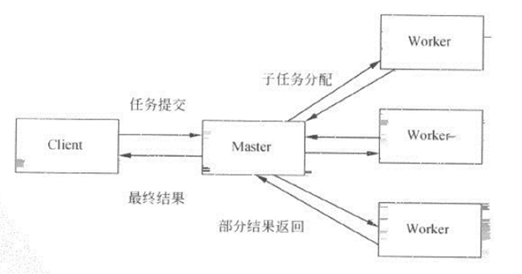

## 并发编程 ##
所谓并发编程是指在一台处理器上“同时”处理多个任务，并发是在同一实体上的多个事件，多个事件在同一时间间隔发生。

### 并发和并行的区别 ###
做并发编程之前，必须首先理解什么是**并发**，什么是**并行**，什么是并发编程，什么是并行编程。

**并发**（concurrency）和**并行**（parallellism）是： 

解释一：并行是指两个或者多个事件在同一时刻发生；而并发是指两个或多个事件在同一时间间隔发生。 
解释二：并行是在不同实体上的多个事件，并发是在同一实体上的多个事件。 
解释三：在一台处理器上“同时”处理多个任务，在多台处理器上同时处理多个任务，如hadoop分布式集群。 
**所以并发编程的目标是充分的利用处理器的每一个核，以达到最高的处理性能。** 

并发和并行的区别就是一个人同时喝三杯酒和三个人同时喝三杯酒。 
  

并发编程之所以让人迷惑是因为有不止一种问题的解决需要使用并发，也有不止一种方法去实现并发，而且他们之间也没有清晰的映射。

实现并发的最直接的方式是在操作系统级别，使用进程，进程一种自包含的程序，使用自己的地址空间，操作系统会让进程之间相互隔离，所以进程编程相对容易一些，不需要考虑共享资源的同步等问题。但是在Java中的并发编程，由于线程之间共享相同的memory或者IO等资源，所以Java多线程编程中需要考虑共享资源的同步问题。

### 并发模型模式分析 ###
并发编程在Java中有多种实现方式，下面根据实例分析常见的实现模式。 
**Future模式** 
该模型是将异步请求和代理模式联合的模型产物。类似客户端与服务端交互模型。见下图：
   
传统交互方式，客户端需要等待服务端返回结果后才能进行下一步操作，如果服务端未及时响应，则客户端将一直等待，直到服务端返回响应结果。
而实际上，如果客户端接下来需要执行的步骤与第一步服务端的返回结果无关，则客户端在等待服务端返回的过程中可以继续进行后续业务的执行。 

在日常生活中，我们喝茶之前，必须完成完成烧开水，找茶叶，清洗茶杯，以及泡茶过程才能喝到清香的茶水。如果一项项的去完成的话，就会浪费很多时间。

    import org.junit.Test;
    
    public class MakeTea1 {

	    @Test
	    public void testFuture() throws InterruptedException {
	        long startTime = System.currentTimeMillis();
	        // 第一步 烧水
	        waterBurning();
	        // 第二步 找茶叶
	        findTea();
	        // 第三步 刷杯子
	        brushCup();
	        // 第四步 沏茶
	        makeTea();
	        System.out.println("总共用时：" + (System.currentTimeMillis() - startTime) + "ms");
	    }
	
	
	    void waterBurning() throws InterruptedException {
	        Thread.sleep(5000);  // 模拟烧水时间
	        System.out.println("第一步：烧水完成");
	    }
	
	    //  找茶叶
	    void findTea() throws InterruptedException {
	        Thread.sleep(2000);
	        System.out.println("第二步：找茶叶到位");
	    }
	
	    // 刷杯子
	    void brushCup() throws InterruptedException {
	        Thread.sleep(2000);
	        System.out.println("第三步：刷杯子完成");
	    }
	
	    // 沏茶
	    void makeTea() throws InterruptedException {
	        Thread.sleep(2000);
	        System.out.println("第四步：沏茶..");
	    }
    }
执行结果：
    
    第一步：烧水完成
    第二步：找茶叶到位
    第三步：刷杯子完成
    第四步：沏茶..
    总共用时11007ms

我们知道，在烧水的过程中，我们完全可以一边清洗茶杯，这样就能节约更多的时间了。优化执行沏茶流程后如下：
    import org.junit.Test;
    
    public class MakeTea {
    
	    @Test
	    public void testFuture() throws InterruptedException {
	        long startTime = System.currentTimeMillis();
	        // 第一步 烧水
	        WaterBurning waterBurning = new WaterBurning();
	        waterBurning.start();
	        // 第二步 找茶叶
	        findTea();
	        // 第三步 刷杯子
	        brushCup();
	        waterBurning.join();  // 保证水烧开
	        // 第四步 沏茶
	        makeTea();
	        System.out.println("总共用时：" + (System.currentTimeMillis() - startTime) + "ms");
	    }
	
	    class WaterBurning extends Thread {
	
	        @Override
	        public void run() {
	            System.out.println("第一步：烧水");
	            try {
	                Thread.sleep(5000);  // 模拟烧水时间
	            } catch (InterruptedException e) {
	                e.printStackTrace();
	            }
	            System.out.println("第一步：烧水完成");
	        }
	    }
	
	    //  找茶叶
	    void findTea() throws InterruptedException {
	        Thread.sleep(2000);
	        System.out.println("第二步：找茶叶到位");
	    }
	
	    // 刷杯子
	    void brushCup() throws InterruptedException {
	        Thread.sleep(2000);
	        System.out.println("第三步：刷杯子完成");
	    }
	
	    // 沏茶
	    void makeTea() throws InterruptedException {
	        Thread.sleep(2000);
	        System.out.println("第四步：沏茶中..");
	    }
    }
执行结果：

    第一步：烧水
    第二步：找茶叶到位
    第三步：刷杯子完成
    第一步：烧水完成
    第四步：沏茶中..
    总共用时：7011ms   

在烧水的同时，CPU并发进行了找茶叶和刷杯子的操作，待全部准备就绪后进入泡茶阶段，通过这种方式缩短泡茶过程的整体执行时间。

**Master-Worker 模式** 
Master-Worker模式的核心思想是在于Master进程和Worker进程各自分担各自的任务,协同完成信息处理的模式 
使用一个图例来简单描述一下:
   
如图所示Master-Worker的工作机制就是Master接收到了一个任务,对任务进行拆分,并且分配给各个Worker,让各个Worker之间各自运行各自的子任务,最后Worker们的返回结果交给Master进行汇总并且最后返回给任务的发起方。

Master-Worker是一种并行模式,Master是主要进程,Master中有维护着一个Worker进程队列.Master把一个大的而且复杂的业务拆分成若干小的业务,只要是互不影响的都可以分而治之相互独立.可以通过多线程或多进程甚至多机联合计算,把拆分后的小业务交给更多的CPU或机器处理,通过并发/并行的方式提高整体业务的运算速度,压榨系统性能来提高效率。

    package com.jd.ldop.share.concurrency.master_worker.demo;
    
    import org.junit.Test;
    
    import java.util.HashMap;
    import java.util.Map;
    import java.util.Queue;
    import java.util.concurrent.ConcurrentHashMap;
    import java.util.concurrent.ConcurrentLinkedQueue;
    import java.util.stream.IntStream;
    
    public class TestDemo {
	
	    @Test
	    public void testMasterWorker() throws InterruptedException {
	        long startTime = System.currentTimeMillis();
	        // 创建Master对象
	        Master master = new Master(new SimpleWorker(), 10); // worker数量初始化
	        // 初始化任务// 计算 0 到1000的三次方并求和
	        IntStream.range(0, 1000).forEach(number -> master.submit(new Task(number, number)));
	        // 任务执行
	        master.execute();
	        // 获取结果集
	        Map<String, Long> resultMap = master.getResultMap();
	        // 对结果进行汇总
	        long sum = getSum(resultMap, master);
	        System.out.println("sum a: " + (sum - 0));
	        long endTime = System.currentTimeMillis();
	        System.out.println("total time: " + (endTime - startTime));
	    }
	
	    private long getSum(Map<String, Long> resultMap, Master master) {
	        while (true) {
	            if (master.isComplete())
	                return resultMap.values().stream().mapToLong(i -> i).sum();
	        }
	    }

	}
	
	class Master<T, V> {
	    // 任务队列
	    private Queue<T> taskQueue = new ConcurrentLinkedQueue<>();
	    // 线程队列
	    private Map<String, Thread> threadMap = new HashMap<>();
	    // 结果对象
	    private Map<String, V> resultMap = new ConcurrentHashMap<>();
	
	    public Master(Worker worker, int workerNumber) {
	        worker.setTaskQueue(taskQueue);
	        worker.setResultMap(resultMap);
	        for (int i = 0; i < workerNumber; i++) {
	            threadMap.put(Integer.toString(i), new Thread(worker, Integer.toString(i)));
	        }
	    }
	
	    /**
	     * 校验任务是否全部执行完成
	     *
	     * @return
	     */
	    public boolean isComplete() {
	        for (Thread thread : threadMap.values()) {
	            if (thread.getState() != Thread.State.TERMINATED) return false;
	        }
	        return true;
	    }
	
	    public Map<String, V> getResultMap() {
	        return resultMap;
	    }
	
	    public void submit(T task) {
	        taskQueue.add(task);
	    }
	
	    public void execute() {
	        threadMap.entrySet().stream().forEach(kv -> kv.getValue().start());
	    }
	}
	
	class SimpleWorker extends Worker {
	
	    @Override
	    protected Long handle(Object task) {
	        try {
	            Thread.sleep(1);
	        } catch (InterruptedException e) {
	            e.printStackTrace();
	        }
	        int number = ((Task) task).getNumber();
	        return Long.valueOf(number * number * number);
	    }
	}
	
	class Task {
	
	    private Integer id;
	
	    private Integer number;
	
	    public Task(Integer id, Integer number) {
	        this.id = id;
	        this.number = number;
	    }
	
	    public Integer getId() {
	        return id;
	    }
	
	    public void setId(Integer id) {
	        this.id = id;
	    }
	
	    public Integer getNumber() {
	        return number;
	    }
	
	    public void setNumber(Integer number) {
	        this.number = number;
	    }
	
	    @Override
	    public int hashCode() {
	        return id;
	    }
	}
	
	abstract class Worker<Task, Result> implements Runnable {
	
	    // 任务队列
	    protected Queue<Task> taskQueue;
	
	    // 结果对象，key 可以作为任务的唯一标识等，value为任务执行结果
	    protected Map<String, Result> resultMap;
	
	    public void setTaskQueue(Queue<Task> taskQueue) {
	        this.taskQueue = taskQueue;
	    }
	
	    public void setResultMap(Map<String, Result> resultMap) {
	        this.resultMap = resultMap;
	    }
	
	    protected abstract Result handle(Task task);
	
	    @Override
	    public void run() {
	        while (true) {
	            Task task = taskQueue.poll();
	            if (task == null) break;
	            Result result = handle(task);
	            resultMap.put(Integer.toString(task.hashCode()), result);
	        }
	    }
    }

当worker线程数为10时，执行结果：

    sum a: 249500250000
    total time: 223

当worker线程数为1时，执行结果：

    sum a: 249500250000
    total time: 1246
    
### 后续会补充Fork-Join 模式、Guarded-Suspension 守卫暂停模式以及Fork-Join 模式在实际工作中的具体应用场景。 ###
