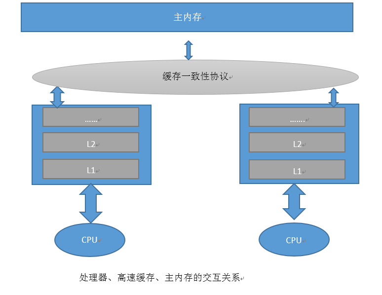
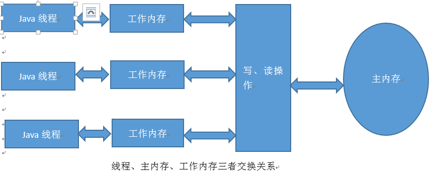

# Java并发机制实现原理

## 什么情况下加锁
  多个线程同时操作（读写）同一实例对象的类变量，就会有资源不同步的情况。这个资源就是共享资源。对于方法内的变量不是共享变量。为何共享变量是会有数据不一致的问题呢？我们来了解下JVM的内存结构。Sun JDK 在实现JVM规范时，将内存空间划分为方法区、堆、本地方法栈、JVM方法栈及PC寄存器。JVM中对象及对象的变量会放在堆内存中，这块内存是所有线程共享的。对象方法中的变量是存放在栈上的，这个内存是每个线程私有的。
  我们都知道，CPU指令是一条一条执行的，这样势必有指令对数据的读取及写入，由于CPU指令执行的速度非常快，CPU读到数据的顺序优先级 是：寄存器－高速缓存（三级、二级最后是一级）－内存。线程耗费的是CPU，线程计算的时候，原始的数据来自内存，在计算过程中，有些数据可能被频繁读取，这些数据被存储在寄存器和高速缓存中，当线程计算完后，这些缓存的数据在适当的时候应该写回内存。当多个线程同时读写某个内存数据时，就会产生多线程并发问题。

  

   JVM在执行时，将主内存的数据复制一份到工作内存（是多级cache及寄存器的抽象）中，每个线程得有自己独立的工作内存。CPU与工作内存进行读取与写入。并在某个特定时候回写到内存。单线程时，这没有问题，如果是多线程要同时访问同一个变量呢？内存中一个变量会存在于多个工作存储中，线程1修改了变量a的值什么时候对线程2可见？此外，编译器或运行时为了效率可以在允许的时候对指令进行重排序，重排序后的执行顺序就与代码不一致了，这样线程2读取某个变量的时候线程1可能还没有进行写入操作呢，虽然代码顺序上写操作是在前面的。所以多线程编程若存在资源竞争，则需要加同步锁。那么java虚拟机是如何实现锁的同步及锁有哪些类型呢？
  

## 锁的类型
  共享资源在多线程下会出现资源竞争的情况，若不想因为多线程操作共享资源，而造成超预期（错误）的结果，则我们须通过锁机制，可以让多个线程进行排队，一个一个地进入临界区访问目标对象，使目标对象的状态保持一致。（其实数据库的读写操作也是对数据（记录）进行各种类型的加锁，与我们所说的对JAVA对象加锁的原理是一致的），那么我们要解决共享资源数据不致问题，有如下办法
  1. 悲观锁
    它是假定会发生并发冲突，屏蔽一切可能违反数据完整性的操作。在一个线程进行共享资源操作时，我们将这个资源进行锁定（互斥锁），其它的线程处于等待。你可以想象这里非常耗性能的，因为其它线程在系统各处徘徊着准备要获得锁然后又阻塞。线程越多，系统的响应性就会越慢，例如，jmm中的sychronized是悲观锁实现的例子，不过在jdk1.6之后做了一些锁的优化（自旋、自适应锁、锁消除、轻量级锁、偏向锁）
  2. 乐观锁
    假设不会发生并发冲突，只在提交操作时检查是否违反数据的完整性。在java中使用AtomInteger就是使用乐观锁来实现数据的同步，它是利用CPU cas 操作来实现数据的同步。

## JVM实现锁同步的方法

### volatile
  在java多线程并发编程中，synchnoized和volatile是我们常使用的同步手段。Volatile在多处理器开发中保证了共享变量的“可见性”，这就意味着当一个线程修改一个共享变量时，对其它线程是共享的。它的使用比synchnoized执行成本更低，因为它不会引起线程的上下文的切换和调度（用户态和核心态的转换，线程的阻塞及唤醒需要进行用户态和核心态转换，这个需要消耗性能的）
  高并发编程有三个主要的概念，可见性、原子性、顺序性。Volatile实现了操作的顺序性、可见性及原子性（仅单个操作，复合操作不具有原子性（如 i++）。也就说对volatile变量的写操作，对于其它线程是可见的。顺序性是指Volatile的写操作永远在读操作之前。那么JMM是如何来实现内存的可见的呢。
  在Volatile修饰的变量中，编绎成汇编之后，会发现有一个Lock指令，这个lock指令在多核处理器中会触发如下两件动作
* 将当前处理器的缓存行写的数据写回到主内存（由工作内存写回系统内存）
* 写回系统内存的操作会使其它CPU里的缓存了该内存的地址的数据无效
  CPU是不会与系统内存直接进行通信的，为了提升速度 ，CPU与缓冲区进行通行，CPU执行所需要的数据全部来源于缓冲区，缓冲区的数据是从系统内存拷贝过来。当CPU对缓冲区的数据进行了修改后，没有volatile修饰过的变量，是不知道什么时候写回系统内存的。反之， volatile变量修改后会立即写回系统内存，但是在多核系统下，其它CPU执行此volatile变量，可能在写回之前已经拿到了此变量，此时这cpu执行的变量就不是最新的变量了，那么操作系统如何来保证每个CPU拿 到的数据是最新的？所以目前CPU实现了缓存一致性协议，每个处理器在总线上的传播的数据来检查自己的缓存是不是过期了，当处理器发现自己缓存行所对应的内存地址被修改了，就会将当前缓存行设置成无效状态。当处理器修改这变量时，会重新从系统内存加载这个变量数据到缓冲行中（工作内存）。
  我们在上面已经提到，volatile变量并不能操作数据操作的原子性，所以在使用volatile时，若此变量的修改不依赖于当前变量的值时，可以使用。如：

 ~~~java
  volatile boolean flag;
  flag = true;
  if (flag){}
  ~~~
  反之如下就会线程不安全：
  ~~~java
  volatile int count;
  count++;//此操作其实是多个操作，下一个操作依赖上一个操作的值，所以是线程不安全的。
  ~~~
  上述操作类似于下面两步操作：
  ~~~java
  temp = count+1;
  count = temp;
  ~~~
  看一个例子：
  ~~~java
  public class VolatileTest {
    public static  volatile  int sum=0;
    public static CountDownLatch countDownLatch = new countDownLatch(100);
    public static void increase(){
        sum++;
    }
    public static void main(String[] args) throws InterruptedException{
        for(int i = 0 ;i<1000; i++){
            new Thread(new Runnable() {
                public void run() {
                    try {
                        Thread.sleep(510);
                        increase();
                        countDownLatch.countDown();
                    }catch (InterruptedException e){
                        e.printStackTrace();
                    }
                }
            }).start();
        }
        countDownLatch.await();
        System.out.println(sum);
    }
   }
~~~
结果：
  ~~~java
   101//本是1000 这个是不是结果相差很大呢。。。。（sleep时间越长，相差的越大）
  ~~~

### Volatile内存语义的实现

#### 写读建立的happen-before关系
   从JSR133开始，Volatile变量的写-读可以实现线程之间的通信。Volatile写和锁的释放有相同的内存语义，Volatile的读与锁的获取相同的内存语义。
   Volatile写happen before 读。当写一个Volatile变量时，JMM会把该线程对应的本地内存中的共享变量的值刷新到主内存。
   当读一个Volatile变量时，JMM会把该线程对应的本地内存置为无效。线程接下来便从主内存读取共享变量。

#### Volatile的ＪＭＭ实现
   为了实现Volatile的内存语义，JMM禁止了编译器及CPU的重排序。其规则如下：
   1. 当第二操作是Volatile写时，不管第一个操作是什么，都不能重排序。这个确保了Volatile写之前的操作不会被编译器重排序到Volatile写之后。
   2. 当第一个操作是Volatile读时，不管第二个操作是什么，都 不能重排序。这个确保了Volatile读之后的操作不会别编译器重排序到Volatile读之前。
   3. 当第一个操作是Volatile写，第二个操作是Volatile读时，不能重排序。
上述重排序规则，编译器在生成字节时，会在指令序列中插入内存屏障来禁止特定类型的处理器重排序。
      内存屏障，又称内存栅栏，是一组处理器指令，用于实现对内存操作的顺序限制。
JMM对Volatile的内存屏障。
	1. 在每个Volatile写操作的前面插入一个StoreStore屏障
	2. 在每个Volatile写操作的后面插入一个StoreLoad屏障
	3. 在每个Volatile读操作后面插入一个LoadLoad屏障
	4. 在每个Volatile读操作后面插入一个LoadStore屏障。
四种屏障说明:
* LoadLoad屏障：对于这样的语句Load1; LoadLoad; Load2，在Load2及后续读取操作要读取的数据被访问前，保证Load1要读取的数据被读取完毕。
* StoreStore屏障：对于这样的语句Store1; StoreStore; Store2，在Store2及后续写入操作执行前，保证Store1的写入操作对其它处理器可见。
* LoadStore屏障：对于这样的语句Load1; LoadStore; Store2，在Store2及后续写入操作被刷出前，保证Load1要读取的数据被读取完毕。
* StoreLoad屏障：对于这样的语句Store1; StoreLoad; Load2，在Load2及后续所有读取操作执行前，保证Store1的写入对所有处理器可见。它的开销是四种屏障中最大的。在大多数处理器的实现中，这个屏障是个万能屏障，兼具其它三种内存屏障的功能。

> 备注说明：
>  JMM对Synchronized也进行了内存屏障。通过 Synchronized关键字包住的代码区域,当线 >  程进入到该区域读取变量信息时,保证读到的是最新的值.这是因为在同步区内对变量的写入操 > 作,在离开同步区时就将当前线程内的数据刷新到内存中,而对数据的读取也不能从缓存读取,只能从内存中读取,保证了数据的读有效性.这就是插入了StoreStore屏障

### Synchronized
   以前我们一直认为Synchronized是一个重量级的锁，但在jdk1.6之后，对Synchronized进行了各种优化。在jdk1.6中为了减少获得锁和释放锁带来的性能消耗而引入的偏向锁和轻量锁。Synchronized 同步是通过同步锁（monitor）来支持的，同步块是通过Java虚拟机的指令monitorenter和monitorexit两指令来支持。在同步块开始处增加monitorenter指令，同步快结束处增加monitorexit指令。 任何一个对象都有一个monitor与之关联，当一个对象持有一个monitor时，该对象就被锁定。线程执行到monitorenter时，就试图去获取该对象（同步）的锁(monitor),若该对象没有持有monitor，则线程可以继续持行且该对象已经获取了monitor(锁定)，否则则等待。同步方法无须通过字节码指令来控制，虚拟机可以从方法常量表结构中的ACC_SYNCHRONIZED访问标志来区分一个方法是否是同步方法，当调用同步方法时，调用指令会检查方法的ACC_SYNCHRONIZED标志是否设置，若设置了，执行线程将先持有同步锁，然后执行方法，最后在方法完成时，释放同步锁。
   ~~~java
   public  void  Test(){
    synchronized(new Object()){
        System.out.println("");
    }
   }
   ~~~
   看下生成的JVM指令，同步代码块的前与后 加上了montiorenter及monitorexit指令。
   ~~~class
   public void Test();
    Code:
       0: new           #2                  // class java/lang/Object
       3: dup
       4: invokespecial #1                  // Method java/lang/Object."<init>":()V
       7: dup
       8: astore_1
       9: monitorenter
      10: getstatic     #3                  // Field java/lang/System.out:Ljava/io/PrintStream;
      13: ldc           #4                  // String
      15: invokevirtual #5                  // Method java/io/PrintStream.println:(Ljava/lang/String;)V
      18: aload_1
      19: monitorexit
      20: goto          28
      23: astore_2
      24: aload_1
      25: monitorexit
      26: aload_2
      27: athrow
      28: iconst_0
      29: istore_1
      30: return
   ~~~

同步方法：
~~~java
public synchronized void test1()
{
    System.out.println(":");
}
~~~
编译后：
~~~class
public synchronized void test1();
    flags: ACC_PUBLIC, ACC_SYNCHRONIZED
    Code:
      stack=2, locals=1, args_size=1
         0: getstatic     #3                  // Field java/lang/System.out:Ljava/io/PrintStream;
         3: ldc           #6                  // String :
         5: invokevirtual #5                  // Method java/io/PrintStream.println:(Ljava/lang/String;)V
         8: return
      LineNumberTable:

~~~
此处没有加monitorenter、monitorexti指令。
