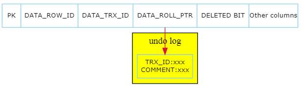
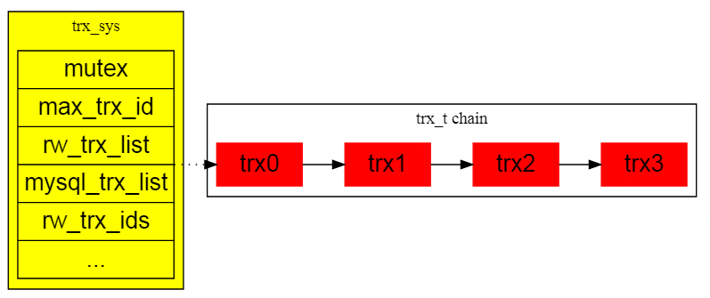
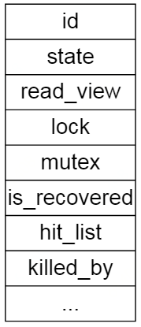
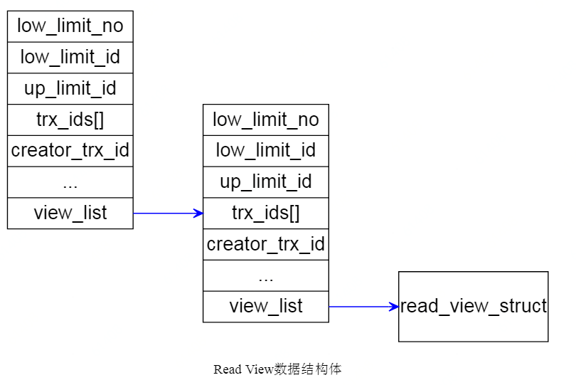
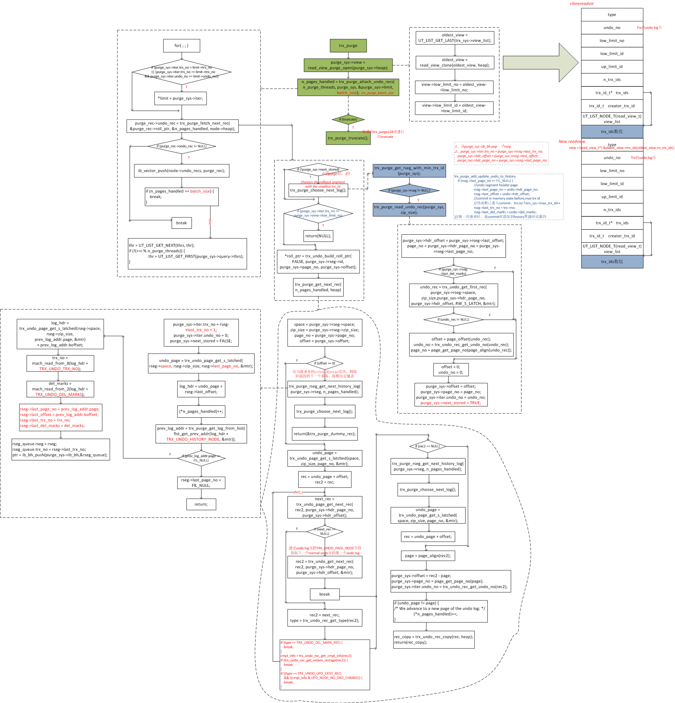

# InnoDB MVCC的实现原理
> 前提
>
> MySQL : 5.6

## MVCC简介
`Multi-Version Concurrency Control 多版本并发控制，是一种并发控制方法，用于数据库管理系统中的数据并发访问，以及编程语言中的事务型内存的实现。`

通俗地讲，多版本并发控制（MVCC）是一种用来**解决读-写冲突**的**无锁**并发控制方案，通过为事务分配单向增长的时间戳，为每个修改保存一个版本，版本与事务时间戳关联，读操作只读该事务开始前的数据库的快照。这样在读操作不用阻塞写操作，写操作不用阻塞读操作，从而大大提高数据库系统的并发性能，降低系统开销。

### 数据库处理并发的技术演变过程
1. 基于表的读写锁
2. 基于索引的读写锁
3. **MVCC**

### MVCC的优缺点
- 优点
  - 高并发
  - 读写不互相阻塞（读可见版本）
  - 低加锁开销
  - 读不加锁
- 缺点
  - 为了实现多版本,需对行记录增加隐藏字段
  - 每个行记录的变更都会生成版本快照
  - 检索行时需要进行版本的比较,降低了查询效率
  - 需要定期清理不再需要的行版本,回收空间


## MVCC的实现原理
了解InnoDB行结构、事务链表、ReadView结构、可见性判断，对于理解MVCC的实现原理有很重要的意义。

### InnoDB行结构
InnoDB行结构中除了用户自定义的列之外，还会默认添加三个隐藏的系统列，参见`storage/innobase/include/data0type.h`
```
/* Precise data types for system columns and the length of those columns;
NOTE: the values must run from 0 up in the order given! All codes must
be less than 256 */
#define	DATA_ROW_ID	0	/* row id: a 48-bit integer */
#define DATA_ROW_ID_LEN	6	/* stored length for row id */

#define DATA_TRX_ID	1	/* transaction id: 6 bytes */
#define DATA_TRX_ID_LEN	6

#define	DATA_ROLL_PTR	2	/* rollback data pointer: 7 bytes */
#define DATA_ROLL_PTR_LEN 7
```

| 列名            | 长度（字节）   | 描述                                                 |
| --------------- |:-------------:| --------------------------------------------------- |
| DATA_ROW_ID     | 6             | 行标识（隐藏单调自增id）                              |
| DATA_TRX_ID     | 6             | 修改该行数据的事务的ID                                |
| DATA_ROLL_PTR   | 7             | undo log的指针,用于记录之前历史数据在undo log中的位置  |

**InnoDB行结构**




### 事务链表
事务在begin时会初始化一个trx_t结构体，同时保存到全局唯一的trx_sys的事务链表中。

事务链表中保存的都是还未提交的事务，事务一旦被提交，则会从事务链表中摘除。

**trx_sys事务链表**



**trx_t结构体**

参见`storage/innobase/include/trx0trx.h`



从trx结构体可以看出，每个事务trx里都持有一个read_view。下文可以看到，ReadView结构体存在的意义是什么。

### ReadView
InnDB为了判断某个行记录是否对当前事务可见，需要对行记录进行可见性判断，ReadView结构体（ReadView是某一个时间点，事务执行状态的一个快照）就是用来辅助判断事务的可见性。

**ReadView结构体**
参见`storage/innobase/include/read0read.h`
```
struct read_view_t{
      	ulint		type;	/*!< VIEW_NORMAL, VIEW_HIGH_GRANULARITY */
      	undo_no_t	undo_no;/*!< 0 or if type is
      				VIEW_HIGH_GRANULARITY
      				transaction undo_no when this high-granularity
      				consistent read view was created */
      	trx_id_t	low_limit_no;
      				/*!< The view does not need to see the undo
      				logs for transactions whose transaction number
      				is strictly smaller (<) than this value: they
      				can be removed in purge if not needed by other
      				views */
      	trx_id_t	low_limit_id;
      				/*!< The read should not see any transaction
      				with trx id >= this value. In other words,
      				this is the "high water mark". */
      	trx_id_t	up_limit_id;
      				/*!< The read should see all trx ids which
      				are strictly smaller (<) than this value.
      				In other words,
      				this is the "low water mark". */
      	ulint		n_trx_ids;
      				/*!< Number of cells in the trx_ids array */
      	trx_id_t*	trx_ids;/*!< Additional trx ids which the read should
      				not see: typically, these are the read-write
      				active transactions at the time when the read
      				is serialized, except the reading transaction
      				itself; the trx ids in this array are in a
      				descending order. These trx_ids should be
      				between the "low" and "high" water marks,
      				that is, up_limit_id and low_limit_id. */
      	trx_id_t	creator_trx_id;
      				/*!< trx id of creating transaction, or
      				0 used in purge */
      	UT_LIST_NODE_T(read_view_t) view_list;
      				/*!< List of read views in trx_sys */
};
```



| 属性名           | 描述                                                       |
| --------------- | ---------------------------------------------------------- |
| creator_trx_id  | 创建这个ReadView的事务ID                                    |
| low_limit_id    | 事务ID >= low_limit_id的记录，对于当前ReadView都是不可见的    |
| up_limit_id     | 事务ID < up_limit_id ，对于当前ReadView都是可见的            |
| trx_ids         | 事务开始时，活跃事务链表里的事务ID集合                        |


通过ReadView，当前事务可以根据查询到的所有行记录中的事务ID进行匹配，以确定哪些行记录对当前事务是可见的，从而实现数据库的事务隔离。
大致处理逻辑如下:
- InnoDB行结构中有隐藏列记录了当前数据最近被哪个事务ID修改过
- 一个新事务开启时会构造trx_t结构体放入事务链表trx_sys，同时trx_t持有ReadView
- 当前事务根据ReadView中的数据去跟检索到的每一条数据去校验,看看当前事务是不是能看到这条数据

### 可见性判断
上文已经介绍了ReadView，现在来看下InnoDB是如何判断某个行记录对当前事务是否可见的，参见`storage/innobase/lock/lock0lock.cc`
```
bool lock_clust_rec_cons_read_sees(
    const rec_t *rec,     /*!< in: user record which should be read or
                          passed over by a read cursor */
    dict_index_t *index,  /*!< in: clustered index */
    const ulint *offsets, /*!< in: rec_get_offsets(rec, index) */
    ReadView *view)       /*!< in: consistent read view */
{
  ut_ad(index->is_clustered());
  ut_ad(page_rec_is_user_rec(rec));
  ut_ad(rec_offs_validate(rec, index, offsets));

  /* Temp-tables are not shared across connections and multiple
  transactions from different connections cannot simultaneously
  operate on same temp-table and so read of temp-table is
  always consistent read. */
  //只读事务或者临时表是不需要一致性读的判断
  if (srv_read_only_mode || index->table->is_temporary()) {
    ut_ad(view == 0 || index->table->is_temporary());
    return (true);
  }

  /* NOTE that we call this function while holding the search
  system latch. */

  //获取记录上的TRX_ID这里需要解释下，我们一个查询可能满足的记录数有多个。
  //那我们每读取一条记录的时候就要根据这条记录上的TRX_ID判断这条记录是否可见
  trx_id_t trx_id = row_get_rec_trx_id(rec, index, offsets);

  //判断记录可见性
  return (view->changes_visible(trx_id, index->table->name));
}
```

真正实现了判断记录的看见性逻辑的是*changes_visible*函数，参见 `storage/innobase/include/read0types.h`
```
bool changes_visible(trx_id_t id, const table_name_t &name) const
      MY_ATTRIBUTE((warn_unused_result)) {
    ut_ad(id > 0);

    //如果ID小于Read View中最小的, 则这条记录是可以看到。说明这条记录是在select这个事务开始之前就结束的
    if (id < m_up_limit_id || id == m_creator_trx_id) {
      return (true);
    }

    check_trx_id_sanity(id, name);

    //如果比Read View中最大的还要大，则说明这条记录是在事务开始之后进行修改的，所以此条记录不应查看到
    if (id >= m_low_limit_id) {
      return (false);

    } else if (m_ids.empty()) {
      return (true);
    }

    const ids_t::value_type *p = m_ids.data();

    //判断是否在Read View中， 如果在说明在创建Read View时 此条记录还处于活跃状态则不应该查询到，
    //否则说明创建Read View是此条记录已经是不活跃状态则可以查询到
    return (!std::binary_search(p, p + m_ids.size(), id));
  }
```

### Purge
InnoDB由于要支持多版本协议, 因此无论是更新、 删除, 都只是设置记录上的deleted bit标记位, 而不是真正的删除记录。
为了清理磁盘空间，后续这些记录的真正删除, 是通过Purge后台进程(根据参数srv_n_purge_threads配置, 由下面两个线程中的一个来执行purge: srv_purge_thread(); srv_master_thread())实现的。

Purge进程定期扫描InnoDB的undo, 按照先读老undo, 再读新undo的顺序, 读取每条undo record. 对于每一条undo record, 判断其对应的记录是否可以被purge(purge进程有自己的read view, 等同于进程开始时最老的活动事务之前的view, 保证purge的数据, 一定是不可见数据, 对任何人来说), 如果可以purge, 则构造完整记录(row_purge_parse_undo_rec). 然后按照先purge二级索引, 最后purge聚簇索引的顺序, purge一个操作生成的旧版本完整记录。

**Purge流程执行细节**

