# **根据树型数据结构分析Mysql索引**
--
# 引言
> 索引（Index）是帮助数据库高效获取数据的数据结构。索引是在基于数据库表创建的，它包含一个表中某些列的值以及记录对应的地址，并且把这些值存储在一个数据结构中。最常见的就是使用哈希表、B+树作为索引。

> 哈希表的数据结构就不再赘述，大家都清楚。那么B+树是一种什么结构？ 本课将从树型基本数据结构讲起，一步步探究Mysql Innodb推荐选择B+树作为数据索引的原因。


# 树形数据结构
我们都知道，索引是为了帮助提高查询速度的，那么查询的速度是越快越好，但是索引也是需要维护的，需要不断的插入新的索引，因此不但要求查询速度快，而且要求插入速度也快。     
众所周知，论查找，有序数组最好，时间复杂度为O1.但是插入却很低效为On，论插入无序链表的插入效果最好，时间复杂度为O1,查找速度却为On。
。

那么有没有一种结构方式能够满足以上两种优势？那么就是树形数据结构。
 
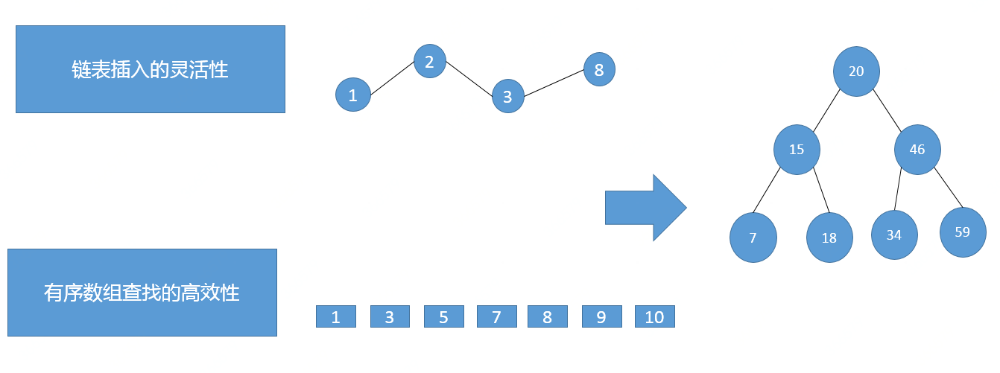

---
## 一. 二叉查找树
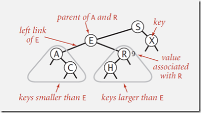

定义：二叉查找树是一棵二叉树，其中每个节点都含有一个Comparable的键（以及相关联的值）且每个结点的键都大于其左子树中的任意结点的键而小于右子树的任意结点的键.

### 1.1 二叉查找树时间复杂度
比如说打算查找数值6，那么在二叉树种是这样进行查找的。**查找的时间复杂度为**:
``` math
O =  1.39lgN(N为二叉树的元素个数)
```
如下图所示，查找的用的次数为3次。
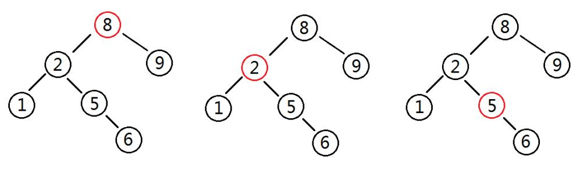

**插入的时间复杂度为**
``` math
O= lgN = H (N为二叉树的元素个数，H为树的高度) 
```

### 1.2 普通二叉查找树不可做索引
随机情况下，时间复杂度会变成N-1(N为元素的个数)，这种情况下丧失了二叉查找树的优势。十分糟糕！如图所示：
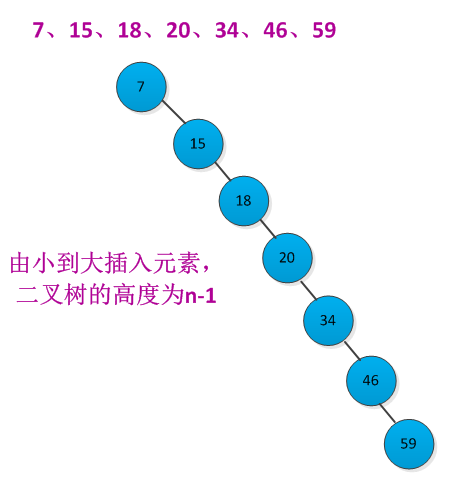

因此 普通的二叉树并不能作为索引！

---
## 二. 平衡 二叉查找树
为了避免时间复杂度发生极端情况，因此使用平衡二叉查找树，如图所示，树的高度由6变成了2。
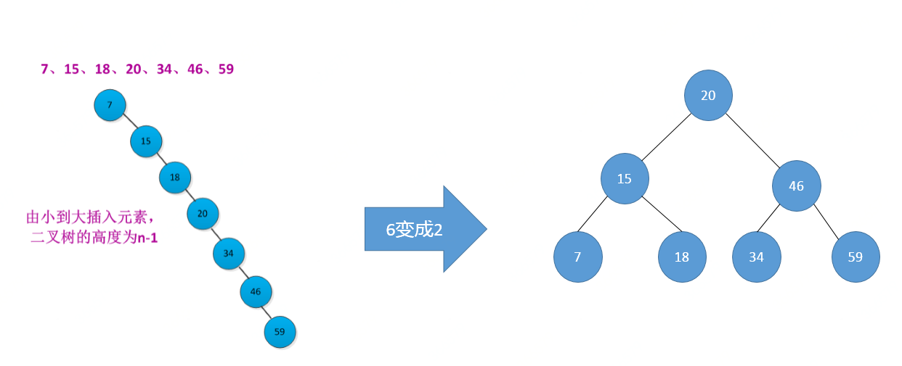
### 2.1 AVL树
> 定义：左右子树的高度之差不能超过1，如果插入或者删除一个节点使得高度之差大于1，就要进行节点之间的旋转，将二叉树重新维持在一个平衡状态。

> AVL树通过旋转规则能够以O(log2 n) 的时间复杂度进行搜索、插入、删除操作。

### 2.2 旋转规则
高度不平衡节点的两颗子树的高度差2。只考虑该不平衡节点本身，分四种情况分别讨论：
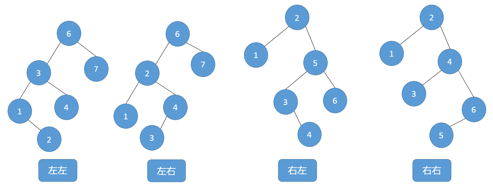

#### 2.2.1 左左
6节点的左子树3节点高度比右子树7节点大2，左子树3节点的左子树1节点高度大于右子树4节点，这种情况成为左左。需要经过一次旋转，达到平衡。
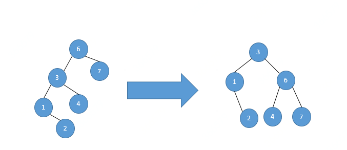

#### 2.2.2 左右
6节点的左子树2节点高度比右子树7节点大2，左子树2节点的左子树1节点高度小于右子树4节点，这种情况成为左右。需要经过两次旋转，才能达到平衡。

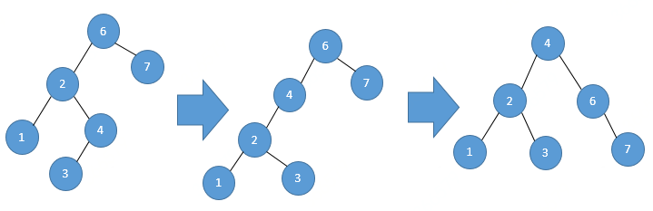

---
### 2.3 红黑树  
> 红黑树是每个节点都带有颜色属性的二叉查找树，颜色或红色或黑色。

红黑树能够以O(log2 n) 的时间复杂度进行搜索、插入、删除操作，是因为它维护了以下的特性，结合下图所示：

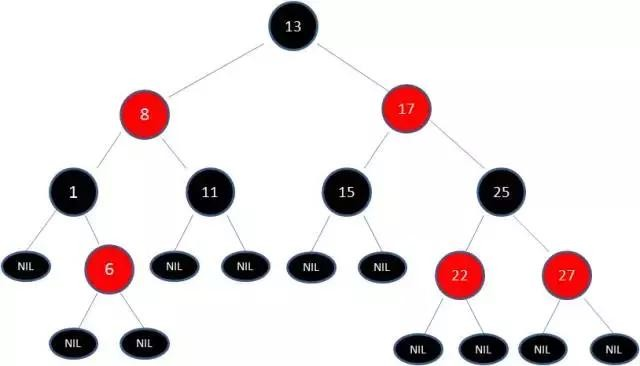
1. 节点是红色或黑色。
2. 根节点是黑色。
3. 每个叶子节点都是黑色的空节点（NIL节点）。
4  每个红色节点的两个子节点都是黑色。(从每个叶子到根的所有路径上不能有两个连续的红色节点)
5. 从任一节点到其每个叶子的所有路径都包含相同数目的黑色节点。
  
#### 2.3.1 红黑树的优势
1. 使用红黑结点的规律可以降低维护平衡性的开销
2. 用非严格的平衡来换取增删节点时旋转次数的降低

#### 2.3.2 红黑树的应用
JDK1.7中的TreeMap采用的就是红黑树,如下代码方法可以体现红黑树实现平衡的过程。

``` java

 //向左旋转
    private void rotateLeft(Entry<K,V> p) {
        if (p != null) {
            Entry<K,V> r = p.right;
            p.right = r.left;
            if (r.left != null)
                r.left.parent = p;
            r.parent = p.parent;
            if (p.parent == null)
                root = r;
            else if (p.parent.left == p)
                p.parent.left = r;
            else
                p.parent.right = r;
            r.left = p;
            p.parent = r;
        }
    }

 //向右旋转
    private void rotateRight(Entry<K,V> p) {
        if (p != null) {
            Entry<K,V> l = p.left;
            p.left = l.right;
            if (l.right != null) l.right.parent = p;
            l.parent = p.parent;
            if (p.parent == null)
                root = l;
            else if (p.parent.right == p)
                p.parent.right = l;
            else p.parent.left = l;
            l.right = p;
            p.parent = l;
        }
    }
    
    //插入后通过红黑节点来维护平衡
    /** From CLR */
    private void fixAfterInsertion(Entry<K,V> x) {
        x.color = RED;

        while (x != null && x != root && x.parent.color == RED) {
            if (parentOf(x) == leftOf(parentOf(parentOf(x)))) {
                Entry<K,V> y = rightOf(parentOf(parentOf(x)));
                if (colorOf(y) == RED) {
                    setColor(parentOf(x), BLACK);
                    setColor(y, BLACK);
                    setColor(parentOf(parentOf(x)), RED);
                    x = parentOf(parentOf(x));
                } else {
                    if (x == rightOf(parentOf(x))) {
                        x = parentOf(x);
                        rotateLeft(x);
                    }
                    setColor(parentOf(x), BLACK);
                    setColor(parentOf(parentOf(x)), RED);
                    rotateRight(parentOf(parentOf(x)));
                }
            } else {
                Entry<K,V> y = leftOf(parentOf(parentOf(x)));
                if (colorOf(y) == RED) {
                    setColor(parentOf(x), BLACK);
                    setColor(y, BLACK);
                    setColor(parentOf(parentOf(x)), RED);
                    x = parentOf(parentOf(x));
                } else {
                    if (x == leftOf(parentOf(x))) {
                        x = parentOf(x);
                        rotateRight(x);
                    }
                    setColor(parentOf(x), BLACK);
                    setColor(parentOf(parentOf(x)), RED);
                    rotateLeft(parentOf(parentOf(x)));
                }
            }
        }
        root.color = BLACK;//最终节点上色为黑色
    }
```

---
## 三. 二叉树 不能作为索引
结合日常的工作，数据库索引数据量十分庞大，结点不能全部放到内存中，那么需要通过磁盘读取，如下图所示，在极端的情况下可能会发生以下状况。


如图所示，树结构的节点分布在不同的磁盘快上，依次取出三个节点进行比较时，需要进行3次IO,很明显这么做是非常不可取的。

因此对于数据库索引，要求能够尽量缩减IO的次数。那么能不能在一个磁盘单位中存储尽可能多的索引节点呢？

---
## 四. B树
### 4.1 B- 树
B-树又叫平衡多路查找树，树的高度被缩减为 logt((n+1)/2)+1。根据例图12来看它的特性如下：
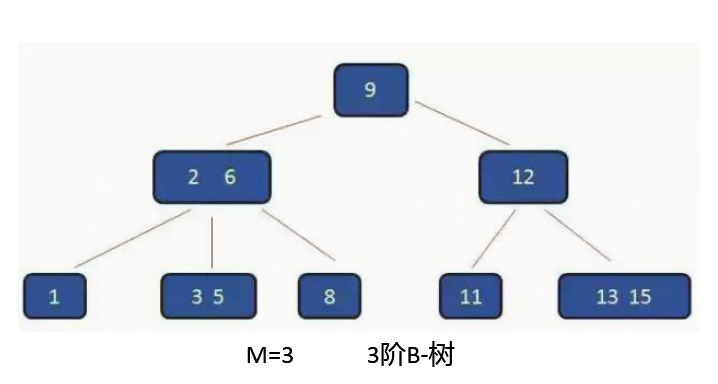

1. 一棵m阶的B树中每个结点最多含有m个孩子,最少起码2个孩子(m>=2);
    - m阶是指一个节点最多能拥有的孩子数。
    - 如果m<=2时退化为二叉树。
    - 例图中是3阶的B-树，可以看到根节点有3个孩子。
2. 每个非根节点所包含的关键字个数 j 满足：（m/2） - 1 <= j <= m – 1；
    - 如图所示关键字j的取值范围为 0.5 <= j <= 2 既 [1,2]
3. 除根结点以外的所有结点（不包括叶子结点）的度数正好是关键字总数加1，故内部子树个数 k 满足：┌m/2┐ <= k <= m ；
    - 如图中所示k的取值范围为 1.5 <= k <= 3 既 [1,2,3]
    - B树中每一个结点能包含的关键字数有一个上界和下界。这个下界可以用一个称作B树的最小度数（算法导论中文版上译作度数，最小度数即内节点中节点最小孩子数目）。
    
4. 所有的叶子结点都位于同一层。

这些特性最终达到的效果如下：

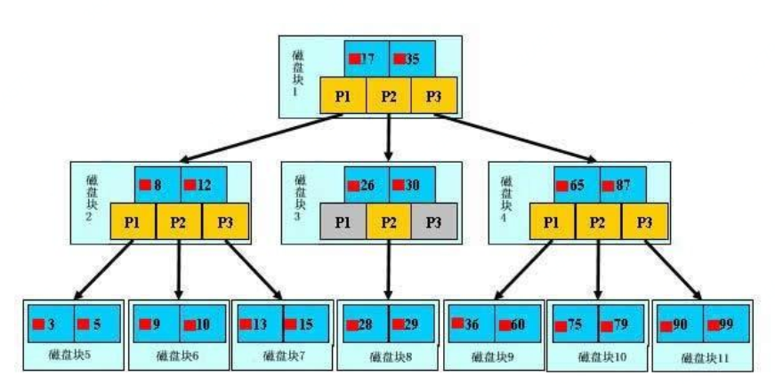
- 正是因为以上的特性，使得B-树在存储到磁盘时，可以在一个磁盘块中，存储多个节点，可见B-树可以有效的减少了IO读取的次数。

### 4.2 B+ 树
B+树是B-树的升级版，主要升级的地方如下：
1. 每个关键字结点不保存数据，只用来索引，所有数据都保存在叶子节点。
2. 所有的叶子结点中包含了全部关键字的信息，及指向含这些关键字记录的指针，且叶子结点本身依关键字的大小自小而大顺序链接。
3. 所有的非终端结点可以看成是索引部分，结点中仅含其子树（根结点）中的最大关键字。

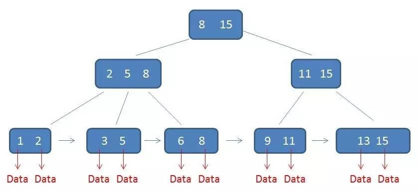
- 如图所示，只有叶子节点保存了数据Data,非叶子节点只是用来做索引的。
- 叶子节点前后相连，从小到大按照顺序连接。


## 五，数据库索引
> 索引是为了加速对表中数据行的检索而创建的一种分散的存储结构。索引是针对表而建立的，它是由数据页面以外的索引页面组成的，每个索引页面中的行都会含有逻辑指针，以便加速检索物理数据.

- 在没有索引的情况下我们搜索信息方式是全表搜索，是将所有记录一一取出，和查询条件进行一一对比，然后返回满足条件的记录，这样做会消耗大量数据库系统时间，并造成大量磁盘I/O操作；

- 但是如果在表中建立了索引，只要在索引中找到符合查询条件的索引值，最后通过保存在索引中的ROWID（相当于页码）就可以非常快速的找到表中对应的记录。如下图所示：


## 5.1 MySQL 索引的主要实现方式
Mysql索引主要有两种结构：B+Tree索引和Hash索引.  
Innodb和MyISAM默认的索引是Btree索引；而Mermory默认的索引是Hash索引。
大家都知道Hash索引并不是很常见，这是因为它的用途比较单一造成的。

HASH索引把数据的索引以hash形式组织起来，因此当查找某一条记录的时候,速度非常快，时间复杂度为O1。

但是因为是hash结构，每个键只对应一个值，而且是散列的方式分布。所以他并不支持范围查找和排序等功能。
在日常的应用中，大部分的场景下是需要范围查找和排序功能的。所以HASH索引在日程工作中并不常见。

## 5.2 为什么推荐使用B+树作为索引？
如下图所示，要维护一张学生表，主要包含的字段为唯一主键学生id,还有学生姓名，我们想要维护主键的唯一索引。那么使用B+树维护的过程是这样的：
首先，不断的插入索引，如下图所示，B+树的树形结构被逐渐维护起来。    
  
那么开始查询学生id为5时可以2次即可查询到5所在的叶子节点。  
然后如果想要查询学生id为6到13的学生信息的话，首先根据非叶子节点找到6所在的叶子节点（2次）和13所在的节点（2次），那么取叶子链表中对应的前后节点之间的数据即可。  
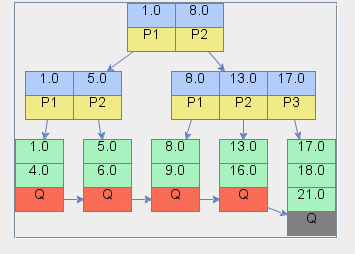

根据以上的过程我们可以很明显的看到B+树是非常适合作为索引的：
1. B+树相对于其它树形数据结构的磁盘读写代价更低，性能更优秀     
    B+树的非叶子节点只存了索引，没有数据，因此可以把非叶子节点都放到内存里进行快速检索。
1. B+树的查询效率更加稳定   
    树的高度是一定的，因此查询的时间也都是相同的。
1. B+树更加适合在区间查询      
    叶子节点使用链表从大到小排序，可以使用索引找到首尾节点快速进行区间查询。


