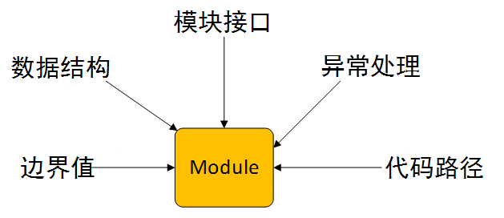

##  1. 什么是单元测试
单元测试又称为模块测试, 是针对程序模块（软件设计的最小单位）来进行正确性检验的测试工作。对于面向对象编程，最小单元就是方法，包括基类（超类）、抽象类、或者派生类（子类）中的方法。  单元测试通常由开发工程师完成，一般会伴随开发代码一起递交至代代码库

## 2. 为什么要做单元测试
单元测试是最接近底层的实现的测试方法，可以在研发阶段发现提早发现系统问题，能够以最小成本保证每个局部代码的质量。  

## 3. 单元测试的收益
1. 开发过程变得敏捷
当我们的开发人员实现越来越多的功能的时候，肯定会对现有的架构或代码进行必要的重构或调优。然而重构已经测试过的功能或代码是一件风险高和成本高的事情。如果我们的代码库中存在对应模块或功能的单元测试，那么就可以使我们的重构或优化变的更有信心。  
2. 提高代码质量
在代码提交集成测试之前，单元测试可以识别出每一个代码的缺陷，并阻止其流向集成测试环节。  
3. 降低修复问题的成本
如果某一个bug本应该在单元测试阶段发现，但是却在系统测试或集成测试阶段才被发现，那么这个bug的修复成本将会翻倍或者成本更高。因为在后续阶段各个模块之间存在依赖，定位问题的难度就会增加。  
4. 简化代码调试
单元测试可以最大程度的简化代码的调式过程。因为如果某一个单元测试用例失败了，那么在代码调试的时候，只需要重点关注最新修改的代码就可以了  

## 4. 如何做单元测试（3A原则）
### Arrange
  单元测试中的初始化工作，是为了解决被测函数中必要的前置依赖的问题，可以使用@Before/@BeforeClass;在测试完成后可以对测试数据进行针对性的清除保证数据的可复用性，可以使用@After/@AfterClass。
如下例所示：  
`
@Before  
public void setUp() throws Exception {  
    taskServerParam = new TaskServerParam();  
    taskServerParam.setExecuteCount(1);  
    taskServerParam.setFetchCount(1000000002);  
    taskServerParam.setOwnsign("test");  
    taskServerParam.setRetryCount(1);  
    taskServerParam.setServerArg("test");  
    taskServerParam.setServerCount(1);  
    taskServerParam.setThreadCount(1);  
}  
`
`
@Test
public void testSkyWorthB2B() throws Exception {
    Thread thread=new Thread(new EclpAutoTest("testSkyWorthB2B"));
    thread.start();
    TimeUnit.MILLISECONDS.sleep(1000 * 1);
    getSalesOrderClover.selectTasks(taskServerParam,curServer);
    ..//Assert
}
`
上述代码均对测试类GetSalesOrderCloverTest进行初始化添加数据的工作，才可以验证单元测试执行结果是否符合预期。

### Action
  Action主要是指调用接口或模块，通过不同的参数来调用接口，并拿到返回。同时要对模块的五个基本特性进行行为的评价：

* 模块接口测试  
1.调用本模块的输入参数是否正确  
2.全局数据结构是否有问题，保证系统数据的正确性  
3.模块的误差积累起来,是否会影响系统功能及性能  
* 内部数据测试  
1.变量是否有正确初始化  
2.数组越界  
* 异常处理  
1.是否检查错误出现  
2.出现错误，是否进行错误处理。抛出错误、通知用户、进行记录  
3.错误处理是否有效  
* 边界值  
1.普通合法数据是否正确处理  
2.普通非法数据是否正确处理  
3.边界内最接近边界的（合法）数据是否正确处理  
4.边界外最接近边界的（非法）数据是否正确处理  
* 代码路径  
1.是否覆盖了核心的业务路径（路径覆盖是最完整的覆盖方式）    
2.是否存在永不被执行到的路径  

### Assert
  当执行单元测试时，遇到每一个断言，都意味着要去验证一些期待的结果。如果断言的条件不满足，那么测试框架就会终止测试，运行teardown逻辑，然后接着运行下一个测试，这样可以帮助我们自动化的验证结果  
`
    @Test  
    public void testOrderMarkingAndCodUpdateServiceN4POPSOPOrderType22VendorInWhiteListIsFlashPurchase2()  {  
        String reqJSON=""//测试数据的准备;  
        OrderMarkingRequest orderMarkingRequest = (OrderMarkingRequest) JSONUtils.jsonToBean(reqJSON, OrderMarkingRequest.class);  
        OrderMarkingNewResponse orderMarkingAndCodUpdateServiceN = orderMarkingService.orderMarkingAndCodUpdateServiceN(orderMarkingRequest);  
        Integer sendPay14 = orderMarkingAndCodUpdateServiceN.getSendpayUpdate().get(14);//2  
        Integer sendPay56 = orderMarkingAndCodUpdateServiceN.getSendpayUpdate().get(56);//2  
        Assert.assertEquals(new Integer(2),sendPay14);  
        Assert.assertEquals(new Integer(2),sendPay56);  
    }
`  

### 5. 单元测试需要注意的几个问题： 
1. *不是所有代码都要都要进行单元测试（需覆盖核心业务流程）*
2. *需要对单元测试框架进行选型。JAVA最常用的框架是Junit、TestNG,常用Mock框架mockito/jmock*
3. *衡量单元测试的覆盖率还需要Jacoco来统计覆盖率/*
4. *满足前3步的基础上可以将单元测试加入持续集成，确保每次提交代码都会自动触发单元测试并统计其覆盖率情况*  

参考资料：  
https://www.cnblogs.com/AloneSword/p/4109407.html  
https://blog.csdn.net/Shiny0815/article/details/80185142