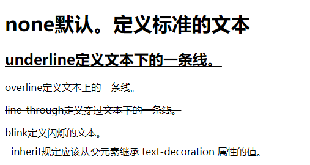
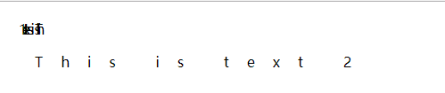
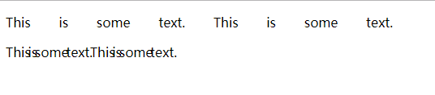
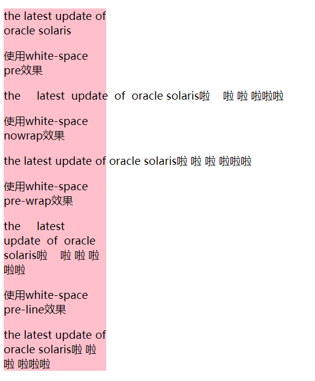

# css使用说明

# 1.text-decoration

## 说明

设置文字下划线 ，这个属性允许对文本设置某种效果，如加下划线。如果后代元素没有自己的装饰，祖先元素上设置的装饰会“延伸”到后代元素中。不要求用户代理支持 blink。


## 可能的值

| 值           | 描述                                            |
| ------------ | ----------------------------------------------- |
| none         | 默认。定义标准的文本。                          |
| underline    | 定义文本下的一条线。                            |
| overline     | 定义文本上的一条线。                            |
| line-through | 定义穿过文本下的一条线。                        |
| blink        | 定义闪烁的文本。                                |
| inherit      | 规定应该从父元素继承 text-decoration 属性的值。 |

## 示例

```
<!DOCTYPE html>
<html>
<head>
    <meta charset="utf-8">
    <title>文本实例-设置文本字体效果</title>
    <style type="text/css">
    h2 {
        text-decoration: underline;
    }

    .p1 {
        text-decoration: overline;
    }

    .p2 {
        text-decoration: line-through;
    }

    .sp1 {
        text-decoration: blink;
    }

    .decoration {
        text-decoration: underline;
        padding: 10px;
    }
    </style>
</head>

<body>
    <h1>none默认。定义标准的文本</h1>
    <h2>underline定义文本下的一条线。</h2>
    <p class="p1">overline定义文本上的一条线。</p>
    <p class="p2">line-through定义穿过文本下的一条线。</p>
    <span class="sp1">blink定义闪烁的文本。</span>
    <div class="decoration">
        <span class="sp2">inherit规定应该从父元素继承 text-decoration 属性的值。</span>
    </div>
</body>

</html>
```

## 效果


# 2.letter-spacing

## 说明 

设置字间距 

## 可能的值

| 值       | 描述                                           |
| -------- | ---------------------------------------------- |
| normal   | 默认。规定字符间没有额外的空间。               |
| *length* | 定义字符间的固定空间（允许使用负值）。         |
| inherit  | 规定应该从父元素继承 letter-spacing 属性的值。 |

## 示例

```
<!DOCTYPE html>
<html>

<head>
    <meta charset="utf-8">
    <title></title>
    <style type="text/css">
    .text_letter_spacing {
        width: 500px;
        margin: 20px auto;
    }

    .p1 {
        letter-spacing: -0.5em;
    }

    .p2 {
        letter-spacing: 20px;
    }
    </style>
</head>

<body>
    <div class="text_letter_spacing">
        <p class="p1">This is text 1</p>
        <p class="p2">This is text 2</p>
    </div>
</body>

</html>
```
## 效果


# 3.word-spacing

## 说明

设置词间距 

## 可能的值

| 值       | 描述                                         |
| -------- | -------------------------------------------- |
| normal   | 默认。定义单词间的标准空间。                 |
| *length* | 定义单词间的固定空间。                       |
| inherit  | 规定应该从父元素继承 word-spacing 属性的值。 |

## 示例

```
<!DOCTYPE html>
<html>

<head>
    <meta charset="utf-8">
    <title>增加或减少单词间距（字间隔）</title>
    <style type="text/css">
    p.spread {
        word-spacing: 30px;
    }

    p.tight {
        word-spacing: -0.5em;
    }
    </style>
</head>

<body>
    <div>
        <p class="spread">This is some text. This is some text.</p>
        <p class="tight">This is some text. This is some text.</p>
    </div>
</body>

</html>
```
## 效果


# 4.white-space

## 说明

white-space 属性设置如何处理元素内的空白。

## 可能的值

| 值       | 描述                                                         |
| -------- | ------------------------------------------------------------ |
| normal   | 默认。空白会被浏览器忽略。                                   |
| pre      | 空白会被浏览器保留。其行为方式类似 HTML 中的 <pre> 标签；文本不会换行，文本会在在同一行上继续，直到遇到 <br> 标签为止。。 |
| nowrap   | 文本不会换行，文本会在在同一行上继续，直到遇到 <br> 标签为止。 |
| pre-wrap | 保留空白符序列，但是正常地进行换行。                         |
| pre-line | 合并空白符序列，但是保留换行符。                             |
| inherit  | 规定应该从父元素继承 white-space 属性的值。                  |

## 示例

```
<!DOCTYPE html>
<html>

<head>
    <meta charset="utf-8">
    <title></title>
    <style type="text/css">
    .white-space-demo {
        width: 170px;
        background-color: pink;
    }

    p {
        font-size: 18px;
    }

    .p1 {
        white-space: pre;
    }

    .p2 {
        white-space: nowrap;
    }

    .p3 {
        white-space: pre-wrap;
    }

    .p4 {
        white-space: pre-line;
    }
    </style>
</head>

<body>
    <div class="white-space-demo">
        <p>the     latest  update  of  oracle solaris</p>
        <p>使用white-space pre效果</p>
        <p class="p1">the     latest  update  of  oracle solaris啦    啦 啦 啦啦啦</p>
        <p>使用white-space nowrap效果</p>
        <p class="p2">the     latest  update  of  oracle solaris啦    啦 啦 啦啦啦</p>
        <p>使用white-space pre-wrap效果</p>
        <p class="p3">the     latest  update  of  oracle solaris啦    啦 啦 啦啦啦</p>
        <p>使用white-space pre-line效果</p>
        <p class="p4">the     latest  update  of  oracle solaris啦    啦 啦 啦啦啦</p>
    </div>
</body>

</html>
```
## 效果

