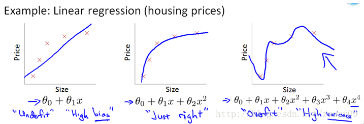
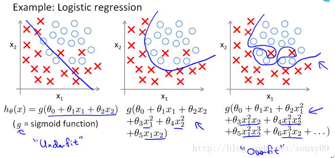
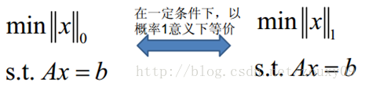
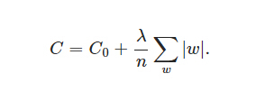
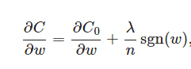
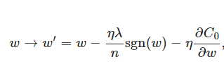

LASSO回归与最小角回归(LASSO Regression and LAR)
-----------------------------------------------

### 5.1 过拟合

机器学习算法虽然能够有效地解决许多问题，但是当将它们应用到某些特定的机器学习应用时，会遇到过拟合(**over-fitting**)的问题，可能会导致它们效果很差。

如果我们有非常多的特征，我们通过学习得到的假设可能能够非常好地适应训练集（代价函数可能几乎为0），但是可能会不能推广到新的数据。

下图是一个回归问题的例子：

第一个模型是一个线性模型，欠拟合，不能很好地适应我们的训练集；第三个模型是一个四次方的模型，过于强调拟合原始数据，而丢失了算法的本质：预测新数据。我们可以看出，若给出一个新的值使之预测，它将表现的很差，是过拟合，虽然能非常好地适应我们的训练集但在新输入变量进行预测时可能会效果不好；而中间的模型似乎最合适。

分类问题中也存在这样的问题：

就以多项式理解，\\(x\\) 的次数越高，拟合的越好，但相应的预测的能力就可能变差。

问题是，如果我们发现了过拟合问题，应该如何处理？

1.丢弃一些不能帮助我们正确预测的特征。可以是手工选择保留哪些特征，或者使用一些模型选择的算法来帮忙（例如**PCA**）

2.正则化。 保留所有的特征，但是减少参数的大小（**magnitude**）。

### 5.2 代价函数的正则化

上面的回归问题中如果我们的模型是：

\\(h\_{\theta}\left( x \right) = \theta\_{0} + \theta\_{1}x\_{1} +
\theta\_{2}x\_{2}^{2} + \theta\_{3}x\_{3}^{3} + \theta\_{4}x\_{4}^{4}\\)

我们可以从之前的事例中看出，正是那些高次项导致了过拟合的产生，所以如果我们能让这些高次项的系数接近于0的话，我们就能很好的拟合了。

所以我们要做的就是在一定程度上减小这些参数\\(\theta\\)
的值，这就是正则化的基本方法。我们决定要减少\\(\theta\_{3}\\)和\\(\theta\_{4}\\)的大小，我们要做的便是修改代价函数，在其中\\(\theta\_{3}\\)和\\(\theta\_{4}\\)
设置一点惩罚。这样做的话，我们在尝试最小化代价时也需要将这个惩罚纳入考虑中，并最终导致选择较小一些的\\(\theta\_{3}\\)和\\(\theta\_{4}\\)。

修改后的代价函数如下：\\(\min\_{\theta}\,\frac{1}{2m}\lbrack\sum\_{i =
1}^{m}{\left( h\_{\theta}\left( x^{(i)} \right) - y^{(i)} \right)^{2} +
1000\theta\_{3}^{2} + 10000\theta\_{4}^{2}\rbrack}\\)

通过这样的代价函数选择出的\\(\theta\_{3}\\)和\\(\theta\_{4}\\)
对预测结果的影响就比之前要小许多。假如我们有非常多的特征，我们并不知道其中哪些特征我们要惩罚，我们将对所有的特征进行惩罚，并且让代价函数最优化的软件来选择这些惩罚的程度。这样的结果是得到了一个较为简单的能防止过拟合问题的假设：\\(J\left(
\theta \right) = \frac{1}{2m}\lbrack\sum\_{i = 1}^{m}{{(h\_{\theta}(x^{(i)}) -
y^{(i)})}^{2} + \lambda\sum\_{j = 1}^{n}\theta\_{j}^{2}\rbrack}\\)

其中\\(\lambda\\)又称为正则化参数（**Regularization Parameter**）。
注：根据惯例，我们不对\\(\theta\_{0}\\)
进行惩罚。经过正则化处理的模型与原模型的可能对比如下图所示：

如果选择的正则化参数λ过大，则会把所有的参数都最小化了，导致模型变成
\\(h\_{\theta}\left( x \right) =
\theta\_{0}\\)，也就是上图中红色直线所示的情况，造成欠拟合。

那为什么增加的一项\\(\lambda = \sum\_{j = 1}^{n}\theta\_{j}^{2}\\)
可以使\\(\theta\\)的值减小呢？

因为如果我们令 \\(\lambda\\) 的值很大的话，为了使**Cost Function**
尽可能的小，所有的 \\(\theta\\) 的值（不包括\\(\theta\_{0}\\)）都会在一定程度上减小。

但若λ的值太大了，那么\\(\theta\\)（不包括\\(\theta\_{0}\\)）都会趋近于0，这样我们所得到的只能是一条平行于\\(x\\)轴的直线。

所以对于正则化，我们要取一个合理的 \\(\lambda\\) 的值，这样才能更好的应用正则化。

### 5.3 L0范数与L1范数

L0范数是指向量中非0的元素的个数。如果我们用L0范数来规则化一个参数矩阵W的话，就是希望W的大部分元素都是0。这太直观了，太露骨了吧，换句话说，让参数W是稀疏的。OK，看到了“稀疏”二字，大家都应该从当下风风火火的“压缩感知”和“稀疏编码”中醒悟过来，原来用的漫山遍野的“稀疏”就是通过这玩意来实现的。但你又开始怀疑了，是这样吗？看到的papers世界中，稀疏不是都通过L1范数来实现吗？脑海里是不是到处都是\|\|W\|\|1影子呀！几乎是抬头不见低头见。没错，这就是这节的题目把L0和L1放在一起的原因，因为他们有着某种不寻常的关系。那我们再来看看L1范数是什么？它为什么可以实现稀疏？为什么大家都用L1范数去实现稀疏，而不是L0范数呢？ 
   

 L1范数是指向量中各个元素绝对值之和，也有个美称叫“稀疏规则算子”（Lasso
regularization）。现在我们来分析下这个价值一个亿的问题：为什么L1范数会使权值稀疏？有人可能会这样给你回答“它是L0范数的最优凸近似”。实际上，还存在一个更美的回答：任何的规则化算子，如果他在Wi=0的地方不可微，并且可以分解为一个“求和”的形式，那么这个规则化算子就可以实现稀疏。这说是这么说，W的L1范数是绝对值，\|w\|在w=0处是不可微，但这还是不够直观。所以关于L1范数的直观理解，请看下一节。 
   

 上面还有一个问题：既然L0可以实现稀疏，为什么不用L0，而要用L1呢？个人理解一是因为L0范数很难优化求解（NP难问题），二是L1范数是L0范数的最优凸近似，而且它比L0范数要容易优化求解。所以大家才把目光和万千宠爱转于L1范数。

 一句话总结：L1范数和L0范数可以实现稀疏，L1因具有比L0更好的优化求解特性而被广泛应用。

我们知道了L1可以实现稀疏，但我们会想呀，为什么要稀疏？让我们的参数稀疏有什么好处呢？这里扯两点：

1）特征选择(Feature Selection)：       

大家对稀疏规则化趋之若鹜的一个关键原因在于它能实现特征的自动选择。一般来说，xi的大部分元素（也就是特征）都是和最终的输出yi没有关系或者不提供任何信息的，在最小化目标函数的时候考虑xi这些额外的特征，虽然可以获得更小的训练误差，但在预测新的样本时，这些没用的信息反而会被考虑，从而干扰了对正确yi的预测。稀疏规则化算子的引入就是为了完成特征自动选择的光荣使命，它会学习地去掉这些没有信息的特征，也就是把这些特征对应的权重置为0。

2）可解释性(Interpretability)：       

另一个青睐于稀疏的理由是，模型更容易解释。例如患某种病的概率是y，然后我们收集到的数据x是1000维的，也就是我们需要寻找这1000种因素到底是怎么影响患上这种病的概率的。假设我们这个是个回归模型：y=w1\*x1+w2\*x2+…+w1000\*x1000+b（当然了，为了让y限定在[0,1]的范围，一般还得加个Logistic函数）。通过学习，如果最后学习到的w\*就只有很少的非零元素，例如只有5个非零的wi，那么我们就有理由相信，这些对应的特征在患病分析上面提供的信息是巨大的，决策性的。也就是说，患不患这种病只和这5个因素有关，那医生就好分析多了。但如果1000个wi都非0，医生面对这1000种因素，累觉不爱。

### 5.4 L1正则化

在原始的代价函数后面加上一个L1正则化项，即所有权重w的绝对值的和，乘以λ/n

同样先计算导数：

上式中sgn(w)表示w的符号。那么权重w的更新规则为：

比原始的更新规则多出了η \* λ \*
sgn(w)/n这一项。当w为正时，更新后的w变小。当w为负时，更新后的w变大——因此它的效果就是让w往0靠，使网络中的权重尽可能为0，也就相当于减小了网络复杂度，防止过拟合。

另外，上面没有提到一个问题，当w为0时怎么办？当w等于0时，\|W\|是不可导的，所以我们只能按照原始的未经正则化的方法去更新w，这就相当于去掉η\*λ\*sgn(w)/n这一项，所以我们可以规定sgn(0)=0，这样就把w=0的情况也统一进来了。（在编程的时候，令sgn(0)=0,sgn(w\>0)=1,sgn(w\<0)=-1）

### 5.5 线性回归的L1正则化

Lasso回归有时也叫做线性回归的L1正则化，和Ridge回归的主要区别就是在正则化项，Ridge回归用的是L2正则化，而Lasso回归用的是L1正则化。Lasso回归的损失函数表达式如下：　

　　　　\\(J(\\mathbf\\theta) = \\frac{1}{2n}(\\mathbf{X\\theta} - \\mathbf{Y})^T(\\mathbf{X\\theta} - \\mathbf{Y}) + \\alpha||\\theta||_1\\)

其中n为样本个数，\\(\\alpha\\)为常数系数，需要进行调优。\\(||\\theta||_1\\)为L1范数。　　　

Lasso回归使得一些系数变小，甚至还是一些绝对值较小的系数直接变为0，因此特别适用于参数数目缩减与参数的选择，因而用来估计稀疏参数的线性模型。

但是Lasso回归有一个很大的问题，导致我们需要把它单独拎出来讲，就是它的损失函数不是连续可导的，由于L1范数用的是绝对值之和，导致损失函数有不可导的点。也就是说，我们的最小二乘法，梯度下降法，牛顿法与拟牛顿法对它统统失效了。那我们怎么才能求有这个L1范数的损失函数极小值呢？
　　　　
### 5.6 LAR回归

我们知道了LASSO回归，但是如何去求解它呢？在本小节中将要介绍最小角回归方法(Least Angle Regression， LARS)求解LASSO问题。
在介绍最小角回归前，我们先看看两个预备算法。

####(1) 前向选择（Forward Selection）算法

第一个预备算法是前向选择（Forward Selection）算法。

前向选择算法的原理是是一种典型的贪心算法。要解决的问题是对于:

\\(\\mathbf{Y = X\\theta}\\)这样的线性关系，如何求解系数向量\\(\\mathbf{\\theta}\\)的问题。其中\\(\\mathbf{Y}\\)为 mx1的向量，\\(\\mathbf{X}\\)为mxn的矩阵，\\(\\mathbf{\\theta}\\)为nx1的向量。m为样本数量，n为特征维度。

把 矩阵\\(\\mathbf{X}\\)看做n个mx1的向量\\(\\mathbf{X\_i}\\)(i=1,2,...n)，在\\(\\mathbf{Y}\\)的\\(\\mathbf{X}\\)变量\\(\\mathbf{X\_i}\\)(i =1,2,...m)中，选择和目标\\(\\mathbf{Y}\\)最为接近(余弦距离最大)的一个变量\\(\\mathbf{X\_k}\\)，用\\(\\mathbf{X\_k}\\)来逼近\\(\\mathbf{Y}\\),得到下式：

\\(\\overline{\\mathbf{Y}} = \\mathbf{X\_k\\theta\_k}\\)

其中： \\(\\mathbf{\\theta\_k}= \\mathbf{\\frac{<X\_k, Y>}{||X\_k||\_2}}\\)

即：\\(\\overline{\\mathbf{Y}}\\) 是 \\(\\mathbf{Y}\\)在 \\(\\mathbf{X\_k}\\)上的投影。那么，可以定义残差(residual):   \\(\\mathbf{Y\_{yes}} = \\mathbf{Y - \\overline{Y}}\\)。由于是投影，所以很容易知道 \\(\\mathbf{Y_{yes}} 和\\mathbf{X\_k}\\)是正交的。再以\\(\\mathbf{Y\_{yes}}\\)为新的因变量，去掉\\(\\mathbf{X\_k}\\)后，剩下的自变量的集合\\(\\mathbf{X\_i}\\),i=1,2,3...k−1,k+1,...n}为新的自变量集合，重复刚才投影和残差的操作，直到残差为0，或者所有的自变量都用完了，才停止算法。

当\\(\\mathbf{X}\\)只有2维时，例子如上图，和\\(\\mathbf{Y}\\)最接近的是\\(\\mathbf{X\_1}\\)，首先在\\(\\mathbf{X\_1}\\)上面投影，残差如上图长虚线。此时\\(X\_1\\theta\_1\\)模拟了\\(\\mathbf{Y}\\)，\\(\\theta\_1\\)模拟了\\(\\mathbf{ \\theta}\\)(仅仅模拟了一个维度)。接着发现最接近的是\\(\\mathbf{X\_2}\\)，此时用残差接着在\\(\\mathbf{X\_2}\\)投影，残差如图中短虚线。由于没有其他自变量了，此时\\(X\_1\\theta\_1+X\_2\\theta_2\\)模拟了\\(\\mathbf{Y}\\),对应的模拟了两个维度的\\(\\theta\\)即为最终结果，此处\\(\\theta\\)计算设计较多矩阵运算，这里不讨论。

此算法对每个变量只需要执行一次操作，效率高，速度快。但也容易看出，当自变量不是正交的时候，由于每次都是在做投影，所有算法只能给出一个局部近似解。因此，这个简单的算法太粗糙，还不能直接用于我们的Lasso回归。

####(2) 前向梯度（Forward Stagewise）算法

第二个预备算法是前向梯度（Forward Stagewise）算法。

前向梯度算法和前向选择算法有类似的地方，也是在\\(\\mathbf{Y}\\)的\\(\\mathbf{X}\\)变量\\(\\mathbf{X\_i}\\)(i =1,2,...n)中，选择和目标\\(\\mathbf{Y}\\)最为接近(余弦距离最大)的一个变量\\(\\mathbf{X\_k}\\)，用\\(\\mathbf{X\_k}\\)来逼近\\(\\mathbf{Y}\\)，但是前向梯度算法不是粗暴的用投影，而是每次在最为接近的自变量\\(\\mathbf{X\_t}\\)的方向移动一小步，然后再看残差\\(\\mathbf{Y_{yes}}\\)和哪个\\(\\mathbf{X\_i}\\)(i =1,2,...n)最为接近。此时我们也不会把\\(\\mathbf{X\_t}\\) 去除，因为我们只是前进了一小步，有可能下面最接近的自变量还是\\(\\mathbf{X\_t}\\)。如此进行下去，直到残差\\(\\mathbf{Y\_{yes}} \\)减小到足够小，算法停止。

　　　　

当\\(\\mathbf{X}\\)只有2维时，例子如上图，和\\(\\mathbf{Y}\\)最接近的是\\(\\mathbf{X\_1}\\)，首先在\\(\\mathbf{X\_1}\\)上面走一小段距离，此处\\(\\varepsilon\\)为一个较小的常量，发现此时的残差还是和\\\(\\mathbf{X\_1}\\)最接近。那么接着沿\\(\\mathbf{X\_1}\\)走，一直走到发现残差不是和\\(\\mathbf{X\_1}\\)最接近，而是和\\(\\mathbf{X\_2}\\)最接近，此时残差如上图长虚线。接着沿着\\(\\mathbf{X\_2}\\)走一小步，发现残差此时又和\\(\\mathbf{X\_1}\\)最接近，那么开始沿着\\(\\mathbf{X_1}\\)走，走完一步后发现残差为0，那么算法停止。此时\\(\\mathbf{Y}\\)由刚才所有的所有步相加而模拟，对应的算出的系数\\(\\theta\\)即为最终结果。此处\\(\\theta\\)计算设计较多矩阵运算，这里不讨论。

当算法在\\(\\varepsilon\\)很小的时候，可以很精确的给出最优解，当然，其计算的迭代次数也是大大的增加。和前向选择算法相比，前向梯度算法更加精确，但是更加复杂。

有没有折中的办法可以综合前向梯度算法和前向选择算法的优点，做一个折中呢？有！这就是终于要出场的最小角回归法。

####(3) 最小角回归(Least Angle Regression， LARS)算法

最小角回归法对前向梯度算法和前向选择算法做了折中，保留了前向梯度算法一定程度的精确性，同时简化了前向梯度算法一步步迭代的过程。具体算法是这样的：　

首先，还是找到与因变量\\(\\mathbf{Y}\\)最接近或者相关度最高的自变量\\(\\mathbf{X\_k}\\)，使用类似于前向梯度算法中的残差计算方法，得到新的目标\\(\\mathbf{Y\_{yes}}\\)，此时不用和前向梯度算法一样小步小步的走。而是直接向前走直到出现一个\\(\\mathbf{X\_t}\\)，使得\\(\\mathbf{X\_t}\\)和\\(\\mathbf{Y\_{yes}}\\)的相关度和\\(\\mathbf{X\_k}\\)与\\(\\mathbf{Y\_{yes}}\\)的相关度是一样的，此时残差\\(\\mathbf{Y\_{yes}}\\)就在\\(\\mathbf{X\_t}\\)和\\(\\mathbf{X\_k}\\)的角平分线方向上，此时我们开始沿着这个残差角平分线走，直到出现第三个特征\\(\\mathbf{X\_p}\\)和\\(\\mathbf{Y\_{yes}}\\)的相关度足够大的时候，即\\(\\mathbf{X\_p}\\)到当前残差\\(\\mathbf{Y\_{yes}}\\)的相关度和\\(\\theta_t\\)，\\(\\theta\_k\\)与\\(\\mathbf{Y\_{yes}}\\)的一样。将其也叫入到\\(\\mathbf{Y}\\)的逼近特征集合中，并用\\(\\mathbf{Y}\\)的逼近特征集合的共同角分线，作为新的逼近方向。以此循环，直到\\(\\mathbf{Y\_{yes}}\\)足够的小，或者说所有的变量都已经取完了，算法停止。此时对应的系数\\(\\theta\\)即为最终结果。

 

当\\(\\theta\\)只有2维时，例子如上图，和\\(\\mathbf{Y}\\)最接近的是\\(\\mathbf{X\_1}\\)，首先在\\(\\mathbf{X\_1}\\)上面走一段距离，一直到残差在\\(\\mathbf{X\_1}\\)和\\(\\mathbf{X\_2}\\)的角平分线上，此时沿着角平分线走，直到残差最够小时停止，此时对应的系数\\(\\beta\\)即为最终结果。此处\\(\\theta\\)计算设计较多矩阵运算，这里不讨论。

最小角回归法是一个适用于高维数据的回归算法，其主要的优点有：

1）特别适合于特征维度n 远高于样本数m的情况。

2）算法的最坏计算复杂度和最小二乘法类似，但是其计算速度几乎和前向选择算法一样

3）可以产生分段线性结果的完整路径，这在模型的交叉验证中极为有用

主要的缺点是：

由于LARS的迭代方向是根据目标的残差而定，所以该算法对样本的噪声极为敏感。

####总结

Lasso回归是在ridge回归的基础上发展起来的，如果模型的特征非常多，需要压缩，那么Lasso回归是很好的选择。一般的情况下，普通的线性回归模型就够了。

另外，本文对最小角回归法怎么求具体的\\(\\theta\\)参数值没有提及，仅仅涉及了原理，如果对具体的算计推导有兴趣，可以参考Bradley Efron的论文《Least Angle Regression》，网上很容易找到。 　　　　
