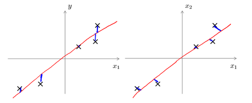

### 主成分分析

主成分分析(**PCA**)是最常见的降维算法。

在**PCA**中，我们要做的是找到一个方向向量（**Vector
direction**），当我们把所有的数据都投射到该向量上时，我们希望投射平均均方误差能尽可能地小。方向向量是一个经过原点的向量，而投射误差是从特征向量向该方向向量作垂线的长度。

下面给出主成分分析问题的描述：

问题是要将\\(n\\)维数据降至\\(k\\)维，目标是找到向量\\(u^{(1)}\\),\\(u^{(2)}\\),...,\\(u^{(k)}\\)使得总的投射误差最小。主成分分析与线性回顾的比较：

主成分分析与线性回归是两种不同的算法。主成分分析最小化的是投射误差（**Projected
Error**），而线性回归尝试的是最小化预测误差。线性回归的目的是预测结果，而主成分分析不作任何预测。

上图中，左边的是线性回归的误差（垂直于横轴投影），右边则是主要成分分析的误差（垂直于红线投影）。

**PCA**将\\(n\\)个特征降维到\\(k\\)个，可以用来进行数据压缩，如果100维的向量最后可以用10维来表示，那么压缩率为90%。同样图像处理领域的**KL变换**使用**PCA**做图像压缩。但**PCA**
要保证降维后，还要保证数据的特性损失最小。

**PCA**技术的一大好处是对数据进行降维的处理。我们可以对新求出的“主元”向量的重要性进行排序，根据需要取前面最重要的部分，将后面的维数省去，可以达到降维从而简化模型或是对数据进行压缩的效果。同时最大程度的保持了原有数据的信息。

**PCA**技术的一个很大的优点是，它是完全无参数限制的。在**PCA**的计算过程中完全不需要人为的设定参数或是根据任何经验模型对计算进行干预，最后的结果只与数据相关，与用户是独立的。

但是，这一点同时也可以看作是缺点。如果用户对观测对象有一定的先验知识，掌握了数据的一些特征，却无法通过参数化等方法对处理过程进行干预，可能会得不到预期的效果，效率也不高。

### 2.1 主成分分析算法

**PCA** 减少\\(n\\)维到\\(k\\)维：

第一步是均值归一化。我们需要计算出所有特征的均值，然后令 \\( x\_{j} = x\_{j} -\mu\_{j} \\)。如果特征是在不同的数量级上，我们还需要将其除以标准差 \\(\sigma^{2}\\)。

第二步是计算**协方差矩阵**（**covariance matrix**）\\(\Sigma\\)： \\(\sum =
\frac{1}{m}\sum_{i = 1}^{n}\left( x^{(i)} \right)\left( x^{(i)} \right)^{T}\\)

第三步是计算协方差矩阵\\(\Sigma\\)的**特征向量**（**eigenvectors**）:

在 **Octave** 里我们可以利用**奇异值分解**（**singular value
decomposition**）来求解，`[U, S, V]= svd(sigma)`。

\\(
Sigma = \frac{1}{m}\sum_{i = 1}^{n}\left( x^{(i)} \right)\left( x^{(i)} \right)^{T}
\\)

对于一个 \\(n \times
n\\)维度的矩阵，上式中的\\(U\\)是一个具有与数据之间最小投射误差的方向向量构成的矩阵。如果我们希望将数据从\\(n\\)维降至\\(k\\)维，我们只需要从\\(U\\)中选取前\\(k\\)个向量，获得一个\\(n
\times
k\\)维度的矩阵，我们用\\(U\_{\text{reduce}}\\)表示，然后通过如下计算获得要求的新特征向量\\(z^{(i)}\\):
\\(z^{(i)} = U\_{\text{reduce}}^{T}*x^{(i)}\\)

其中\\(x\\)是\\(n \times 1\\)维的，因此结果为\\(k \times
1\\)维度。注，我们不对方差特征进行处理。

### 2.2 选择主成分的数量

主要成分分析是减少投射的平均均方误差：

训练集的方差为：\\(\frac{1}{m}\sum_{i = 1}^{m}\left. \parallel x^{\left( i
\right)} \right.\parallel^{2}\\)

我们希望在平均均方误差与训练集方差的比例尽可能小的情况下选择尽可能小的\\(k\\)值。

如果我们希望这个比例小于1%，就意味着原本数据的偏差有99%都保留下来了，如果我们选择保留95%的偏差，便能非常显著地降低模型中特征的维度了。

我们可以先令\\(k =
1\\)，然后进行主要成分分析，获得\\(U_{\text{reduce}}\\)和\\(z\\)，然后计算比例是否小于1%。如果不是的话再令\\(k
= 2\\)，如此类推，直到找到可以使得比例小于1%的最小\\(k\\)
值（原因是各个特征之间通常情况存在某种相关性）。

还有一些更好的方式来选择\\(k\\)，当我们在**Octave**中调用“**svd**”函数的时候，我们获得三个参数：`[U,
S, V] = svd(sigma)`。

其中的\\(S\\)是一个\\(n \times
n\\)的矩阵，只有对角线上有值，而其它单元都是0，我们可以使用这个矩阵来计算平均均方误差与训练集方差的比例：

\\(
\frac{\frac{1}{m}\sum\_{i = 1}^{m}\left. \parallel x^{\left( i \right)} - x\_{\text{approx}}^{\left( i \right)} \right.\parallel^{2}}{\frac{1}{m}\sum\_{i = 1}^{m}\left. \parallel x^{(i)} \right.\parallel^{2}} = 1 - \frac{\Sigma\_{i = 1}^{k}s\_{\text{ii}}}{\Sigma\_{i = 1}^{n}s\_{\text{ii}}} \leq 1\%
\\)

也就是：

\\(\frac{\Sigma\_{i = 1}^{k}s\_{\text{ii}}}{\Sigma\_{i = 1}^{n}s\_{\text{ii}}}\\)
≥0.99

在压缩过数据后，我们可以采用如下方法来近似地获得原有的特征：

\\(
x\_{\text{approx}}^{\left( i \right)} = U\_{\text{reduce}}z^{(i)}
\\)

### 2.3 重建的压缩表示

**PCA**作为压缩算法，可能需要把1000维的数据压缩100维特征，或具有三维数据压缩到一二维表示。所以，如果这是一个压缩算法，应该能回到这个压缩表示，回到你原有的高维数据的一种近似。

所以，给定的\\(z^{(i)}\\)，这可能100维，怎么回到你原来的表示\\(x^{(i)}\\)，这可能是1000维的数组？

**PCA**算法，我们可能有一个这样的样本。如图中样本\\(x^{(1)}\\),\\(x^{(2)}\\)。我们做的是，我们把这些样本投射到图中这个一维平面。然后现在我们需要只使用一个实数，比如\\(z^{(1)}\\)，指定这些点的位置后他们被投射到这一个三维曲面。给定一个点\\(z^{(1)}\\)，我们怎么能回去这个原始的二维空间呢？\\(x\\)为2维，z为1维，\\(z
= U_{\text{reduce}}^{T}x\\)，相反的方程为：

\\(x\_{\text{appox}} = U\_{\text{reduce}} \cdot z\\),\\(x\_{\text{appox}} \approx
x\\)。

如图：

如你所知，这是一个漂亮的与原始数据相当相似。所以，这就是你从低维表示\\(z\\)回到未压缩的表示。我们得到的数据的一个之间你的原始数据
\\(x\\)，我们也把这个过程称为重建原始数据。

当我们认为试图重建从压缩表示 \\(x\\)
的初始值。所以，给定未标记的数据集，您现在知道如何应用**PCA**，你的带高维特征\\(x\\)和映射到这的低维表示\\(z\\)。现在也知道如何采取这些低维表示\\(z\\)，映射到备份到一个近似你原有的高维数据。

### 2.4 主成分分析法的应用建议

假使我们正在针对一张
100×100像素的图片进行某个计算机视觉的机器学习，即总共有10000 个特征。

1. 第一步是运用主要成分分析将数据压缩至1000个特征

2. 然后对训练集运行学习算法。

3.
在预测时，采用之前学习而来的\\(U_{\text{reduce}}\\)将输入的特征\\(x\\)转换成特征向量\\(z\\)，然后再进行预测

注：如果我们有交叉验证集合测试集，也采用对训练集学习而来的\\(U_{\text{reduce}}\\)。

错误的主要成分分析情况：一个常见错误使用主要成分分析的情况是，将其用于减少过拟合（减少了特征的数量）。这样做非常不好，不如尝试正则化处理。原因在于主要成分分析只是近似地丢弃掉一些特征，它并不考虑任何与结果变量有关的信息，因此可能会丢失非常重要的特征。然而当我们进行正则化处理时，会考虑到结果变量，不会丢掉重要的数据。

