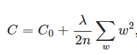
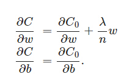
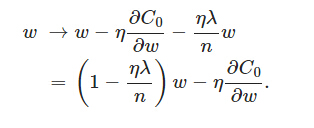
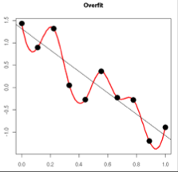
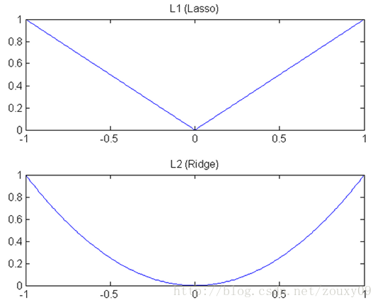
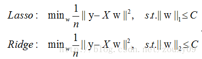
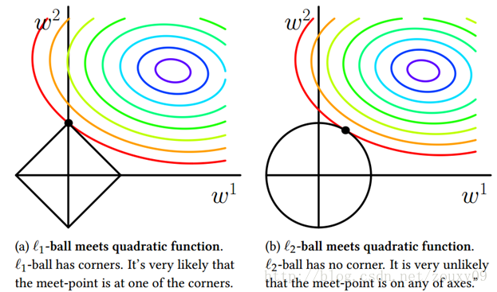
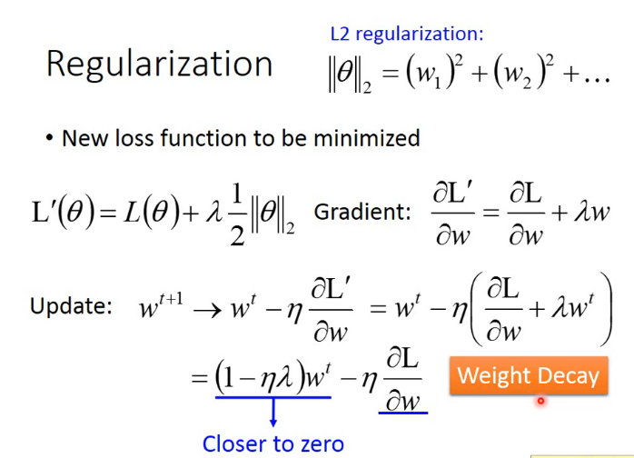
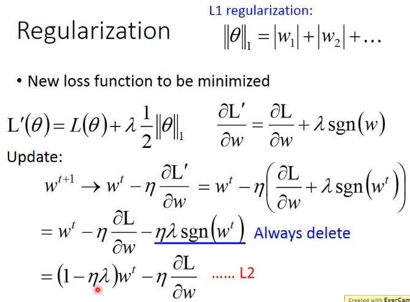

岭回归(Ridge Regression)
------------------------

### 6.1 L2正则化

  L2正则化就是在代价函数后面再加上一个正则化项：

C0代表原始的代价函数，后面那一项就是L2正则化项，它是这样来的：所有参数w的平方的和，除以训练集的样本大小n。λ就是正则项系数，权衡正则项与C0项的比重。另外还有一个系数1/2，1/2经常会看到，主要是为了后面求导的结果方便，后面那一项求导会产生一个2，与1/2相乘刚好凑整。

L2正则化项是怎么避免overfitting的呢？我们推导一下看看，先求导：

可以发现L2正则化项对b的更新没有影响，但是对于w的更新有影响:

在不使用L2正则化时，求导结果中w前系数为1，现在w前面系数为 1−ηλ/n
，因为η、λ、n都是正的，所以
1−ηλ/n小于1，它的效果是减小w，这也就是权重衰减（weight
decay）的由来。当然考虑到后面的导数项，w最终的值可能增大也可能减小。

到目前为止，我们只是解释了L2正则化项有让w“变小”的效果，但是还没解释为什么w“变小”可以防止overfitting？一种解释就是：更小的权值w，从某种意义上说，表示网络的复杂度更低，对数据的拟合刚刚好（这个法则也叫做奥卡姆剃刀），而在实际应用中，也验证了这一点，L2正则化的效果往往好于未经正则化的效果。另一种解释是过拟合的时候，拟合函数的系数往往非常大，为什么？如下图所示，过拟合，就是拟合函数需要顾忌每一个点，最终形成的拟合函数波动很大。在某些很小的区间里，函数值的变化很剧烈。这就意味着函数在某些小区间里的导数值（绝对值）非常大，由于自变量值可大可小，所以只有系数足够大，才能保证导数值很大。

L2范数是指向量各元素的平方和然后求平方根。我们让L2范数的规则项\\(||w||_2\\)最小，可以使得W的每个元素都很小，都接近于0，但与L1范数不同，它不会让它等于0，而是接近于0，这里是有很大的区别的哦。而越小的参数说明模型越简单，越简单的模型则越不容易产生过拟合现象。为什么越小的参数说明模型越简单？我的理解是：限制了参数很小，实际上就限制了多项式某些分量的影响很小，这样就相当于减少参数个数。

一句话总结：通过L2范数，我们可以实现了对模型空间的限制，从而在一定程度上避免了过拟合，提升模型的泛化能力。

### 6.2 线性回归的L2正则化

由于直接套用线性回归可能产生过拟合，我们需要加入正则化项，如果加入的是L2正则化项，就是Ridge回归，有时也翻译为脊回归。它和一般线性回归的区别是在损失函数上增加了一个L2正则化的项，和一个调节线性回归项和正则化项权重的系数\\(\\alpha\\)。损失函数表达式如下：

　　　　\\(J(\\mathbf\\theta) = \\frac{1}{2}(\\mathbf{X\\theta} - \\mathbf{Y})^T(\\mathbf{X\\theta} - \\mathbf{Y}) + \\frac{1}{2}\\alpha||\\theta||_2^2\\)

其中\\(\\alpha\\)为常数系数，需要进行调优。\\(||\\theta||_2\\)为L2范数。

Ridge回归的解法和一般线性回归大同小异。如果采用梯度下降法，则每一轮\\(\\theta\\)迭代的表达式是：

　　　　\\(\\mathbf\\theta= \\mathbf\\theta - (\\beta\\mathbf{X}^T(\\mathbf{X\\theta} - \\mathbf{Y}) + \\alpha\\theta)\\)

其中\\(\\beta\\)为步长。

如果用最小二乘法，则\\(\\theta\\)的结果是：

　　　　\\(\\mathbf{\\theta = (X^TX + \\alpha E)^{-1}X^TY}\\) 

其中E为单位矩阵。

Ridge回归在不抛弃任何一个变量的情况下，缩小了回归系数，使得模型相对而言比较的稳定。

### 6.3 L1和L2的区别

1）下降速度：

   
我们知道，L1和L2都是规则化的方式，我们将权值参数以L1或者L2的方式放到代价函数里面去。然后模型就会尝试去最小化这些权值参数。而这个最小化就像一个下坡的过程，L1和L2的差别就在于这个“坡”不同，如下图：L1就是按绝对值函数的“坡”下降的，而L2是按二次函数的“坡”下降。所以实际上在0附近，L1的下降速度比L2的下降速度要快。所以会非常快得降到0。

 2）模型空间的限制：

     实际上，对于L1和L2规则化的代价函数来说，我们可以写成以下形式：

    也就是说，我们将模型空间限制在w的一个L1-ball
中。为了便于可视化，我们考虑两维的情况，在(w1,
w2)平面上可以画出目标函数的等高线，而约束条件则成为平面上半径为C的一个 norm ball
。等高线与 norm ball 首次相交的地方就是最优解：

 可以看到，L1-ball 与L2-ball
的不同就在于L1在和每个坐标轴相交的地方都有“角”出现，而目标函数的测地线除非位置摆得非常好，大部分时候都会在角的地方相交。注意到在角的位置就会产生稀疏性，例如图中的相交点就有w1=0，而更高维的时候（想象一下三维的L1-ball
是什么样的？）除了角点以外，还有很多边的轮廓也是既有很大的概率成为第一次相交的地方，又会产生稀疏性。

相比之下，L2-ball
就没有这样的性质，因为没有角，所以第一次相交的地方出现在具有稀疏性的位置的概率就变得非常小了。这就从直观上来解释了为什么L1-regularization
能产生稀疏性，而L2-regularization 不行的原因了。

因此，L1会趋向于产生少量的特征，而其他的特征都是0，而L2会选择更多的特征，这些特征都会接近于0。Lasso常用于特征选择，而Ridge可以降低模型过拟合的程度。

 3）更直接的看二者的区别：

我们可以看到，L2正则化的损失函数在参数更新时，参数是按固定的比例减少的（一塔与拉姆达的乘积接近于0，图中标识有误），也就是说，假如w很大，则每次更新会减少较大的值；假如w较小，则每次减少较小的值。因此，L2正则化曲线较平滑。再看L1正则化：

从图中可以看出，参数是按固定的量减少的（即一塔与拉姆达之积），如果w是正的，则减少一个固定量；如果w是负的，则加上一个固定量。因此，如果w本来比较小的话，那么就很容易会被更新为0。
