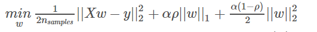
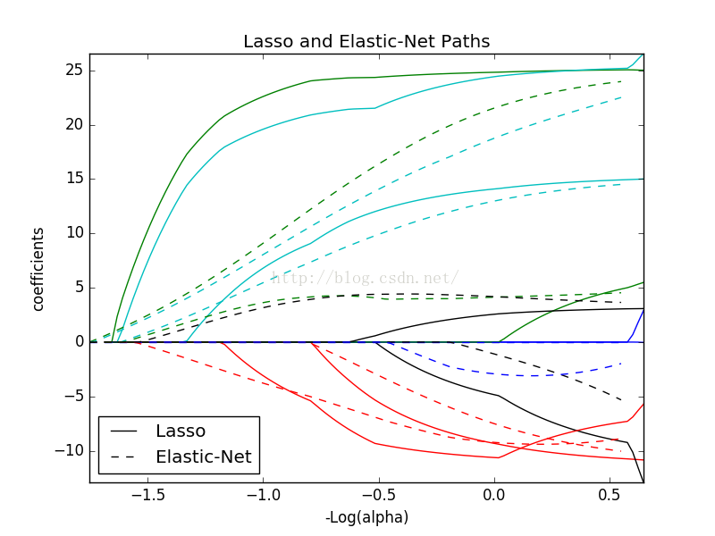
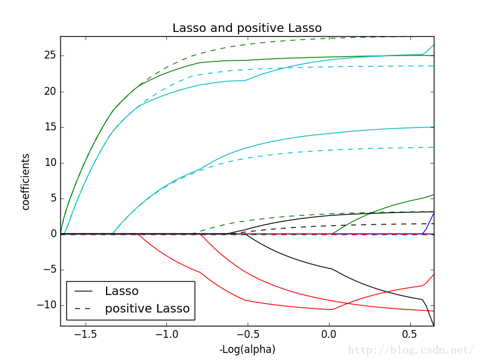

弹性网络（Elastic Net）
-----------------------

### 7.1 弹性网络

ElasticNet
是一种使用L1和L2先验作为正则化矩阵的线性回归模型.这种组合用于只有很少的权重非零的稀疏模型，比如Lasso,
但是又能保持Ridge 的正则化属性.我们可以使用 l1_ratio
参数来调节L1和L2的凸组合(一类特殊的线性组合)。

当多个特征和另一个特征相关的时候弹性网络非常有用。Lasso
倾向于随机选择其中一个，而弹性网络更倾向于选择两个。

在实践中，Lasso 和 Ridge 之间权衡的一个优势是它允许在循环过程（Under
rotate）中继承 Ridge 的稳定性。

弹性网络的目标函数是最小化:

ElasticNetCV 可以通过交叉验证来用来设置参数\\(\alpha(\alpha)\\)和\\(l1\_
ratio(\rho)\\)

