

极大似然估计(MLE)
------------

### 4.1 极大似然估计原理

极大似然估计的原理，用一张图片来说明，如下图所示：

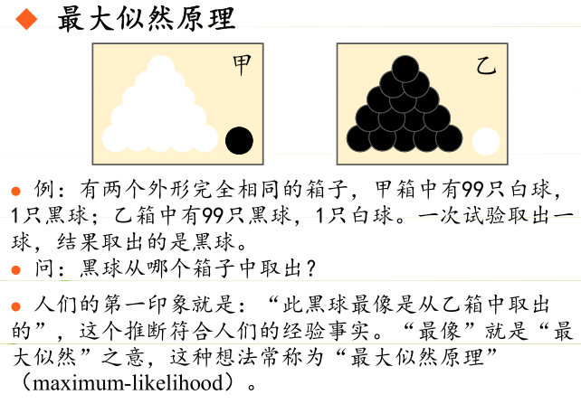

总结起来，最大似然估计的目的就是：利用已知的样本结果，反推最有可能（最大概率）导致这样结果的参数值。

原理：极大似然估计是建立在极大似然原理的基础上的一个统计方法，是概率论在统计学中的应用。极大似然估计提供了一种给定观察数据来评估模型参数的方法，即：“模型已定，参数未知”。通过若干次试验，观察其结果，利用试验结果得到某个参数值能够使样本出现的概率为最大，则称为极大似然估计。

由于样本集中的样本都是独立同分布，可以只考虑一类样本集D，来估计参数向量θ。记已知的样本集为：

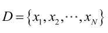

似然函数（linkehood function）：联合概率密度函数
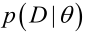称为相对于

的θ的似然函数。

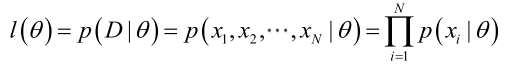

如果
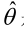
是参数空间中能使似然函数
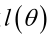
最大的θ值，则应该是“最可能”的参数值，那么

就是θ的极大似然估计量。它是样本集的函数，记作：

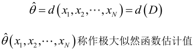

### 4.2 求解极大似然函数

ML估计：求使得出现该组样本的概率最大的θ值。

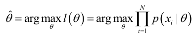

实际中为了便于分析，定义了对数似然函数：

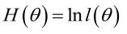

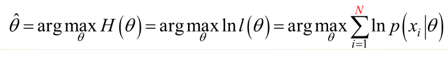

1. 未知参数只有一个（θ为标量）

在似然函数满足连续、可微的正则条件下，极大似然估计量是下面微分方程的解：

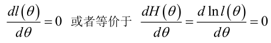

2.未知参数有多个（θ为向量）

则θ可表示为具有S个分量的未知向量：

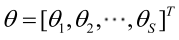

记梯度算子：

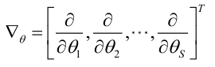

若似然函数满足连续可导的条件，则最大似然估计量就是如下方程的解。

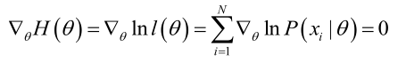

方程的解只是一个估计值，只有在样本数趋于无限多的时候，它才会接近于真实值。

### 4.3 总结

求最大似然估计量

的一般步骤：

（1）写出似然函数；       

（2）对似然函数取对数，并整理；       

（3）求导数；       

（4）解似然方程。       

最大似然估计的特点：       

1.比其他估计方法更加简单；       

2.收敛性：无偏或者渐近无偏，当样本数目增加时，收敛性质会更好；       

3.如果假设的类条件概率模型正确，则通常能获得较好的结果。但如果假设模型出现偏差，将导致非常差的估计结果。
