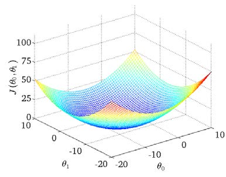
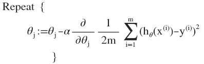

单变量线性回归(Linear Regression with One Variable)
---------------------------------------------------

### 1.1 模型表示

我们的第一个学习算法是线性回归算法。让我们通过一个例子来开始：这个例子是预测住房价格的，我们要使用一个数据集，数据集包含俄勒冈州波特兰市的住房价格。在这里，我要根据不同房屋尺寸所售出的价格，画出我的数据集。比方说，如果你朋友的房子是1250平方尺大小，你要告诉他们这房子能卖多少钱。那么，你可以做的一件事就是构建一个模型，也许是条直线，从这个数据模型上来看，也许你可以告诉你的朋友，他能以大约220000(美元)左右的价格卖掉这个房子。这就是监督学习算法的一个例子。

它被称作监督学习是因为对于每个数据来说，我们给出了“正确的答案”，即告诉我们：根据我们的数据来说，房子实际的价格是多少，而且，更具体来说，这是一个回归问题。回归一词指的是，我们根据之前的数据预测出一个准确的输出值，对于这个例子就是价格，同时，还有另一种最常见的监督学习方式，叫做分类问题，当我们想要预测离散的输出值，例如，我们正在寻找癌症肿瘤，并想要确定肿瘤是良性的还是恶性的，这就是0/1离散输出的问题。更进一步来说，在监督学习中我们有一个数据集，这个数据集被称训练集。

以之前的房屋交易问题为例，假使我们回归问题的训练集（**Training
Set**）如下表所示：

我们将要用来描述这个回归问题的标记如下:

\\(m\\) 代表训练集中实例的数量

\\(x\\) 代表特征/输入变量

\\(y\\) 代表目标变量/输出变量

\\(\left( x,y \right)\\) 代表训练集中的实例

\\((x^{(i)},y^{(i)})\\) 代表第\\(i\\) 个观察实例

\\(h\\) 代表学习算法的解决方案或函数也称为假设（**hypothesis**）

这就是一个监督学习算法的工作方式，我们可以看到这里有我们的训练集里房屋价格
我们把它喂给我们的学习算法，学习算法的工作了，然后输出一个函数，通常表示为小写
\\(h\\) 表示。\\(h\\)
代表**hypothesis**(**假设**)，\\(h\\)表示一个函数，输入是房屋尺寸大小，就像你朋友想出售的房屋，因此
\\(h\\) 根据输入的 \\(x\\)值来得出 \\(y\\) 值，\\(y\\) 值对应房子的价格 因此，\\(h\\)
是一个从\\(x\\) 到 \\(y\\) 的函数映射。

我将使用\\(h\\)代表**hypothesis**，因而，要解决房价预测问题，我们实际上是要将训练集“喂”给我们的学习算法，进而学习得到一个假设\\(h\\)，然后将我们要预测的房屋的尺寸作为输入变量输入给\\(h\\)，预测出该房屋的交易价格作为输出变量输出为结果。那么，对于我们的房价预测问题，我们该如何表达
\\(h\\)？

一种可能的表达方式为：\\(h\_{\theta}\left( x \right) = \theta\_{0} +
\theta\_{1}x\\)，因为只含有一个特征/输入变量，因此这样的问题叫作单变量线性回归问题。

### 1.2 代价函数

我们将定义代价函数的概念，这有助于我们弄清楚如何把最有可能的直线与我们的数据相拟合。如图：

在线性回归中我们有一个像这样的训练集，\\(m\\)代表了训练样本的数量，比如 \\(m =
47\\)。而我们的假设函数，也就是用来进行预测的函数，是这样的线性函数形式：\\(h\_{\theta}\left(
x \right) = \theta\_{0} + \theta\_{1}x\\)。

接下来我们会引入一些术语我们现在要做的便是为我们的模型选择合适的**参数**（**parameters**）\\(\theta\_{0}\\)
和 \\(\theta\_{1}\\)，在房价问题这个例子中便是直线的斜率和在\\(y\\) 轴上的截距。

我们选择的参数决定了我们得到的直线相对于我们的训练集的准确程度，模型所预测的值与训练集中实际值之间的差距（下图中蓝线所指）就是**建模误差**（**modeling
error**）。

我们的目标便是选择出可以使得建模误差的平方和能够最小的模型参数。 即使得代价函数
\\(J\left( \theta\_{0},\theta\_{1} \right) = \frac{1}{2m}\sum\_{i = 1}^{m}\left(
h\_{\theta}(x^{(i)}) - y^{(i)} \right)^{2}\\)最小。

我们绘制一个等高线图，三个坐标分别为\\(\theta\_{0}\\)和\\(\theta\_{1}\\)
和\\(J(\theta\_{0},\theta\_{1})\\)：

则可以看出在三维空间中存在一个使得\\(J(\theta\_{0},\theta\_{1})\\)最小的点。

代价函数也被称作平方误差函数，有时也被称为平方误差代价函数。我们之所以要求出误差的平方和，是因为误差平方代价函数，对于大多数问题，特别是回归问题，都是一个合理的选择。还有其他的代价函数也能很好地发挥作用，但是平方误差代价函数可能是解决回归问题最常用的手段了。

在后续课程中，我们还会谈论其他的代价函数，但我们刚刚讲的选择是对于大多数线性回归问题非常合理的。

### 1.3 梯度下降

梯度下降是一个用来求函数最小值的算法，我们将使用梯度下降算法来求出代价函数\\(J(\theta\_{0},\theta\_{1})\\)
的最小值。

梯度下降背后的思想是：开始时我们随机选择一个参数的组合\\(\left(
\theta\_{0},\theta\_{1},......,\theta\_{n}
\right)\\)，计算代价函数，然后我们寻找下一个能让代价函数值下降最多的参数组合。我们持续这么做直到到到一个局部最小值（**local
minimum**），因为我们并没有尝试完所有的参数组合，所以不能确定我们得到的局部最小值是否便是全局最小值（**global
minimum**），选择不同的初始参数组合，可能会找到不同的局部最小值。

想象一下你正站立在山的这一点上，站立在你想象的公园这座红色山上，在梯度下降算法中，我们要做的就是旋转360度，看看我们的周围，并问自己要在某个方向上，用小碎步尽快下山。这些小碎步需要朝什么方向？如果我们站在山坡上的这一点，你看一下周围，你会发现最佳的下山方向，你再看看周围，然后再一次想想，我应该从什么方向迈着小碎步下山？然后你按照自己的判断又迈出一步，重复上面的步骤，从这个新的点，你环顾四周，并决定从什么方向将会最快下山，然后又迈进了一小步，并依此类推，直到你接近局部最低点的位置。

批量梯度下降（**batch gradient descent**）算法的公式为：

其中\\(a\\)是学习率（**learning
rate**），它决定了我们沿着能让代价函数下降程度最大的方向向下迈出的步子有多大，在批量梯度下降中，我们每一次都同时让所有的参数减去学习速率乘以代价函数的导数。

在梯度下降算法中，还有一个更微妙的问题，梯度下降中，我们要更新\\(\theta\_{0}\\)和\\(\theta\_{1}\\)
，当 \\(j = 0\\) 和\\(j = 1\\)时，会产生更新，所以你将更新\\(J\left( \theta\_{0}
\right)\\)和\\(J\left( \theta\_{1}
\right)\\)。实现梯度下降算法的微妙之处是，在这个表达式中，如果你要更新这个等式，你需要同时更新\\(\theta\_{0}\\)和\\(\theta\_{1}\\)，

即\\(\ \theta\_{0}\\):= \\(\theta\_{0}\\) ，并更新\\(\theta\_{1}\\):= \\(\theta\_{1}\\)。

实现方法是：你应该计算公式右边的部分，通过那一部分计算出\\(\theta\_{0}\\)和\\(\theta\_{1}\\)的值，然后同时更新\\(\theta\_{0}\\)和\\(\theta\_{1}\\)。

进一步阐述这个过程：

### 1.4 梯度下降的线性回归

梯度下降是很常用的算法，它不仅被用在线性回归上和线性回归模型、平方误差代价函数。我们要将梯度下降和代价函数结合。我们将用到此算法，并将其应用于具体的拟合直线的线性回归算法里。

梯度下降算法和线性回归算法比较如图：

对我们之前的线性回归问题运用梯度下降法，关键在于求出代价函数的导数，即：

\\(
\frac{\partial}{\partial\theta\_{j}}J(\theta\_{0},\theta\_{1}) = \frac{\partial}{\partial\theta\_{j}}\frac{1}{2m}{\sum\_{i = 1}^{m}\left( h\_{\theta}(x^{(i)}) - y^{(i)} \right)}^{2}
\\)

\\(j = 0\\) 时：\\(\frac{\partial}{\partial\theta\_{0}}J(\theta\_{0},\theta\_{1}) =
\frac{1}{m}\sum\_{i = 1}^{m}\left( h\_{\theta}(x^{(i)}) - y^{(i)} \right)\\)

\\(j = 1\\) 时：\\(\ \frac{\partial}{\partial\theta\_{1}}J(\theta\_{0},\theta\_{1}) =
\frac{1}{m}\sum\_{i = 1}^{m}\left( \left( h\_{\theta}(x^{(i)}) - y^{(i)} \right)
\cdot x^{(i)} \right)\\)

则算法改写成：

**Repeat {**

\\(\theta\_{0}: = \theta\_{0} - a\frac{1}{m}\sum\_{i = 1}^{m}\left(
h\_{\theta}(x^{(i)}) - y^{(i)} \right)\\)

\\(\theta\_{1}: = \theta\_{1} - a\frac{1}{m}\sum\_{i = 1}^{m}\left( \left(
h\_{\theta}(x^{(i)}) - y^{(i)} \right) \cdot x^{(i)} \right)\\)

**}**

我们刚刚使用的算法，有时也称为批量梯度下降。指的是在梯度下降的每一步中，我们都用到了所有的训练样本，在梯度下降中，在计算微分求导项时，我们需要进行求和运算，所以，在每一个单独的梯度下降中，我们最终都要计算这样一个东西，这个项需要对所有\\(m\\)个训练样本求和。因此，批量梯度下降法这个名字说明了我们需要考虑所有这一"批"训练样本，而事实上，有时也有其他类型的梯度下降法，不是这种"批量"型的，不考虑整个的训练集，而是每次只关注训练集中的一些小的子集。在后面的课程中，我们也将介绍这些方法。

如果你之前学过线性代数，你应该知道有一种计算代价函数\\(J\\)最小值的数值解法，不需要梯度下降这种迭代算法。在后面的课程中，我们也会谈到这个方法，它可以在不需要多步梯度下降的情况下，也能解出代价函数\\(J\\)的最小值，这是另一种称为正规方程(**normal
equations**)的方法。实际上在数据量较大的情况下，梯度下降法比正规方程要更适用一些。

多变量线性回归(Linear Regression with Multiple Variable)
--------------------------------------------------------

### 2.1 多维特征

目前为止，我们探讨了单变量/特征的回归模型，现在我们对房价模型增加更多的特征，例如房间数楼层等，构成一个含有多个变量的模型，模型中的特征为\\(\left(
x\_{1},x\_{1},...,x\_{n} \right)\\)。

增添更多特征后，我们引入一系列新的注释：

\\(n\\) 代表特征的数量

\\(x^{\left( i \right)}\\)代表第 \\(i\\)
个训练实例，是特征矩阵中的第\\(i\\)行，是一个**向量**（**vector**）。

比方说，上图的

\\(x^{(2)} = \begin{bmatrix} 1416 \\ \ 3 \\ \ 2 \\ \ 40 \\ \end{bmatrix}\\)，

\\(x\_{j}^{\left( i \right)}\\)代表特征矩阵中第 \\(i\\) 行的第 \\(j\\) 个特征，也就是第
\\(i\\) 个训练实例的第 \\(j\\) 个特征。

如上图的\\(x\_{2}^{\left( 2 \right)} = 3,x\_{3}^{\left( 2 \right)} = 2\\)，

支持多变量的假设 \\(h\\) 表示为：\\(h\_{\theta}\left( x \right) = \theta\_{0} +
\theta\_{1}x\_{1} + \theta\_{2}x\_{2} + ... + \theta\_{n}x\_{n}\\)，

这个公式中有\\(n + 1\\)个参数和\\(n\\)个变量，为了使得公式能够简化一些，引入\\(x\_{0}
= 1\\)，则公式转化为：\\(h\_{\theta}\left( x \right) = \theta\_{0}x\_{0} +
\theta\_{1}x\_{1} + \theta\_{2}x\_{2} + ... + \theta\_{n}x\_{n}\\)

此时模型中的参数是一个\\(n + 1\\)维的向量，任何一个训练实例也都是\\(n +
1\\)维的向量，特征矩阵\\(X\\)的维度是 \\(m*(n + 1)\\)。
因此公式可以简化为：\\(h\_{\theta}\left( x \right) =
\theta^{T}X\\)，其中上标\\(T\\)代表矩阵转置。

### 2.2 多变量梯度下降

与单变量线性回归类似，在多变量线性回归中，我们也构建一个代价函数，则这个代价函数是所有建模误差的平方和，即：\\(J\left(
\theta\_{0},\theta\_{1}\text{...}\theta\_{n} \right) = \frac{1}{2m}\sum\_{i =
1}^{m}\left( h\_{\theta}\left( x^{\left( i \right)} \right) - y^{\left( i
\right)} \right)^{2}\\) ，

其中：\\(h\_{\theta}\left( x \right) = \theta^{T}X = \theta\_{0} + \theta\_{1}x\_{1}
+ \theta\_{2}x\_{2} + ... + \theta\_{n}x\_{n}\\) ，

我们的目标和单变量线性回归问题中一样，是要找出使得代价函数最小的一系列参数。
多变量线性回归的批量梯度下降算法为：

即：

求导数后得到：

当\\(n > = 1\\)时，

\\(\theta\_{0}: = \theta\_{0} - a\frac{1}{m}\sum\_{i = 1}^{m}{(h\_{\theta}(x^{(i)}) -
y^{(i)})}x\_{0}^{(i)}\\)

\\(
\theta\_{1}: = \theta\_{1} - a\frac{1}{m}\sum\_{i = 1}^{m}{(h\_{\theta}(x^{(i)}) - y^{(i)})}x\_{1}^{(i)}
\\)

\\(
\theta\_{2}: = \theta\_{2} - a\frac{1}{m}\sum\_{i = 1}^{m}{(h\_{\theta}(x^{(i)}) - y^{(i)})}x\_{2}^{(i)}
\\)

我们开始随机选择一系列的参数值，计算所有的预测结果后，再给所有的参数一个新的值，如此循环直到收敛。

代码示例：

计算代价函数 \\(J\left( \theta \right) = \frac{1}{2m}\sum\_{i = 1}^{m}\left(
h\_{\theta}\left( x^{(i)} \right) - y^{(i)} \right)^{2}\\)
其中：\\(h\_{\theta}\left( x \right) = \theta^{T}X = \theta\_{0}x\_{0} +
\theta\_{1}x\_{1} + \theta\_{2}x\_{2} + ... + \theta\_{n}x\_{n}\\)

**Python** 代码：

	def computeCost(X, y, theta):
	    inner = np.power(((X * theta.T) - y), 2)
	    return np.sum(inner) / (2 * len(X))

### 2.3 正规方程

到目前为止，我们都在使用梯度下降算法，但是对于某些线性回归问题，正规方程方法是更好的解决方案。如：

正规方程是通过求解下面的方程来找出使得代价函数最小的参数的：\\(\frac{\partial}{\partial\theta\_{j}}J\left(
\theta\_{j} \right) = 0\\) 。 假设我们的训练集特征矩阵为 \\(X\\)（包含了 \\(x\_{0} =
1\\)）并且我们的训练集结果为向量 \\(y\\)，则利用正规方程解出向量 \\(\theta = \left(
X^{T}X \right)^{- 1}X^{T}y\\) 。

上标**T**代表矩阵转置，上标-1 代表矩阵的逆。设矩阵\\(A = X^{T}X\\)，则：\\(\left(
X^{T}X \right)^{- 1} = A^{- 1}\\)

以下表示数据为例：

即：

运用正规方程方法求解参数：

注：对于那些不可逆的矩阵（通常是因为特征之间不独立，如同时包含英尺为单位的尺寸和米为单位的尺寸两个特征，也有可能是特征数量大于训练集的数量），正规方程方法是不能用的。

梯度下降与正规方程的比较：

总结一下，只要特征变量的数目并不大，标准方程是一个很好的计算参数\\(\theta\\)的替代方法。具体地说，只要特征变量数量小于一万，我通常使用标准方程法，而不使用梯度下降法。

随着我们要讲的学习算法越来越复杂，例如，当我们讲到分类算法，像逻辑回归算法，我们会看到，实际上对于那些算法，并不能使用标准方程法。对于那些更复杂的学习算法，我们将不得不仍然使用梯度下降法。因此，梯度下降法是一个非常有用的算法，可以用在有大量特征变量的线性回归问题。或者我们以后在课程中，会讲到的一些其他的算法，因为标准方程法不适合或者不能用在它们上。但对于这个特定的线性回归模型，标准方程法是一个比梯度下降法更快的替代算法。所以，根据具体的问题，以及你的特征变量的数量，这两种算法都是值得学习的。

正规方程的**python**实现：

	import numpy as np
	def normalEqn(X, y):
	   theta = np.linalg.inv(X.T@X)@X.T@y #X.T@X等价于X.T.dot(X)
	   return theta

### 2.4 正规方程及不可逆性

我们要讲的问题如下：\\(\theta = \left( X^{T}X \right)^{- 1}X^{T}y\\)

备注：本节最后我把推导过程写下。

那当计算 \\(\theta = \left( X^{T}X \right)^{- 1}X^{T}y\\)
，那对于矩阵\\(X'X\\)的结果是不可逆的情况咋办呢?

我们知道有些矩阵可逆，而有些矩阵不可逆。我们称那些不可逆矩阵为奇异或退化矩阵。

问题的重点在于\\(X'X\\)的不可逆的问题很少发生，在**Octave**里，如果你用它来实现\\(\theta\\)的计算，你将会得到一个正常的解。在**Octave**里，有两个函数可以求解矩阵的逆，一个被称为`pinv()`，另一个是`inv()`，这两者之间的差异是些许计算过程上的，一个是所谓的伪逆，另一个被称为逆。使用`pinv()`
函数可以展现数学上的过程，这将计算出\\(\theta\\)的值，即便矩阵\\(X'X\\)是不可逆的。

在`pinv()` 和 `inv()` 之间，又有哪些具体区别呢 ?

其中`inv()`
引入了先进的数值计算的概念。例如，在预测住房价格时，如果\\(x\_{1}\\)是以英尺为尺寸规格计算的房子，\\(x\_{2}\\)是以平方米为尺寸规格计算的房子，同时，你也知道1米等于3.28英尺
( 四舍五入到两位小数 )，这样，你的这两个特征值将始终满足约束：\\(x\_{1} =
x\_{2}*\left( 3.28 \right)^{2}\\)。

实际上，你可以用这样的一个线性方程，来展示那两个相关联的特征值，矩阵\\(X'X\\)将是不可逆的。

第二个原因是，在你想用大量的特征值，尝试实践你的学习算法的时候，可能会导致矩阵\\(X'X\\)的结果是不可逆的。
具体地说，在\\(m\\)小于或等于n的时候，例如，有\\(m\\)等于10个的训练样本也有\\(n\\)等于100的特征数量。要找到适合的\\((n
+ 1)\\)
维参数矢量\\(\theta\\)，这将会变成一个101维的矢量，尝试从10个训练样本中找到满足101个参数的值，这工作可能会让你花上一阵子时间，但这并不总是一个好主意。因为，正如我们所看到你只有10个样本，以适应这100或101个参数，数据还是有些少。

稍后我们将看到，如何使用小数据样本以得到这100或101个参数，通常，我们会使用一种叫做正则化的线性代数方法，通过删除某些特征或者是使用某些技术，来解决当\\(m\\)比\\(n\\)小的时候的问题。即使你有一个相对较小的训练集，也可使用很多的特征来找到很多合适的参数。
总之当你发现的矩阵\\(X'X\\)的结果是奇异矩阵，或者找到的其它矩阵是不可逆的，我会建议你这么做。

首先，看特征值里是否有一些多余的特征，像这些\\(x\_{1}\\)和\\(x\_{2}\\)是线性相关的，互为线性函数。同时，当有一些多余的特征时，可以删除这两个重复特征里的其中一个，无须两个特征同时保留，将解决不可逆性的问题。因此，首先应该通过观察所有特征检查是否有多余的特征，如果有多余的就删除掉，直到他们不再是多余的为止，如果特征数量实在太多，我会删除些
用较少的特征来反映尽可能多内容，否则我会考虑使用正规化方法。
如果矩阵\\(X'X\\)是不可逆的，（通常来说，不会出现这种情况），如果在**Octave**里，可以用伪逆函数`pinv()`
来实现。这种使用不同的线性代数库的方法被称为伪逆。即使\\(X'X\\)的结果是不可逆的，但算法执行的流程是正确的。总之，出现不可逆矩阵的情况极少发生，所以在大多数实现线性回归中，出现不可逆的问题不应该过多的关注\\(X^{T}X\\)是不可逆的。

**增加内容：**

\\(\theta = \left( X^{T}X \right)^{- 1}X^{T}y\\) 的推导过程：

\\(J\left( \theta \right) = \frac{1}{2m}\sum\_{i = 1}^{m}\left( h\_{\theta}\left(
x^{(i)} \right) - y^{(i)} \right)^{2}\\) 其中：\\(h\_{\theta}\left( x \right) =
\theta^{T}X = \theta\_{0}x\_{0} + \theta\_{1}x\_{1} + \theta\_{2}x\_{2} + ... +
\theta\_{n}x\_{n}\\)

将向量表达形式转为矩阵表达形式，则有\\(J(\theta) = \frac{1}{2}\left( X\theta - y
\right)^{2}\\)
，其中\\(X\\)为\\(m\\)行\\(n\\)列的矩阵（\\(m\\)为样本个数，\\(n\\)为特征个数），\\(\theta\\)为\\(n\\)行1列的矩阵，\\(y\\)为\\(m\\)行1列的矩阵，对\\(J(\theta)\\)进行如下变换:

\\(
J(\theta) = \frac{1}{2}\left( X\theta - y \right)^{T}\left( X\theta - y \right)
\\)

\\(
= \frac{1}{2}\left( \theta^{T}X^{T} - y^{T} \right)\left( X\theta - y \right)
\\)

\\(
= \frac{1}{2}\left( \theta^{T}X^{T}X\theta - \theta^{T}X^{T}y - y^{T}X\theta - y^{T}y \right)
\\)

接下来对\\(J(\theta)\\)偏导，需要用到以下几个矩阵的求导法则:

\\(\frac{\text{dAB}}{\text{dB}} = A^{T}\\)

\\(\frac{dX^{T}\text{AX}}{\text{dX}} = 2AX\\)  
所以有:

\\(
\frac{\partial J\left( \theta \right)}{\partial\theta} = \frac{1}{2}\left( 2X^{T}X\theta - X^{T}y - (y^{T}X)^{T} - 0 \right)
\\)

\\(
= \frac{1}{2}\left( 2X^{T}X\theta - X^{T}y - X^{T}y - 0 \right)
\\)

\\(
= X^{T}X\theta - X^{T}y
\\)

令\\(\frac{\partial J\left( \theta \right)}{\partial\theta} = 0\\),

则有\\(\theta = \left( X^{T}X \right)^{- 1}X^{T}y\\)
