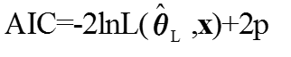
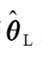
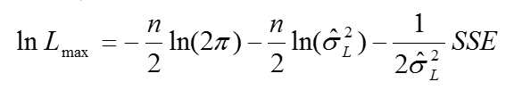
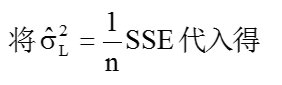
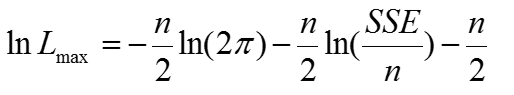
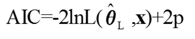

<head>
  
  

</head>

逐步回归与赤池信息准则(AIC)
---------------------------

### 8.1 逐步回归

在一个多元线性回归模型中，并不是所有的自变量都与因变量有显著关系，有时有些自变量的作用可以忽略。这就产生了怎样从大量可能有关的自变量中挑选出对因变量有显著影响的部分自变量的问题。

在可能自变量的整个集合有40到60个，甚至更多的自变量的情况下，使用“最优”子集算法可能并不行得通。那么，逐步产生回归模型要含有的_X_变量子集的自动搜索方法，可能是有效的。逐步回归方法可能是应用最广泛的自动搜索方法。这是在求适度“好”的自变量子集时，同所有可能回归的方法比较，为节省计算工作量而产生的。从本质上说，这种方法在每一步增加或剔除一个_X_变量时，产生一系列回归模型。增加或剔除一个_X_变量的准则，可以等价地用误差平方和缩减量、偏相关系数或_F_统计量来表示。

无疑选择自变量要靠有关专业知识，但是作为起参谋作用的数学工具，往往是不容轻视的。通常在多元线性模型中，我们首先从专业角度选择有关的为数众多的因子，然后用数学方法从中选择适当的子集。本节介绍的逐步回归法就是人们在实际问题中常用的，并且行之有效的方法。

逐步回归的基本思想是，将变量一个一个引入，引入变量的条件是偏回归平方和经检验是显著的，同时每引入一个新变量后，对已选入的变量要进行逐个检验，将不显著变量剔除，这样保证最后所得的变量子集中的所有变量都是显著的。这样经若干步以后便得“最优”变量子集。

逐步回归是这样一种方法，使用它时每一步只有一个单独的回归因子引进或从当前的回归模型中剔除。Efroymoson (1966)编的程序中，有两个_F_水平，记作_Fin_和_Fout_，在每一步时，只有一个回归因子，比如说_Xi_，如果剔除它可能引起_RSS_的减少不超过残差均方_MSE_（即_ESS/(N-k-_1_)_）的_Fout_倍，则将它剔除；这就是在当前的回归模型中，用来检验_i_=0的_F_比 是小于或等于_Fout_。

若剔除的变量需要选择，则就选择使_RSS_减少最少的那一个（或等价的选择_F_比最小的）。用这种方式如果没有变量被剔除，则开始引进一个回归因子，比如_Xj_，如果引进它后使_RSS_的增加，至少是残差均方的_Fin_倍，则将它引进。即若在当前模型加_Xj_项后，为了检验 _j =0_的_F_比，_F_ _≥Fin_时，则引进_Xj_，其次，若引进的变量需要选择，则选择_F_比最大的。程序按照上面的步骤开始拟合，当没有回归因子能够引进模型时，该过程停止。

### 8.2 变量选择的方法

若在回归方程中增加自变量_Xi_，称为“引入”变量_Xi_，将已在回归方程中的自变量_Xj_从回归方程中删除，则称为“剔除”变量_Xj_。无论引入变量或剔除变量，都要利用_F_检验，将显著的变量引入回归方程，而将不显著的从回归方程中剔除。记引入变量_F_检验的临界值为_Fin_（进），剔除变量_F_检验的临界值为_Fout_（出），一般取_Fin_≥_Fout_，它的确定原则一般是对_k_个自变量的_m_个(_m_ ≤_k_)，对显著性水平_df_1=1，_df_2= 的_F_分布表的值，记为_F*_，则取_Fin_=_Fout_= _F*_。一般来说，也可以直接取_Fin_=_Fout_=2.0或2.5。当然，为了回归方程中还能够多进入一些自变量，甚至也可以取为1.0或1.5。

#### （1）变量增加法

首先对全部_k_个自变量，分别对因变量_Y_建立一元回归方程，并分别计算这_k_个一元回归方程的_k_个回归系数_F_检验值，记为{ }，选其最大的记为  = max{ },若有 ≥ _Fin_，则首先将_X_i引入回归方程，不失一般性，设_Xi_就是_X_1。

接着考虑_X_1分别与_X_2,_X_3,...,_Xk_与因变量_Y_组成二元回归方程，对于这_k__－_1个回归方程中_X_2,...,_X_k的回归系数进行_F_检验，计算_F_值，并选其最大的_F_值 ,若 ≥_Fin_,则接着就将_Xj_引入回归方程，不失一般性，设_Xj_就是_X_2。

对已经引入回归方程的变量_X_1和_X_2，如同前面的方法做下去，直至所有未被引入方程的变量的_F_值均小于_Fin_时为止。这时的回归方程就是最终选定的回归方程。

显然，这种增加法有一定的缺点，主要是，它不能反映后来变化的情况。因为对于某个自变量，它可能开始是显著的，即将其引入到回归方程，但是，随着以后其他自变量的引入，它也可能又变为不显著了，但是，并没有将其及时从回归方程中剔除掉。也就是增加变量法，只考虑引入而不考虑剔除。

#### （2）变量减少法

与变量增加法相反，变量减少法是首先建立全部自变量_X_1,_X_2,...,_Xk_对因变量_Y_的回归方程，然后对_k_个回归系数进行_F_检验，记求得的_F_值为{ }，选其最小的记为 =min{ },若有 ≤_Fout_，则可以考虑将自变量_Xi_从回归方程中剔除掉，不妨设_Xi_就取为_X_1。

再对_X_2,_X_3,...,_Xk_对因变量_Y_建立的回归方程重复上述过程，取最小的_F_值为 ，若有 小于等于_Fout_，则将_Xj_也从回归方程中剔除掉。不妨设_Xj_就是_X_2。重复前面的做法，直至在回归方程中的自变量_F_检验值均大于_Fout_，即没有变量可剔除为止。这时的回归方程就是最终的回归方程。

这种减少法也有一个明显的缺点，就是一开始把全部变量都引入回归方程，这样计算量比较大。若对一些不重要的变量，一开始就不引入，这样就可以减少一些计算。

#### （3）变量增减法

前面的两种方法各有其特点，若自变量_X_1,_X_2,...,_Xk_ 完全是独立的，则可结合这两种方法，但是，在实际的数据中，自变量_X_1,_X_2,...,_Xk_之间往往并不是独立的，而是有一定的相关性存在的，这就会使得随着回归方程中变量的增加和减少，某些自变量对回归方程的贡献也会发生变化。因此一种很自然的想法是将前两种方法综合起来，也就是对每一个自变量，随着其对回归方程贡献的变化，它随时可能被引入回归方程或被剔除出去，最终的回归模型是在回归方程中的自变量均为显著，不在回归方程中的自变量均不显著。

### 8.3 赤池信息准则(AIC)

AIC准则是日本统计学家赤池弘次(Akaike)1974年根据极大似然估计原理提出的一种较为一般的模型选择准则，人们称它为Akaike信息量准则
(Akaike Information
Criterion,简记为AIC)。AIC准则既可用来作回归方程自变量的选择，又可用于时间序列分析中自回归模型的定阶上。由于该方法的广泛应用，使得赤池乃至日本统计学家在世界的声誉大增。

设回归模型的似然函数为L(θ,x),
θ的维数为p，x为样本，在回归分析中样本为y=（y1，y2，…yn）′，则AIC定义为：

其中是**θ**的极大似然估计，p是未知参数的个数。

假定回归模型的随机误差项ε遵从正态分布，即ε～N(0,σ2)

对数似然函数为

带入公式
中

这里似然函数中的未知参数个数为p+2，略去与p无关的常数，得回归模型的AIC公式为

对每一个回归子集计算AIC，其中AIC最小者所对应的模型是“最优”回归模型。

一般而言，当模型复杂度提高（p增大）时，似然函数L也会增大，从而使AIC变小，但是p过大时，似然函数增速减缓，导致AIC增大，模型过于复杂容易造成过拟合现象。目标是选取AIC最小的模型，AIC不仅要提高模型拟合度（极大似然），而且引入了惩罚项，使模型参数尽可能少，有助于降低过拟合的可能性。可见AIC准则有效且合理地控制了参数的维数p。显然AIC准则追求似然函数尽可能大的同时，p要尽可能的小。

