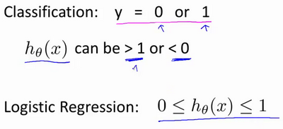
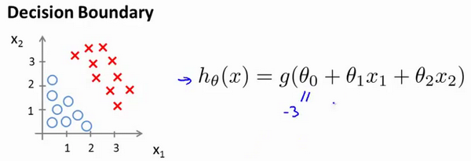

逻辑回归(Logistic Regression)
-----------------------------

### 3.1 分类问题

在分类问题中，你要预测的变量 \\(y\\) 是离散的值，我们将学习一种叫做逻辑回归
(**Logistic Regression**) 的算法，这是目前最流行使用最广泛的一种学习算法。

在分类问题中，我们尝试预测的是结果是否属于某一个类（例如正确或错误）。分类问题的例子有：判断一封电子邮件是否是垃圾邮件；判断一次金融交易是否是欺诈；之前我们也谈到了肿瘤分类问题的例子，区别一个肿瘤是恶性的还是良性的。

我们从二元的分类问题开始讨论。

我们将因变量(**dependent variable**)可能属于的两个类分别称为负向类（**negative
class**）和正向类（**positive class**），则因变量 ，其中 0 表示负向类，1
表示正向类。

如果我们要用线性回归算法来解决一个分类问题，对于分类， \\(y\\) 取值为 0
或者1，但如果你使用的是线性回归，那么假设函数的输出值可能远大于
1，或者远小于0，即使所有训练样本的标签 \\(y\\) 都等于 0 或
1。尽管我们知道标签应该取值0
或者1，但是如果算法得到的值远大于1或者远小于0的话，就会感觉很奇怪。所以我们在接下来的要研究的算法就叫做逻辑回归算法，这个算法的性质是：它的输出值永远在0到
1 之间。

顺便说一下，逻辑回归算法是分类算法，我们将它作为分类算法使用。有时候可能因为这个算法的名字中出现了“回归”使你感到困惑，但逻辑回归算法实际上是一种分类算法，它适用于标签
\\(y\\) 取值离散的情况，如：1 0 0 1。

### 3.2 假说表示

在分类问题中，要用什么样的函数来表示我们的假设。此前我们说过，希望我们的分类器的输出值在0和1之间，因此，我们希望想出一个满足某个性质的假设函数，这个性质是它的预测值要在0和1之间。

回顾在一开始提到的乳腺癌分类问题，我们可以用线性回归的方法求出适合数据的一条直线：

根据线性回归模型我们只能预测连续的值，然而对于分类问题，我们需要输出0或1，我们可以预测：

当\\(h\_{\theta}\left( x \right) > = 0.5\\)时，预测 \\(y = 1\\)。

当\\(h\_{\theta}\left( x \right) < 0.5\\)时，预测 \\(y = 0\\) 。

对于上图所示的数据，这样的一个线性模型似乎能很好地完成分类任务。假使我们又观测到一个非常大尺寸的恶性肿瘤，将其作为实例加入到我们的训练集中来，这将使得我们获得一条新的直线。

这时，再使用0.5作为阀值来预测肿瘤是良性还是恶性便不合适了。可以看出，线性回归模型，因为其预测的值可以超越[0,1]的范围，并不适合解决这样的问题。

我们引入一个新的模型，逻辑回归，该模型的输出变量范围始终在0和1之间。
逻辑回归模型的假设是： \\(h\_{\theta}\left( x \right) = g\left( \theta^{T}X
\right)\\) 其中： \\(X\\) 代表特征向量 \\(g\\) 代表逻辑函数（**logistic
function**)是一个常用的逻辑函数为**S**形函数（**Sigmoid function**），公式为：
\\(g\left( z \right) = \frac{1}{1 + e^{- z}}\\)。

**python**代码实现：

	import numpy as np
	
	def sigmoid(z):
	    
	    return 1 / (1 + np.exp(-z))

该函数的图像为：

合起来，我们得到逻辑回归模型的假设：

对模型的理解： \\(g\left( z \right) = \frac{1}{1 + e^{- z}}\\)。

\\(h\_{\theta}\left( x
\right)\\)的作用是，对于给定的输入变量，根据选择的参数计算输出变量=1的可能性（**estimated
probablity**）即\\(h\_{\theta}\left( x \right) = P\left( y = 1|x;\theta \right)\\)

例如，如果对于给定的\\(x\\)，通过已经确定的参数计算得出\\(h\_{\theta}\left( x
\right) =
0.7\\)，则表示有70%的几率\\(y\\)为正向类，相应地\\(y\\)为负向类的几率为1-0.7=0.3。

### 3.3 判定边界

现在讲下决策边界(**decision
boundary**)的概念。这个概念能更好地帮助我们理解逻辑回归的假设函数在计算什么。

在逻辑回归中，我们预测：

当\\(h\_{\theta}\left( x \right) > = 0.5\\)时，预测 \\(y = 1\\)。

当\\(h\_{\theta}\left( x \right) < 0.5\\)时，预测 \\(y = 0\\) 。

根据上面绘制出的 **S** 形函数图像，我们知道当

\\(z = 0\\) 时 \\(g(z) = 0.5\\)

\\(z > 0\\) 时 \\(g(z) > 0.5\\)

\\(z < 0\\) 时 \\(g(z) < 0.5\\)

又 \\(z = \theta^{T}x\\) ，即：

\\(\theta^{T}x > = 0\\) 时，预测 \\(y = 1\\)

\\(\theta^{T}x < 0\\) 时，预测 \\(y = 0\\)

现在假设我们有一个模型：

并且参数\\(\theta\\) 是向量[-3 1 1]。 则当\\(- 3 + x\_{1} + x\_{2} \geq
0\\)，即\\(x\_{1} + x\_{2} \geq 3\\)时，模型将预测 \\(y = 1\\)。
我们可以绘制直线\\(x\_{1} + x\_{2} =
3\\)，这条线便是我们模型的分界线，将预测为1的区域和预测为 0的区域分隔开。

假使我们的数据呈现这样的分布情况，怎样的模型才能适合呢？

因为需要用曲线才能分隔 \\(y = 0\\) 的区域和 \\(y = 1\\)
的区域，我们需要二次方特征：\\(h\_{\theta}\left( x \right) = g\left( \theta\_{0} +
\theta\_{1}x\_{1} + \theta\_{2}x\_{2} + \theta\_{3}x\_{1}^{2} + \theta\_{4}x\_{2}^{2}
\right)\\)是[-1 0 0 1 1]，则我们得到的判定边界恰好是圆点在原点且半径为1的圆形。

我们可以用非常复杂的模型来适应非常复杂形状的判定边界。

### 3.4 代价函数

本节主要介绍如何拟合逻辑回归模型的参数\\(\theta\\)。具体来说，我要定义用来拟合参数的优化目标或者叫代价函数，这便是监督学习问题中的逻辑回归模型的拟合问题。

对于线性回归模型，我们定义的代价函数是所有模型误差的平方和。理论上来说，我们也可以对逻辑回归模型沿用这个定义，但是问题在于，当我们将\\(h\_{\theta}\left(
x \right) = \frac{1}{1 + e^{-
\theta^{T}}X}\\)带入到这样定义了的代价函数中时，我们得到的代价函数将是一个非凸函数（**non-convexfunction**）。

这意味着我们的代价函数有许多局部最小值，这将影响梯度下降算法寻找全局最小值。

线性回归的代价函数为：\\(J\left( \theta \right) = \frac{1}{m}\sum\_{i =
1}^{m}{\frac{1}{2}\left( h\_{\theta}\left( x^{\left( i \right)} \right) -
y^{\left( i \right)} \right)^{2}}\\) 。

我们重新定义逻辑回归的代价函数为：\\(J\left( \theta \right) = \frac{1}{m}\sum\_{i
= 1}^{m}{\text{Cost}\left( h\_{\theta}\left( x^{\left( i \right)}
\right),y^{\left( i \right)} \right)}\\)，其中

\\(h\_{\theta}\left( x \right)\\)与 \\(\text{Cost}\left( h\_{\theta}\left( x
\right),y \right)\\)之间的关系如下图所示：

这样构建的\\(\text{Cost}\left( h\_{\theta}\left( x \right),y
\right)\\)函数的特点是：当实际的 \\(y = 1\\) 且\\(h\_{\theta}\left( x \right)\\)也为 1
时误差为 0，当 \\(y = 1\\) 但\\(h\_{\theta}\left( x
\right)\\)不为1时误差随着\\(h\_{\theta}\left( x \right)\\)变小而变大；当实际的 \\(y =
0\\) 且\\(h\_{\theta}\left( x \right)\\)也为 0 时代价为 0，当\\(y = 0\\)
但\\(h\_{\theta}\left( x \right)\\)不为 0时误差随着 \\(h\_{\theta}\left( x
\right)\\)的变大而变大。

将构建的 \\(\text{Cost}\left( h\_{\theta}\left( x \right),y \right)\\)简化如下：

\\(\text{Cost}\left( h\_{\theta}\left( x \right),y \right) = - y \times log\left(
h\_{\theta}\left( x \right) \right) - (1 - y) \times log\left( 1 -
h\_{\theta}\left( x \right) \right)\\)

带入代价函数得到：

\\(J\left( \theta \right) = \frac{1}{m}\sum\_{i = 1}^{m}{\lbrack -
y^{(i)}\log\left( h\_{\theta}\left( x^{(i)} \right) \right) - \left( 1 - y^{(i)}
\right)\log\left( 1 - h\_{\theta}\left( x^{(i)} \right) \right)\rbrack}\\)

即：\\(J\left( \theta \right) = - \frac{1}{m}\sum\_{i = 1}^{m}{\lbrack
y^{(i)}\log\left( h\_{\theta}\left( x^{(i)} \right) \right) + \left( 1 - y^{(i)}
\right)\log\left( 1 - h\_{\theta}\left( x^{(i)} \right) \right)\rbrack}\\)

**Python**代码实现：

	import numpy as np

	def cost(theta, X, y):
	
	  theta = np.matrix(theta)  
	  X = np.matrix(X)
	  y = np.matrix(y)
	  first = np.multiply(-y, np.log(sigmoid(X* theta.T)))
	  second = np.multiply((1 - y), np.log(1 - sigmoid(X* theta.T)))
	  return np.sum(first - second) / (len(X))

在得到这样一个代价函数以后，我们便可以用梯度下降算法来求得能使代价函数最小的参数了。算法为：

**Repeat** { \\(\theta\_{j}: = \theta\_{j} -
\alpha\frac{\partial}{\partial\theta\_{j}}J(\theta)\\)

**(simultaneously update all** \\(\mathbf{\ }\theta\_{j}\\) )

}

求导后得到：

**Repeat** { \\(\theta\_{j}: = \theta\_{j} - \alpha\frac{1}{m}\sum\_{i =
1}^{m}\left( h\_{\theta}\left( x\_{}^{\left( i \right)}{} \right) - y\_{}^{\left( i
\right)}{} \right)x\_{j}^{(i)}{}\\)

**(simultaneously update all**\\(\mathbf{\ }\theta\_{j}\\) )

}

我们定义了单训练样本的代价函数，代价函数\\(J(\theta)\\)是一个凸函数，并且没有局部最优值。

推导过程：

\\(J\left( \theta \right) = - \frac{1}{m}\sum\_{i = 1}^{m}{\lbrack
y^{(i)}\log\left( h\_{\theta}\left( x^{(i)} \right) \right) + \left( 1 - y^{(i)}
\right)\log\left( 1 - h\_{\theta}\left( x^{(i)} \right) \right)\rbrack}\\)

考虑： \\(h\_{\theta}\left( x^{(i)} \right) = \frac{1}{1 + e^{-
\theta^{T}x^{(i)}}}\\)

则： \\(y^{(i)}\log\left( h\_{\theta}\left( x^{(i)} \right) \right) + \left( 1 -
y^{(i)} \right)\log\left( 1 - h\_{\theta}\left( x^{(i)} \right) \right)\\)

\\(= y^{(i)}\log\left( \frac{1}{1 + e^{- \theta^{T}x^{(i)}}} \right) + \left( 1 -
y^{(i)} \right)\log\left( 1 - \frac{1}{1 + e^{- \theta^{T}x^{(i)}}} \right)\\)

\\(
= - y^{(i)}\log\left( 1 + e^{- \theta^{T}x^{(i)}} \right) - \left( 1 - y^{(i)} \right)\log\left( 1 + e^{\theta^{T}x^{(i)}} \right)
\\)

所以： \\(\frac{\partial}{\partial\theta\_{j}}J\left( \theta \right) =
\frac{\partial}{\partial\theta\_{j}}\lbrack - \frac{1}{m}\sum\_{i = 1}^{m}{\lbrack
- y^{(i)}\log\left( 1 + e^{- \theta^{T}x^{(i)}} \right) - \left( 1 - y^{(i)}
\right)\log\left( 1 + e^{\theta^{T}x^{(i)}} \right)\rbrack}\rbrack\\)

\\(
= - \frac{1}{m}\sum\_{i = 1}^{m}{\lbrack - y^{(i)}\frac{- x\_{j}^{(i)}e^{- \theta^{T}x^{(i)}}}{1 + e^{- \theta^{T}x^{(i)}}} - \left( 1 - y^{(i)} \right)\frac{x\_{j}^{(i)}e^{\theta^{T}x^{(i)}}}{1 + e^{\theta^{T}x^{(i)}}}}\rbrack
\\)

\\(
= - \frac{1}{m}\sum\_{i = 1}^{m}y^{(i)}\frac{x\_{j}^{(i)}}{1 + e^{\theta^{T}x^{(i)}}} - \left( 1 - y^{(i)} \right)\frac{x\_{j}^{(i)}e^{\theta^{T}x^{(i)}}}{1 + e^{\theta^{T}x^{(i)}}}\rbrack
\\)

\\(
= - \frac{1}{m}\sum\_{i = 1}^{m}\frac{y^{(i)}x\_{j}^{(i)} - x\_{j}^{(i)}e^{\theta^{T}x^{(i)}} + y^{(i)}x\_{j}^{(i)}e^{\theta^{T}x^{(i)}}}{1 + e^{\theta^{T}x^{(i)}}}
\\)

\\(
= - \frac{1}{m}\sum\_{i = 1}^{m}{\frac{y^{(i)}\left( 1 + e^{\theta^{T}x^{(i)}} \right) - e^{\theta^{T}x^{(i)}}}{1 + e^{\theta^{T}x^{(i)}}}x\_{j}^{(i)}}
\\)

\\(
= - \frac{1}{m}\sum\_{i = 1}^{m}{(y^{(i)} - \frac{e^{\theta^{T}x^{(i)}}}{1 + e^{\theta^{T}x^{(i)}}})x\_{j}^{(i)}}
\\)

\\(
= - \frac{1}{m}\sum\_{i = 1}^{m}{(y^{(i)} - \frac{1}{1 + e^{- \theta^{T}x^{(i)}}})x\_{j}^{(i)}}
\\)

\\(
= - \frac{1}{m}\sum\_{i = 1}^{m}{\lbrack y^{(i)} - h\_{\theta}\left( x^{(i)} \right)\rbrack x\_{j}^{(i)}}
\\)

\\(
= \frac{1}{m}\sum\_{i = 1}^{m}{\lbrack h\_{\theta}\left( x^{(i)} \right) - y^{(i)}\rbrack x\_{j}^{(i)}}
\\)

注：虽然得到的梯度下降算法表面上看上去与线性回归的梯度下降算法一样，但是这里的\\(h\_{\theta}\left(
x \right) = g\left( \theta^{T}X
\right)\\)与线性回归中不同，所以实际上是不一样的。另外，在运行梯度下降算法之前，进行特征缩放依旧是非常必要的。

### 3.5 简化的成本函数和梯度下降

本节中我们将会找出一种稍微简单一点的方法来写代价函数，来替换我们现在用的方法。同时我们还要弄清楚如何运用梯度下降法，来拟合出逻辑回归的参数。

这就是逻辑回归的代价函数：

这个式子可以合并成：

\\(\text{Cost}\left( h\_{\theta}\left( x \right),y \right) = - y \times log\left(
h\_{\theta}\left( x \right) \right) - (1 - y) \times log\left( 1 -
h\_{\theta}\left( x \right) \right)\\)

即，逻辑回归的代价函数：

\\(\text{Cost}\left( h\_{\theta}\left( x \right),y \right) = - y \times log\left(
h\_{\theta}\left( x \right) \right) - (1 - y) \times log\left( 1 -
h\_{\theta}\left( x \right) \right)\\)

\\(= - \frac{1}{m}\sum\_{i = 1}^{m}{\lbrack y^{(i)}\log\left( h\_{\theta}\left(
x^{(i)} \right) \right) + \left( 1 - y^{(i)} \right)\log\left( 1 -
h\_{\theta}\left( x^{(i)} \right) \right)\rbrack}\\)

根据这个代价函数，为了拟合出参数，该怎么做呢？我们要试图找尽量让\\(J\left( \theta
\right)\\) 取得最小值的参数\\(\theta\\)。

\\(\min\_{\theta}J\left( \theta \right)\\)所以我们想要尽量减小这一项，这将我们将得到某个参数\\(\theta\\)。

如果我们给出一个新的样本，假如某个特征
\\(x\\)，我们可以用拟合训练样本的参数\\(\theta\\)，来输出对假设的预测。

另外，我们假设的输出，实际上就是这个概率值：\\(p(y = 1|x;\theta)\\)，就是关于
\\(x\\)以\\(\theta\\)为参数，\\(y = 1\\) 的概率，你可以认为我们的假设就是估计 \\(y =
1\\) 的概率，所以，接下来就是弄清楚如何最大限度地最小化代价函数\\(J\left( \theta
\right)\\)，作为一个关于\\(\theta\\)的函数，这样我们才能为训练集拟合出参数\\(\theta\\)。

最小化代价函数的方法，是使用**梯度下降法**(**gradient
descent**)。这是我们的代价函数： \\(J\left( \theta \right) = - \frac{1}{m}\sum\_{i
= 1}^{m}{\lbrack y^{(i)}\log\left( h\_{\theta}\left( x^{(i)} \right) \right) +
\left( 1 - y^{(i)} \right)\log\left( 1 - h\_{\theta}\left( x^{(i)} \right)
\right)\rbrack}\\)

如果我们要最小化这个关于\\(\theta\\)的函数值，这就是我们通常用的梯度下降法的模板。

我们要反复更新每个参数，用这个式子来更新，就是用它自己减去学习率 \\(\alpha\\)
乘以后面的微分项。求导后得到：

如果你计算一下的话，你会得到这个等式：

\\(\theta\_{j}: = \theta\_{j} - \alpha\frac{1}{m}\sum\_{i =
1}^{m}{(h\_{\theta}(x^{(i)}) - y^{(i)}){x\_{j}}^{(i)}}\\)

我把它写在这里，将后面这个式子，在 \\(i = 1\\) 到 \\(m\\)
上求和，其实就是预测误差乘以\\(x\_{j}^{(i)}\\)
，所以你把这个偏导数项\\(\frac{\partial}{\partial\theta\_{j}}J\left( \theta
\right)\\)放回到原来式子这里，我们就可以将梯度下降算法写作如下形式：

\\(\theta\_{j}: = \theta\_{j} - \alpha\frac{1}{m}\sum\_{i =
1}^{m}{(h\_{\theta}(x^{(i)}) - y^{(i)}){x\_{j}}^{(i)}}\\)

所以，如果你有 \\(n\\) 个特征，也就是说：

，参数向量\\(\theta\\)包括\\(\theta\_{0}\\) \\(\theta\_{1}\\) \\(\theta\_{2}\\)
一直到\\(\theta\_{n}\\)，那么你就需要用这个式子：

\\(\theta\_{j}: = \theta\_{j} - \alpha\frac{1}{m}\sum\_{i =
1}^{m}{(h\_{\theta}(x^{(i)}) -
y^{(i)}){x\_{j}}^{(i)}}\\)来同时更新所有\\(\theta\\)的值。

现在，如果你把这个更新规则和我们之前用在线性回归上的进行比较的话，你会惊讶地发现，这个式子正是我们用来做线性回归梯度下降的。

那么，线性回归和逻辑回归是同一个算法吗？要回答这个问题，我们要观察逻辑回归看看发生了哪些变化。实际上，假设的定义发生了变化。

对于线性回归假设函数：

\\(
h\_{\theta}\left( x \right) = \theta^{T}X = \theta\_{0}x\_{0} + \theta\_{1}x\_{1} + \theta\_{2}x\_{2} + ... + \theta\_{n}x\_{n}
\\)

而现在逻辑函数假设函数：\\(h\_{\theta}\left( x \right) = \frac{1}{1 + e^{-
\theta^{T}X}}\\)

因此，即使更新参数的规则看起来基本相同，但由于假设的定义发生了变化，所以逻辑函数的梯度下降，跟线性回归的梯度下降实际上是两个完全不同的东西。

当我们在谈论线性回归的梯度下降法时，我们谈到了如何监控梯度下降法以确保其收敛，我通常也把同样的方法用在逻辑回归中，来监测梯度下降，以确保它正常收敛。

当使用梯度下降法来实现逻辑回归时，我们有这些不同的参数\\(\theta\\)，就是\\(\theta\_{0}\\)
\\(\theta\_{1}\\) \\(\theta\_{2}\\)
一直到\\(\theta\_{n}\\)，我们需要用这个表达式来更新这些参数。我们还可以使用
**for循环**来更新这些参数值，用 `for i=1 to n`，或者 `for i=1 to
n+1`。当然，不用
**for循环**也是可以的，理想情况下，我们更提倡使用向量化的实现，可以把所有这些
n个参数同时更新。

最后还有一点，我们之前在谈线性回归时讲到的特征缩放，我们看到了特征缩放是如何提高梯度下降的收敛速度的，这个特征缩放的方法，也适用于逻辑回归。如果你的特征范围差距很大的话，那么应用特征缩放的方法，同样也可以让逻辑回归中，梯度下降收敛更快。
