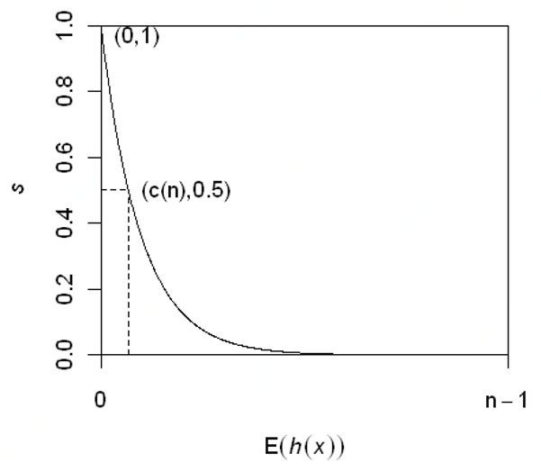

# 孤立森林——一种异常检测算法

# 一、概述

iForest（Isolation
Forest）孤立森林是一个基于Ensemble的快速异常检测方法，具有线性时间复杂度和高精准度。其可以用于网络安全中的攻击检测，金融交易欺诈检测，疾病侦测，和噪声数据过滤等。

## 异常

目前学术界对异常（anomaly detection）的定义有很多种，iForest
适用于连续数据（continuous numerical
data）的异常检测，将异常定义为“容易被孤立的离群点 (more likely to be
separated)”——可以理解为分布稀疏且离密度高的群体较远的点。用统计学来解释，在数据空间里面，分布稀疏的区域表示数据发生在此区域的概率很低，因而可以认为落在这些区域里的数据是异常的。一个例子如图1所示，途中白色点为正常的点（在一个簇中），黑色点位异常点（outliers，离群点）。iForest检测到的异常边界为红色，它可以正确地检测到所有黑点异常点。

  

 
图1 离群点（outliers）示意图

## iForest基本思想

iForest属于非参数（non-parametric）和无监督（unsupervised）的方法，即不用定义数学模型也不需要有标记的训练。iForest由很多孤立树（isolation
tree,
iTree）组成，每一棵iTree都是一棵二叉树。在构建iTree的过程中，每次都随机地选择一个维度作为分割维度，并随机地选择一个该维度上介于最大值和最小值之间的数作为分割点，将数据分为左分支和右分支两部分。这相当于用一个随机超平面来切割（split）数据空间（data
space）,
切一次可以生成两个子空间（想象拿刀切蛋糕一分为二）。之后我们再继续用一个随机超平面来切割每个子空间，循环下去，直到每子空间里面只有一个数据点为止。

直观上，我们可以发现那些密度很高的簇需要被切很多次才会停止切割，但是那些密度很低的点切很少的几次就停到一个子空间了。图1里面黑色的点就很容易被切几次就停到一个子空间，而白色点聚集的地方可以切很多次才停止。

以高斯分布为例（如图2所示），在一棵iTree中，(a)图中的正常点被切割了12次才被孤立；而(b)图中的异常点则只切割了4次就被孤立出来。从(c)图可以看出，随着iTree数目的增长，两个数据的平均切割次数各自收敛于一个稳定值，异常点的平均切割次数显著低于正常点。iForest就使用“平均切割次数”判断数据点是否异常，在一个完全生长的iTree中，“切割次数”就是数据所在叶子节点到根节点的层数。

  

 

 
图2 iForest基本思想

# 二、算法详解

iForest算法首先建立多棵iTree，计算样本点在每棵iTree的“分割次数”，也即根节点到样本点的路径深度，然后计算多棵iTree中样本的平均深度，平均深度小的样本被界定为异常数据。我们首先来看iTree是如何建立的。

## 1. iTree的建立

给定一个包含n个数据的数据集，每个数据的维度是。在建立随机树的过程中，每次都随机选择一个维度和一个分割值，当数据的维度大于时，就将数据放入左分支，否则就放入右分支。使用相同的方法，对每个分支继续构造子树，直到满足以下条件：直到满足以下任意一个条件：(1)树达到了限制的高度；(2)节点上只有一个样本；(3)节点上的样本所有特征都相同。

前面已经提到，越异常的数据，会越早地落入叶子节点（即没有子分支的节点），因此它的路径深度会越小。我们用表示数据的路径深度，它表示数据所在的叶子节点走到根节点所经过的边数，表示数据在随机树中路径深度的期望。

对做如下归一化，从而得到一个标准化的异常得分：

  

其中

  

表示在一棵含有个数据的二叉树中，检索一个数据所需的平均路径深度（参考二叉树相关理论[3]，式中，称为调和数）。

图3给出了和的关系:

  

 
图3 期望路径深度与异常得分的关系

由上图可以得到一些结论：

-   当时，，即样本的路径平均长度与树的平均路径长度相近时，则不能区分是不是异常。

-   当时，，即的异常分数接近1时，被判定为异常。

-   当时，，被判定为正常。

###iTree的特点

孤立森林作为iTree的总体，将具有较短路径深度的点识别为异常点，不同的树扮演不同异常识别的专家。

已经存在的那些异常检测的方法大部分都期望有更多的数据，但是在孤立森林中，小数据集往往能取得更好的效果。样本数较多会降低孤立森林孤立异常点的能力，因为正常样本会干扰隔离的过程，降低隔离异常的能力。因此在建立iTree时往往进行降采样。

swamping和masking是异常检测中比较关键的问题。swamping指的是错误地将正常样本预测为异常。当正常样本很靠近异常样本时，隔离异常时需要的拆分次数会增加，使得从正常样本中区分出异常样本更加困难。masking指的是存在大量异常点隐藏了他们的本来面目。当异常簇比较大，并且比较密集时，同样需要更多的拆分才能将他们隔离出来。上面的这两种情况使得孤立异常点变得更加困难。

造成上面两种情况的原因都与数据量太大有关。孤立树的独有特点使得孤立森林能够通过子采样建立局部模型，减小swamping和masking对模型效果的影响。其中的原因是：子采样可以控制每棵孤立树的数据量；每棵孤立树专门用来识别特定的子样本。

下面两张图说明了上述的现象。

  

 
图4 降采样后，异常数据的密度降低

## 2. iForest用于异常检测

基于iForest的异常检测包括两个步骤：训练阶段，基于训练集的子样本来建立多棵孤立树，构成孤立森林；测试阶段，用孤立森林为每一个测试样本计算异常分数。

### 训练阶段

在训练阶段，iTree的建立是通过对训练集的递归分隔来建立的，直到所有的样本被孤立，或者树达到了指定的高度。树的高度限制与子样本数量的关系为，它近似等于树的平均高度。树只生长到平均高度，而不继续生长的原因是，我们只关心路径长度较小的那些点，它们更有可能是异常点，而并不关心路径很长的正常点。训练的详细过程如算法1和算法2所示：

  
 

论文[1]中给出子样本大小和树的数量的经验值为：，。

### 评估阶段

在评估阶段，每一个测试样本的异常分数由期望路径长度得到，是将样本通过孤立森林中的每一棵树得到的。具体过程见算法3。

  

# 三、算法特点

1.
iForest具有线性时间复杂度，是一种ensemble方法，所以可以用在含有海量数据的数据集上面。通常树的数量越多，算法越稳定。由于每棵树都是互相独立生成的，因此可以部署在大规模分布式系统上来加速运算。

2.
iForest不适用于特别高维的数据。由于每次切割数据空间都随机选取一个维度，建完树后仍然有大量的维度信息没有被使用，导致算法可靠性降低。高维空间还可能存在大量噪音维度或无关维度（irrelevant
attributes），影响树的构建。对这类数据，建议使用子空间异常检测（Subspace Anomaly
Detection）技术。此外，切割平面默认是axis-parallel的，也可以随机生成各种角度的切割平面，参见“On
Detecting Clustered Anomalies Using SCiForest”[5]。

3.
iForest仅对Global Anomaly
敏感，即全局稀疏点敏感，不擅长处理局部的相对稀疏点（Local
Anomaly）。目前已有改进方法参见“Improving iForest with Relative Mass”[6]。

# 参考文献

[1] Liu, Fei Tony, Kai Ming Ting, and Zhi-Hua Zhou. "Isolation forest."Data
Mining, 2008. ICDM'08. Eighth IEEE International Conference on. IEEE, 2008.

[2] YeZhu, iForest （Isolation Forest）孤立森林 异常检测
入门篇 *https://www.jianshu.com/p/5af3c66e0410*

[3] B. R. Preiss. Data Structures and Algorithms with ObjectOriented Design
Patterns in Java. Wiley, 1999.

[4] Liu, Fei Tony, Kai Ming Ting, and Zhi-Hua Zhou. "Isolation-based anomaly
detection."ACM Transactions on Knowledge Discovery from Data (TKDD)6.1 (2012):
3.

[5] Liu F.T., Ting K.M., Zhou ZH. (2010) On Detecting Clustered Anomalies Using
SCiForest. In: Balcázar J.L., Bonchi F., Gionis A., Sebag M. (eds) Machine
Learning and Knowledge Discovery in Databases. ECML PKDD 2010. Lecture Notes in
Computer Science, vol 6322. Springer, Berlin, Heidelberg

[6] Aryal S., Ting K.M., Wells J.R., Washio T. (2014) Improving iForest with
Relative Mass. In: Tseng V.S., Ho T.B., Zhou ZH., Chen A.L.P., Kao HY. (eds)
Advances in Knowledge Discovery and Data Mining. PAKDD 2014. Lecture Notes in
Computer Science, vol 8444. Springer, Cham

