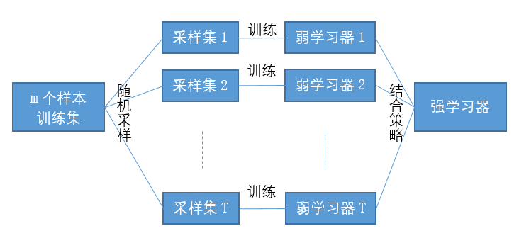

# 随机森林——一种集成学习（Ensemble Learning）方法

随机森林是一种集成算法（Ensemble Learning），它属于Bagging类型，通过组合多个弱分类器，最终结果通过投票或取均值，使得整体模型的结果具有较高的精确度和泛化性能。其可以取得不错成绩，主要归功于“随机”和“森林”，一个使它具有抗过拟合能力，一个使它更加精准。

## Bagging

  

 
图1 Baging示意图

Bagging也叫自举汇聚法（bootstrap aggregating），是一种在原始数据集上通过有放回抽样重新选出k个新数据集来训练分类器的集成技术。它使用训练出来的分类器的集合来对新样本进行分类，然后用多数投票或者对输出求均值的方法统计所有分类器的分类结果，结果最高的类别即为最终标签。此类算法可以有效降低bias，并能够降低variance。

> **【自助法】**它通过自助法（bootstrap）重采样技术，从训练集里面采集固定个数的样本，但是每采集一个样本后，都将样本放回。也就是说，之前采集到的样本在放回后有可能继续被采集到。

&ensp; 
> **【OOB】**在Bagging的每轮随机采样中，训练集中大约有36.8%的数据没有被采样集采集中。对于这部分没采集到的数据，我们常常称之为袋外数据(Out Of Bag，简称OOB)。这些数据没有参与训练集模型的拟合，因此可以用来检测模型的泛化能力

&ensp; 
>**【随机性】**对于我们的Bagging算法，一般会对样本使用boostrap进行随机采集，每棵树采集相同的样本数量，一般小于原始样本量。这样得到的采样集每次的内容都不同，通过这样的自助法生成k个分类树组成随机森林，做到**样本随机性**。

&ensp; 
> **【输出】**Bagging的集合策略也比较简单，对于分类问题，通常使用简单投票法，得到最多票数的类别或者类别之一为最终的模型输出。对于回归问题，通常使用简单平均法，对T个弱学习器得到的回归结果进行算术平均得到最终的模型输出

### bagging算法流程
> **输入:** 样本集  ，弱学习器算法, 弱分类器迭代次数。  
**输出:** 最终的强分类器  
　　　　1）对于:  
　　　　　　a)对训练集进行第次随机采样，共采集次，得到包含m个样本的采样集  
　　　　　　b)用采样集训练第个弱学习器  
　　　　2) 如果是分类算法预测，则个弱学习器投出最多票数的类别或者类别之一为最终类别。如果是回归算法，个弱学习器得到的回归结果进行算术平均得到的值为最终的模型输出。

## 随机森林

随机森林(Random Forest，RF）是Bagging算法的一种，其实在介绍完Bagging算法之后，随机森林几乎是呼之欲出的，RF相对于Bagging只是对其中一些细节做了自己的规定和设计。可以概括RF包括四个部分：

1. 随机选择样本（放回抽样）
2. 随机选择特征
3. 构建决策树
4. 随机森林投票（平均）

> **【弱分类器】**首先，RF使用了CART决策树作为弱学习器。换句话说，其实我们只是将使用CART决策树作为弱学习器的Bagging方法称为随机森林。

&ensp; 
> **【随机性】**同时，在生成每棵树的时候，每个树选取的特征都仅仅是随机选出的少数特征，一般默认取特征总数m的开方。而一般的CART树则是会选取全部的特征进行建模。因此，不但特征是随机的，也保证了**特征随机性**。

&ensp;
> **【样本量】**相对于一般的Bagging算法，RF会选择采集和训练集样本数N一样个数的样本。

&ensp;
> **【特点】**由于随机性，对于降低模型的方差很有作用，故随机森林一般不需要额外做剪枝，即可以取得较好的泛化能力和抗过拟合能力（Low Variance）。当然对于训练集的拟合程度就会差一些，也就是模型的偏倚会大一些（High Bias），但仅仅是相对的。

### CART树

随机森林的弱分类器使用的是CART数，CART决策树又称分类回归树。当数据集的因变量为连续性数值时，该树算法就是一个回归树，可以用叶节点观察的均值作为预测值；当数据集的因变量为离散型数值时，该树算法就是一个分类树，可以很好的解决分类问题。
但需要注意的是，该算法是一个**二叉树**，即每一个非叶节点只能引伸出两个分支，所以当某个非叶节点是多水平(2个以上)的离散变量时，该变量就有可能被多次使用。同时，若某个非叶节点是连续变量时，决策树也将把他当做离散变量来处理（即在有限的可能值中做划分）

### 特征选择

特征选择目前比较流行的方法是信息增益、增益率、基尼系数和卡方检验。这里主要介绍基于基尼系数（GINI）的特征选择，因为随机森林采用的CART决策树就是基于基尼系数选择特征的。
基尼系数的选择的标准就是每个子节点达到最高的纯度，即落在子节点中的所有观察都属于同一个分类，此时基尼系数最小，纯度最高，不确定度最小。
对于一般的决策树，假如总共有K类，样本属于第k类的概率为：，则该概率分布的基尼指数为：

基尼指数越大，说明不确定性就越大；基尼系数越小，不确定性越小，数据分割越彻底，越干净。
对于CART树而言，由于是二叉树，可以通过下面的表示：

在我们遍历每个特征的每个分割点时，当使用特征，将划分为两部分，即（满足的样本集合），（不满足的样本集合）。则在特征的条件下的基尼指数为：

：表示集合D的不确定性。
：表示经过分割后的集合的不确定性。
随机森林中的每棵CART决策树都是通过不断遍历这棵树的特征子集的所有可能的分割点，寻找Gini系数最小的特征的分割点，将数据集分成两个子集，直至满足停止条件为止。

### 抗过拟合
首先，正如Bagging介绍中提到的，每个树选取使用的特征时，都是从全部m个特征中随机产生的，本身已经降低了过拟合的风险和趋势。模型不会被特定的特征值或者特征组合所决定，随机性的增加，将控制模型的拟合能力不会无限提高。

第二，与决策树不同，RF对决策树的建立做了改进。对于普通的决策树，我们会在节点上所有的个样本特征中选择一个最优的特征来做决策树的左右子树划分。但是RF的每个树，其实选用的特征是一部分，在这些少量特征中，选择一个最优的特征来做决策树的左右子树划分，将随机性的效果扩大，进一步增强了模型的泛化能力。

假设每棵树选取个特征，越小，此时模型对于训练集的拟合程度会变差，偏倚增加，但是会泛化能力更强，模型方差减小。越大则相反。在实际使用中，一般会将的取值作为一个参数，通过开启oob验证或使用交叉验证，不断调整参数以获取一个合适的的值。

### 随机森林算法流程
> **输入:** 样本集，弱学习器算法, 弱分类器迭代次数。  
**输出:** 最终的强分类器  
　　　　1）对于:  
　　　　　　a)对训练集进行第次随机采样，共采集次，得到包含m个样本的采样集。在训练决策树模型的节点的时候， 在节点上所有的样本特征中选择一部分样本特征， 在这些随机选择的部分样本特征中选择一个最优的特征来做决策树的左右子树划分  
　　　　　　b)用采样集训练第个弱学习器  
　　　　2) 如果是分类算法预测，则个弱学习器投出最多票数的类别或者类别之一为最终类别。如果是回归算法，个弱学习器得到的回归结果进行算术平均得到的值为最终的模型输出。

RF和Bagging对比：RF的起始性能较差，特别当只有一个基学习器时，随着学习器数目增多，随机森林通常会收敛到更低的泛化误差。随机森林的训练效率也会高于Bagging，因为在单个决策树的构建中，Bagging使用的是“确定性”决策树，在选择特征划分结点时，要对所有的特征进行考虑，而随机森林使用的是“随机性”特征数，只需考虑特征的子集。

## 优缺点总结
RF的主要优点有：

　　　　1） 训练可以高度并行化，对于大数据时代的大样本训练速度有优势。个人觉得这是的最主要的优点。

　　　　2） 由于可以随机选择决策树节点划分特征，这样在样本特征维度很高的时候，仍然能高效的训练模型。

　　　　3） 在训练后，可以给出各个特征对于输出的重要性

　　　　4） 由于采用了随机采样，训练出的模型的方差小，泛化能力强。

　　　　5） 相对于Boosting系列的Adaboost和GBDT， RF实现比较简单。

　　　　6） 对部分特征缺失不敏感。

RF的主要缺点有：

　　　　1）在某些噪音比较大的样本集上，RF模型容易陷入过拟合。

　　　　2) 取值划分比较多的特征容易对RF的决策产生更大的影响，从而影响拟合的模型的效果。

## 参考目录
[1] 随机森林原理介绍与适用情况（综述篇）https://www.jianshu.com/p/a779f0686acc

[2] RF(随机森林)、GBDT、XGBoost算法简介 https://www.jianshu.com/p/0f3e14190989

[3] Bagging与随机森林算法原理小结 https://www.cnblogs.com/pinard/p/6156009.html

