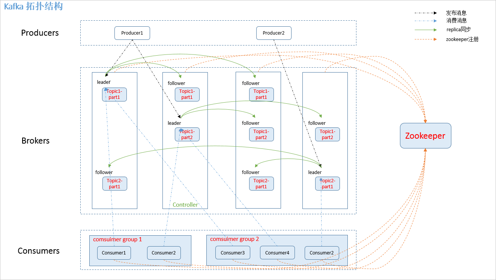
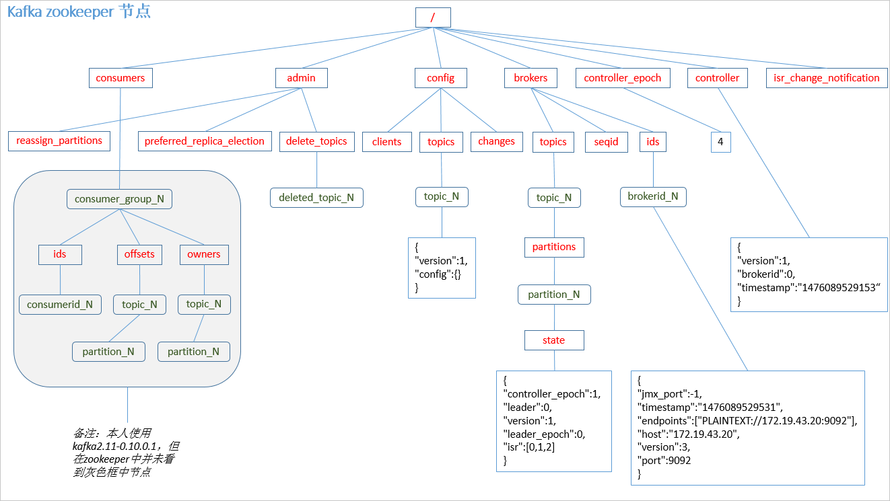
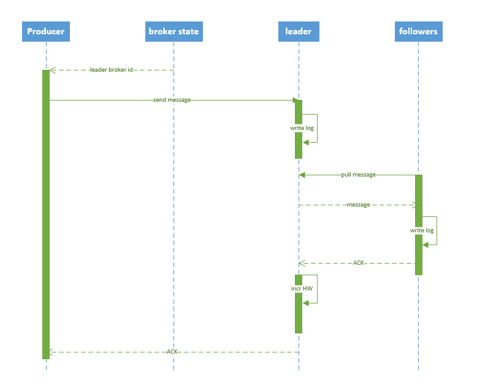
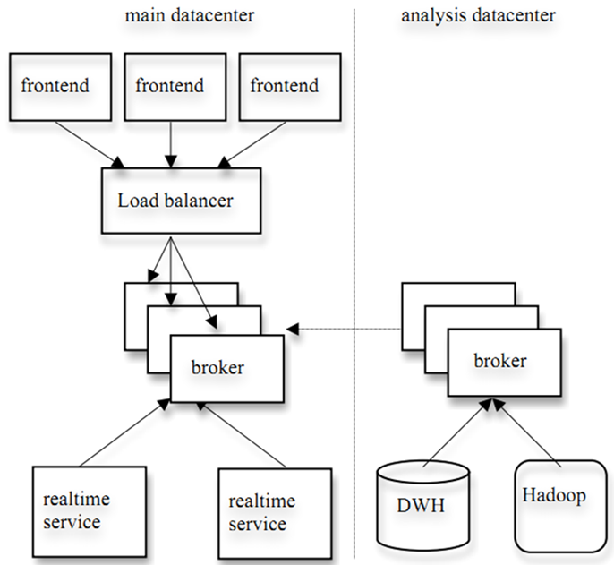
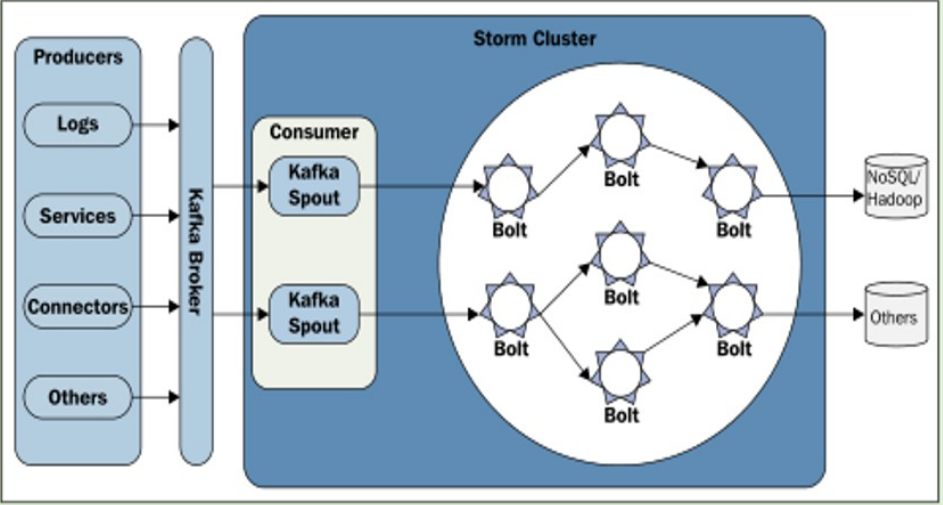

# 1 为什么需要消息系统
+ **解耦**  
   允许你独立的扩展或修改两边的处理过程，只要确保它们遵守同样的接口约束。
+ **冗余**  
　消息队列把数据进行持久化直到它们已经被完全处理，通过这一方式规避了数据丢失风险。许多消息队列所采用的"插入-获取-删除"范式中，在把一个消息从队列中删除之前，需要你的处理系统明确的指出该消息已经被处理完毕，从而确保你的数据被安全的保存直到你使用完毕。
+ **扩展性**  
　因为消息队列解耦了你的处理过程，所以增大消息入队和处理的频率是很容易的，只要另外增加处理过程即可。
+ **灵活性 & 峰值处理能力**  
　在访问量剧增的情况下，应用仍然需要继续发挥作用，但是这样的突发流量并不常见。如果为以能处理这类峰值访问为标准来投入资源随时待命无疑是巨大的浪费。使用消息队列能够使关键组件顶住突发的访问压力，而不会因为突发的超负荷的请求而完全崩溃。
+ **可恢复性**    
　系统的一部分组件失效时，不会影响到整个系统。消息队列降低了进程间的耦合度，所以即使一个处理消息的进程挂掉，加入队列中的消息仍然可以在系统恢复后被处理。
+ **顺序保证**  
　在大多使用场景下，数据处理的顺序都很重要。大部分消息队列本来就是排序的，并且能保证数据会按照特定的顺序来处理。（Kafka 保证一个 Partition 内的消息的有序性）
+ **缓冲**  
　有助于控制和优化数据流经过系统的速度，解决生产消息和消费消息的处理速度不一致的情况。
+ **异步通信**  
  很多时候，用户不想也不需要立即处理消息。消息队列提供了异步处理机制，允许用户把一个消息放入队列，但并不立即处理它。想向队列中放入多少消息就放多少，然后在需要的时候再去处理它们。

# 2 kafka 架构          
## 2.1 拓扑结构  
如下图：
 

图1
   
如Topic1-part1、Topic1-part2、Topic2-part1分别对应1个leader 2个follower 被2个消费组group1、group2消费。
## 2.2 相关概念  
如图1中，kafka 相关名词解释如下：  

**1.producer：**  
　　消息生产者，发布消息到 kafka 集群的终端或服务。  
**2.broker：**   
　　kafka 集群中包含的服务器。  
**3.topic：**  
　　每条发布到 kafka 集群的消息属于的类别，即 kafka 是面向 topic 的。  
**4.partition：**  
　　partition 是物理上的概念，每个 topic 包含一个或多个 partition。kafka 分配的单位是 partition。  
**5.consumer：**  
　　从 kafka 集群中消费消息的终端或服务。  
**6.Consumer group：**  
　　high-level consumer API 中，每个 consumer 都属于一个 consumer group，每条消息只能被 consumer group 中的一个 Consumer 消费，但可以被多个 consumer group 消费。  
**7.replica：**  
　　partition 的副本，保障 partition 的高可用。  
**8.leader：**  
　　replica 中的一个角色， producer 和 consumer 只跟 leader 交互。  
**9.follower：**    
　　replica 中的一个角色，从 leader 中复制数据。    
**10.controller：**  
　　kafka 集群中的其中一个服务器，用来进行 leader election 以及 各种 failover。  
**11.zookeeper：**  
　　kafka 通过 zookeeper 来存储集群的 meta 信息。  
## 2.3 zookeeper 节点
kafka 在 zookeeper 中的存储结构如下图所示：
  
  
图2

# 3 producer发布消息
## 3.1 写入方式
producer 采用 push 模式将消息发布到 broker，每条消息都被 append 到 patition 中，属于顺序写磁盘（顺序写磁盘效率比随机写内存要高，保障 kafka 吞吐率）。
## 3.2 消息路由
producer 发送消息到 broker 时，会根据分区算法选择将其存储到哪一个 partition。其路由机制为：

1. 指定了 patition，则直接使用；   
2. 未指定 patition 但指定 key，通过对 key 的 value 进行hash 选出一个 patition  
3. patition 和 key 都未指定，使用轮询选出一个 patition。 

## 3.3 写入流程
producer 写入消息序列图如下所示：  
   

图3

流程说明：
1. producer 先从 zookeeper 的 "/brokers/.../state" 节点找到该 partition 的 leader    
2. producer 将消息发送给该 leader    
3. leader 将消息写入本地 log    
4. followers 从 leader pull 消息，写入本地 log 后 leader 发送 ACK    
5. leader 收到所有 ISR 中的 replica 的 ACK 后，增加 HW（high watermark，最后 commit 的 offset） 并向 producer 发送 ACK

## 3.4 producer delivery guarantee  
 一般情况下存在三种情况：    
1. At most once 消息可能会丢，但绝不会重复传输    
2. At least one 消息绝不会丢，但可能会重复传输    
3. Exactly once 每条消息肯定会被传输一次且仅传输一次      
 当 producer 向 broker 发送消息时，一旦这条消息被 commit，由于 replication 的存在，它就不会丢。但是如果 producer 发送数据给 broker 后，遇到网络问题而造成通信中断，那 producer 就无法判断该条消息是否已经 commit。虽然 Kafka 无法确定网络故障期间发生了什么，但是 producer 可以生成一种类似于主键的东西，发生故障时幂等性的重试多次，这样就做到了 Exactly once，但目前还并未实现。所以目前默认情况下一条消息从 producer 到 broker 是确保了 At least once，可通过设置 producer 异步发送实现At most once。

# 4 consumer 消费消息
## 4.1 consumer API  
kafka 提供了两套 consumer API：      
1. The high-level Consumer API        
2. The SimpleConsumer API  
 其中 high-level consumer API 提供了一个从 kafka 消费数据的高层抽象，而 SimpleConsumer API 则需要开发人员更多地关注细节。 

**1） The high-level consumer API**  
high-level consumer API 提供了 consumer group 的语义，一个消息只能被 group 内的一个 consumer 所消费，且 consumer 消费消息时不关注 offset，最后一个 offset 由 zookeeper 保存。
使用 high-level consumer API 可以是多线程的应用，应当注意：  
1. 如果消费线程大于 patition 数量，则有些线程将收不到消息  
2. 如果 patition 数量大于线程数，则有些线程多收到多个 patition 的消息  
3. 如果一个线程消费多个 patition，则无法保证你收到的消息的顺序，而一个 patition 内的消息是有序的 

**2） The SimpleConsumer API**  
如果你想要对 patition 有更多的控制权，那就应该使用 SimpleConsumer API，比如：  
1. 多次读取一个消息  
2. 只消费一个 patition 中的部分消息  
3. 使用事务来保证一个消息仅被消费一次  

 但是使用此 API 时，partition、offset、broker、leader 等对你不再透明，需要自己去管理。你需要做大量的额外工作：  
1. 必须在应用程序中跟踪 offset，从而确定下一条应该消费哪条消息  
2. 应用程序需要通过程序获知每个 Partition 的 leader 是谁  
3. 需要处理 leader 的变更 

 使用 SimpleConsumer API 的一般流程如下：  
 
1. 查找到一个“活着”的 broker，并且找出每个 partition 的 leader  
2. 找出每个 partition 的 follower  
3. 定义好请求，该请求应该能描述应用程序需要哪些数据  
4. fetch 数据  
5. 识别 leader 的变化，并对之作出必要的响应 

 
以下针对 high-level Consumer API 进行说明。 

## 4.2 consumer group  
如 2.2 节所说， kafka 的分配单位是 patition。每个 consumer 都属于一个 group，一个 partition 只能被同一个 group 内的一个 consumer 所消费（也就保障了一个消息只能被 group 内的一个 consuemr 所消费），但是多个 group 可以同时消费这个 partition。  
kafka 的设计目标之一就是同时实现离线处理和实时处理，根据这一特性，可以使用 spark/Storm 这些实时处理系统对消息在线处理，同时使用 Hadoop 批处理系统进行离线处理，还可以将数据备份到另一个数据中心，只需要保证这三者属于不同的 consumer group。如下图所示：  
    

图4

## 4.3 消费方式
consumer 采用 pull 模式从 broker 中读取数据。  
push 模式很难适应消费速率不同的消费者，因为消息发送速率是由 broker 决定的。它的目标是尽可能以最快速度传递消息，但是这样很容易造成 consumer 来不及处理消息，典型的表现就是拒绝服务以及网络拥塞。而 pull 模式则可以根据 consumer 的消费能力以适当的速率消费消息。  
对于 Kafka 而言，pull 模式更合适，它可简化 broker 的设计，consumer 可自主控制消费消息的速率，同时 consumer 可以自己控制消费方式——即可批量消费也可逐条消费，同时还能选择不同的提交方式从而实现不同的传输语义。
## 4.4 consumer delivery guarantee
如果将 consumer 设置为 autocommit，consumer 一旦读到数据立即自动 commit。如果只讨论这一读取消息的过程，那 Kafka 确保了 Exactly once。  
但实际使用中应用程序并非在 consumer 读取完数据就结束了，而是要进行进一步处理，而数据处理与 commit 的顺序在很大程度上决定了consumer delivery guarantee：  
 
1.读完消息先 commit 再处理消息。  
    这种模式下，如果 consumer 在 commit 后还没来得及处理消息就 crash 了，下次重新开始工作后就无法读到刚刚已提交而未处理的消息，这就对应于 At most once  
2.读完消息先处理再 commit。  
    这种模式下，如果在处理完消息之后 commit 之前 consumer crash 了，下次重新开始工作时还会处理刚刚未 commit 的消息，实际上该消息已经被处理过了。这就对应于 At least once。  
3.如果一定要做到 Exactly once，就需要协调 offset 和实际操作的输出。  
    精典的做法是引入两阶段提交。如果能让 offset 和操作输入存在同一个地方，会更简洁和通用。这种方式可能更好，因为许多输出系统可能不支持两阶段提交。比如，consumer 拿到数据后可能把数据放到 HDFS，如果把最新的 offset 和数据本身一起写到 HDFS，那就可以保证数据的输出和 offset 的更新要么都完成，要么都不完成，间接实现 Exactly once。（目前就 high-level API而言，offset 是存于Zookeeper 中的，无法存于HDFS，而SimpleConsuemr API的 offset 是由自己去维护的，可以将之存于 HDFS 中）
# 5 数据一致性
这里我们主要讨论kafka里存的是mysql binlog的insert update delete类型的消息数据   
## 5.1 topic扩分片如何保证数据一致性？  
扩分片会导致数据不一致的情况出现，由于操作分区时，会使后生产的同主键数据写到不同分区，进而导致后生产的数据会比先生产的数据先被消费到，从而导致数据顺序上的混乱，造成数据不一致的情况出现。  
**合理方案：**  
在扩容前通知下游使用方，要把kafka积压数据消费完后，上游大数据那边才能扩分片，否则就会出现部分数据不一致性异常。  
## 5.2 Kafka与Storm集成如何保证数据一致性？  
   
   
图5

Storm与kafak集成时KafkaSpout用于从kafka拉取数据，且KafkaSpout的并行度要与topic分片数保持一致，因为一个kafka分片只能被一个客户端线程消费。也就是说一个kafka spout task只会拉取同一个分片的数据。  
此外，还要注意下游的Bolt处理数据时，与spout之间的分组策略要选用fieldsGrouping 源表主键，这样才能保证同一源表主键被同一bolt处理的顺序性。

