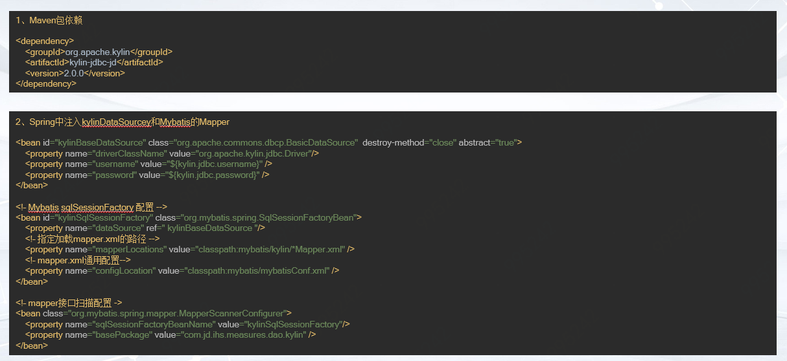
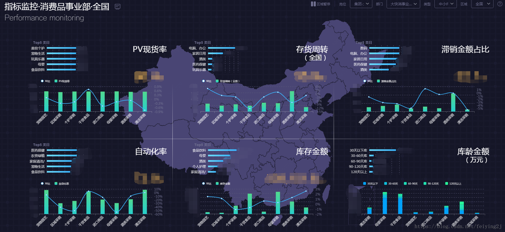

# 大数据技术实践之Kylin
## Kylin简介
Apache Kylin™是唯一来自中国的Apache的顶级开源项目，是一个分布式分析引擎，提供Hadoop之上的SQL查询接口及多维分析（OLAP）能力以支持超大规模数据，能够处理TB乃至PB级别的分析任务。简单来说，Kylin的核心思想是预计算（以空间换时间），即从Hive中读取源数据使用MapReduce/Spark作为Cube构建引擎进行预计算，将计算好的结果保存到Hbase中，供查询时直接访问，这决定了Kylin能够拥有很好的快速查询和高并发能力。
### 特性
- Hadoop ANSI SQL 接口: 
Kylin为Hadoop提供标准SQL支持大部分查询功能
- 交互式查询能力: 
通过Kylin，用户可以与Hadoop数据进行亚秒级交互，在同样的数据集上提供比Hive更好的性能
- 多维立方体（MOLAP Cube）:
用户能够在Kylin里为百亿以上数据集定义数据模型并构建立方体

- 与BI工具无缝整合:
Kylin提供与BI工具的整合能力，如Tableau，PowerBI/Excel，MSTR，QlikSense，Hue和SuperSet

- 其他特性: 
Job管理与监控、压缩与编码 、增量更新、利用HBase Coprocessor、友好的web界面以管理，监控和使用Cube、项目及表级别的访问控制安全

### 架构

根据上图可以看出
- Kylin对外提供全是SQL形式的rest查询接口
- SQL解析为对应的HBase API对已经提前计算好并存在HBase中的数据结果进行查询
- 对没有提前计算的数据会路由到Hadoop/Hive中进行离线数据查询
- 支持kafka的实时数据增量构建cube

## Kylin场景分析
Kylin属于OLAP类型的加工查询引擎，实时增量构建目前还不普及。目前OLAP引擎有如下几种：
1. 基于MPP(大规模并行处理)类引擎
- 代表：Impala/Presto
- 特点：基于Hive/Kudu直接读取数据，通过分布式/内存加速计算。
- 劣势：在超大数据量级以及复杂业务场景延迟较高，高压情况下某个节点挂掉可能导致剩余节点负载过大而产生问题。
- 场景：在灵活性较高、数据量及业务适场景下，准实时查询。

2. 基于Lucene类引擎
- 代表：Elasticsearch/Solr
- 特点：相比其他可以较简单的部署使用，通过索引加速计算。
- 劣势：不支持标准SQL、不支持关联、没有细致的权限管理。
- 场景：适用于搜索引擎，归档数据检索，准实时的数据写入检索。

3. 基于预计算类引擎
- 代表：Kylin/Druid
- 特点：对各类维度计算优化，提前聚合明细数据，将结果保存提供查询。
- 劣势：数据膨胀占用更多的空间、与Mysql语法有一定差异，支持的函数少。
- 场景：适用于对查询时效性要求高的，离线大数据量的多维分析。

根据不同的应用场景选择更加合适的OLAP引擎是我们选型中最需要考量的点，大家再实践中务必根据各方面情况综合考虑进行最终的技术确定。

### 场景

如上图，假设需要统计公司各个部门各类白酒的每个销售人员的销量按时间做趋势的话，如果写HiveSQL我们需要写几个加工语句，然后讲加工完的结果数据再推送到应用的关系数据库或者ES中供查询,但使用Kylin步骤就简单的多。
### 操作步骤

- Model描述了一个星型模式的数据结构，它定义了一个事实表（Fact Table）和多个查找表（Lookup Table）的连接和过滤关系
- Cube描述一个Cube实例的定义和配置选项，包括使用了哪个数据模型、包含哪些维度和度量、如何将数据进行分区、如何处理自动合并等等
- 通过Build Cube得到，包含一个或者多个Cube Segment
- 支持标准的SQL查询

可以简单理解为下图逻辑：

## Cube简介和优化

Cube是Kylin的核心概念，如上图所示，一个常用的3维立方体，包含：时间、地点、产品。假如data cell 中存放的是销量，则我们可以根据时间、地点、产品来确定销量，同时也可以根据时间、地点来确定所有产品的总销量等。Kylin就将所有（时间、地点、产品）的各种组合实现算出来，data cell 中存放度量，其中每一种组合都称为cuboid。估n维的数据最多有2^n个cuboid，不过Kylin通过设定维度的种类，可以减少cuboid的数目。
### Cube优化
随着维度数目的增加 Cuboid 的数量会爆炸式地增长，不仅占用大量的存储空间还会延长 Cube 的构建时间。为了缓解 Cube 的构建压力，减少生成的 Cuboid 数目，Apache Kylin 引入了一系列的高级设置，帮助用户筛选出真正需要的 Cuboid。主要设置有强制维度、层级维度、聚合组、联合维度等，如果不做优化一个四维的Cube构建出来是如下图这样的：

#### 联合维
如果假设我们只需要ABC和D两种维度的结果我们可以使用联合维做优化，优化结果如下图，他将只构建两种结果：

用户有时并不关心维度之间各种细节的组合方式，例如用户的查询语句中仅仅会出现 group by A, B, C，而不会出现 group by A, B 或者 group by C 等等这些细化的维度组合。这一类问题就是联合维度所解决的问题。例如将维度 A、B 和 C 定义为联合维度，Apache Kylin 就仅仅会构建 Cuboid ABC，而 Cuboid AB、BC、A 等等Cuboid 都不会被生成。最终的 Cube 结果如图所示，Cuboid 数目从 16 减少到 4。
### 聚合组
用户关心的聚合组之间可能包含相同的维度，例如聚合组 ABC 和聚合组 BCD 都包含维度 B 和维度 C。这些聚合组之间会衍生出相同的 Cuboid，例如聚合组 ABC 会产生 Cuboid BC，聚合组 BCD 也会产生 Cuboid BC。这些 Cuboid不会被重复生成，一份 Cuboid 为这些聚合组所共有，如下图：

对于强制维和层次维比较好理解本文不再赘述，相关资料会在文末提供。

## Kylin实践
### 京东库存健康系统
以京东自营订单、库存、流量等数据，结合可配置的指标口径，对40多个指标十多个维度每天一亿多的数据增量加工，包括存货周转、现货率、PV、滞销、不动销、长库龄等，并从不同维度对这些指标的健康情况进行展示，为所有采销人员优化库存结构提供决策支持，同时提供明细数据的查询下载。设计如图：

该系统开发只需要简单配置mybatis，就可以在项目中使用简单SQL来查询几十个维度提前计算好的结果数据，毫秒级展现给用户。配置文件如下：

使用Kylin全过程都是界面化操作，只需要设置好维度字段、汇总字段以及Cube构建的优化方式和参数即可定期来增量构建Cube数据。操作界面如下：

### 系统展示

## 参考资料
- http://Kylin.apache.org
- http://kylin.apache.org/cn/docs15/tutorial/create_cube.html
- https://blog.bcmeng.com/post/kylin-dimension.html
- http://kylin.apache.org/docs20/howto/howto_optimize_build.html
- http://kylin.apache.org/docs21/install/advance_settings.html