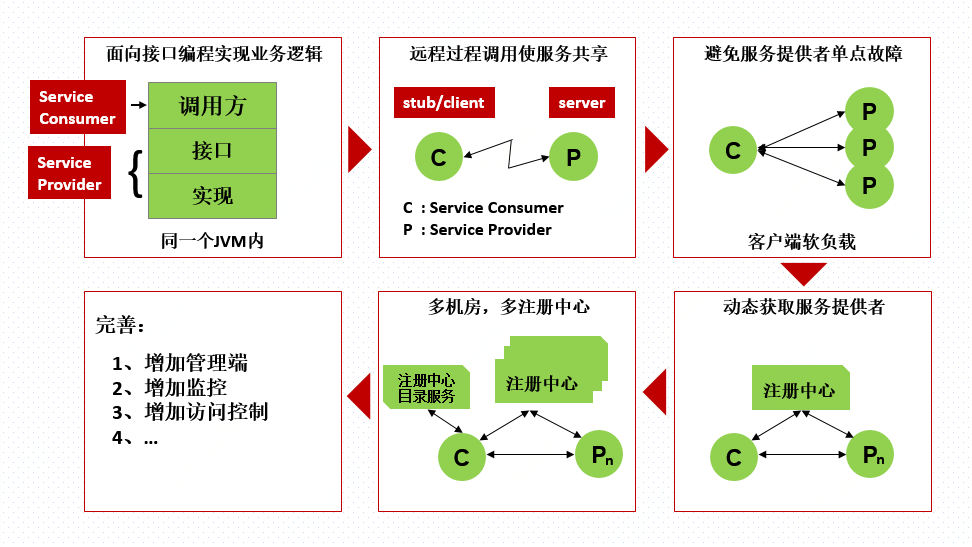
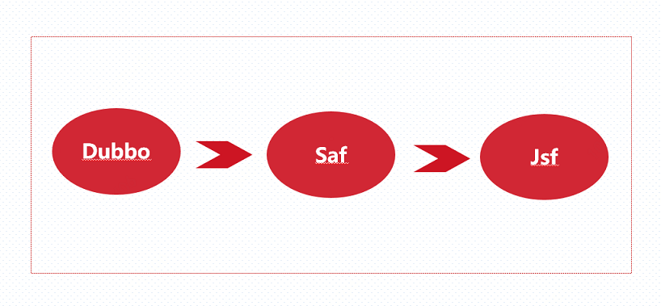
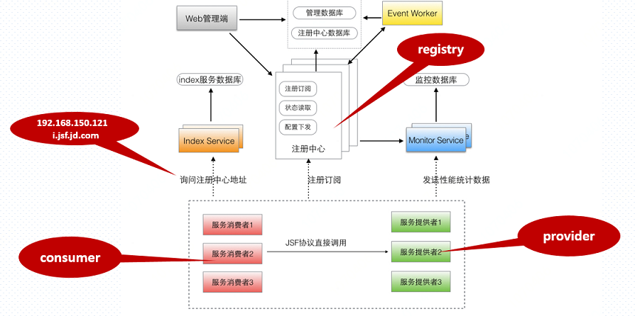
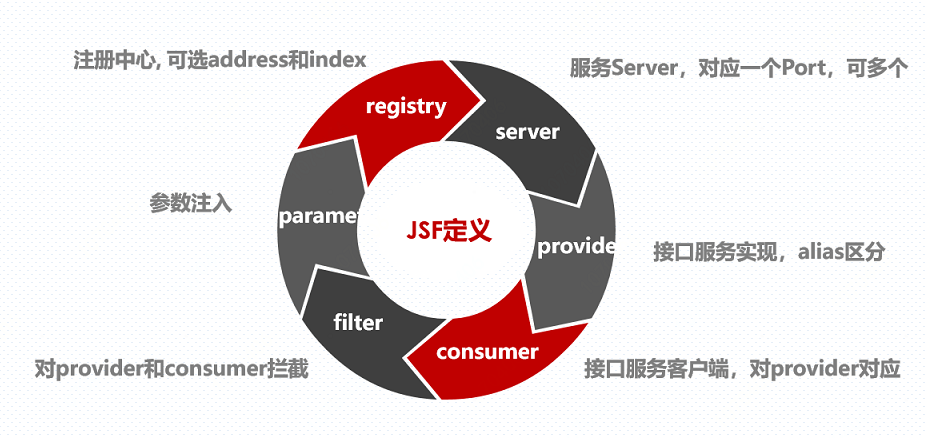
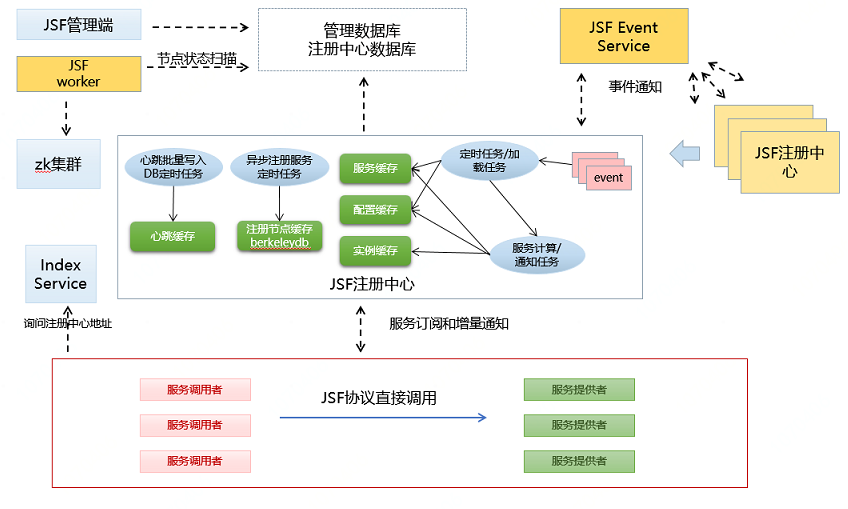
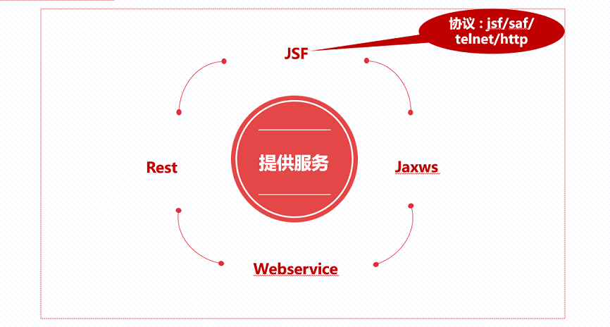
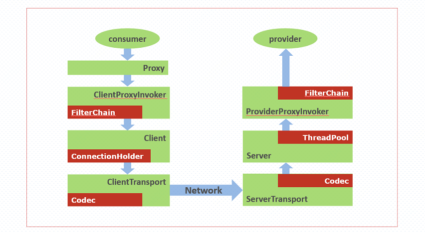
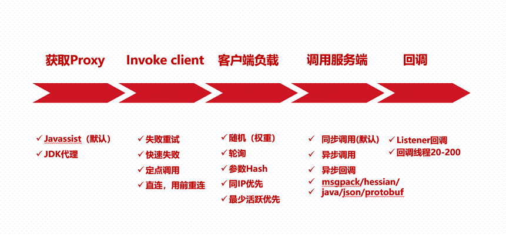
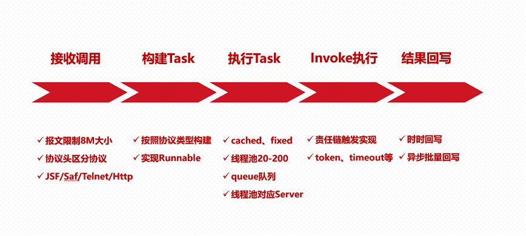
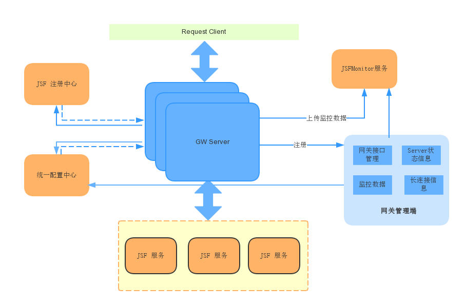

# 1.目标

    1)了解应用服务发展的基本节点情况；

    2)了解JSF的使用方式、参数配置等。

    3)了解JSF的内部原理、实现组成等。

# 2.目标内容

## 2.1服务简介

  JSF（中文名：杰夫）是Jingdong Service Framework （京东服务框架）的缩写，JSF是SAF的演进完全自主研发的高性能服务框架。

    1)高效RPC调用，20线程场景下调用效率比SAF高30%以上；

    2)高可用的注册中心，完备的容灾特性；

    3)服务端口同时支持TCP与HTTP协议调用，支持跨语言调用，构造一个HTTP POST请求即可对接口进行测试；
    
    4)支持msgpack、json等多种序列化格式，支持数据压缩；

    5)提供黑白名单、负载均衡、provider动态分组、动态切换调用分组等服务治理功能；

    6)提供对接口－方法的调用次数、平均耗时等在线监控报表功能；

    7)兼容SAF协议，可以调用SAF1.X接口；

    8)全部模块均为自主研发，自主设计应用层JSF协议；各模块功能可控，可扩展性较好；
    

## 2.2京东服务历史

  SAF基于开源的Dubbo实现，适用场景、监控、扩展有限。故此，推出自研服务框架JSF。

## 2.3架构组成

    寻址服务：索引服务，提供注册中心地址列表。
    
    注册中心：提供服务注册、订阅，服务上下线；配置下发、状态读取，为了容灾多实例部署。

    服务提供者：提供接口服务的应用。

    服务消费者：调用其他应用的接口服务的应用。

    监控中心：收集所有客户端所上传的性能统计数据。

    管理系统：服务管理界面，可以在此配置权重、路由规则等。

## 2.4组件含义

    **Registry：** 下面可以有parameter节点，对应com.jd.jsf.gd.config.RegistryConfig；配置注册中心用，注册服务和订阅服务，订阅配置。全局唯一即可。

    **Server：** 下面可以有parameter节点，对应com.jd.jsf.gd.config.ServerConfig；配置服务端用，只在发布服务端时声明。一个server对应一个端口一个协议。一个server下可以发布多个provider。

    **Provider：** 下面可以有method或者parameter节点，对应com.jd.jsf.gd.config.ProviderConfig。

    **Consumer：** 下面可以有method或者parameter节点，对应com.jd.jsf.gd.config.ConsumerConfig。

    **Parameter：** 可直接出现在spring的beans标签下，也可以出现在registry、server、provider、consumer任一标签下。还可以出现在method下，是一个key-value形式map。

    **Filter：**对应com.jd.jsf.gd.config.annotation.FilterBean，提供一个全局过滤器的入口，只针对spring配置方式（api方式没有此接口）。
    

## 2.5注册中心

    1)服务订阅：推拉结合，实现黑白名单、IP路由、同机房优先、动态分组等策略，缓存实例信息和callback，定时更新服务缓存、配置缓存。

    2)服务列表订阅计算：

        a.加载版本变化的接口、provider列表、动态分组、权重信息、ip路由、同机房优先；

        b.根据动态分组、权重计算接口的每个alias的服务列表；

        c.新加载的服务列表与内存做比对，选出变化的服务列表（新增、删除、更新）；

        d.如果是同机房优先策略，且是删除，判断当前alias中的provider数量小于5个时，做全量推送；

        e.根据IP路由、同机房优先策略（由于同机房策略导致服务列表为空时，要推送机房所有服务列表）、列表数量限制计算服务列表；

    3)消费配置：限流配置、方法监控配置、app调用限制信息；

    4)心跳的异步写入；

## 2.6使用与协议

    1)注册中心方式：客户端和服务端使用同一个注册中心

    2)直连方式：客户端配置服务端IP列表

    3)HTTP方式：http://ip:port/interface/alias/method

    4)网关方式：HTTP方式调用，支持负载均衡

    5)API/Spring/Annotation方式：代码方式启动或调用服务

## 2.7服务调用

## 2.8客户端调用

## 2.9服务端触发

## 2.10服务网关

  JSF网关的作用如下：

    1)轻量化、多样化客户端

    2)服务集中管理

    3)解决非intranet问题

    4)类似开放平台，高可用负载
    

## 2.11其他

    1)JSF拓扑图：http://callgraph.jd.com/

    2)技术问题：分布式事务

    3)业务问题：服务粒度、服务版本与兼容

    4)Github：https://github.com/tiglabs/jsf-sdk