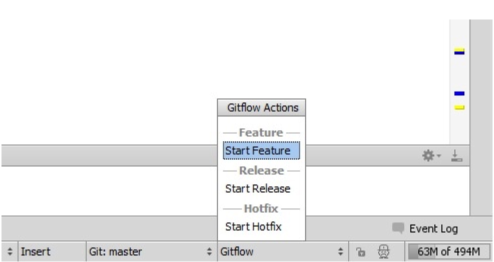

# Git-Flow
> Git-flow 是个 git 命令扩展集合，为 [Vincent Driessen 的分支模型](http://nvie.com/posts/a-successful-git-branching-model/) 提供了高级库操作扩展。

## 1 安装
### 1.1 Mac下安装：
```
$ brew install git-flow
```

### 1.2 Windows下安装：
#### 1.2.1 Cygwin
```
$ wget -q -O - --no-check-certificate https://github.com/nvie/gitflow/raw/develop/contrib/gitflow-installer.sh | bash
```

#### 1.2.2 Git for Windows (previously MSysGit)
* 在[ util-linux package ](http://gnuwin32.sourceforge.net/packages/util-linux-ng.htm) 页面下载并安装 ` getopt.ext ` 到 ` $GIT_PATH\bin` 目录。类似在 [libintl](http://gnuwin32.sourceforge.net/packages/libintl.htm) 与 [libiconv](http://gnuwin32.sourceforge.net/packages/libiconv.htm) 页面下载并安装 ` libintl3.dll ` 和 ` libiconv2.dll `。

* 克隆git-flow 源码
```
$ git clone --recursive git://github.com/nvie/gitflow.git
$ cd gitflow
```

* 执行 ` msysgit-install ` 脚本
```
C:\gitflow> contrib\msysgit-install.cmd “[$GIT_PATH]”
```
$GIT_PATH指 git 安装目录，例如 `C:\Program Files (x86)\Git\bin`

* 为 ` git flow ` 创建同步链接，以便在所有位置都能访问 ` git flow ` 命令
```
$ ln -s "/C/Program Files (x86)/Git/bin/git-flow" git-flow
```
其中 ` /C/Program Files (x86)/Git/bin/git-flow ` 为 git 安装目录，目录中如有空格，需用双引号括起。

### 1.3 测试安装完成
安装完成后可执行命令 `  $ git flow help ` 来测试。

***

## 2 操作指南
### 2.1 初始化
使用 git flow , 初始化一个现有库：
``` $ git flow init [-d] ```
*  -d 表示接受所有默认配置

默认参数如下：
```
No branches exist yet. Base branches must be created now.
Branch name for production releases: [master]
Branch name for "next release" development: [develop]

How to name your supporting branch prefixes?
Feature branches? [feature/]
Release branches? [release/]
Hotfix branches? [hotfix/]
Support branches? [support/]
Version tag prefix? []
```

### 2.2 feature (特性)
*  为即将发布的版本开发新功能特性
*  通常只存在开发者的库中

#### 2.2.1 开始新 feature
新 feature 的开发是基于 'develop' 分支的，开始一个新 feature 命令如下：
```
git flow feature start MYFEATURE
```
以上操作创建了一个基于'develop'的新 feature 分支，并切换到这个分支之下。

#### 2.2.2 完成 feature
完成新 feature 这个动作会执行以下几个操作：
* 合并 MYFEATURE 分支到 'develop'
* 删除这个新 feature 分支
* 切换回 'develop' 分支

命令如下：
```
git flow feature finish MYFEATURE
```

#### 2.2.2 发布 feature
如果是以协作的形式开发新 feature ，那么需要发布此 feature 到远程服务器，以便他人可以使用此分支。

命令如下：
```
git flow feature publish MYFEATURE
```

#### 2.2.3 获取一个发布的 feature
获取他人发布的远程 feature，并迁出远程变更。命令如下：
```
git flow feature pull origin MYFEATURE
```
同时可采用以下命令来跟踪远程仓库
```
git flow feature track MYFEATURE
```

### 2.3 做一个 release 版本
* 用来支持预发布环境的发布
* 允许修复一些小Bug，并为发布正式版准备原数据(例如修改版本号)

#### 2.3.1 开始准备 release 版本
使用 ` git flow release ` 命令来创建 release 版本。以下命令会从 ‘develop’ 分支创建一个新的 release 分支：
```
git flow release start RELEASE [BASE]
```
* `[BASE]` 参数为选填项，为 ‘develop’ 分支提交记录中的 `sha-1` hash 值。即以此提交记录的 ` sha-1` hash 值为起点，创建一个release 分支。

创建后应该马上发布（推送）此分支到远程，以便其他开发者提交修改。与发布 feature 分支类似，命令为：
```
git flow release publish RELEASE
```
当然，你也可以采用以下命令来跟踪远程分支
```
git flow release track RELEASE
```

#### 2.3.2 完成 release 版本
完成 release 版本是一个比较大的 git 分支操作，它执行以下几个操作：
* 合并（merge）此 release 版本到 ‘master’ 主干
* 用此 release 分支名称来打个标记（tag）
* 合并此 release 分支回 ‘develop’ 分支
* 删除此 release 分支

命令为：
```
git flow release finish RELEASE
```
注意，别忘了推送 tag 到远程，命令为：
```
git push --tags
```

### 2.4 紧急修复（ hotfix ）
* 紧急修复适用于对生产环境中版本所遇到的问题，必须采取立即修复的场景
* 有可能是需要修正 master 分支上某个 TAG 标记的生产版本

#### 2.4.1  开始 hotfix
与其他 git flow 命令类似，命令为：
```
git flow hotfix start VERSION [BASENAME]
```
* VERSION 参数标记新建hotfix 发布名称
*  [BASENAME]作为可选项，也可以指定TAG名称来进行紧急修复  

#### 2.4.2 完成 hotfix
* 完成 hotfix 后应该合并回 ‘develop’ 和 ‘master’ 分支
* 与此同时，合并后的 master 分支打上hotfix版本（名称）的TAG

命令为：
```
git flow hotfix finish VERSION
```

***

## 3 git-flow 命令集

***

## 4 Git 分支模型


* 主要分支
	* master : 永远处于生产可用 ( production-ready ) 状态
	* develop : 最新的下次发布开发状态
* 支援分支
	* feature : 开发新功能都从 develop 分支出来，完成后 merge 回 develop  
	* release : 准备要 release 的版本之修复bugs。从 develop 分支出来，完成后 merge 回 develop 和 master，同时打一个 tag
	* hotfix : 等不及下一个 release 版本就必须要马上修复 master 上的 bug 赶上线的情况下使用。从 master 分支出来，完成后 merge 回 master 和 develop ，并同时打一个新的 tag

***

## 5 IntelliJ IDEA 插件
可直接在 plugins 中搜索 Git Flow Integration 进行安装，安装后插件如下图

***

## 6 番外篇
* 接到产品经理新需求后，此时应该新建 feature 分支进行需求开发。
* 这个需求可能涉及很多内容，需要同事来协助开发，此时应将新建的feature 分支 push 到 remote，以便协作
* 给测试部门提测新功能也将在此新分支进行
* 开发完成并且测试通过，确定好上线日期后执行 finish feature 分支操作，此时会将开发的新功能合并到develop分支
* 紧接着应该新建一个 release 分支，用于 UAT 环境测试，此时可以在此分枝进行系统版本号升级，修复 UAT bug 等操作
* 待 UAT 无误，到指定上线日期时进行 finish release 操作，将 release 分支内容合并到 master 以及 develop，并打一个 tag
* 打包 master 内容，进行上线
* 如果发现线上有 bug，可随时新建 hotfix 分支修复Bug

***

## 7 其他
* 目前 ‘support’ 功能处于测试版，暂时不推荐使用
* 项目中可以继续使用其他 git 命令，git flow 只是一个工具集合

***

## 8 参考资料
* [A successful Git branching model](http://nvie.com/posts/a-successful-git-branching-model/)
* [git-flow cheatsheet](http://danielkummer.github.io/git-flow-cheatsheet/)
* [git-flow 备忘清单](http://danielkummer.github.io/git-flow-cheatsheet/index.zh_CN.html)
* [Git flow 開發流程](https://ihower.tw/blog/archives/5140)
