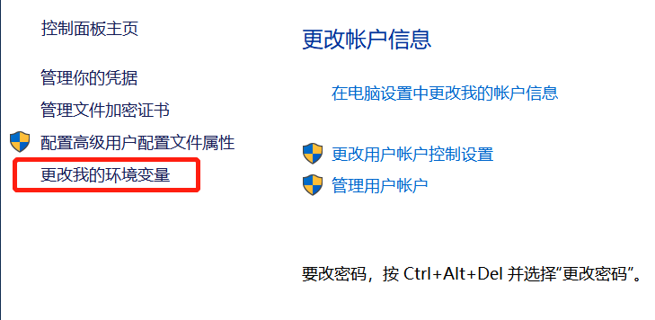

# 2.安装和运行Maven

[TOC]

## 2.1.Windows系统安装Maven

1. 准备工作:

   Maven 3 需要确认已经正确安装 JDK  1.7 以上版本.通过在命令行中执行 [^1]:
   ```cmd
   C:\>java -version
   java version "1.8.0_152"
   Java(TM) SE Runtime Environment (build 1.8.0_152-b16)
   Java HotSpot(TM) 64-Bit Server VM (build 25.152-b16, mixed mode)
   ```

   确认已经注册JAVA_HOME环境变量[^2]:

   ```cmd
   C:\>echo %JAVA_HOME%
   C:\Program Files\Java\jdk1.8.0_152    
   ```

2. **文艺青年的优雅安装方式** -- 通过*scoop* 安装:

   ```powershell
   scoop install maven
   ```

   > *[scoop](https://scoop.sh/)*是一个Windows下的命令行程序(cli)安装工具,类似linux下的apt-get或者yum.安装时依赖powershell 3.0 可以在powershell或者 cmd下运行,进行程序安装.
   >
   > 使用*scoop*安装maven可以自动注册环境变量,而且还可以获得多版本管理,自动更新等特性.

3. 验证,使用cmd在任意目录执行:

   ```cmd
   C:\>mvn -v
   Apache Maven 3.5.4 (1edded0938998edf8bf061f1ceb3cfdeccf443fe; 2018-06-18T02:33:14+08:00)
   Maven home: C:\Users\<userName>\scoop\apps\maven\current\bin\..
   Java version: 1.8.0_152, vendor: Oracle Corporation, runtime: C:\Program Files\Java\jdk1.8.0_152\jre
   Default locale: zh_CN, platform encoding: GBK
   OS name: "windows 10", version: "10.0", arch: "amd64", family: "windows"
   ```

4. 普通青年手工下载安装

   在[maven官网](https://maven.apache.org/download.cgi)下载maven压缩包,解压缩,注册PATH环境变量.普通青年可以遵照官方文档操作,在此就不赘述了:P.

##2.2 Linux系统安装Maven

1. 与windows相同也需要验证JDK依赖,方法类似,都是在控制台输入

   ```bash
   ╭─Allen@ZB-PF0XGQ7N ~
   ╰─$ java -version             
   openjdk version "1.8.0_171"
   OpenJDK Runtime Environment (build 1.8.0_171-8u171-b11-0ubuntu0.16.04.1-b11)
   OpenJDK 64-Bit Server VM (build 25.171-b11, mixed mode)
   ```

   > 顺便安利一下功能强大的Zsh+Oh_my_zsh 组合

2. Linux有众多发行版,作为workstation的常用发行版一般是ubuntu和centOS,使用内置的包管理工具apt-get/yum安装maven:

   ```bash
   ╭─Allen@ZB-PF0XGQ7N ~
   ╰─$ sudo apt install -y maven
   ```

## 2.3 macOS系统安装Maven

1. 好吧 mac 用户都是文艺青年来的,自然知道大名鼎鼎的[homebrew](https://brew.sh/),正确的安装姿势必须是:

   ```bash
   $ brew install maven
   ```

## 2.4 配置maven

安装maven之后,默认工作目录都是当前用户目录下的.m2 目录.

例如,Windows下,此目录为C:\Users\\<userName>\\\.m2

Linux/macOS下,此目录为~/.m2

如果需要修改可以通过定义M2_HOME这个环境变量来修改.

这里默认存储maven的配置文件和本地仓库.

基于一些原因(如Windows系统分区空间有限),我们需要调整默认仓库位置,以及通过使用私服加快获取依赖库的速度,这就需要我们修改配置文件来实现.修改 C:\Users\\<userName>\\\.m2\settings.xml 对本地所有maven项目都有效.而且减少IDE中项目maven配置的复杂度,也能做到不依赖IDE,通过命令也能执行所有maven操作.

```xml
<?xml version="1.0" encoding="UTF-8"?>
<settings xmlns="http://maven.apache.org/SETTINGS/1.0.0" xmlns:xsi="http://www.w3.org/2001/XMLSchema-instance" 
  xsi:schemaLocation="http://maven.apache.org/SETTINGS/1.0.0 http://maven.apache.org/xsd/settings-1.0.0.xsd">  
  <!-- 设置本地仓库的位置,注意linux下的目录表示方式与Win不同 -->
  <localRepository>D:\Work\Build\Maven\repository</localRepository>  

  <!-- 设置提交jar包的目标仓库需要的身份认证信息，参见jd私服帮助 https://cf.jd.com/pages/viewpage.action?pageId=97087329 -->
  <servers>   
    <server>
      <id>snapshots</id>
      <username>erp</username>
       <!-- 根据私服文档获取api-key -->
      <password>api-key</password>
    </server>
      <server>
      <id>release</id>
      <username>erp</username>
      <password>api-key</password>
    </server>  
  </servers> 
  
  <!-- 设置私服,需要注意,不同版本maven 获取依赖时使用仓库的顺序可能会不同,
	通过验证v3.5 是自上而下的顺访问仓库的.-->
  <profiles>
    <profile>
      <id>jdRepository</id>
      <repositories>        
        <repository>
          <id>libs-releases-local</id>
          <name>libs-releases-local</name>
          <url>http://artifactory.jd.com/libs-releases-local/</url>
          <snapshots>
            <enabled>false</enabled>
            <updatePolicy>never</updatePolicy>
            <checksumPolicy>ignore</checksumPolicy>
          </snapshots>
        </repository>
        <repository>
          <id>libs-snapshots-local</id>
          <name>libs-snapshots-local</name>
          <url>http://artifactory.jd.com/libs-snapshots-local</url>
          <snapshots>
            <enabled>true</enabled>
          </snapshots>
        </repository>           
        <repository>
          <snapshots/>
          <id>central</id>
          <name>central</name>
          <url>http://central.maven.org/maven2/</url>
        </repository>      
      </repositories>
      <pluginRepositories>
        <pluginRepository>
          <snapshots>
            <enabled>false</enabled>
          </snapshots>
          <id>jd</id>
          <name>plugins-releases</name>
          <url>http://artifactory.jd.com/plugins-releases</url>
        </pluginRepository>
        <pluginRepository>
          <snapshots/>
          <id>snapshots</id>
          <name>plugins-snapshots</name>
          <url>http://artifactory.jd.com/plugins-snapshots</url>
        </pluginRepository>
        <pluginRepository>
          <snapshots/>
         <id>central</id>
          <name>central</name>
          <url>http://central.maven.org/maven2/</url>
        </pluginRepository>
      </pluginRepositories>
    </profile>    
  </profiles>  
  <!-- 启用私服配置 -->
  <activeProfiles>
    <activeProfile>jdRepository</activeProfile>
  </activeProfiles>  
</settings>

```


[^1]: 注册PATH环境变量的意义在于可以在任何目录下可以找到我们需要执行的命令.
[^2]: JD AD域下的Ｗin10系统设置环境变量:在“控制面板”->“用户帐户” 窗口左边最后一行“改变我的环境变量”中设置当前用户的环境变量

