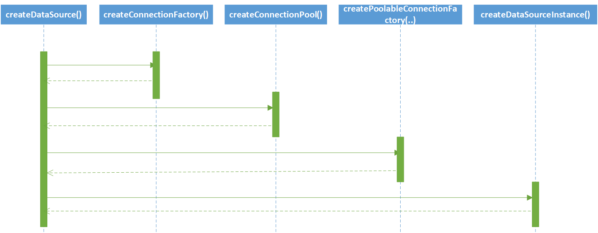

#  一. 为何使用数据库连接池

如果没有连接池，数据库服务器就需要为应用程序的每次请求创建数据库连接，而数据库连接是一种有限的昂贵资源，频繁的建立，关闭连接会极大的浪费数据库资源，降低请求性能 。

数据库连接池通过对象池化进行连接复用，在初始化时将数据库连接作为对象存储在内存中，当用户需要访问数据库时，并非建立一个新的连接，而是从连接池中取出一个已建立的空闲连接对象。使用完毕后，用户也并非关闭连接，而是将连接放回连接池中，以供下一个请求访问使用。而连接的建立、断开都由连接池自身来管理。同时配备连接管理策略，使每一个数据库连接可以高效、安全的复用，避免了数据库连接频繁建立，关闭的开销。

# 二. DBCP连接池介绍

DBCP（DataBase Connection Pool）数据库连接池，由Apache开发，基于Commons-pool对象池实现。

目前DBCP有四个版本，支持不同版本的JDBC，分别是：

- DBCP 2.5.0 最低要求Java 8编译和运行，支持JDBC 4.2
- DBCP 2.4.0 最低要求Java 7编译和运行，支持JDBC 4.1
- DBCP 1.4 最低要求Java 6编译和运行，支持JDBC 4
- DBCP 在Java 1.4-5.0版本编译和运行，支持JDBC 3

DBCP 2基于Commons Pool 2，与DBCP1.x版本相比，提供了更高的性能及JMX支持，注意：DBCP1 升级 DBCP2不是平滑兼容的，Maven坐标及某些配置选项（例如maxActive变成maxTotal）已被重命名。

由于京东大部分项目使用DBCP1.4版本，所以下文以此版本进行讲解。

# 三. 先了解对象池

前面提到DBCP基于Commons-pool实现，Commons-pool是对象池化技术原理的一种具体实现，主要的作用就是将“对象集合”池化，任何通过pool进行对象存取的操作，都会严格按照“pool配置”实时的创建对象/阻塞控制/销毁对象等，它在一定程度上，实现了对象集合的管理以及对象的分发。

Commons-Pool的包结构很简单，仅有两个包组成，org.apache.commons.pool包内主要是接口和抽象类，org.apache.commons.pool.impl包则是由org.apache.commons.pool包的实现类组成。

## org.apache.commons.pool

- 接口
  - KeyedObjectPool
  - KeyedObjectPoolFactory
  - KeyedPoolableObjectFactory
  - ObjectPool
  - ObjectPoolFactory
  - PoolableObjectFactory
- 抽象类
  -  BaseKeyedObjectPool
  - BaseKeyedPoolableObjectFactory 
  - BaseObjectPool
  - BasePoolableObjectFactory

其中最核心的三个接口为：ObjectPool、PoolableObjectFactory和ObjectPoolFactory 

###  ObjectPool

ObjectPool就是一个对象池，它主要描述一个“池”应该提供的那些功能，主要方法有：

- void addObject()：向池里添加一个对象。
- Object borrowObject()：从池里获取对象。
- void returnObject(Object obj)：将对象交还给池。
- boolean validateObject(Object obj)：校验交还到池中的对象是否合法。

上述三个方法，是“池”这个设计思想的核心。

### PoolableObjectFactory

PoolableObjectFactory是对ObjectPool的补充，它的着眼点在池中的“对象”，它提供的主要方法有：

- Object makeObject()：创建一个对象。
- void destroyObject(Object obj)：销毁一个对象

通常情况下，PoolableObjectFactory与ObjectPool是结对出现的。一个ObjectPool必然对应一个PoolableObjectFactory。举两个简单的场景，当对象池初始化时（addObject），此时ObjectPool就会调用PoolableObjectFactory的makeObject方法，创建一个对象，并将对象蓄到池中；当将对象交还给池时（returnObject），ObjectPool会首先调用PoolableObjectFactory的validateObject方法，判断当前对象是否合法，然后根据判断结果选择是否销毁它（调用destroyObject方法）。

### ObjectPoolFactory

ObjectPoolFactory就是一个创建对象池的工厂类。
 由此，也基本可以梳理出来，commons-pool具体的使用逻辑了。首先，我们需要定义个ObjectPoolFactory对象，由它来创建对象池，对象池其本质就是一个Java对象，所以理论上是可以创建多个。拿到对象池之后，就可以正常使用了，但在这之前要给这个对象池提供一个PoolableObjectFactory，由它来完成具体对象的创建和回收，这么做的目的，是为了保证对象池的“纯净”，也就是说，一个对象池究竟持有哪些对象，在一开始的时候，就是知道的。

## org.apache.commons.pool.impl

 了解了org.apache.commons.pool包的组成之后，再看org.apache.commons.pool.impl包就会清晰很多，在1.5.4的版本中org.apache.commons.pool.impl包由以下几个类组成： 

标准实现

- GenericKeyedObjectPool
- GenericKeyedObjectPoolFactory
- GenericObjectPool
- GenericObjectPoolFactory

基于堆栈的实现

-  StackKeyedObjectPool
-  StackKeyedObjectPoolFactory
- StackObjectPool
- StackObjectPoolFactory

使用软引用的对象池

- SoftReferenceObjectPool

在org.apache.commons.pool.impl包并不包含PoolableObjectFactory接口的实现类，也就是说，PoolableObjectFactory接口是需要用户自己去实现的 。

### GenericObjectPoolFactory

GenericObjectPoolFactory是ObjectPoolFactory接口的标准实现。初始化GenericObjectPoolFactory对象时必须传入一个PoolableObjectFactory对象。同时用户可以自己定义一些参数，这些参数就是构造一个pool对象是用到的属性。关于这些属性，我们放到后面详细介绍。一个GenericObjectPoolFactory对象初始化完成之后，就可以调用它的createPool()方法，得到一个GenericObjectPool对象了。

###  GenericObjectPool

GenericObjectPool出于严谨的考虑，既继承了BaseObjectPool又实现了ObjectPool。在org.apache.commons.pool.impl包的packageinfo中可以看到这样一段描述：“GenericObjectPool (GenericKeyedObjectPool) provides a more robust (but also more complicated) implementation of ObjectPool (KeyedObjectPool). ”，意思就是GenericObjectPool的实现更为健壮也更为复杂！它是整个commons-pool包的核心和基础！

### 内部类

 GenericObjectPool内部一共定义了3个内部类： 

- org.apache.commons.pool.impl.GenericObjectPool.Evictor：闲置对象校验（清除）器

  这个内部的类的源码如下：

  > ```java
  > //--- inner classes ----------------------------------------------
  > 
  >     /**
  >      * The idle object evictor {@link TimerTask}.
  >      * @see GenericObjectPool#setTimeBetweenEvictionRunsMillis
  >      */
  >     private class Evictor extends TimerTask {
  >         /**
  >          * Run pool maintenance.  Evict objects qualifying for eviction and then
  >          * invoke {@link GenericObjectPool#ensureMinIdle()}.
  >          */
  >         public void run() {
  >             try {
  >                 evict();
  >             } catch(Exception e) {
  >                 // ignored
  >             } catch(OutOfMemoryError oome) {
  >                 // Log problem but give evictor thread a chance to continue in
  >                 // case error is recoverable
  >                 oome.printStackTrace(System.err);
  >             }
  >             try {
  >                 ensureMinIdle();
  >             } catch(Exception e) {
  >                 // ignored
  >             }
  >         }
  >     }
  > ```

  可以看到它是TimerTask的子类，这样我们结合java.util.Timer类就可以做到定时的启动闲置实例校验。当前启动闲置实例校验时，一共只执行了两个方法，先说evict()，这个方法的主要作用是结合类的属性完成闲置实例的校验和清理，校验的逻辑也很简单，程序会首先检查这个实例的空闲时间，空闲时间超过_minEvictableIdleTimeMillis属性的值时就认定需要清理，当_testWhileIdle属性为ture时，程序还会将实例交给PoolableObjectFactory（用户自定义的）再去校验一次，最后如果认定需要清理，则调用PoolableObjectFactory的destroyObject方法，销毁对象。

  因为evict()在执行的过程中有可能销毁池中的对象，因此在方法结束后，可能会出现的一种场景就是池中的对象少于minIdle的值，这个时候就需要执行ensureMinIdle()方法，重新完成“蓄池”的动作。

- org.apache.commons.pool.impl.GenericObjectPool.Config：一个内部静态常量类 

- org.apache.commons.pool.impl.GenericObjectPool.Latch ：Latch直译过来是“门闩”的意思，它其实是对用户“获取对象”操作的一个封装。

### 核心方法实现 

- addObject() 

  在方法的注释上，作者写的很清楚,addObject的作用就是创建一个对象，并将对象“蓄”到池中。一般使用池的时候，都会初始化一些对象在池中，即作者所说的“pre-loading”。方法比较简单，真正干活的，是内部方法addObjectToPool(Object, boolean)。

  ```java
   /**
       * Create an object, and place it into the pool.
       * addObject() is useful for "pre-loading" a pool with idle objects.
       */
      public void addObject() throws Exception {
          assertOpen();
          if (_factory == null) {
              throw new IllegalStateException("Cannot add objects without a factory.");
          }
          Object obj = _factory.makeObject();
          try {
              assertOpen();
              addObjectToPool(obj, false);
          } catch (IllegalStateException ex) { // Pool closed
              try {
                  _factory.destroyObject(obj);
              } catch (Exception ex2) {
                  // swallow
              }
              throw ex;
          }
      }
  ```

   addObjectToPool方法做了三件事情：首先校验当前拿到的这个对象是否合法，然后判断是需要将它销毁掉还是放到内部的_pool对象中。 

  ```java
  /**
       * <p>Adds an object to the pool.</p>
       * 
       * <p>Validates the object if testOnReturn == true and passivates it before returning it to the pool.
       * if validation or passivation fails, or maxIdle is set and there is no room in the pool, the instance
       * is destroyed.</p>
       * 
       * <p>Calls {@link #allocate()} on successful completion</p>
       * 
       * @param obj instance to add to the pool
       * @param decrementNumActive whether or not to decrement the active count
       * @throws Exception
       */
      private void addObjectToPool(Object obj, boolean decrementNumActive) throws Exception {
          // 判断object是否合法
          boolean shouldDestroy = !success;
          ....
          // 将对象蓄到池中
           _pool.addFirst(new ObjectTimestampPair(obj));
          // 
          allocate();
          // Destroy the instance if necessary
          if(shouldDestroy) {
              _factory.destroyObject(obj);
          }
      }
  ```

   在完成“蓄池”后，需要给正在获取对象的现在重新分配资源，及调用allocate方法。 

  ```java
  /**
       * Allocate available instances to latches in the allocation queue.  Then
       * set _mayCreate to true for as many additional latches remaining in queue
       * as _maxActive allows.
       */
      private synchronized void allocate() {
          if (isClosed()) return;
  
          // First use any objects in the pool to clear the queue
          // 首先从池里获取对象实例
          for (;;) {
              if (!_pool.isEmpty() && !_allocationQueue.isEmpty()) {
                  Latch latch = (Latch) _allocationQueue.removeFirst();
                  latch.setPair((ObjectTimestampPair) _pool.removeFirst());
                  _numInternalProcessing++; // 表示正在处理中的对象个数
                  synchronized (latch) {
                      latch.notify();//通知被阻塞等待的latch
                  }
              } else {
                  break;
              }
          }
  
          // Second utilise any spare capacity to create new objects
          // 如果池已经空了，又没有到达容量上限，则标识需要重新生成
          for(;;) {
              if((!_allocationQueue.isEmpty()) && (_maxActive < 0 || (_numActive + _numInternalProcessing) < _maxActive)) {
                  Latch latch = (Latch) _allocationQueue.removeFirst();
                  latch.setMayCreate(true);
                  _numInternalProcessing++;
                  synchronized (latch) {
                      latch.notify();
                  }
              } else {
                  break;
              }
          }
      }
  ```

- borrowObject() 

  方法的功能很简单，就是从池中获取一个对象，但实施起来却比较复杂 。首先，如果池中有可用的对象，那么根据配置的获取原则（后入先出，或者先入先出），将对象激活并返回，如果设置了testOnBorrow，那么在返回之前还将进行校验，如果校验不通过则销毁当前对象，并继续这个过程，直至从池中找到复合要求的对象或者池中已经没有可用的对象为止。

  如果池中没有可用的对象，接下来的动作要结合maxActive、whenExhaustedAction和maxWait这三个属性的值综合判断。如果当前池中已经被取用的对象小于maxActive的值，则会创建一个新的对象，并将它返回。如果池中的资源已经被耗尽（当前没有可用的对象并且已取用的对象达到maxActive的值），方法会首先阻塞，如果阻塞的时间已经超过了设置（maxWait的值），那么接下来有两种选择，一种选择是抛异常，另一种则是无视maxActive的配置，继续扩充池的容量。

   当池中的资源被耗尽时，所以的线程都会阻塞，都在等待从池中获取可用的资源，1.5之后的commons-pool设计了一种“公平”算法，确保线程们是按照请求的顺序，依次获取对象实例。 

   逻辑交代清楚了，接下来我们就来看一下代码是如何实现的:

  ```java
  public Object borrowObject() throws Exception {
          // 得到当前时间
          long starttime = System.currentTimeMillis();
          // 新建一个闩锁，用来实现“公平”算法
          Latch latch = new Latch();
          byte whenExhaustedAction;
          long maxWait;
          /*
           * 同步的将闩锁放入队列，为了避免死锁，没有调用属性的get的方法，而是指定赋值。
           * 在高并发的环境下，同时有多个线程请求borrowObject方法，此时，每个线程都会新生成一个Latch对象以及whenExhaustedAction和maxWait，
           * 程序会同步的将Latch对象放入_allocationQueue链表中，然后执行allocate方法（allocate的作用见上文）。
           */
          synchronized (this) {
              // Get local copy of current config. Can't sync when used later as
              // it can result in a deadlock. Has the added advantage that config
              // is consistent for entire method execution
              whenExhaustedAction = _whenExhaustedAction;
              maxWait = _maxWait;
  
              // Add this request to the queue
              _allocationQueue.add(latch);
  
              // Work the allocation queue, allocating idle instances and
              // instance creation permits in request arrival order
              allocate();
          }
          // 开始迭代，直到返回对象或抛出异常！for(;;)是死循环的一种写法
          for(;;) {
              synchronized (this) {
                  assertOpen();
              }
  
              // If no object was allocated from the pool above 无法从池中获取对象
              if(latch.getPair() == null) {
                  // check if we were allowed to create one 如果池中的对象还没有达到maxActive，标识可以创建一个新的对象
                  if(latch.mayCreate()) {
                      // allow new object to be created
                  } else {
                      // the pool is exhausted 池中的资源被用光后，依照属性的whenExhaustedAction的值，完成相应的动作，
                      switch(whenExhaustedAction) {
                          // 继续扩充池的容量
                          case WHEN_EXHAUSTED_GROW:
                              // allow new object to be created
                              synchronized (this) {
                                  // Make sure another thread didn't allocate us an object
                                  // or permit a new object to be created
                                  if (latch.getPair() == null && !latch.mayCreate()) {
                                      _allocationQueue.remove(latch); // 这行代码的意思是不在继续为latch分配对象
                                      _numInternalProcessing++;
                                  }
                              }
                              break;
                          // 返回失败
                          case WHEN_EXHAUSTED_FAIL:
                              synchronized (this) {
                                  // Make sure allocate hasn't already assigned an object
                                  // in a different thread or permitted a new object to be created
                                  if (latch.getPair() != null || latch.mayCreate()) {
                                      break;
                                  }
                                  _allocationQueue.remove(latch);
                              }
                              throw new NoSuchElementException("Pool exhausted"); // 直接抛异常
                          // 阻塞等待
                          case WHEN_EXHAUSTED_BLOCK:
                              try {
                                  synchronized (latch) {
                                      // Before we wait, make sure another thread didn't allocate us an object
                                      // or permit a new object to be created
                                      if (latch.getPair() == null && !latch.mayCreate()) {
                                          if(maxWait <= 0) {
                                              latch.wait();
                                          } else {
                                              // this code may be executed again after a notify then continue cycle
                                              // so, need to calculate the amount of time to wait
                                              // 计算阻塞时间
                                              final long elapsed = (System.currentTimeMillis() - starttime);
                                              final long waitTime = maxWait - elapsed;
                                              if (waitTime > 0)
                                              {
                                                  latch.wait(waitTime);
                                              }
                                          }
                                      } else {
                                          break;
                                      }
                                  }
                              } catch(InterruptedException e) {
                                  Thread.currentThread().interrupt();
                                  throw e;
                              }
                              // 等待超时，抛异常
                              if(maxWait > 0 && ((System.currentTimeMillis() - starttime) >= maxWait)) {
                                  synchronized(this) {
                                      // Make sure allocate hasn't already assigned an object
                                      // in a different thread or permitted a new object to be created
                                      if (latch.getPair() == null && !latch.mayCreate()) {
                                          // Remove latch from the allocation queue
                                          _allocationQueue.remove(latch);
                                      } else {
                                          break;
                                      }
                                  }
                                  throw new NoSuchElementException("Timeout waiting for idle object");
                              } else {
                                  continue; // keep looping
                              }
                          default:
                              throw new IllegalArgumentException("WhenExhaustedAction property " + whenExhaustedAction +
                                      " not recognized.");
                      }
                  }
              }
              // 开始新生成一个对象
              boolean newlyCreated = false;
              if(null == latch.getPair()) {
                  try {
                      Object obj = _factory.makeObject();
                      latch.setPair(new ObjectTimestampPair(obj));
                      newlyCreated = true;
                  } finally {
                      if (!newlyCreated) {
                          // object cannot be created
                          synchronized (this) {
                              _numInternalProcessing--;
                              // No need to reset latch - about to throw exception
                              allocate();
                          }
                      }
                  }
              }
              // activate & validate the object 激活并返回对象
              try {
                  _factory.activateObject(latch.getPair().value);
                  if(_testOnBorrow &&
                          !_factory.validateObject(latch.getPair().value)) {
                      throw new Exception("ValidateObject failed");
                  }
                  synchronized(this) {
                      _numInternalProcessing--;
                      _numActive++;
                  }
                  return latch.getPair().value;
              }
              // 如果在激活对象的过程中出现异常
              catch (Throwable e) {
                  // object cannot be activated or is invalid
                  try {
                      _factory.destroyObject(latch.getPair().value); // 销毁这个对象
                  } catch (Throwable e2) {
                      // cannot destroy broken object
                  }
                  synchronized (this) {
                      _numInternalProcessing--; // 修改正在处理中的对象个数
                      if (!newlyCreated) {
                          latch.reset();
                          _allocationQueue.add(0, latch);
                      }
                      allocate(); // 重新分配
                  }
                  if(newlyCreated) {
                      // 如果是新创建的对象又无法激活，会抛异常
                      throw new NoSuchElementException("Could not create a validated object, cause: " + e.getMessage());
                  }
                  else {
                      continue; // keep looping 
                  }
              }
          }
      }
  ```

  通过对上述的源码分析可以看到，程序对关键资源的操作都是同步的（synchronized），按照资源类型大致可以分为： 

  1. 全局属性配置：_whenExhaustedAction、_maxWait。属于全局配置，当pool初始化时就已经确定。
  2. 全局资源变量：_allocationQueue、_pool和_numInternalProcessing。用作全局控制，操作的结果会影响其他方法。
  3. 方法内部变量：latch。每个调用borrowObject()方法的线程都会生成一个latch对象

  

# 四. DBCP的设计实现

在分析dbcp的工作原理之前，先总结一下数据库连接池的通用核心功能：

1.  连接池要在初始化时创建一组Connection对象，便于连接复用
2. 连接池应控制Connection对象数量在可控的范围之内，提供一系列的管理策略让用户按照自己的意愿来确定连接池的边界
3. 连接池要便于使用，能够灵活替换，所以应该作为javax.sql.DataSource的实现，方便用户替换不同的数据源

dbcp的设计实现时将功能1与功能2完全委托给Apache Commons Pool（前面提到的对象池）来实现，先说功能1，pool用来存储对象的容器为CursorableLinkedList，它实现了List接口，由Apache Commons Collections提供，它最大的特点就是提供了一个ListIterator（集合迭代器）对象，允许实时修改其内部list的数据。对于功能2，pool提供了GenericObjectPool类来实现对池中对象的控制，dbcp配置项中的有池的属性，以及高可用等属性，这些配置，实际上就是用来创建GenericObjectPool对象用的，这些配置就是GenericObjectPool的配置。另外，GenericObjectPool要求用户必须提供一个实现了org.apache.commons.pool.PoolableObjectFactory接口工厂类，方法如下：

- org.apache.commons.pool.PoolableObjectFactory.makeObject()  -- 创建一个对象
- org.apache.commons.pool.PoolableObjectFactory.destroyObject(Object)  --销毁一个对象
- org.apache.commons.pool.PoolableObjectFactory.validateObject(Object) -- 校验一个对象
- org.apache.commons.pool.PoolableObjectFactory.activateObject(Object) -- 激活一个对象
- org.apache.commons.pool.PoolableObjectFactory.passivateObject(Object) -- 取消激活一个对象

通过工厂的方法，我们可以理解这个工厂类的作用主要是定义及管理对象的生命周期。

## BasicDataSource

 真正由dbcp实现的其实只有功能3，BasicDataSource实现javax.sql.DataSource接口

- Connection getConnection() throws SQLException;
- Connection getConnection(String username, String password)
    throws SQLException;

getConnection()方法调用几个内部方法：

- createDataSource()
- createConnectionFactory()
- createConnectionPool()
- createDataSourceInstance()
- createPoolableConnectionFactory(ConnectionFactory, KeyedObjectPoolFactory, AbandonedConfig)

这几个方法的关系，如下所示：



 看下createDataSource()方法源码：

```java
protected synchronized DataSource createDataSource()
        throws SQLException {
        // 首先判断容器（连接池）是否关闭，如果关闭的话直接抛异常
        // closed是一个内部属性
        if (closed) {
            throw new SQLException("Data source is closed");
        }

        // 如果已经创建了dataSource，就直接返回，这个dataSource也是内部属性对象
        if (dataSource != null) {
            return (dataSource);
        }
         
        // 首先创建一个获得数据库物理连接的工厂类
        ConnectionFactory driverConnectionFactory = createConnectionFactory();

        // 创建连接池
        // 方法内部的关键代码为：
        //      GenericObjectPool gop = new GenericObjectPool();
        //      connectionPool = gop;
        // GenericObjectPool是apache.commons.pool中的组件
        // 注意：此时这个connectionPool还无法创建数据对象
        createConnectionPool();

        // 根据配置，判断是否需要创建一个statement的pool工厂
        // 最终这个工厂类将会委派给本地的connectionPool对象
        // 如果poolPreparedStatements=true
        // connectionPool创建一个connection时，会同时创建一个statement的池
        GenericKeyedObjectPoolFactory statementPoolFactory = null;
        if (isPoolPreparedStatements()) {
            statementPoolFactory = new GenericKeyedObjectPoolFactory(null,
                        -1, // unlimited maxActive (per key)
                        GenericKeyedObjectPool.WHEN_EXHAUSTED_FAIL,
                        0, // maxWait
                        1, // maxIdle (per key)
                        maxOpenPreparedStatements);
        }

        // 创建一个数据对象的工厂给connectionPool，让connectionPool可以创建数据库连接
        createPoolableConnectionFactory(driverConnectionFactory, statementPoolFactory, abandonedConfig);

        // 创建内部对象dataSource，由它来维护connectionPool对象
        // 这个内部的dataSource对象为PoolingDataSource的实例，其内部对象_pool是指向connectionPool的引用
        createDataSourceInstance();
        
        // 根据创建的配置“蓄池”
        try {
            for (int i = 0 ; i < initialSize ; i++) {
                // 使用数据对象工厂，创建物理数据库连接并交由connectionPool维护
                connectionPool.addObject();
            }
        } catch (Exception e) {
            throw new SQLNestedException("Error preloading the connection pool", e);
        }
        // 返回内部dataSource对象
        return dataSource;
}
```

 整个方法的核心时在createPoolableConnectionFactory(ConnectionFactory, KeyedObjectPoolFactory, AbandonedConfig)，这个方法的主体就是调用构造方法，创建一个PoolableConnectionFactory对象，这个工厂对象，就是交给GenericObjectPool对象，管理和维护池中数据用的。

 

```java
protected void createPoolableConnectionFactory(ConnectionFactory driverConnectionFactory,
            KeyedObjectPoolFactory statementPoolFactory, AbandonedConfig configuration) throws SQLException {
        PoolableConnectionFactory connectionFactory = null;
        try {
            connectionFactory =
                new PoolableConnectionFactory(driverConnectionFactory,
                                              connectionPool,
                                              statementPoolFactory,
                                              validationQuery,
                                              validationQueryTimeout,
                                              connectionInitSqls,
                                              defaultReadOnly,
                                              defaultAutoCommit,
                                              defaultTransactionIsolation,
                                              defaultCatalog,
                                              configuration);
            validateConnectionFactory(connectionFactory);
        } catch (RuntimeException e) {
            throw e;
        } catch (Exception e) {
            throw new SQLNestedException("Cannot create PoolableConnectionFactory (" + e.getMessage() + ")", e);
        }
    }
```

 PoolableConnectionFactory的构造方法将connectionPool作为它自己的内部对象，同时又将自己作为内部对象，保存到connectionPool里（调用 _pool.setFactory(this);），在整个BasicDataSource的生命周期中，connectionPool是一直存在的 。

再来看看PoolableConnectionFactory 创建出来PoolableConnection对象的实例：

```java
public Object makeObject() throws Exception {
        Connection conn = _connFactory.createConnection();
        if (conn == null) {
            throw new IllegalStateException("Connection factory returned null from createConnection");
        }
        initializeConnection(conn);
        if(null != _stmtPoolFactory) {
            KeyedObjectPool stmtpool = _stmtPoolFactory.createPool();
            conn = new PoolingConnection(conn,stmtpool);
            stmtpool.setFactory((PoolingConnection)conn);
        }
        return new PoolableConnection(conn,_pool,_config);
    }
```

PoolableConnection对象的实例同时保留了物理数据库连接conn和连接池对象的引用。并且PoolableConnection对象重写了close()方法：

```java
public synchronized void close() throws SQLException {
        if (_closed) {
            // already closed
            return;
        }

        boolean isUnderlyingConectionClosed;
        try {
            // 连接是否已经关闭
            isUnderlyingConectionClosed = _conn.isClosed();
        } catch (SQLException e) {
            try {
                _pool.invalidateObject(this); // XXX should be guarded to happen at most once
            } catch(IllegalStateException ise) {
                // pool is closed, so close the connection
                passivate();
                getInnermostDelegate().close();
            } catch (Exception ie) {
                // DO NOTHING the original exception will be rethrown
            }
            throw (SQLException) new SQLException("Cannot close connection (isClosed check failed)").initCause(e);
        }
        
        if (!isUnderlyingConectionClosed) {
            // Normal close: underlying connection is still open, so we
            // simply need to return this proxy to the pool
            try {
                //如果连接未关闭，将这个连接归还到池中
                _pool.returnObject(this); // XXX should be guarded to happen at most once
            } catch(IllegalStateException e) {
                // pool is closed, so close the connection
                passivate();
                getInnermostDelegate().close();
            } catch(SQLException e) {
                throw e;
            } catch(RuntimeException e) {
                throw e;
            } catch(Exception e) {
                throw (SQLException) new SQLException("Cannot close connection (return to pool failed)").initCause(e);
            }
        } else {
            // Abnormal close: underlying connection closed unexpectedly, so we
            // must destroy this proxy
            try {
                // 如果这个物理连接实际上已经关闭，就不能还回连接池，而应该销毁
                _pool.invalidateObject(this); // XXX should be guarded to happen at most once
            } catch(IllegalStateException e) {
                // pool is closed, so close the connection
                passivate();
                getInnermostDelegate().close();
            } catch (Exception ie) {
                // DO NOTHING, "Already closed" exception thrown below
            }
            throw new SQLException("Already closed.");
        }
    }
```

 至此，我们从源码上已经基本清楚dbcp核心功能是如何实现的了

# 五. DBCP主要配置参数说明


| Parameter                     | Default        | Description                                                  |
| ----------------------------- | -------------- | ------------------------------------------------------------ |
| username                      |                | 要传递给JDBC驱动程序以建立连接的用户名                       |
| password                      |                | 要传递给JDBC驱动程序以建立连接的密码                         |
| url                           |                | 要传递给JDBC驱动程序以建立连接的连接URL                      |
| driverClassName               |                | 要使用的JDBC驱动程序的标准Java类名                           |
| initialSize                   | 0              | 初始化连接:连接池启动时创建的初始化连接数量                  |
| maxActive                     | 8              | 最大活动连接:连接池在同一时间能够分配的最大活动连接的数量, 如果设置为非正数则表示不限制 |
| maxIdle                       | 8              | 最大空闲连接:连接池中容许保持空闲状态的最大连接数量,超过的空闲连接将被释放, 如果设置为负数表示不限制 |
| minIdle                       | 0              | 最小空闲连接:连接池中容许保持空闲状态的最小连接数量,低于这个数量将创建新的连接, 如果设置为0则不创建 |
| maxWait                       | -1             | 最大等待时间:当没有可用连接时,连接池等待连接被归还的最大时间(以毫秒计数)超过时间则抛出异常,如果设置为-1表示无限等待 |
| testOnReturn                  | false          | 是否在归还到池中前进行检验                                   |
| testWhileIdle                 | false          | 连接是否被空闲连接回收器(如果有)进行检验.如果检测失败, 则连接将被从池中去除.设置为true后如果要生效,validationQuery参数必须设置为非空字符串 |
| minEvictableIdleTimeMillis    | 1000 * 60 * 30 | 连接在池中保持空闲而不被空闲连接回收器线程 (如果有)回收的最小时间值，单位毫秒 |
| numTestsPerEvictionRun        | 3              | 在每次空闲连接回收器线程(如果有)运行时检查的连接数量         |
| timeBetweenEvictionRunsMillis | -1             | 在空闲连接回收器线程运行期间休眠的时间值,以毫秒为单位.  如果设置为非正数,则不运行空闲连接回收器线程 |
| validationQuery               | null           | QL查询,用来验证从连接池取出的连接,在将连接返回给调用者之前.如果指定, 则查询必须是一个SQL SELECT并且必须返回至少一行记录 |
| testOnBorrow                  | true           | 是否在从池中取出连接前进行检验,如果检验失败, 则从池中去除连接并尝试取出另一个 |
|                               |                |                                                              |

其它参数在官网上都有，不详细例举了  http://commons.apache.org/proper/commons-dbcp/configuration.html 

[]: 

#  六.DBCP配置模板

```java
<!--   数据源   --> 
<bean id="dataSource" class="org.apache.commons.dbcp.BasicDataSource" destroy-method="close"> 
<property name="url" value="${jdbc.url}"/> 
<property name="username" value="${jdbc.username}"/> 
<property name="password" value="${jdbc.password}"/> 
<property name="driverClassName" value="${jdbc.driver}"/> 
<!--   初始化连接数量   --> 
<property name="initialSize" value="5"/> 
<!--   最大活动连接数量   --> 
<property name="maxActive" value="30"/> 
<!--   最大空闲连接数量   --> 
<property name="maxIdle" value="5"/> 
<!--   最小空闲连接数量   --> 
<property name="minIdle" value="2"/> 
<!--   获取连接时等待时间，超出将抛异常，单位毫秒   --> 
<property name="maxWait" value="10000"/> 
<!--   是否自动提交   --> 
<property name="defaultAutoCommit" value="false"/> 
<!--   空闲连接被回收时间，回收空闲连接至minIdle指定数量，单位毫秒   --> 
<property name="minEvictableIdleTimeMillis" value="1800000"/> 
<!--   检查空闲连接是否可被回收，如果小于等于0，不会启动检查线程，默认-1，单位毫秒   --> 
<property name="timeBetweenEvictionRunsMillis" value="600000"/> 
<!--   在每次空闲连接回收器线程(如果有)运行时检查的连接数量   --> 
<property name="numTestsPerEvictionRun" value="3"/> 
<!-- SQL查询,用来验证从连接池取出的连接   --> 
<property name="validationQuery" value="select 1"/> 
<!--   指明连接是否被空闲连接回收器(如果有)进行检验.如果检测失败,则连接将被从池中去除   --> 
<property name="testWhileIdle" value="true"/> 
<!--   指明是否在从池中取出连接前进行检验,如果检验失败, --> 
<property name="testOnBorrow" value="false"/> 
<!--   指明是否在归还到池中前进行检验   --> 
<property name="testOnReturn" value="false"/> 
<!--   标记是否删除泄露的连接，设置为true可以为写法糟糕的没有关闭连接的程序修复数据库连接. --> 
<property name="removeAbandoned" value="true"/> 
<!--   泄露的连接可以被删除的超时值,   单位秒   --> 
<property name="removeAbandonedTimeout" value="180"/> 
<!--   将会在回收事件后，在log中打印出回收Connection的错误信息，在调试的时候很有用。   --> 
<property name="logAbandoned" value="true"/>
```

 

 

 

 

