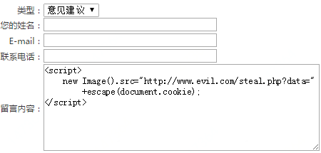
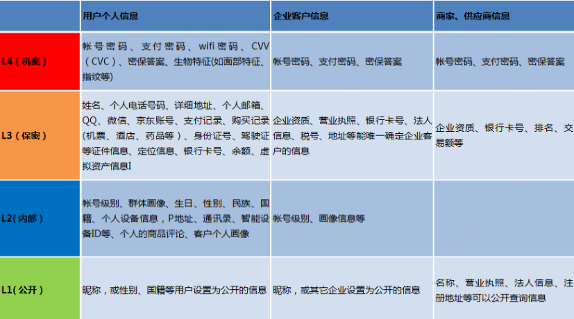

# **Web前端黑客技术揭秘**——Web开发安全注意事项

## 01. XSS攻击
XSS全称为Cross Site Script，即跨站脚本，为了不和层叠样式表CSS混淆，故将其缩写为XSS。

XSS漏洞非常广泛，是Web应用程序中最常见的漏洞之一。它发生在浏览器层面上，当用户浏览器渲染整个HTML文档的过程中出现了不被预期的脚本指令并执行时，XSS就会发生。

不被预期的脚本指令，是指攻击者在“编辑页面”输入的内容中包含了“精心设计”的脚本指令，正常情况下这些内容在“展示页面”只是用来显示，但由于网站没有对用户提交的数据进行转义处理或者过滤不足，当其他用户浏览该“展示页面”时，内容中包含的脚本指令被浏览器解析执行，从而实现了攻击者的目的。
因此，XSS攻击的基本原理就是攻击者将代码植入到提供给其它用户使用的页面中，是一种注入式的脚本攻击。

- 举个例子：在线留言板XSS漏洞

场景如下：攻击者在留言板可以输入一段留言，提交后这些留言可以被其他的网站用户查看。



假设留言出现在留言详情页的
```
<div>[输出]</div> 
```
位置，当其他用户浏览到该留言时，用户的cookie就会被发送给攻击者，而攻击者利用cookie将有可能获取用户的账号及权限......

---
>  - [ ] **Web安全的知识点：cookie**

> Cookie 经常被用来存储用户的会话信息，比如，用户登录认证后的session，所以攻击者就特别喜欢盗取 cookie ，以获取用户权限。

> Cookie出现在请求头的Cookie字段中。服务端响应头的Set-Cookie字段可以添加、修改和删除Cookie，大多数情况下，客户端通过JavaScript也可以添加、修改和删除 Cookie 。

> Cookie 的重要字段如下： **[name][value][domain][path][expires][httponly][secure]** 
其含义依次是：名称、值、所属域名、所属相对根路径、过期时间、是否有HttpOnly标志、是否有Secure 标志。这些字段用好了，Cookie 就是安全的，下面对关键的字段进行说明。

> **domain** ——用于指定Cookie的有效域范围。如果指定domain为父级域，这样带来的好处就是可以在不同的子域共享Cookie，坏处也很明显，就是攻击者控制的其他子域也能读到这个 Cookie 。

> **path**—— 用于指定Cookie的有效URL路径。通过指定 path 字段，JavaScript 有权限设置任意 Cookie 到任意路径下，只有目标路径下的页面 JavaScript 才能读取到该 Cookie 。但是通过设置 path 并不能防止 Cookie 被盗取，因为通过跨 iframe 进行DOM操作，可以跨路径读取 Cookie。 

> **expires**——用于设置Cookie的过期时间。根据是否设置了expires，可以将Cookie分为本地Cookie与内存Cookie。如果没设置过期时间，就是内存Cookie，这样的Cookie会随着浏览器的关闭而从内存中消失；如果设置了过期时间是未来的某个时间点，那么这样的Cookie就会以文本形式保存在操作系统本地，待过期时间到了才会消失。很多时候为了提升用户体验，不需要每次都登录，于是设置了较长的过期时间，让用户在未来1个月、半年、甚至永久都不需要进行登录操作，但这也增加了Cookie被盗取的风险。

> **httpOnly**——是指仅在HTTP 层面上传输的Cookie，当设置了HttpOnly标志后，客户端脚本就无法读写该Cookie，这样能有效地防御 XSS攻击获取 Cookie。

> **secure**——如果设置该属性，仅在HTTPS请求中提交Cookie，如果请求是HTTP的，就不会带上这个Cookie，这样能降低Cookie被截获的风险。


### XSS的分类
1. 反射型XSS

    发出请求时，XSS代码出现在URL中，作为输入提交到服务端，服务端解析后响应，在响应内容中出现这段XSS代码，最后浏览器解析执行。这个过程就像一次反射，故称为反射型XSS，也叫非持久型XSS。
2. 存储型XSS

    存储型XSS也叫持久型XSS，和反射型XSS的差别在于：提交的XSS代码会存储在服务端，下次请求目标页面时不用再提交XSS代码。
3. DOM XSS
    
    DOM XSS也称为type0 XSS，XSS的代码并不需要服务器解析响应的直接参与，触发XSS靠的就是浏览器端的DOM解析，可以认为完全是客户端的事情。


### 漏洞的挖掘

以反射型XSS为例，针对 http://www.foo.com/xss.php?id=1 这个 URL ，我们利用的输入点是 id=1。 

假设执行这个URL后，其返回的页面中会输出这个id，并且该id会出现在以下“输出”位置：

```
<input value="[输出]" type="hidden" /> 
```
要触发 XSS ，可以将URL改为： 
```
http://www.foo.com/xss.php?id=1" onmouserover=alert(1) type="text
```
这样，返回的页面input标签会变成：
```
<input value="1" onmouserover=alert(1) type="text" type="hidden" /> 
```
然后把鼠标移上去就可触发XSS脚本。 

当然，id的输出位置不一定是input标签内，还会有很多种可能，针对每一种可能的情况，我们都可以通过构造不同的攻击脚本，逐一试探挖掘。

有一种思路叫做“探子请求”，即在真正的攻击请求之前，先发起一次包含“探子”的请求，该请求的目的是：
1. 目标参数值是否会出现在响应上，如果不出现，就完全没必要进行后续的攻击。 
2. 目标参数值出现在 HTML 的哪个部分，不同的HTML部分攻击的脚本构造是不一样的。 

“探子”可以是一个随机字符串，只要保证在响应的HTML中不会与已有的字符串冲突就行，以便于我们对“探子”进行定位，这样可以大大提高挖掘的效率。

### XSS的危害
1. 盗取用户Cookie，进而盗取用户帐号
2. 网站挂马
3. DoS（拒绝服务）用户客户端浏览器
4. 钓鱼攻击，金融诈骗
5. 控制企业数据，包括读取、篡改、添加、删除企业敏感数据
6. Web2.0蠕虫攻击
7. 控制受害者机器向其它网站发起攻击
8. 刷广告、刷流量 ......

### XSS的防御

XSS漏洞的起因就是没有对用户提交的数据进行严格的过滤处理。因此在思考解决XSS漏洞的时候，我们应该重点把握如何才能更好的将用户提交的数据进行安全过滤。我们不能信任任何客户端提交的数据，只要是客户端提交的数据就应该先进行相应的过滤处理然后方可进行下一步的操作。以下是总结的一些防御策略：

1. 将重要的cookie标记为http only, 这样的话Javascript中的document.cookie语句就不能获取到cookie了
2. 对数据进行Html Encode处理
3. 所有的输入域都需要进行验证、过滤处理，并且尽量在服务器端进行
4. 表单中的数据项尽量规定值的类型，例如：年龄只能为int、name只能为字母数字组合......
5. 过滤或移除特殊的Html标签，例如: 
```
<script>, <iframe> , &lt; for <, &gt; for >, &quot for " 等等
```
6. 过滤JavaScript 事件的标签。例如 "onclick=", "onfocus" 等等

需要注意的是，在有些应用中是允许html标签出现的，甚至是javascript代码出现。因此我们在过滤数据的时候需要仔细分析哪些数据是有特殊要求（例如输出需要html代码、javascript代码拼接、或者此表单直接允许使用等等），然后区别处理！

---
>  - [ ] **Web安全的知识点：内容安全策略(CSP)**

> 内容安全策略（Content Security Policy，简称CSP）是一种以可信白名单作机制，通过HTTP响应头中的指令来实施的策略，用来限制网站中是否可以包含某来源内容，目的是缓解潜在的跨站脚本问题。
可以通过配置CSP ，对某个类型的资源使用指定的安全策略，CSP的一些常用指令：

值 |	描述
---|---
default-src|默认的资源加载策略
script-src|可以加载的脚本的域或URL
object-src|可以加载的插件，如Falsh
style-src|可以加载的CSS样式表的域或URL
img-src|可以加载的图片的域或URL
media-src|可以加载的音视频的域或URL
frame-src|可以加载的框架的域或URL
font-src|可以加载的字体的域或URL
connect-src|可以加载的像XHR,WebSockets,以及EventSource等脚本接口的域或URL

## 02. CSRF攻击

CSRF的全称是Cross Site Request Forgery，即跨站请求伪造。
在跨站的世界中，CSRF同样扮演着极其重要的角色。
CSRF攻击可以在受害者毫不知情的情况下以受害者名义伪造请求发送给受攻击站点，从而在并未授权的情况下执行在权限保护之下的操作。

CSRF攻击依赖下面的假定：
1. 受害者登录受信任网站A，并在本地生成Cookie
2. 受害者在不登出A的情况下，访问危险网站B
3. 危险网站B返回给受害者的HTTP信息中要求受害者访问网站A
4. 由于受害者已登录网站A，导致这个请求就像受害者真实发送的一样会被执行

CSRF攻击是源于WEB的隐式身份验证机制，WEB的身份验证机制虽然可以保证一个请求是来自于某个用户的浏览器，但却无法保证该请求是用户“真实意愿”发送的！

举个例子（纯属搞笑）：

1. 你的领导登录了ERP系统，正在处理工作上的事。
2. 你给领导发过去一个标题为“加班申请审批”的链接（实际是加薪申请审批链接）
3. 你的领导点击该链接，这时就会（以领导的权限）提交审批通过。
这样，在你领导不知情的情况下，便完成了一次对你的加薪审批。

### CSRF漏洞的挖掘
CSRF的漏洞挖掘只要确认以下内容即可。 
- [x] 目标表单是否有有效的 token 随机串。 
- [x] 目标表单是否有验证码。 
- [x] 目标是否判断了 Referer 来源。 
- [x] 网站根目录下 crossdomain.xml 的“allow -access-from domain”是否是通配符。 
- [x] 目标JSON 数据是否可以自定义 callback 函数等。

### CSRF的危害
与XSS攻击相比，CSRF攻击往往不大流行（因此对其进行防范的资源也相当稀少）和难以防范，所以被认为比XSS更具危险性。
由于攻击者盗用了你的身份，以你的名义发送恶意请求，对服务器来说这个请求是完全合法的，但是却完成了攻击者所期望的一个操作，因此他能够做的事情包括：
1. 以你的名义发送邮件、发消息、发文章（当然也可以修改、删除）......
2. 修改你的保密邮箱、盗取账号、添加网站用户......
3. 用你的账户购买商品、购买虚拟货币......
4. 用你的账户转账......
5. ......

### CSRF的防御
1. **验证 HTTP Referer 字段。**
根据 HTTP 协议，在 HTTP 头中有一个字段叫 Referer，它记录了该 HTTP 请求的来源地址。在通常情况下， Referer 值是所在页面的 URL，而如果黑客要实施 CSRF 攻击，他只能在他自己的网站构造请求，当用户通过黑客的网站发送请求时，该请求的 Referer 是指向黑客自己的网站。因此，要防御 CSRF 攻击，只需要对于每一个请求验证其 Referer 值即可。
然而，Referer 的值是由浏览器提供的，虽然 HTTP 协议上有明确的要求，但是并不能保证浏览器自身没有安全漏洞导致Referer 值被篡改，例如：IE6。
另外，用户自己也可以设置浏览器使其在发送请求时不提供 Referer，这样会导致误杀。

2. **尽量使用POST，限制GET。**
GET接口太容易被拿来做CSRF攻击，只要构造一个img标签，而img标签又是不能过滤的数据。接口最好限制为POST使用，GET则无效，降低攻击风险。当然POST并不是万无一失，攻击者只要构造一个form就可以，但需要在第三方页面做，这样就增加暴露的可能性。

3. **在请求地址中添加 token 并验证。**
要抵御 CSRF，关键在于在请求中放入黑客所不能伪造的信息，并且该信息不存在于 cookie 之中。可以在 HTTP 请求中以参数的形式加入一个随机产生的 token，并在服务器端建立一个拦截器来验证这个 token，如果请求中没有 token 或者 token 内容不正确，则认为可能是 CSRF 攻击而拒绝该请求。

4. **在 HTTP 头中自定义属性并验证。**
这种方法也是使用 token 并进行验证，和上一种方法不同的是，这里并不是把 token 以参数的形式置于 HTTP 请求之中，而是把它放到 HTTP 头中自定义的属性里。通过 XMLHttpRequest 这个类，可以一次性给所有该类请求加上 csrftoken 这个 HTTP 头属性，并把 token 值放入其中。这样解决了上一种方法在请求中加入 token 的不便，同时，通过 XMLHttpRequest 请求的地址不会被记录到浏览器的地址栏，也不用担心 token 会透过 Referer 泄露到其他网站中去。

5. **加验证码。**
强制用户必须与应用进行交互，才能完成最终请求。在通常情况下，验证码能很好遏制CSRF攻击。但是出于用户体验考虑，网站不能给所有的操作都加上验证码，一般只用在最关键的地方。因此验证码只能作为一种辅助手段，不能作为主要解决方案。

---
>  - [ ] **Web安全的知识点：浏览器的同源策略**

> 浏览器制定了一些安全策略，这些安全策略有效地保障了用户计算机的本地安全与 Web 安全，同源策略是众多安全策略中非常重要的一个。 
同源策略规定：不同域的客户端脚本在没有明确授权的情况下，不能读写对方的资源。
同域要求两个站点同协议、同域名、同端口。下表展示了表中所列站点与
http://www.jd.com 是否同域：


站     点 | 是否同域 | 原     因
---|---|---
https://www.jd.com | 不同域 | 协议不同，https 与http 是不同的协议 
http://ump.jd.com  | 不同域 | 域名不同，ump 子域与 www子域不同 
http://jd.com  | 不同域 | 域名不同，顶级域与 www子域不是一个概念 
http://www.jd.com:8080 | 不同域 | 端口不同，8080 与默认的 80 端口不同 
http://www.jd.com/jdwl/ |  同域 | 满足同协议、同域名、同端口，只是这里多了一个目录而已


> AJAX 跨域访问

> AJAX 跨域访问在默认情况下是不允许的，只有目标站点（假如是 http://www.jd.com）明确返回 HTTP 响应头： 
```
Access-Control-Allow-Origin: http://www.jdwl.com 
```
> 那么 www.jdwl.com 站点上的客户端脚本才有权通过 AJAX 对 www.jd.com 上的数据进行读写操作。

---

>  - [ ] **Web安全的知识点： iframe带来的风险**

> 我们通常会以iframe的方式引入第三方提供的页面组件，这会带来不少的安全隐患。因为iframe中的内容是由第三方来提供的，默认情况下不受我们的控制，他们可以在iframe中运行脚本，如果iframe被黑客攻破，则我们自己的页面也会受到牵连。

> sandbox是HTML5中的新属性，它能让顶级页面对其嵌入的子页面及这些子页面的子资源设置一些额外的限制。
通过设置iframe标签的sandbox属性来实现限制：

值 |	描述
---|---
"" |	应用以下所有的限制。
allow-same-origin |	是否允许iframe访问同源数据，没有则不允许
allow-top-navigation | 是否允许iframe控制顶级窗口的地址跳转，没有则不允许
allow-forms | 是否允许使用form表单，没有则不允许
allow-scripts |	是否允许执行javascript脚本，没有则不允许

## 03. XXE攻击

XXE——XML External Entity（XML外部实体）注入，该漏洞是由于XML解析器解析了用户发送的不可信数据导致。

外部实体声明: 

```
<?xml version="1.0"?>
<!DOCTYPE test [
        <!ENTITY myEntity SYSTEM "file://etc/password">
]>
<abc>&myEntity;</abc>
```
在上面的代码中， XML外部实体 ‘myEntity’ 被赋予的值为：file://etc/password。
在解析XML文档的过程中，实体‘myEntity’的值会被替换为password文件的内容，并展示出来。

### XXE的危害

1. 可任意访问服务器上的资源内容，导致服务器上敏感数据泄露
2. 可远程执行服务器上的系统命令
3. 可探测服务器内网端口是否open
4. 构造恶意的XML实体文件耗尽服务器可用内存，实现DDoS 攻击

### XXE的防御

1. 过滤用户提交的XML数据，关键词：<!DOCTYPE和<!ENTITY 或者 SYSTEM和PUBLIC
2. 使用开发语言提供的禁用外部实体的方法

```
    DocumentBuilderFactory dbf =DocumentBuilderFactory.newInstance(); 
    dbf.setExpandEntityReferences(false);
```

## 04. 反序列化攻击

序列化是指把对象转换为字节序列，反序列化则是指把字节序列恢复为对象。

漏洞成因：在反序列化过程中解析了恶意用户构造的字节序列数据，从而产生非预期的对象，并在此过程中执行被构造的恶意代码。

漏洞危害：反序列化漏洞会导致任意代码在服务器端被执行，这是极其严重的问题。

### 反序列化的防御
1. 不要反序列化不可信的数据
2. 给反序列数据加密签名，并确保解密在反序列之前
3. 给反序列化接口添加认证授权
4. 反序列化服务只允许监听在本地或者开启相应防火墙
5. 升级第三方库
6. 升级JDK，JEP290

## 05. 水平越权攻击

水平越权指的是攻击者尝试访问与他拥有相同功能权限的其他用户的资源。

常见的漏洞场景：

- [x] 根据某个参数（id、订单号等）查询/修改某条数据时，没有判断数据的所属人，导致攻击者可以自行修改参数，查询/修改不属于自己的数据。
- [x] 在判断数据所属人时使用了页面表单中隐藏字段的userid，导致攻击者可以自行修改userid，获取不属于自己的数据。

### 水平越权的防御

1. 对请求中的关键参数进行加密（或者做映射）
2. 在服务端根据用户pin进行数据所有权的验证


## 06. 垂直越权攻击

垂直越权指的是低权限的角色通过一些途径获得高权限角色的能力。

举个例子

程序猿哥哥仅仅在页面菜单上做了权限控制，在服务端并未对菜单对应的URL做拦截和鉴权。
```
if(普通用户) {
    //显示菜单A 
}
if(系统管理员) {
    //显示菜单B 
} 
```
攻击者虽然只是普通用户，但通过访问菜单B的URL，就轻易拥有了系统管理员的权限。

### 垂直越权的防御

1. 根据用户角色进行授权
2. 在服务端对需要鉴权的请求URL（包括菜单、按钮等）做拦截和鉴权处理

## 07. SQL注入攻击

攻击者在HTTP请求参数中注入恶意的SQL代码，服务器使用参数构建数据库SQL命令时，恶意SQL被一起构造并执行。

举个例子
```
select * from user where name = ' admin' and password = ' ' or '1'='1'
```
注入内容为password字段值： ' or '1'='1

### SQL注入的防御

1. 所有的查询语句都使用数据库提供的参数化查询接口，禁止拼串
2. 对进入数据库的特殊字符（’”\<>&*;等）进行转义处理，或编码转换
3. 针对mybatis：传入参数时使用#而不要使用$

## 08. 文件上传攻击

文件上传漏洞，指的是用户上传一个可执行的脚本文件，并通过此脚本文件获得了执行的能力。许多第三方框架都曾经被爆出文件上传漏洞，比如Struts2、富文本编辑器等等，一旦被攻击者上传恶意代码，有可能连服务端都被人黑了，危害极大。

举个例子

1. 攻击者在上传图片的时候，提交了一个JS的脚本文件，该文件逃过了文件类型校验。
2. 受害者在访问这个“图片”的时候，浏览器会去请求这个伪装成图片的JS脚本。
3. 如果浏览器错误的推断了这个响应的内容类型，那么就会把它当做JS脚本执行，攻击成功！

### 文件上传的防御
1. 文件上传的目录设置为不可执行
2. 文件上传使用京东云存储系统
3. 在服务端检查上传文件扩展名，不在白名单内不允许上传
4. 用户上传文件的文件名必须重新生成（增加攻击者猜想文件路径成本）
5. 禁止用户自定义路径上传 
6. 下载：禁止使用真实的路径文件名进行下载
7. 设置X-Content-Type-Options为 nosniff 明确禁止浏览器去推断响应类型

## 09. 敏感数据泄漏

敏感数据需要额外的保护，比如在存放或传输过程中的加密，以及在与浏览器交换时进行特殊的预防措施。许多Web应用没有正确保护敏感数据，造成敏感数据的泄漏，攻击者可能会窃取这些数据以进行垃圾广告推销、电信诈骗、身份窃取等违法犯罪活动。

敏感数据的定义



### 敏感数据的处理
1. 所有敏感信息必须进行加密处理
2. 敏感号码类数据需要做部分隐藏显示（防爬虫）
3. 使用统一的错误处理机制，防止在错误处理中泄露系统敏感信息（代码结构、框架的型号版本等）
4. 务必接入HTTPS

## 10. 配置漏洞利用

安全配置错误可以发生在一个应用程序堆栈的任何层面，包括平台、Web服务器、应用服务器、数据库、框架和自定义代码。
攻击者访问默认账户，无效页面，没打补丁的漏洞，未受保护的文件及文件夹等，以获得未授权的访问或对应用系统进行了解和分析。


配置漏洞的案例

- [x] 案例1：应用程序服务器管理员控制台自动安装后没有被删除。而默认帐户也没有被改变。攻击者在你的服务器上发现了标准的管理员页面，通过默认密码登录，从而接管了你的服务器。

- [x] 案例2：目录列表在你的服务器上未被禁用。攻击者发现只需列出目录，她就可以找到你服务器上的任意文件。攻击者找到并下载所有已编译的Java类，她通过反编译获得了所有你的自定义代码。然后，她在你的应用程序中找到一个访问控制的严重漏洞。

- [x] 案例3：应用服务器配置允许堆栈跟踪返回给用户，这样就暴露了潜在的漏洞。攻击者热衷于收集错误消息里提供的额外信息。

- [x] 案例4：应用服务器自带的示例应用程序没有从您的生产服务器中删除。该示例应用有已知安全漏洞，攻击者可以利用这些漏洞破坏您的服务器。

### 配置漏洞的处理
开发人员和系统管理员需共同努力，对整个应用栈进行正确的安全加固，以确保整个堆栈的正确配置，包括：

1. 及时安装最新的软件更新、补丁，包括操作系统、应用服务器、数据库系统、应用程序以及所有的代码库
2. 确保某些不需要的特性不被开启或安装，例如端口、服务、页面、账户、权限等
3. 确保默认账户不被开启或默认密码已被修改
4. 确保错误处理不会暴露出堆栈的痕迹，错误信息不直接暴露给用户
5. 确保开发框架（例如Struts、Spring等）中的安全设置配置正确